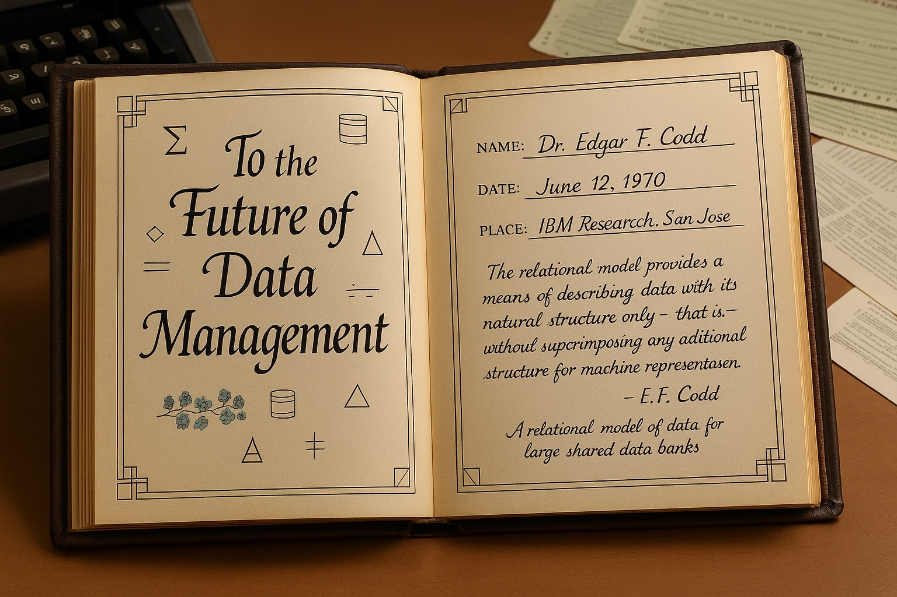

<!--
author:   André Dietrich; GitHub CoPilot
language: de
narrator: German Male
comment:  Grundlagen der Datenspeicherung: Von der DIKW-Pyramide (Daten → Informationen → Wissen → Weisheit) über Serialisierungsformate (CSV, JSON, YAML, XML) bis zur praktischen Motivation für Datenbanksysteme. Hands-on Ad-hoc-Analyse von CSV/JSON-Daten direkt im Browser.

logo:     ../assets/img/logo/1-lecture.jpg

edit:     true

import: https://raw.githubusercontent.com/liaTemplates/PyScript/main/README.md
        https://raw.githubusercontent.com/LiaScript/CodeRunner/master/README.md
-->


# Daten & Serialisierung + DIKW + Vergleichsachsen Teaser

    --{{0}}--
Willkommen zu "Databases Unlocked" – einer strukturierten Reise durch die Evolutionsstufen der Datenspeicherung! Heute starten wir bewusst "unten" bei rohen Datenformaten, um zu verstehen, warum heutige Systeme so gestaltet sind, wie sie sind.

    {{0-1}}
<section>

**Was Sie heute erwartet:**

> Diese Vorlesung ist **kein nostalgischer Rückblick**, sondern die **Begründung** dafür, warum moderne Datenbanksysteme so funktionieren, wie sie funktionieren.

</section>

    --{{1}}--
Lassen Sie uns die Reise durch die Datenspeicher-Paradigmen skizzieren – von primitiv bis hochentwickelt. Wir durchlaufen sieben Blöcke, wobei jeder Block auf den Schwächen des vorherigen aufbaut. Block 1 zeigt uns die rohe Realität: Serialisierungsformate sind einfach, aber fehleranfällig. Die Blöcke 2 bis 6 führen uns durch verschiedene Paradigmen – vom kompakten Paradigmen-Überblick über den relationalen Kern (Algebra, SQL, Performance) bis zu fortgeschrittenen Konzepten. Block 7 vereint schließlich Graph-Datenbanken und polyglotte Architekturen mit verteilten Systemen.

    {{1}}
<section>

## 🗺️ Unsere Reise durch die Datenspeicher-Evolution

**Block 1: Die rohe Realität**

- 📄 **Daten & Serialisierung** ← *Heute: L1*
- �️ **Paradigmen-Überblick** (L2–L6: KV, Document, Wide Column, Column, Trade-offs)

**Block 2: Relationale Grundlagen**

- 🏛️ **Relationale Algebra & SQL Basics** (L7–L9 + Exercises)
- 📐 **FROM σ, π, ⨝ TO SELECT, JOIN, CTE**

**Block 3: Relationale Integrität**

- � **Normalisierung & Constraints** (L10–L11)
- ⚛️ **Transaktionen & ACID** (L12 + Exercise)

**Block 4: Performance & Optimierung**

- ⚡ **Indexe & Query-Optimierung** (L13–L15 + Exercise)
- 📊 **B-Trees, EXPLAIN, Materialized Views**

**Block 5: Fortgeschrittene Konzepte**

- 🔄 **Locking vs. MVCC** (L16)
- � **Views, Triggers, Stored Procedures** (L17)

**Block 6: Graph & Polyglot**

- 🕸️ **Graph Databases** (L18 + Exercise)
- 🎯 **Property Graphs, Traversal, Pattern Matching**

**Block 7: Polyglot & Verteilung**

- 🌐 **Polyglot Persistence** (L19: CQRS, Event Sourcing)
- ☁️ **Verteilte Systeme** (L20–L21: Replikation, CAP, Konsistenz)

</section>


    --{{2}}--
Begleitend durchlaufen Sie ein Mini-Projekt mit dokumentierten Designentscheidungen – von rohen CSV-Dateien bis zur polyglotten Architektur. Diese vier Meilensteine sind keine theoretischen Übungen, sondern praktische Erfahrungen mit echten Trade-offs. Meilenstein 1 konfrontiert Sie mit den Limitationen flacher Dateien. Meilenstein 2 zwingt Sie zur Schema-Evolution – was passiert, wenn sich Anforderungen ändern? Meilenstein 3 bringt Performance ins Spiel: Wann lohnt sich ein Index wirklich? Und Meilenstein 4 stellt die große Frage: Wann rechtfertigt Normalisierung ihren Aufwand? Die Micro-Consistency Checks sind Ihre Reflexionsmomente – explizite Pausen, um Ihr mentales Modell zu kalibrieren.

    {{2}}
<section>

## 🛠️ Hands-on: Mini-Projekt & Reflexion

**4 Meilensteine** begleiten unsere Reise:

- **MS1:** Rohdaten + Key-Value Layer
- **MS2:** Document Migration + Schema-Evolution  
- **MS3:** Column Analytics + Performance-Benchmarks
- **MS4:** Relationales Redesign + Index-Strategien

Plus **Micro-Consistency Checks** nach jedem Block:
*"Was glaube ich jetzt – und was hat sich seit Block X verschoben?"*

</section>

    --{{3}}--
Am Ende verfügen Sie über ein begründbares Entscheidungsrepertoire: Sie können Anwendungsfälle auf Paradigmen abbilden, Trade-offs artikulieren und Risiken antizipieren. Das ist der Unterschied zwischen einem SQL-Kurs und einem Architektur-Kompass. Ein SQL-Kurs lehrt Syntax – `SELECT * FROM table`. Ein Architektur-Kompass lehrt Entscheidungsfindung: "Für Session-Storage brauche ich $O(1)$ Zugriff und TTL-Support – also Key-Value. Für Beziehungsanalyse brauche ich Traversierung – also Graph. Für Reportings brauche ich Aggregationen über Millionen Zeilen – also Column Store." Sie lernen nicht nur Tools, sondern wann und warum Sie sie einsetzen. Das ist polyglotte Denkweise: das richtige Werkzeug für den richtigen Job.

    {{3}}
<section>

## 🧭 Ihr Kompass für datengetriebene Architektur

- ✅ **Trade-off Verständnis:** Wann nutze ich was?
- ✅ **Risiko-Antizipation:** Schema Drift, Lock Contention, Replikationsverzögerung
- ✅ **Architektur-Entscheidungen:** Sessions vs. Metriken vs. Beziehungsanalyse
- ✅ **Polyglot Thinking:** Das richtige Tool für den richtigen Job

> **Heute:** Wir starten mit der Frage: "Was sind eigentlich Daten?" 🪶

</section>

## Was sind Daten 🪶🪶🪶

    --{{0}}--
Bevor wir uns in CSV-Dateien und JSON-Objekte stürzen, machen wir einen fundamentalen Schritt zurück: Was sind eigentlich Daten? Diese Frage ist nicht philosophisch gemeint, sondern praktisch.

    {{1}}
<section>

### Daten

    --{{1}}--
Daten sind die rohe, uninterpretierte Ebene. Pixel, Bytes, Zeichen – alles ohne Kontext oder Bedeutung. In Datenbanken entspricht das den puren Feldwerten: "42", "Schmidt", "2023-10-03". Schauen Sie sich dieses Bild an und beschreiben Sie nur das, was Sie sehen – ohne zu interpretieren, was es bedeuten könnte.

Daten können strukturiert oder unstrukturiert vorliegen, die zur Beschreibung von Objekten, Ereignissen oder Zuständen verwendet werden. Sie können in verschiedenen Formaten vorliegen.

    {{2}}
<div>
__Beispiel:__

Was sehen Sie? Beschreiben Sie das folgende Bild möglichst detailliert:


<!---
Prompt:

Create a respectful, historically accurate portrait of a Plains Native American warrior from the 1870s. The man should be in his late 30s to early 40s, with a weathered, experienced face showing wisdom and strength. He has traditional red and white war paint stripes on his cheekbones, long black hair in braids, and intense dark eyes. The elaborate feather headdress is the focal point, containing exactly these elements in specific arrangement:

- Seven golden eagle feathers standing upright in the back, each with distinctive white tips
- Three red-tailed hawk feathers positioned diagonally to the left, with thin red leather wrapping
- Two great horned owl feathers hanging down on the right side, with black leather bands
- One crow feather positioned centrally in front, pure black with a bright yellow rawhide ring
- A horsehair roach (scalp lock) at the crown center
- A brown leather headband with exactly twelve knife notches carved along the edge

The warrior wears traditional buckskin clothing with fringe and a bear claw necklace. The setting should be a soft-focus prairie landscape with warm, golden hour lighting. The image should be in 16 to 9 format, photorealistic and respectful, avoiding any stereotypes or inaccurate cultural elements.
--->

</div>

</section>

    --{{2}}--
Sie haben vermutlich Federn gezählt, Farben benannt, Materialien identifiziert. Das sind die Rohdaten – messbar, zählbar, objektiv. Aber was bedeuten sie? Hier kommen Informationen ins Spiel.

    {{3}}
<section>

### Informationen

    --{{3}}--
Informationen entstehen, wenn wir Daten Kontext und Bedeutung geben. Die sieben Adlerfedern sind nicht nur "sieben gelbe Objekte" – sie sind kodierte Nachrichten mit spezifischer kultureller Bedeutung. In Datenbanken entspricht das der semantischen Ebene: Ein Feld "salary" mit Wert "50000" wird zur Information "Jahresgehalt: 50.000 Euro". Schauen Sie, wie sich rohe Beobachtungen in bedeutungsvolle Nachrichten verwandeln:

__Moment mal, was bedeutet das alles?__

- **Adlerfeder aufrecht:** Tapferkeit im Kampf (eine Feder je getötetem Feind)
- **Falkenfeder schräg-links + rot:** Geschicklichkeit und Schnelligkeit (eine Feder je erfolgreichem Überraschungsangriff)
- **Eulenfeder hängend + schwarz:** Weisheit und Nachtsicht (eine Feder je überlebter Nachtschlacht)
- **Krähenfeder zentral:** Intelligenz und Anpassungsfähigkeit (eine Feder je erfolgreich gelöstem Problem)
- **Lederband mit Kerben:** Lebensjahre und Erfahrungen (eine Kerbe je Lebensjahr)
- **Pferdehaarknoten:** Mindestens ein erbeutetes Pferd

</section>


    {{4}}
<section>

### Wissen

    --{{4}}--
Jetzt haben wir einzelne Bedeutungen, aber noch keine Gesamtsicht. Wissen entsteht, wenn wir Informationen systematisch verknüpfen und Muster erkennen.
Die Anordnung und Anzahl der Federn, die Farben und Lederbandkerben sind kein Zufall – sie folgen einem kohärenten System zur Kodierung von Lebenserfahrungen. In Datenbanken entspricht das den Queries, die Beziehungen aufdecken: "Welche Kunden kaufen zusammen?" oder "Welche Faktoren korrelieren mit Erfolg?" Das Wissen liegt in den erkannten Zusammenhängen.

Die Anordnung und Anzahl der Federn, die Farben und die Lederbandkerben sind keine zufälligen Dekorationen, sondern kodieren spezifische Informationen über die Errungenschaften, Fähigkeiten und das Alter des Kriegers. Ein erfahrener Krieger mit vielen Federn und Kerben erzählt eine Geschichte von Mut, Geschicklichkeit, Weisheit und einem langen Leben voller Herausforderungen und Siege.

</section>

    --{{5}}--
Aber Wissen allein reicht nicht. Weisheit entsteht, wenn wir aus Wissen handlungsrelevante Entscheidungen ableiten können. Hier wird es praktisch – und manchmal überlebenswichtig.

    {{5}}
<section>

### Weisheit

    --{{5}}--
Weisheit ist angewandtes Wissen für Entscheidungen. Alle Informationen über den Krieger führen zu einer klaren Handlungsempfehlung: "Konflikt vermeiden!" In Datenbanken entspricht das den Business Intelligence Systemen, die aus Mustern Aktionen ableiten: "Kunde X hat 80% Abwanderungsrisiko – sofort Retention-Maßnahmen einleiten." Weisheit macht Daten actionable.

``` ascii
┌─────────────────────────────────────────┐
│  ⚠️  THREAT ASSESSMENT: MAXIMUM  ⚠️     │
├─────────────────────────────────────────┤
│ Combat Experience:    [██████████] 10/10│
│ Leadership Skills:    [████████░░]  8/10│
│ Survival Instinct:    [██████████] 10/10│
│ Strategic Thinking:   [█████████░]  9/10│
│ Recommendation:       AVOID CONFLICT    │
└─────────────────────────────────────────┘
```

{{6}} "Würde ich diesem Typen das Pferd stehlen?" → {7}{__NEIN__}

{{8}} "Würde ich ihn in meinem Team haben wollen?" → {9}{__DEFINITIV JA__}

{{10}} "Würde ich ihm widersprechen?" → {11}{__Nur sehr höflich__}

</section>

## DIKW Pyramide

    --{{0}}--
Jetzt konsolidieren wir unsere Erkenntnisse in der DIKW-Pyramide. Diese Hierarchie ist nicht nur akademische Theorie – sie ist das Fundament für jede Datenbankarchitektur. Jede Ebene stellt andere Anforderungen an Speicherung, Verarbeitung und Zugriff. Verstehen Sie DIKW, verstehen Sie, warum verschiedene Datenbank-Paradigmen existieren.

    {{0}}
<section>

**DIKW** steht für **Data, Information, Knowledge, Wisdom** (Daten, Informationen, Wissen, Weisheit) und beschreibt eine Hierarchie der Verarbeitung und Bedeutung von Daten.

</section>

    --{{1}}--
Die Pyramide zeigt uns vier Stufen der Wertschöpfung. Unten haben wir das Rohmaterial – Daten. Jede Stufe nach oben wird wertvoller, aber auch komplexer zu verarbeiten. In Datenbanken entspricht jede Ebene verschiedenen Systemanforderungen.

    {{1}}
``` ascii
.-----------------------------------------------------------------------------.
|                   _                                                         |
|                  / \                                                        |
|                 / W \                  "4. __W__isdom (Weisheit)"           |
|                /_____\                                                      |
|               /       \                                                     |
|              /    K    \               "3. __K__nowledge (Wissen)"          |
|             /___________\                                                   |
|            /             \                                                  |
|           /       I       \            "2. __I__nformation (Informationen)" |
|          /_________________\                                                |
|         /                   \                                               |
|        /          D          \         "1. __D__ata (Daten)"                |
|       /_______________________\                                             |
|                                                                             |
'-----------------------------------------------------------------------------'
```

    --{{2}}--
Lassen Sie uns jede Ebene mit ihren Datenbank-Entsprechungen verstehen. Die Basis: Daten sind die rohen Feldwerte. Informationen fügen Semantik hinzu. Wissen erkennt Muster durch Queries. Und Weisheit leitet Aktionen ab – das ist Business Intelligence.

    {{2}}
<section>

**Die vier Ebenen in Datenbank-Kontext:**

- **[Daten](https://de.wikipedia.org/wiki/Daten):** Rohe Feldwerte ohne Kontext (`"42"`, `"Schmidt"`, `"2023-10-03"`)
- **[Information](https://de.wikipedia.org/wiki/Information):** Semantische Bedeutung (`"Alter: 42 Jahre"`, `"Nachname: Schmidt"`)  
- **[Wissen](https://de.wikipedia.org/wiki/Wissen):** Muster durch Queries (`"Kunden über 40 kaufen häufiger Produkt X"`)
- **[Weisheit](https://de.wikipedia.org/wiki/Weisheit):**

  Handlungsempfehlungen (`"Kunde Schmidt → Produkt X empfehlen"`)

</section>

    --{{3}}--
Unser Indianer-Beispiel durchläuft genau diese Stufen: Rohe Pixel werden zu kulturellen Codes, diese zu systematischem Verständnis, und schließlich zu der weisen Entscheidung: "Besser nicht ärgern!" Jede Datenbank-Anwendung macht dieselbe Reise.

## Datenorganisation – Die Ewige Suche nach Ordnung

    --{{0}}--
Hier ist eine unbequeme Wahrheit: Jede Datenbank löst ein Problem, das Menschen jahrhundertelang von Hand gemacht haben. Und oft haben sie es besser gemacht als wir heute glauben.

    {{1}}
<section>

    --{{1}}--
**1970 prägte Edgar Codd, der Erfinder der relationalen Datenbanken, den folgenden Satz:**
__"The relational model provides a means of describing data with its natural structure only"__



<!---
Prompt: Create a beautifully detailed academic friendship album (Poesiealbum) from 1970, photographed in an open state showing two facing pages in 16:9 format. The album has deep brown leather binding with gold embossed decorative borders. The left page shows elegant academic calligraphy reading "To the Future of Data Management" decorated with subtle geometric patterns and mathematical symbols. The right page displays a structured entry with clear fields: "Name: Dr. Edgar F. Codd", "Date: June 12, 1970", "Place: IBM Research, San Jose" followed by his famous handwritten quote in neat academic penmanship: "The relational model provides a means of describing data with its natural structure only - that is, without superimposing any additional structure for machine representation purposes. - E.F. Codd". Below this, in smaller script: "A relational model of data for large shared data banks". The pages are cream-colored with very light aging appropriate to 1970s paper. Include subtle pen-and-ink border decorations with clean, modernist geometric motifs reflecting the computational age. Background shows a 1970s academic desk with IBM typewriter, computer punch cards, and academic papers. Warm incandescent lighting suggests a university office. Photorealistic style with emphasis on authentic 1970s academic penmanship and period-appropriate details.
--->

    --{{3}}--
**Die Ironie?** Seine "revolutionäre" Idee war ein Rückschritt zu dem, was Bibliothekare seit 100 Jahren mit Karteikarten machten!

    --{{3}}--
Und Ja, ein Poesiealbum ist tatsächlich eine Art Datenbank – mit Einträgen, Attributen, einem impliziten Schema und Integritätsregeln. Es ist theoretisch und praktisch ein spezialisiertes und  handgefertigtes, physisches Datenbanksystem, das Menschen seit Generationen nutzen.

</section>

    --{{4}}--
Bevor wir uns in NoSQL, NewSQL und anderen Buzzwords verlieren, schauen wir zurück: Was haben Menschen früher richtig gemacht? Welche Probleme haben sie elegant gelöst? Und wo sind sie gescheitert – sodass wir Maschinen brauchten?

### Historische Beispiele für Datenorganisation 🌾

    --{{0}}--
Hier beginnt eine faszinierende Entdeckungsreise: Jede moderne Datenbank löst Probleme, die Menschen jahrhundertelang von Hand gemeistert haben. Und erstaunlicherweise haben unsere Vorfahren oft elegantere Lösungen gefunden, als wir heute glauben. Lassen Sie uns die DNA moderner Datenspeicherung in historischen Systemen aufspüren.

    {{0}}
<section>

**Unsere Zeitreise durch 5000 Jahre Datenorganisation:**

> Jede "revolutionäre" Datentechnologie hat historische Wurzeln. Wir lernen nicht nur, **was** funktioniert – sondern **warum** es schon immer funktionierte.

</section>

    --{{1}}--
Beginnen wir bei den Anfängen: Die alten Ägypter und Sumerer hatten bereits ein kritisches Problem erkannt – wie dokumentiert man Mengen und Verteilungen so, dass Betrug schwierig wird und Nachvollziehbarkeit gewährleistet ist? Ihre Tontafeln und Papyri waren die ersten "Audit Trails" der Menschheitsgeschichte.

    {{1}}
<section>

### 1. Frühe Verwaltungslisten (3000 v.Chr. - 500 n.Chr.) 📜

 — Photo: Poulpy / Zunkir, Wikimedia Commons, CC BY-SA 3.0")

    --{{2}}--
Diese frühen Systeme verfolgten ein klares Ziel: verlässliche Mengennachweise und Verteilungskontrolle. Die Herausforderungen? Doppelte Einträge, mehrdeutige Interpretationen und fehlende Standardisierung untergruben das Vertrauen und machten Abgleiche extrem aufwendig.

      {{2}}
<div>

**Problem gelöst:** ✅ Dauerhafte Persistenz, ❌ Inkonsistenz-Prävention

```ascii

🏺 GETREIDESPEICHER BABYLON (ca. 2500 v.Chr.)

 ┌─────────────────────────────────────────┐
 │ DATUM: 3. MOND NISANNU                  │
 │ EMPFÄNGER: HAMMURABI-SOHN               │
 │ ----------------------------------------│
 │ MENGE: |||||||||| (10 Maß Gerste)       │
 │ KONTROLLE: 𒌑𒀀𒌑 (Doppelt eingetragen) │
 └─────────────────────────────────────────┘
```

**Moderne DNA:** Append-Only Logs, Audit Trails

</div>

</section>

    --{{3}}--
Springen wir ins Mittelalter: Luca Pacioli revolutionierte 1494 das Rechnungswesen mit einem eleganten Trick – jede Transaktion wird doppelt erfasst. Soll und Haben müssen sich ausgleichen, sonst stimmt etwas nicht. Das ist die Ur-Idee der Transaktions-Integrität!

    {{3}}
<section>

### 2. Doppelte Buchführung (~1494) 📚

 with a student, attrib. Jacopo de’ Barbari — Wikimedia Commons, Public Domain.")

    --{{4}}--
Paciolis Genialität lag in der Invariante: Jede Buchung erzeugt einen ausgleichenden Gegeneintrag. Fehler zeigen sich sofort als Unbalancen. Dieses Prinzip ist das Fundament für moderne ACID-Transaktionen – Atomizität durch systematische Dualität.

    --{{4}}--
Im Beispiel sehen wir, wie jede Transaktion zwei Seiten hat – Soll und Haben. Am Ende muss die Summe beider Seiten übereinstimmen. Im ersten Eintrag wird Geld in die Kasse gelegt (Soll), im zweiten werden Waren gekauft (Haben). Danach werden gegen einen Kredit Waren eingekauft (Soll). Im letzten Eintrag wird ein Gewinn (Soll) aus der Kasse entnommen (Haben). Am Ende stimmen die Summen überein – die Bücher sind ausgeglichen.

      {{4}}
<div>

**Problem gelöst:** ✅ Transaktions-Integrität, ❌ Physische Skalierung

```ascii

    📖 HANDELSBUCH VENEDIG (1494)

┌─────────────────┬─────────────────┐
│      SOLL       │     HABEN       │
├─────────────────┼─────────────────┤
│ Kassa    +100 ₤ │ Waren    -100 ₤ │
│ Waren    +200 ₤ │ Kredit   -200 ₤ │
│ Gewinn   +50 ₤  │ Kassa    -50 ₤  │
├─────────────────┼─────────────────┤
│ SUMME:    350 ₤ │ SUMME:    350 ₤ │ ✓
└─────────────────┴─────────────────┘
```

**Moderne DNA:** ACID-Transaktionen, Two-Phase Commit

</div>

</section>

    --{{5}}--
Die Seefahrt brachte eine weitere Innovation: das Logbuch. Jeder Eintrag ist zeitgestempelt, nichts wird gelöscht, alles wird nacheinander aufgeschrieben. Bei Schiffsunglücken oder Rechtsstreitigkeiten war die lückenlose Chronologie überlebenswichtig. Das ist das Ur-Prinzip des Write-Ahead Logs!

    {{5}}
<section>

### 3. Schiffslogbücher & Navigationsjournale ⚓


    --{{6}}--
Schiffslogbücher etablierten das Append-Only Prinzip: Kurs, Wetter und Ereignisse werden chronologisch festgehalten – niemals überschrieben, niemals gelöscht. Die Herausforderung? Uneinheitliche Formate und schwierige Querverweise machten Analysen mühsam.

      {{6}}
<div>

**Problem gelöst:** ✅ Append-Only Durability, ❌ Strukturierte Abfragen

```ascii

     🧭 LOGBUCH HMS BEAGLE (1831-1836)

┌─────────────────────────────────────────┐
│ Tag 847: 15° S, 47° W | Wind: SO 4 bft  │
│ Darwin sammelt Finken | Wasser: 300 Ltr │
│ ─────────────────────────────────────── │
│ Tag 848: 16° S, 48° W | Wind: O 2 bft   │
│ Sturm voraus sichtbar | Segel gerefft   │
│ ─────────────────────────────────────── │
│ Tag 849: POSITION UNBEKANNT | Kompass   │
│ defekt | Darwin seekrank | NOTLAGE!     │
└─────────────────────────────────────────┘
```

**Moderne DNA:** Write-Ahead Logs, Event Sourcing

</div>

</section>

    --{{7}}--
Ende des 19. Jahrhunderts perfektionierten Bibliothekare ein System, das heute noch beeindruckt: Katalogkarten. Für jedes Buch mehrere Zugriffspfade – nach Autor, Titel, Thema. Das ist die Erfindung der Sekundärindizes! Millionen von Büchern, gefunden in Sekunden.

    {{7}}
<section>

### 4. Bibliotheks-Katalogkarten (Dewey Decimal, 1876) 📚

      {{8}}
<div>


)")


</div>

    --{{8}}--
Melvil Dewey und seine Zeitgenossen lösten das Indexierungs-Problem elegant: Mehrere Zugriffspfade auf dieselben Daten, systematische Kategorisierung, und O(log n) Suchzeit durch alphabetische Ordnung. Probleme entstanden durch physische Fragmentierung und Redundanz-Management – aber das Grundprinzip war brillant.

      {{9}}
<div>

**Problem gelöst:** ✅ Sekundäre Zugriffspfade, ❌ Konsistenz bei Updates

```ascii
  🗂️  DEWEY DECIMAL SYSTEM - INDEX DESIGN
┌─────────────────────────────────────────┐
│ HAUPTKATALOG (nach Standort)            │
│ 510.123 → "Mathematik: Algebra Bd.3"    │
│                                         │
│ AUTORENKATALOG (nach Nachname)          │
│ "Einstein" → [510.543, 523.877, ...]    │
│                                         │
│ SCHLAGWORTKATALOG (nach Thema)          │
│ "Relativität" → [523.877, 510.543]      │
│                                         │
│ PROBLEM: 3x Redundanz, manueller Sync!  │
└─────────────────────────────────────────┘
```

**Moderne DNA:** B-Tree Indizes, Multi-Column Indexing

</div>

</section>

    --{{10}}--
1890 revolutionierte Herman Hollerith die Datenverarbeitung: Standardisierte Lochkarten für den US-Zensus. Erstmals konnten Millionen von Datensätzen maschinell ausgewertet werden. Der Preis? Ein starres Schema – jede Änderung bedeutete neue Hardware-Konfiguration.

    {{10}}
<section>

### 5. Hollerith-Lochkarten (US Census 1890) 🕳️

. Wikimedia Commons.")

    --{{11}}--
Holleriths Innovation war die physische Standardisierung: Jede Karte hatte exakt dieselbe Struktur, jede Position eine definierte Bedeutung. Das ermöglichte erstmals automatisierte Statistiken über Millionen Menschen. Aber Schema-Änderungen bedeuteten Hardware-Umbau – Flexibilität war unmöglich.

      {{11}}
<div>

**Problem gelöst:** ✅ Maschinelle Auswertung, ❌ Schema-Flexibilität

```ascii
     🕳️  HOLLERITH CENSUS CARD (1890)
┌─────────────────────────────────────────┐
│ Col 1-2: AGE     [●●]   = 42 Jahre      │
│ Col 3:   SEX     [●]    = Male          │
│ Col 4-5: STATE   [●●]   = New York      │
│ Col 6:   MARRIED [●]    = Yes           │
│ Col 7-8: OCCUP   [●●]   = Farmer        │
│ Col 9:   LITERATE[●]    = Can Read      │
│ Col 10:  CITIZEN [●]    = Native Born   │
│ ─────────────────────────────────────── │
│ 80 Spalten, fixes Format, Maschine liest│
│ 500 Karten/Minute! (vs. Jahre manuell)  │
└─────────────────────────────────────────┘
```

**Moderne DNA:** Schema-Enforcer, Column-Based Storage

</div>

</section>

    --{{12}}--
Und damit schließt sich der Kreis zu unserem Eingangsbild: Edgar Codds "revolutionäre" relationale Theorie war im Grunde eine Rückkehr zu den Katalogkarten-Prinzipien – aber mit mathematischer Präzision und maschineller Flexibilität. Die Ironie der Informatikgeschichte!

    {{12}}
<section>

### 6. Der Kreis schließt sich: Codd 1970 → Heute ♻️

    --{{13}}--
Schauen Sie zurück auf unsere Zeitreise: Jedes "neue" Datenbankkonzept hat historische Wurzeln. Append-Only Logs? Schiffstagebücher. ACID-Transaktionen? Doppelte Buchführung. Sekundärindizes? Katalogkarten. Die Innovation liegt nicht in der Erfindung neuer Prinzipien – sondern in deren maschineller Perfektionierung.


</section>

## Datenformate im Vergleich: CSV, JSON, XML & Co.

    --{{0}}--
Wir haben die historischen Grundlagen gelegt – jetzt wird es praktisch! In der nächsten Session nehmen wir uns reale Datenformate vor und sehen, wo sie uns im Stich lassen. CSV, JSON, XML – jedes Format hat seine Berechtigung, aber auch seine Tücken.

<!-- style="width: 100%" -->


### CSV - Das trojanische Pferd der Datenformate 🐴

    --{{0}}--
CSV - Comma Separated Values - ist das Schweizer Taschenmesser der Datenwelt. Jeder kennt es, jeder nutzt es, und jeder unterschätzt seine Tücken. Als praxisorientierter Architekt sage ich Ihnen: CSV ist gleichzeitig das nützlichste und gefährlichste Format, das Sie je verwenden werden.

    {{0}}
<section>

### Was ist CSV eigentlich?

CSV steht für **Comma Separated Values** - eine scheinbar simple Textdatei, in der Datensätze zeilenweise und Felder durch Kommas getrennt gespeichert werden.

> **Die Ironie:** Ein "Standard" ohne echte Standardisierung - RFC 4180 kam erst 2005, nachdem CSV bereits 20 Jahre wild gewachsen war!

</section>

    --{{1}}--
Schauen wir uns die Anatomie einer CSV-Datei an. Auf den ersten Blick wirkt es harmlos - Zeilen, Kommas, fertig. Aber der Teufel steckt im Detail: Was passiert, wenn ein Feld selbst ein Komma enthält? Wie codiere ich Anführungszeichen? Welche Zeichen sind Zeilenenden?

    {{1}}
<section>

### Die Anatomie einer CSV-Datei

<script run-once modify="false" style="display: block">
fetch("../assets/dat/titanic.csv")
  .then(response => response.text())
  .then(data => {
    send.lia("LIASCRIPT: ````csv\n" + data.split("\n").slice(0,16).join("\n") + "\n...\n````");
  }).catch(error => {
    send.lia('Error fetching the file:', error);
  });
"LIA: wait"
</script>

**Grundregeln (die niemand einheitlich befolgt):**

- Erste Zeile = Header (meist, aber nicht immer)
- Komma = Feldtrenner (außer es ist Semikolon, Tab, oder Pipe)
- Anführungszeichen für Felder mit Sonderzeichen (wenn überhaupt)
- Zeilenende = Datensatz-Ende (CR, LF, oder CRLF?)

</section>

    --{{2}}--
Hier beginnt das CSV-Drama! Jeder implementiert es anders. Excel nutzt regional unterschiedliche Trennzeichen - in Deutschland Semikolon statt Komma, weil Komma als Dezimaltrennzeichen dient. Französische Systeme nutzen andere Kodierungen. Und dann gibt es noch die Escape-Hölle: Wie schreibt man Anführungszeichen in ein angeführtes Feld?

    {{2}}
<section>

### 🚨 Die CSV-Hölle: Wilde Varianten

```csv     🌍 INTERNATIONALE CSV-VERWIRRUNG
US-Style,      "Smith,John",   42,50000
German-Style,  "Smith,John";   42;50000
French-Style,  "Smith,John";   42;50000
Unix-Style,     Smith\,John,   42,50000
Excel-Export,  "Smith, John",  42,50000
Database-Dump, 'Smith, John',  42,50000
```

**Die vier Hauptprobleme:**

1. **Trennzeichen-Chaos:** `,` vs `;` vs `\t` vs `|`
2. **Escape-Hölle:** Wie kodiere ich `"` in `"Feld"`?
3. **Encoding-Wirrwarr:** UTF-8 vs Latin-1 vs Windows-1252
4. **Implizite Typen:** Ist `"42"` Text oder Zahl?

</section>

    --{{3}}--
Lassen Sie uns praktisch werden! Hier ist ein echter CSV-Alptraum aus der Praxis. Schauen Sie genau hin - können Sie alle Probleme erkennen? Inkonsistente Anführungszeichen, mixed Encodings, verschiedene Datumsformate, und sogar eingebettete Zeilenwechsel. Das ist leider Realität, nicht Übertreibung.

    {{3}}
<section>

### 💀 CSV-Alptraum aus der Praxis (Titanic-Export vom Legacy-System)

```csv
PassengerId,Survived,Pclass,Name,Sex,Age,SibSp,Parch,Ticket,Fare,Cabin,Embarked
1,0,3,"Braund, Mr. Owen Harris",male,1912-04-15,1,0,A/5 21171,7.25,,S
2,1,1,Cumings, Mrs. John Bradley (Florence Briggs Thayer),female,38,1,0,PC 17599,71.2833,C85,Cherbourg
3,1,3,"Heikkinen, Miss. Laina",female,26.0,0,0,STON/O2. 3101282,7.925,,Southampton
"4",1,1,"Futrelle, Mrs. Jacques Heath (Lily May Peel)
Notiz: Überlebte in Rettungsboot 9",female,35,1,0,113803,53,1€,C123,S
5,0,3,"Allen, Mr. William Henry",mâle,35,0,0,373450,8.05,NULL,S
```

    {{4}}
<div>
**Probleme identifiziert (alle in 5 Zeilen!):**

1. **Inkonsistente Datumsformate:** `1912-04-15` (ISO) vs. `38` (Alter) vs. `26.0` (Float) – Age-Spalte gemischt!
2. **Inkonsistente Quotes:** Zeile 2 fehlt Opening-Quote bei Name → Parser-Chaos
3. **Mixed Encoding:** `mâle` (French UTF-8) statt `male` → Latin-1/UTF-8 Konflikt
4. **Multiline Fields:** Zeile 4 hat Zeilenwechsel in Name-Feld → "Notiz: Überlebte..."
5. **Quoted Numbers:** `"4"` als PassengerId → String statt Integer
6. **Type Confusion:** `7.25` vs `53,1€` vs `53` – verschiedene Währungs-/Dezimalnotationen
7. **Mixed Value Semantics:** `` (leer) vs `NULL` vs fehlende Spalte – drei Arten von "missing"
8. **Inconsistent Categories:** `S` vs `Southampton` vs `Cherbourg` – mal Code, mal Volltext

</div>

      --{{4}}--
**Real-World Impact:** Ein einziger falsch escapeter Zeilenwechsel kann eine komplette Datenimport-Pipeline zum Absturz bringen!

</section>

    --{{5}}--
Warum wird CSV trotz all dieser Probleme so viel verwendet? Weil es funktioniert - meistens. Es ist das kleinste gemeinsame Vielfache aller Systeme. Jede Programmiersprache kann es lesen, jede Datenbank kann es importieren, jeder Mensch kann es verstehen. Es ist der Duct-Tape der Datenwelt.

    {{5}}
<section>

### ✅ Warum CSV trotzdem überlebt

**Die Stärken:**

- **Universal lesbar:** Von Excel bis Python, von MySQL bis Notepad
- **Menschenlesbar:** Man sieht sofort, was drin steht  
- **Kompakt:** Wenig Overhead, hohe Datendichte
- **Stream-fähig:** Kann zeilenweise verarbeitet werden
- **Git-freundlich:** Textbasiert, diff-bar, mergeable

**Die Schwächen:**

- **Schemalos:** Keine Typdefinitionen, keine Validierung
- **Fehleranfällig:** Silent Failures bei Parsing-Problemen
- **Begrenzt:** Keine Verschachtelung, keine Metadaten
- **Inkonsistent:** Jeder interpretiert den "Standard" anders

</section>

    --{{6}}--
Hier ist Ihr Praxis-Guide für den Umgang mit CSV. Diese Regeln haben mir in 15 Jahren Datenarchitektur viel Ärger erspart. Definieren Sie IMMER das Schema explizit, nutzen Sie UTF-8 BOM für Excel-Kompatibilität, und testen Sie mit echten Daten - nicht nur mit Ihren sauberen Testdatensätzen.

    {{6}}
<section>

### 🛠️ CSV-Survival-Guide für Profis

**Beim CSV-Import (Sie kriegen Daten rein):**

``` python @PyScript.repl
import pyodide.http
import pandas as pd
from io import StringIO

async def fetch_data(url):
    response = await pyodide.http.pyfetch(url)  # Daten abrufen
    csv_data = await response.string()  # Inhalt als String laden
    df = pd.read_csv(StringIO(csv_data))  # In DataFrame umwandeln
    return df

# Funktion direkt aufrufen mit `await` (NICHT `asyncio.run()`)
url = "https://raw.githubusercontent.com/andre-dietrich/Datenbankensysteme-Vorlesung/refs/heads/main/assets/dat/titanic.csv"
Titanic = await fetch_data(url)

# Ausgabe
Titanic
```

---


```python @PyScript.repl
import matplotlib.pyplot as plt

# Absolute Häufigkeit der Überlebenden und Nicht-Überlebenden berechnen
absolute_counts = Titanic.groupby(["Pclass", "Sex"])["Survived"].value_counts().unstack()

# Visualisierung der absoluten Häufigkeiten
absolute_counts.plot(kind="bar", stacked=True, figsize=(10,6), edgecolor="black")
plt.title("Absolute Häufigkeit der Überlebenden nach Passagierklasse und Geschlecht")
plt.xlabel("Passagierklasse und Geschlecht")
plt.ylabel("Anzahl der Passagiere")
plt.xticks(rotation=0)
plt.legend(["Nicht Überlebt", "Überlebt"], title="Status")
plt.grid(axis="y", linestyle="--", alpha=0.7)
plt.show()
plt
```

---

``` r
library(ggplot2)
library(dplyr)

# CSV-Datei einlesen
df <- read.csv("https://raw.githubusercontent.com/andre-dietrich/Datenbankensysteme-Vorlesung/refs/heads/main/assets/dat/titanic.csv")

# Alter bereinigen (NA-Werte entfernen)
df <- df %>% filter(!is.na(Age))

# Überlebenswahrscheinlichkeit nach Geschlecht und Alter (inkl. Männer)
women_children_men <- df %>% 
  mutate(Category = case_when(
    Sex == "female" & Age < 18 ~ "Female Child",
    Sex == "female" & Age >= 18 ~ "Female Adult",
    Sex == "male" & Age < 18 ~ "Male Child",
    Sex == "male" & Age >= 18 ~ "Male Adult"
  )) %>%
  group_by(Category) %>% 
  summarise(SurvivalRate = mean(Survived), .groups = 'drop')

# PNG-Datei für Analyse speichern
png("women_children_men_survival.png", width = 800, height = 400)

ggplot(women_children_men, aes(x = Category, y = SurvivalRate, fill = Category)) +
  geom_bar(stat = "identity", position = "dodge") +
  ggtitle("Überlebenswahrscheinlichkeit von Frauen, Männern und Kindern") +
  xlab("Kategorie") +
  ylab("Überlebensrate") +
  scale_fill_manual(values = c("blue", "red", "green", "purple"), name = "Kategorie") +
  theme_minimal()

dev.off()
```
@LIA.r


</section>


    --{{8}}--
Zum Abschluss: CSV ist wie ein Schraubendreher - für manche Aufgaben perfekt, für andere völlig ungeeignet. Nutzen Sie es für Datenexporte, ETL-Zwischenschritte und schnelle Analysen. Aber bauen Sie nie eine Anwendung darauf auf. In der nächsten Session sehen wir, wie JSON versucht, CSVs Schwächen zu beheben.

    {{8}}
<section>

### 🎯 Wann CSV verwenden - Wann nicht

**✅ CSV ist perfekt für:**

- **Datenexport** aus Datenbanken für Analysen
- **ETL-Pipelines** als Zwischenformat  
- **Reporting** für Business-User (Excel-Import)
- **Data Science** für schnelle explorative Analysen
- **Logs** mit strukturierten Events

**❌ CSV ist schlecht für:**

- **Produktive Datenhaltung** (keine Integrität)
- **APIs** (keine Typisierung, kein Schema)
- **Hierarchische Daten** (keine Verschachtelung)
- **Multi-User Szenarien** (Concurrency-Probleme)
- **Komplexe Queries** (keine JOIN-Unterstützung)

> **Professor Freinets Regel:** CSV für Transport, nie für Storage!

</section>


### XML - Als Ordnung zur Bürokratie wurde 📜

    --{{0}}--
XML - Extensible Markup Language - ist das formale Gegenstück zu CSV. Wo CSV zu locker ist, schoss XML über das Ziel hinaus. Als praxisorientierter Architekt sage ich Ihnen: XML ist wie ein übervorsichtiger Anwalt - jedes Detail wird geprüft, jede Regel befolgt, aber am Ende dauert alles dreimal so lange.

__Was ist XML eigentlich?__

XML steht für **Extensible Markup Language** - ein textbasiertes Format für **selbstbeschreibende, hierarchische Dokumente** mit strenger Validierung.

> **Die Mission:** Ordnung schaffen wo CSV Chaos hinterließ - mit formalen Schemas, Namespaces und Validierung.
>
> **Das Resultat:** Der bürokratische Overkill - mehr Zeilen Schema als Daten, mehr Parser-Overhead als Nutzen.


#### Die Anatomie einer XML-Datei

    --{{0}}--
Schauen wir uns die Anatomie von XML an. Auf den ersten Blick sieht es aus wie HTML - Tags, Attribute, Hierarchie. Aber der Unterschied ist fundamental: HTML ist nachsichtig ("best effort parsing"), XML ist streng ("well-formed or fail"). Ein einziges fehlendes Closing-Tag und der Parser verweigert die Arbeit.


```xml
<?xml version="1.0" encoding="UTF-8"?>
<library>
  <book isbn="978-0-13-110362-7">
    <title>The C Programming Language</title>
    <authors>
      <author>Brian Kernighan</author>
      <author>Dennis Ritchie</author>
    </authors>
    <year>1978</year>
    <price currency="USD">42.50</price>
  </book>
  <book isbn="978-0-13-468599-1">
    <title>Structure and Interpretation of Computer Programs</title>
    <authors>
      <author>Harold Abelson</author>
      <author>Gerald Jay Sussman</author>
    </authors>
    <year>1985</year>
    <price currency="USD">65.00</price>
  </book>
</library>
```

**Grundelemente:**

- **Prolog:** `<?xml version="1.0" encoding="UTF-8"?>` (optional, aber empfohlen)
- **Root-Element:** Genau ein umschließendes Element (hier `<library>`)
- **Tags:** Öffnend und schließend, case-sensitive: `<book>...</book>`
- **Attribute:** Key-Value Paare in öffnenden Tags: `isbn="..."`
- **Hierarchie:** Beliebig tiefe Verschachtelung möglich


    {{1}}
<section>

### Well-formed vs. Valid - Der Unterschied

    --{{1}}--
XML unterscheidet zwei Qualitätsstufen: "well-formed" und "valid". Well-formed bedeutet syntaktisch korrekt - alle Tags geschlossen, keine ungültigen Zeichen, ein Root-Element. Valid bedeutet zusätzlich: entspricht einem Schema. Und hier beginnt die XML-Hölle.

**Well-formed** = Syntaktisch korrekt

```xml
<!-- ✅ Well-formed -->
<person>
  <name>John</name>
  <age>42</age>
</person>

<!-- ❌ NOT well-formed: Missing closing tag -->
<person>
  <name>John</name>
  <age>42
</person>

<!-- ❌ NOT well-formed: Case mismatch -->
<Person>
  <name>John</name>
</person>
```

**Valid** = Entspricht einem Schema (DTD, XSD, RELAX NG)

```xml
<!-- Schema sagt: "age" muss Integer sein -->
<!-- ✅ Valid -->
<person>
  <name>John</name>
  <age>42</age>
</person>

<!-- ❌ NOT valid: age ist kein Integer -->
<person>
  <name>John</name>
  <age>forty-two</age>
</person>
```

</section>


#### 🏛️ Das Schema-Ökosystem - Drei Wege zur Validierung


    --{{3}}--
Jetzt kommen wir zum XML-Ökosystem der Schema-Sprachen. Es gibt drei Hauptansätze: DTD aus den 90ern - einfach aber limitiert. XSD, der W3C-Standard - mächtig aber monströs verbose. Und RELAX NG - elegant aber kaum verbreitet. Das Problem? Für jede dieser Sprachen brauchen Sie ein eigenes Buch.


```ascii
📚 XML SCHEMA EVOLUTION
┌─────────────────────────────────────────┐
│ DTD (1990s)     - Simple, limited       │
│ XSD (2001)      - Powerful, VERBOSE     │
│ RELAX NG (2003) - Elegant, unpopular    │
└─────────────────────────────────────────┘
```

**DTD (Document Type Definition):**

```dtd
<!DOCTYPE library [
  <!ELEMENT library (book+)>
  <!ELEMENT book (title, authors, year, price)>
  <!ELEMENT title (#PCDATA)>
  <!ELEMENT authors (author+)>
  <!ELEMENT author (#PCDATA)>
  <!ELEMENT year (#PCDATA)>
  <!ELEMENT price (#PCDATA)>
  <!ATTLIST book isbn CDATA #REQUIRED>
  <!ATTLIST price currency CDATA #IMPLIED>
]>
```

**XSD (XML Schema Definition):**


```
<xs:schema xmlns:xs="http://www.w3.org/2001/XMLSchema">
  <xs:element name="library">
    <xs:complexType>
      <xs:sequence>
        <xs:element name="book" maxOccurs="unbounded">
          <xs:complexType>
            <xs:sequence>
              <xs:element name="title" type="xs:string"></xs:element>
              <xs:element name="authors">
                <xs:complexType>
                  <xs:sequence>
                    <xs:element name="author" type="xs:string" maxOccurs="unbounded"></xs:element>
                  </xs:sequence>
                </xs:complexType>
              </xs:element>
              <xs:element name="year" type="xs:integer"></xs:element>
              <xs:element name="price">
                <xs:complexType>
                  <xs:simpleContent>
                    <xs:extension base="xs:decimal">
                      <xs:attribute name="currency" type="xs:string"></xs:attribute>
                    </xs:extension>
                  </xs:simpleContent>
                </xs:complexType>
              </xs:element>
            </xs:sequence>
            <xs:attribute name="isbn" type="xs:string" use="required"></xs:attribute>
          </xs:complexType>
        </xs:element>
      </xs:sequence>
    </xs:complexType>
  </xs:element>
</xs:schema>
```

**Das Paradox:** 40 Zeilen Schema für 12 Zeilen Daten! 🤯


    --{{4}}--
Lassen Sie uns das Kernproblem von XML visualisieren: Verbosity. Jede Information wird mehrfach kodiert - im öffnenden Tag, im schließenden Tag, und eventuell nochmal im Schema. Das ist wie ein Brief, bei dem Sie auf jedem Umschlag dreimal Ihre Adresse schreiben müssen.

    {{4}}
<section>

### 💀 Der Verbosity-Alptraum - XML vs. Alternativen

```
📊 GLEICHE PERSON - VERSCHIEDENE FORMATE
┌─────────────────────────────────────────┐
│ CSV (30 Bytes):                         │
│ John Smith,42,Engineer,New York         │
│ ──────────────────────────────────────  │
│ JSON (85 Bytes):                        │
│ {                                       │
│   "name": "John Smith",                 │
│   "age": 42,                            │
│   "job": "Engineer",                    │
│   "city": "New York"                    │
│ }                                       │
│ ──────────────────────────────────────  │
│ XML (187 Bytes):                        │
│ <?xml version="1.0"?>                   │
│ <person>                                │
│   <name>John Smith</name>               │
│   <age>42</age>                         │
│   <job>Engineer</job>                   │
│   <city>New York</city>                 │
│ </person>                               │
│ ──────────────────────────────────────  │
│ Overhead: CSV 1x | JSON 2.8x | XML 6.2x│
└─────────────────────────────────────────┘
```

      {{5}}
<div>

**Real-World Impact:**

- **Bandbreite:** 6x mehr Datenvolumen als CSV
- **Parsing:** 10-50x langsamer als JSON (je nach Parser)
- **Lesbarkeit:** Menschen ertrinken in Closing-Tags
- **Wartung:** Schema-Änderungen sind Albträume

> **Die Ironie:** XML sollte "human-readable" sein, aber niemand liest gerne 187 Bytes statt 30.

</div>

</section>

#### 🔍 XPath & XQuery - Die mächtigen Query-Sprachen


    --{{6}}--
Aber XML hat auch Stärken! Die Query-Sprachen XPath und XQuery sind extrem mächtig. Mit XPath können Sie komplexe Pfade durch XML-Bäume navigieren - weit über das hinaus, was CSV je könnte. XQuery ist sogar Turing-vollständig! Das Problem: Die Lernkurve ist steil und die Tools sind kompliziert.


https://learn.microsoft.com/en-us/previous-versions/windows/desktop/ms762271(v=vs.85)

**🎯 XPath Live-Demo: Buchkatalog abfragen**

Probieren Sie verschiedene XPath-Queries aus:

https://developer.mozilla.org/en-US/docs/Web/XML/XPath/Guides/Introduction_to_using_XPath_in_JavaScript

``` js
const xmlDoc = new DOMParser().parseFromString(books, 'text/xml');

// 🔍 Wählen Sie eine Query aus oder schreiben Sie eigene:

// Query 1: Alle Computer-Bücher
const query = '//book[genre="Computer"]/title/text()';

// Query 2: Bücher teurer als 10$
// const query = '//book[price > 10]/title/text()';

// Query 3: Alle Fantasy-Bücher von Eva Corets
// const query = '//book[author="Corets, Eva" and genre="Fantasy"]/title/text()';

// Query 4: Günstigstes Buch (Titel)
// const query = '//book[price = min(//book/price)]/title/text()';

// Query 5: Durchschnittspreis aller Bücher
// const query = 'sum(//book/price) div count(//book)';

// Query 6: Bücher aus dem Jahr 2001
// const query = '//book[starts-with(publish_date, "2001")]/title/text()';

// Query 7: Alle Genres (mit Duplikaten)
// const query = '//book/genre/text()';

// ✅ Query ausführen
const resultType = typeof query === 'string' && 
                   (query.includes('sum(') || query.includes('count(') || 
                    query.includes('avg(') || query.includes('div'))
    ? XPathResult.NUMBER_TYPE
    : XPathResult.ORDERED_NODE_SNAPSHOT_TYPE;

const result = xmlDoc.evaluate(
    query,
    xmlDoc.documentElement,
    null,
    resultType,
    null
);

// 📊 Ergebnis formatieren
let output;
if (resultType === XPathResult.NUMBER_TYPE) {
    output = `💰 Ergebnis: ${result.numberValue.toFixed(2)}`;
} else {
    const items = [];
    for (let i = 0; i < result.snapshotLength; i++) {
        items.push(`${i + 1}. ${result.snapshotItem(i).textContent}`);
    }
    output = items.length > 0 
        ? `📚 Gefunden: ${items.length} Ergebnisse\n\n${items.join('\n')}`
        : '❌ Keine Ergebnisse gefunden';
}

output;
```
``` xml   Books.xml
<catalog>
   <book id="bk101">
      <author>Gambardella, Matthew</author>
      <title>XML Developer's Guide</title>
      <genre>Computer</genre>
      <price>44.95</price>
      <publish_date>2000-10-01</publish_date>
      <description>An in-depth look at creating applications 
      with XML.</description>
   </book>
   <book id="bk102">
      <author>Ralls, Kim</author>
      <title>Midnight Rain</title>
      <genre>Fantasy</genre>
      <price>5.95</price>
      <publish_date>2000-12-16</publish_date>
      <description>A former architect battles corporate zombies, 
      an evil sorceress, and her own childhood to become queen 
      of the world.</description>
   </book>
   <book id="bk103">
      <author>Corets, Eva</author>
      <title>Maeve Ascendant</title>
      <genre>Fantasy</genre>
      <price>5.95</price>
      <publish_date>2000-11-17</publish_date>
      <description>After the collapse of a nanotechnology 
      society in England, the young survivors lay the 
      foundation for a new society.</description>
   </book>
   <book id="bk104">
      <author>Corets, Eva</author>
      <title>Oberon's Legacy</title>
      <genre>Fantasy</genre>
      <price>5.95</price>
      <publish_date>2001-03-10</publish_date>
      <description>In post-apocalypse England, the mysterious 
      agent known only as Oberon helps to create a new life 
      for the inhabitants of London. Sequel to Maeve 
      Ascendant.</description>
   </book>
   <book id="bk105">
      <author>Corets, Eva</author>
      <title>The Sundered Grail</title>
      <genre>Fantasy</genre>
      <price>5.95</price>
      <publish_date>2001-09-10</publish_date>
      <description>The two daughters of Maeve, half-sisters, 
      battle one another for control of England. Sequel to 
      Oberon's Legacy.</description>
   </book>
   <book id="bk106">
      <author>Randall, Cynthia</author>
      <title>Lover Birds</title>
      <genre>Romance</genre>
      <price>4.95</price>
      <publish_date>2000-09-02</publish_date>
      <description>When Carla meets Paul at an ornithology 
      conference, tempers fly as feathers get ruffled.</description>
   </book>
   <book id="bk107">
      <author>Thurman, Paula</author>
      <title>Splish Splash</title>
      <genre>Romance</genre>
      <price>4.95</price>
      <publish_date>2000-11-02</publish_date>
      <description>A deep sea diver finds true love twenty 
      thousand leagues beneath the sea.</description>
   </book>
   <book id="bk108">
      <author>Knorr, Stefan</author>
      <title>Creepy Crawlies</title>
      <genre>Horror</genre>
      <price>4.95</price>
      <publish_date>2000-12-06</publish_date>
      <description>An anthology of horror stories about roaches,
      centipedes, scorpions  and other insects.</description>
   </book>
   <book id="bk109">
      <author>Kress, Peter</author>
      <title>Paradox Lost</title>
      <genre>Science Fiction</genre>
      <price>6.95</price>
      <publish_date>2000-11-02</publish_date>
      <description>After an inadvertant trip through a Heisenberg
      Uncertainty Device, James Salway discovers the problems 
      of being quantum.</description>
   </book>
   <book id="bk110">
      <author>O'Brien, Tim</author>
      <title>Microsoft .NET: The Programming Bible</title>
      <genre>Computer</genre>
      <price>36.95</price>
      <publish_date>2000-12-09</publish_date>
      <description>Microsoft's .NET initiative is explored in 
      detail in this deep programmer's reference.</description>
   </book>
   <book id="bk111">
      <author>O'Brien, Tim</author>
      <title>MSXML3: A Comprehensive Guide</title>
      <genre>Computer</genre>
      <price>36.95</price>
      <publish_date>2000-12-01</publish_date>
      <description>The Microsoft MSXML3 parser is covered in 
      detail, with attention to XML DOM interfaces, XSLT processing, 
      SAX and more.</description>
   </book>
   <book id="bk112">
      <author>Galos, Mike</author>
      <title>Visual Studio 7: A Comprehensive Guide</title>
      <genre>Computer</genre>
      <price>49.95</price>
      <publish_date>2001-04-16</publish_date>
      <description>Microsoft Visual Studio 7 is explored in depth,
      looking at how Visual Basic, Visual C++, C#, and ASP+ are 
      integrated into a comprehensive development 
      environment.</description>
   </book>
</catalog>
```
<script>
const books = `@input(1)`
@input(0)
</script>


``` js
const xsltString = `
<xsl:stylesheet version="1.0" xmlns:xsl="http://www.w3.org/1999/XSL/Transform">
<xsl:template match="/">
  <h2>Katalog</h2>
  <ul>
    <xsl:for-each select="catalog/book[price &gt; 10]">
      <li>
        <b><xsl:value-of select="title"/></b>
        — <xsl:value-of select="author"/> —
        <xsl:value-of select="price"/> €
      </li>
    </xsl:for-each>
  </ul>
</xsl:template>
</xsl:stylesheet>`;

// XML & XSLT parsen
const parser = new DOMParser();
const xml = parser.parseFromString(xmlString, "text/xml");
const xslt = parser.parseFromString(xsltString, "text/xml");

// Transformation
const processor = new XSLTProcessor();
processor.importStylesheet(xslt);
const fragment = processor.transformToFragment(xml, document);
const serializer = new XMLSerializer();
const htmlString = serializer.serializeToString(fragment);

console.html(htmlString);
```
``` xml  -Books.xml
<catalog>
   <book id="bk101">
      <author>Gambardella, Matthew</author>
      <title>XML Developer's Guide</title>
      <genre>Computer</genre>
      <price>44.95</price>
      <publish_date>2000-10-01</publish_date>
      <description>An in-depth look at creating applications 
      with XML.</description>
   </book>
   <book id="bk102">
      <author>Ralls, Kim</author>
      <title>Midnight Rain</title>
      <genre>Fantasy</genre>
      <price>5.95</price>
      <publish_date>2000-12-16</publish_date>
      <description>A former architect battles corporate zombies, 
      an evil sorceress, and her own childhood to become queen 
      of the world.</description>
   </book>
   <book id="bk103">
      <author>Corets, Eva</author>
      <title>Maeve Ascendant</title>
      <genre>Fantasy</genre>
      <price>5.95</price>
      <publish_date>2000-11-17</publish_date>
      <description>After the collapse of a nanotechnology 
      society in England, the young survivors lay the 
      foundation for a new society.</description>
   </book>
   <book id="bk104">
      <author>Corets, Eva</author>
      <title>Oberon's Legacy</title>
      <genre>Fantasy</genre>
      <price>5.95</price>
      <publish_date>2001-03-10</publish_date>
      <description>In post-apocalypse England, the mysterious 
      agent known only as Oberon helps to create a new life 
      for the inhabitants of London. Sequel to Maeve 
      Ascendant.</description>
   </book>
   <book id="bk105">
      <author>Corets, Eva</author>
      <title>The Sundered Grail</title>
      <genre>Fantasy</genre>
      <price>5.95</price>
      <publish_date>2001-09-10</publish_date>
      <description>The two daughters of Maeve, half-sisters, 
      battle one another for control of England. Sequel to 
      Oberon's Legacy.</description>
   </book>
   <book id="bk106">
      <author>Randall, Cynthia</author>
      <title>Lover Birds</title>
      <genre>Romance</genre>
      <price>4.95</price>
      <publish_date>2000-09-02</publish_date>
      <description>When Carla meets Paul at an ornithology 
      conference, tempers fly as feathers get ruffled.</description>
   </book>
   <book id="bk107">
      <author>Thurman, Paula</author>
      <title>Splish Splash</title>
      <genre>Romance</genre>
      <price>4.95</price>
      <publish_date>2000-11-02</publish_date>
      <description>A deep sea diver finds true love twenty 
      thousand leagues beneath the sea.</description>
   </book>
   <book id="bk108">
      <author>Knorr, Stefan</author>
      <title>Creepy Crawlies</title>
      <genre>Horror</genre>
      <price>4.95</price>
      <publish_date>2000-12-06</publish_date>
      <description>An anthology of horror stories about roaches,
      centipedes, scorpions  and other insects.</description>
   </book>
   <book id="bk109">
      <author>Kress, Peter</author>
      <title>Paradox Lost</title>
      <genre>Science Fiction</genre>
      <price>6.95</price>
      <publish_date>2000-11-02</publish_date>
      <description>After an inadvertant trip through a Heisenberg
      Uncertainty Device, James Salway discovers the problems 
      of being quantum.</description>
   </book>
   <book id="bk110">
      <author>O'Brien, Tim</author>
      <title>Microsoft .NET: The Programming Bible</title>
      <genre>Computer</genre>
      <price>36.95</price>
      <publish_date>2000-12-09</publish_date>
      <description>Microsoft's .NET initiative is explored in 
      detail in this deep programmer's reference.</description>
   </book>
   <book id="bk111">
      <author>O'Brien, Tim</author>
      <title>MSXML3: A Comprehensive Guide</title>
      <genre>Computer</genre>
      <price>36.95</price>
      <publish_date>2000-12-01</publish_date>
      <description>The Microsoft MSXML3 parser is covered in 
      detail, with attention to XML DOM interfaces, XSLT processing, 
      SAX and more.</description>
   </book>
   <book id="bk112">
      <author>Galos, Mike</author>
      <title>Visual Studio 7: A Comprehensive Guide</title>
      <genre>Computer</genre>
      <price>49.95</price>
      <publish_date>2001-04-16</publish_date>
      <description>Microsoft Visual Studio 7 is explored in depth,
      looking at how Visual Basic, Visual C++, C#, and ASP+ are 
      integrated into a comprehensive development 
      environment.</description>
   </book>
</catalog>
```
<script>
const xmlString = `@input(1)`;
@input
"LIA: stop"
</script>


    {{6}}
<section>


**XPath - Navigation durch XML-Bäume:**

```xpath
/* Alle Buchtitel */
//book/title

/* Bücher nach 1980 */
//book[year > 1980]/title

/* Bücher von Kernighan */
//book[authors/author = "Brian Kernighan"]/title

/* Bücher über $50 */
//book[price > 50]/@isbn

/* Zweites Buch */
//book[2]

/* Bücher mit mehr als einem Autor */
//book[count(authors/author) > 1]
```


**XQuery - SQL für XML:**

```xquery
for $book in //book
where $book/year > 1980 and $book/price < 100
order by $book/price descending
return
  <result>
    <title>{$book/title/text()}</title>
    <cost>{$book/price/text()}</cost>
  </result>
```

**Vergleich:**

- **CSV:** Keine Query-Sprache (nur externe Tools)
- **JSON:** JSONPath (limitiert, nicht standardisiert)
- **XML:** XPath/XQuery (mächtig, aber komplex)

> **Das Problem:** Die Macht von XQuery rechtfertigt selten den XML-Overhead.

</section>


    --{{8}}--
Warum existiert XML noch? Legacy! SOAP-APIs aus den 2000ern, Microsoft Office-Formate, SVG-Grafiken, RSS-Feeds - überall wo Kompatibilität wichtiger ist als Effizienz. Aber neue Projekte? Die starten mit JSON, nicht XML. Das ist die Lektion: Perfektion ist der Feind des Guten.

    {{8}}
<section>

### 🎯 Wann XML verwenden - Wann nicht

**✅ XML ist perfekt für:**

- **Legacy-Systeme** mit SOAP-APIs (keine Wahl)
- **Dokumenten-Workflows** mit komplexer Validation (DocBook, DITA)
- **Office-Formate** (.docx, .xlsx sind ZIP-Archive mit XML)
- **SVG/MathML** - Grafiken und Formeln als Vektordaten
- **RSS/Atom Feeds** - etablierter Standard
- **Konfigurationsdateien** mit Schema-Validierung (Maven pom.xml, ANT)

**❌ XML ist schlecht für:**

- **REST-APIs** (JSON ist 3-6x effizienter)
- **Real-time Kommunikation** (Parsing-Overhead zu hoch)
- **Mobile Apps** (Bandbreite & Battery verschwendet)
- **NoSQL-Datenbanken** (JSON-nativer)
- **Microservices** (zu verbose für Service-Mesh)

> **Professor Freinets Regel:** XML nur wo MÜSSEN (Legacy), nie wo KÖNNEN (neue Projekte)!

</section>

    --{{9}}--
Zum Abschluss eine historische Perspektive: XML war die Antwort auf CSV-Chaos in den 90ern. Es brachte Ordnung, aber zum Preis der Praktikabilität. JSON lernte aus XMLs Fehlern: genug Struktur für Maschinen, genug Lesbarkeit für Menschen. Das ist Evolution in Reinform - und wir sind dabei, sie zu beobachten.

    {{9}}
<section>

### 📜 Die XML-Lektion für Architekten

**Was XML richtig machte:**

- ✅ Hierarchische Struktur (besser als flaches CSV)
- ✅ Schema-Validierung (Integrität!)
- ✅ Namespaces (Kollisions-Vermeidung)
- ✅ Mächtige Query-Sprachen

**Was XML falsch machte:**

- ❌ Zu verbose (3-6x Overhead)
- ❌ Zu komplex (XSD ist monströs)
- ❌ Parsing-Performance (10-50x langsamer als JSON)
- ❌ Schlechte Developer-Experience

**Die Architektur-Lektion:**

> **"Perfektion ist der Feind des Guten."**\
> XML versuchte, ALLES richtig zu machen - und wurde dadurch für VIELES unbrauchbar.

**JSON gewann nicht durch Perfektion, sondern durch:**

- Einfachheit (5 Minuten zum Lernen)
- Effizienz (nativ in JavaScript)
- Pragmatismus (gut genug für 95% der Fälle)

Das ist die Lektion für Datenbankarchitektur: **Optimiere für den Normalfall, nicht den Extremfall.**

</section>

### JSON - Das Goldlöckchen-Format 🐻✨

    --{{0}}--
JSON - JavaScript Object Notation - ist das Format, das den Sweet Spot zwischen CSV und XML gefunden hat. Nicht zu simpel, nicht zu komplex - genau richtig. Als praxisorientierter Architekt sage ich Ihnen: JSON ist das Format, das Sie in 5 Minuten lernen und für die nächsten 10 Jahre nutzen werden.

    {{0}}
<section>

**Was ist JSON eigentlich?**

JSON steht für **JavaScript Object Notation** - ein textbasiertes Format für **strukturierte Daten** mit minimalem Overhead.

**Erfunden:** 2001 von Douglas Crockford\
**Ursprung:** Subset von JavaScript (aber sprachunabhängig!)\
**Philosophie:** *"So einfach wie möglich, aber nicht einfacher"*

**Die 5-Minuten-Garantie:** Nach diesem Abschnitt können Sie JSON lesen, schreiben und verstehen!

</section>

    --{{1}}--
Lassen Sie uns mit der Anatomie beginnen. JSON hat exakt SECHS Datentypen - keine mehr, keine weniger. Zahlen, Strings, Booleans, null, Arrays und Objekte. Das wars. Diese bewusste Beschränkung macht JSON lernbar, aber nicht limitiert.

    {{1}}
<section>

### 🔍 JSON-Anatomie: Die 6 Datentypen

```json
{
  "string": "Hallo Welt",           // Text in Anführungszeichen
  "number": 42,                      // Integer oder Float (kein Unterschied!)
  "boolean": true,                   // true oder false (kleingeschrieben!)
  "null": null,                      // Explizites "nichts"
  "array": [1, 2, 3],               // Geordnete Liste
  "object": {                        // Key-Value-Paare
    "nested": "Verschachtelung möglich!"
  }
}
```

**Wichtige Regeln:**

- **Keys** MÜSSEN in doppelten Anführungszeichen: `"name"` ✅ nicht `name` ❌
- **Strings** nur mit doppelten Anführungszeichen: `"text"` ✅ nicht `'text'` ❌
- **Keine trailing commas:** `[1, 2, 3]` ✅ nicht `[1, 2, 3,]` ❌
- **Keine Kommentare:** JSON ist pures Datenformat (Kommentare = Parsing-Error!)

</section>

    --{{2}}--
Jetzt wird es praktisch! Hier ist derselbe Titanic-Passagier in CSV, JSON und XML. Sehen Sie den Unterschied? CSV ist flach, XML ist verbose, JSON ist strukturiert aber lesbar. Beachten Sie: JSON kann Verschachtelung (Name-Objekt), Arrays (Tickets) und verschiedene Typen - alles was CSV nicht kann, ohne XMLs Overhead!

    {{2}}
<section>

### 📊 Vergleich: CSV vs. JSON vs. XML (Titanic-Passagier)

**CSV (flach, keine Struktur):**
```csv
PassengerId,Survived,Pclass,Name,Sex,Age,Fare,Cabin,Embarked
2,1,1,"Cumings, Mrs. John Bradley",female,38,71.2833,C85,C
```

**JSON (strukturiert, lesbar):**

```json
{
  "passengerId": 2,
  "survived": true,
  "class": 1,
  "name": {
    "family": "Cumings",
    "given": "Florence Briggs",
    "title": "Mrs.",
    "husband": "John Bradley"
  },
  "demographics": {
    "sex": "female",
    "age": 38
  },
  "ticket": {
    "number": "PC 17599",
    "fare": 71.28,
    "cabin": "C85",
    "embarked": "Cherbourg"
  }
}
```

**XML (verbose, bürokratisch):**

```xml
<passenger id="2">
  <survived>true</survived>
  <class>1</class>
  <name family="Cumings" given="Florence Briggs" title="Mrs.">
    <husband>John Bradley</husband>
  </name>
  <demographics sex="female" age="38"/>
  <ticket number="PC 17599" fare="71.28" cabin="C85" embarked="Cherbourg"/>
</passenger>
```

**Size-Vergleich:** CSV: 87B | JSON: 285B (3.3x) | XML: 312B (3.6x)

💡 **Merke:** JSON hat mehr Overhead als CSV, aber **deutlich weniger** als XML - und dafür Struktur!

</section>

    --{{3}}--
Ein kritischer Punkt: JSON hat keine Datumstypen! Das ist kein Fehler, sondern Design. JSON bleibt bewusst einfach und überlässt Interpretation der Anwendung. Daher sehen Sie Dates oft als ISO-Strings. Auch die Zahl 42 vs "42" - JSON unterscheidet nicht zwischen Integer und Float, alles ist "number". Das vereinfacht Parser, aber Typsicherheit kommt von außen (TypeScript, JSON Schema).

    {{3}}
<section>

### ⚠️ JSON-Fallen: Was fehlt?

**1. Keine Datumstypen:**

```json
{
  "date": "2023-10-17",           // String, kein Date!
  "timestamp": 1697500800,        // Unix-Timestamp als Zahl
  "iso": "2023-10-17T10:00:00Z"   // ISO 8601 String (üblich)
}
```

**2. Keine Integer vs. Float Unterscheidung:**

```json
{
  "integer": 42,      // Beides ist "number"
  "float": 42.0,      // Parser entscheidet!
  "scientific": 4.2e1 // Auch valid
}
```

**3. Keine Binärdaten:**

```json
{
  "image": "base64encodedstring..."  // Muss als String kodiert werden
}
```

**4. Keine Kommentare:**

```json
{
  // "comment": "Das ist ein Error!"  ❌
  "_comment": "Workaround: Fake-Key"  ✅
}
```

**5. Encoding muss UTF-8 sein:**
- JSON Standard erlaubt NUR UTF-8 (oder UTF-16/UTF-32)
- Kein Latin-1, kein Windows-1252 → weniger Chaos als bei CSV!

</section>

    --{{4}}--
Jetzt die gute Nachricht: JSON ist unglaublich praktisch in der Praxis. Jede moderne Programmiersprache hat native oder near-native Support. JavaScript? Es ist literale Syntax! Python? Ein dict ist schon JSON. Parsing ist 10-50x schneller als XML. Und Developer Experience? Sublime - keine XSD-Monster, keine DTDs, einfach schreiben und fertig.

    {{4}}
<section>

### ✅ JSON in der Praxis: Warum es dominiert

**Native JavaScript-Integration:**

```javascript
// JSON ist literale JavaScript-Syntax!
const person = {
  "name": "Alice",
  "age": 30
};

// Parsing & Serialisierung built-in
const jsonString = JSON.stringify(person);
const parsed = JSON.parse(jsonString);

console.log(jsonString);
```
<script>
@input
""
</script>

**Python (near-native):**

```python @PyScript.repl
import json

# Dict → JSON
data = {"name": "Alice", "age": 30}
json_str = json.dumps(data)

# JSON → Dict  
parsed = json.loads(json_str)

print(json_str)
```

**REST-APIs Standard:**

- 95% aller modernen APIs nutzen JSON
- `Content-Type: application/json`
- Kleinere Payloads als XML (3x Faktor)

**NoSQL-Datenbanken:**

- MongoDB speichert BSON (Binary JSON)
- CouchDB, RethinkDB, Firebase - alle JSON-nativ
- Queries direkt auf JSON-Struktur

</section>


    --{{6}}--
Die JSON-Erfolgsformel in einem Satz: Es ist einfach genug, dass Sie es in 5 Minuten lernen, aber mächtig genug für komplexe APIs. Kein Zufall, dass REST-APIs JSON nutzen, nicht XML. Developer Experience schlägt formale Perfektion - das ist die Lektion!

    {{6}}
<section>

### 🎯 Wann JSON verwenden - Wann nicht

**✅ JSON ist perfekt für:**

- **REST-APIs** (de facto Standard seit 2010)
- **Web-Anwendungen** (native JavaScript-Integration)
- **NoSQL-Datenbanken** (MongoDB, CouchDB, Firebase)
- **Konfigurationsdateien** (package.json, tsconfig.json)
- **Data Science** (wenn Struktur wichtiger als Size)
- **Microservices-Kommunikation** (schnell, kompakt)

**❌ JSON ist schlecht für:**

- **Binärdaten** (Base64-Overhead 33%)
- **Sehr große Datasets** (CSV ist 3x kompakter)
- **Streaming-Daten** (keine partielle Parsing-Unterstützung)
- **Komplexe Validierung** (JSON Schema ist optional, nicht native)
- **Kommentare notwendig** (YAML oder TOML besser)

**🤔 JSON ist OK, aber nicht optimal für:**

- **Human-Editing** (YAML ist lesbarer ohne Quotes/Commas)
- **Typsichere APIs** (Protobuf oder gRPC besser)
- **Extreme Performance** (MessagePack, BSON schneller)

> **Professor Freinets Regel:** JSON für alles wo Menschen UND Maschinen lesen - das sind 90% aller Fälle!

</section>

    --{{7}}--
Zum Abschluss: JSON ist kein Zufall - es ist Evolution. CSV war zu simpel, XML zu komplex, JSON fand die Balance. Das ist die Architektur-Lektion: Erfolgreiche Technologien optimieren nicht für Perfektion, sondern für Adoption. JSON gewann, weil es einfach genug war, dass jeder Entwickler es ohne Handbuch versteht. Das ist der Benchmark für alle zukünftigen Datenformate!

    {{7}}
<section>

### 📜 Die JSON-Lektion für Architekten

**Was JSON richtig machte:**

- ✅ **Einfachheit:** 6 Datentypen, 5 Minuten Lernzeit
- ✅ **Lesbarkeit:** Selbsterklärend ohne Schema
- ✅ **Performance:** 10-50x schneller als XML
- ✅ **Adoption:** Native in JavaScript, near-native überall
- ✅ **Pragmatismus:** Gut genug für 95% der Fälle

**Was JSON bewusst opferte:**

- ❌ Keine Kommentare (Daten ≠ Dokumentation)
- ❌ Keine Dates (Interpretation bleibt bei Anwendung)
- ❌ Kein natives Schema (JSON Schema optional)
- ❌ Keine Binärdaten (Base64-Workaround)

**Die Architektur-Lektion:**

> **"Simplicity is the ultimate sophistication."** (Leonardo da Vinci)\
> JSON gewann nicht durch Features, sondern durch **Fehlende Komplexität**.

**Erfolgsformel:**

1. **Developer Experience > Formale Perfektion**
2. **Adoption > Theoretische Überlegenheit**
3. **"Gut genug" > "Alles richtig"**

Das ist die DNA erfolgreicher Technologien: **Optimiere für den Normalfall, akzeptiere Schwächen im Extremfall.**

</section>


``` js
fetch('https://restcountries.com/v3.1/name/germany')
//fetch('https://jsonplaceholder.typicode.com/users/1')
//fetch('https://api.github.com/repos/microsoft/vscode')
//fetch('https://api.open-meteo.com/v1/forecast?latitude=52.52&longitude=13.41&current=temperature_2m')
  .then(response => response.json())
  .then(data => console.log(JSON.stringify(data, null, 2)))
  .catch(error => console.error("Ups", error.message))
```
<script>
@input
""
</script>


### YAML - JSON für Menschen 📝

    --{{0}}--
YAML - YAML Ain't Markup Language - ist JSONs menschenfreundlicher Cousin. Es wurde 2001 entwickelt, kurz nach JSON, mit einem klaren Ziel: Konfigurationsdateien, die Menschen gerne schreiben. Weniger Syntax-Noise, mehr Lesbarkeit. Docker Compose, Kubernetes, GitHub Actions - überall wo Konfiguration king ist, finden Sie YAML.

    {{0}}
<section>

**Was ist YAML?**

YAML = **YAML Ain't Markup Language** (rekursives Akronym)\
**Erfunden:** 2001 (parallel zu JSON)\
**Philosophie:** *"Human-readable data serialization"*\
**Superset von JSON:** Jedes JSON ist valides YAML!

**Der Kern-Unterschied zu JSON:**

- ❌ Keine geschweiften Klammern `{}`
- ❌ Keine eckigen Klammern `[]` (optional)
- ❌ Keine Anführungszeichen für Strings (meist)
- ❌ Keine Kommas
- ✅ Einrückung definiert Struktur (wie Python!)
- ✅ Kommentare erlaubt (`#`)

</section>

    --{{1}}--
Lassen Sie uns den direkten Vergleich sehen. Hier ist dieselbe Kubernetes-Config in JSON und YAML. Sehen Sie den Unterschied? JSON ist voller Syntax-Noise - Klammern, Quotes, Kommas. YAML ist clean - reine Daten, minimale Syntax. Das ist der Grund, warum DevOps YAML liebt: Sie schreiben Konfiguration, keine Parsing-Anweisungen!

    {{1}}
<section>

### 📊 JSON vs. YAML - Derselbe Inhalt

**JSON (verbose, viele Sonderzeichen):**

```json
{
  "apiVersion": "v1",
  "kind": "Service",
  "metadata": {
    "name": "my-service",
    "labels": {
      "app": "myapp"
    }
  },
  "spec": {
    "ports": [
      {
        "port": 80,
        "targetPort": 8080
      }
    ],
    "selector": {
      "app": "myapp"
    }
  }
}
```

**YAML (clean, lesbar):**

```yaml
apiVersion: v1
kind: Service
metadata:
  name: my-service
  labels:
    app: myapp
spec:
  ports:
    - port: 80
      targetPort: 8080
  selector:
    app: myapp
```

**Unterschied:** 

- JSON: 253 Zeichen, 18 Zeilen mit Syntax-Noise
- YAML: 158 Zeichen, 12 Zeilen ohne Clutter
- **37% kompakter, deutlich lesbarer!**

💡 **Merke:** YAML = JSON ohne Syntax-Overhead für menschliche Augen!

</section>

    --{{2}}--
YAML hat aber auch Tücken! Einrückung mit Spaces ist Pflicht - ein Tab bricht alles. Mehrdeutigkeiten gibt es auch: "yes", "no", "on", "off" werden zu Booleans geparsed, nicht Strings. Und die Spec ist riesig - YAML 1.2 hat Features, die kaum jemand nutzt. Daher: YAML für Konfig-Dateien, JSON für APIs. Das ist die Faustregel!

    {{2}}
<section>

### ⚠️ YAML-Fallen & Best Practices

**1. Einrückung ist kritisch:**

```yaml
# ✅ RICHTIG (2 Spaces)
parent:
  child: value

# ❌ FALSCH (Tabs oder inkonsistente Spaces)
parent:
    child: value  # 4 Spaces → Parsing-Error möglich!
```

**2. Implizite Typen (können überraschen):**

```yaml
# Vorsicht: Diese werden zu Booleans!
boolean_yes: yes      # → true
boolean_no: no        # → false
boolean_on: on        # → true

# Strings explizit machen:
string_yes: "yes"     # → "yes" (String)
string_jaa: jaa       # → "no" (String)
```

**3. Mehrzeilige Strings:**

```yaml
# | = Zeilenumbrüche behalten
description: |
  Dies ist eine
  mehrzeilige
  Beschreibung.

# > = Zeilenumbrüche werden zu Spaces
summary: >
  Langer Text der
  als eine Zeile
  behandelt wird.
```

**4. Anker & Aliase (Wiederverwendung):**

```yaml
defaults: &default_settings
  timeout: 30
  retries: 3

service_a:
  <<: *default_settings  # Übernimmt defaults
  name: ServiceA

service_b:
  <<: *default_settings
  name: ServiceB
```

</section>

    --{{3}}--
Wann nutzen Sie YAML, wann JSON? Die Antwort ist einfach: YAML für Dateien, die Menschen schreiben und lesen - Konfiguration, CI/CD Pipelines, Infrastructure-as-Code. JSON für Maschinen - APIs, Datenbank-Export, programmatische Generierung. Das ist kein Zufall: Docker Compose, Kubernetes, Ansible, GitHub Actions - alles YAML. REST-APIs? Alle JSON. Die richtige Tool für den richtigen Job!

    {{3}}
<section>

### 🎯 Wann YAML - Wann JSON?

**✅ YAML ist perfekt für:**

- **Konfigurationsdateien** (docker-compose.yml, .gitlab-ci.yml)
- **Infrastructure-as-Code** (Kubernetes Manifests, Ansible Playbooks)
- **CI/CD Pipelines** (GitHub Actions, CircleCI)
- **Menschliches Editing** (weniger Syntax-Fehler)
- **Dokumentation** (Kommentare erlaubt!)

**✅ JSON ist besser für:**

- **REST-APIs** (maschinenlesbar, schnelles Parsing)
- **Programmatische Generierung** (keine Einrückung-Probleme)
- **Datenbank-Export** (klar definierte Struktur)
- **Browser-Kommunikation** (native JavaScript-Unterstützung)

**Die Faustregel:**

| Kriterium           | YAML       | JSON      |
| ------------------- | ---------- | --------- |
| **Geschrieben von** | Menschen   | Maschinen |
| **Gelesen von**     | Menschen   | Maschinen |
| **Use Case**        | Config     | Data      |
| **Kommentare**      | ✅ Ja      | ❌ Nein   |
| **Lesbarkeit**      | ⭐⭐⭐⭐⭐ | ⭐⭐⭐    |
| **Parsing-Speed**   | ⭐⭐       | ⭐⭐⭐⭐  |

> **Professor Freinets Regel:** YAML für Config-Files die du editierst, JSON für Data-Transfer den Maschinen verarbeiten!

</section>

    --{{4}}--
Zusammenfassung: YAML ist JSONs Antwort auf das Lesbarkeits-Problem. Es opfert Parsing-Speed für Developer-Experience. Das ist kein Bug, sondern Feature - denn Konfigurationsdateien werden einmal geschrieben, tausendmal gelesen. Optimiere für den Leser, nicht den Parser. Das ist die YAML-Philosophie in einem Satz!

    {{4}}
<section>

### 📜 Die YAML-Lektion

**YAML's Trade-offs:**

- ✅ **Lesbarkeit:** Keine Syntax-Noise → 37% kompakter
- ✅ **Kommentare:** Dokumentation direkt in Config
- ✅ **DRY:** Anker/Aliase vermeiden Duplikation
- ❌ **Parsing:** 2-5x langsamer als JSON
- ❌ **Mehrdeutigkeiten:** `yes`/`no` werden zu Booleans
- ❌ **Einrückung:** Ein falscher Space bricht alles

**Die Evolution:**

```
CSV (1970er) → zu simpel
XML (1990er) → zu komplex  
JSON (2001)  → maschinenfreundlich
YAML (2001)  → menschenfreundlich
```

**Das Prinzip:**

> **"Optimiere für die Häufigkeit der Operation."**\
> Config wird 1x geschrieben, 1000x gelesen → Optimiere für Leser!\
> API-Data wird 1000x generiert, 1000x geparsed → Optimiere für Parser!

YAML und JSON koexistieren, weil sie **unterschiedliche Probleme** lösen!

</section>


## 🎯 Fazit & Ausblick: Von Rohdaten zu strukturierten Systemen

    --{{0}}--
Lassen Sie uns die Reise zusammenfassen. Wir haben heute die Grundlagen gelegt - nicht nur als historische Trivia, sondern als funktionale Analyse. Die DIKW-Pyramide zeigte uns: Daten ohne Kontext sind wertlos. Die historischen Beispiele zeigten: Jedes moderne DB-Feature hat einen Vorläufer. Und die Datenformate zeigten: Es gibt keinen Alleskönner - nur Trade-offs.

    {{0}}
<section>

### 📚 Was Sie heute gelernt haben

**1. Die DIKW-Pyramide als Analyserahmen:**

- **Data:** Rohe Fakten (Federn zählen, Bytes speichern)
- **Information:** Kontextualisierte Daten (Kriegshäuptling-Status)
- **Knowledge:** Vernetzte Informationen (Gefahreneinschätzung)
- **Wisdom:** Handlungsfähigkeit (Entscheidung treffen)

→ Datenbanken bewegen sich zwischen Data und Information!

**2. Historische DNA moderner Systeme:**

- **Pacioli's Soll/Haben** → ACID-Transaktionen (Session L15!)
- **Karteikarten-Katalog** → B-Tree-Indizes (Session L16!)
- **Schiffstagebücher** → Write-Ahead-Logs (Session L22!)
- **Hollerith-Lochkarten** → Schema-Enforcement
- **Tontafeln** → Append-Only-Logs

→ Keine Konzepte sind wirklich neu - nur automatisiert!


**4. Datenformate und ihre Trade-offs:**

```
CSV:  ⭐⭐ | ⭐  | ⭐⭐⭐ | ⭐⭐   | ⭐⭐⭐⭐  → Schnell, aber strukturlos
JSON: ⭐⭐⭐ | ⭐⭐ | ⭐⭐⭐ | ⭐⭐⭐⭐ | ⭐⭐⭐⭐  → Pragmatischer Allrounder
XML:  ⭐⭐⭐⭐⭐ | ⭐⭐⭐⭐ | ⭐⭐ | ⭐⭐⭐⭐ | ⭐⭐    → Perfekt, aber unpraktisch
YAML: ⭐⭐⭐ | ⭐⭐ | ⭐⭐⭐ | ⭐⭐⭐⭐ | ⭐⭐     → JSON für Menschen
```

→ Kein Format ist "das Beste" - nur "das Beste für X"!

</section>

    --{{1}}--
Aber jetzt kommt der kritische Punkt: Alle diese Formate - CSV, JSON, XML, YAML - haben ein fundamentales Problem. Sie sind *Dateien*. Und Dateien sind dumm. Sie wissen nichts von Transaktionen, nichts von Indizes, nichts von Concurrency-Control. Wenn zwei Prozesse gleichzeitig schreiben? Datenverlust. Wenn Sie nach einem Feld suchen? Lineares Scannen. Wenn Sie Integrität garantieren wollen? Beten Sie!

    {{1}}
<section>

### 🚨 Das fundamentale Problem: Dateien sind dumm

**Was Dateien NICHT können:**

❌ **Schnelles Suchen:** Linear Scan durch 1 GB CSV für eine Zeile?\
❌ **Transaktionen:** Zwei gleichzeitige Writes → Einer verliert!\
❌ **Indizes:** Jede Query liest ALLES (O(n) statt O(log n))\
❌ **Integrität:** Kein Foreign-Key-Check, keine Constraints\
❌ **Concurrency:** Lock the whole file? Performance-Killer!\
❌ **Recovery:** File korrupt? Alles weg!

**Real-World Horror-Szenario:**

```python
# Zwei Prozesse schreiben gleichzeitig in users.csv
# Prozess A: Fügt "Alice" ein
# Prozess B: Fügt "Bob" ein
# Ergebnis: Datei korrupt, beide Einträge kaputt! 💥
```

**Die Frage, die Sie sich stellen sollten:**

> "Wenn CSV so simpel ist und JSON so pragmatisch - warum brauchen wir überhaupt Datenbanken?"

**Die Antwort:** Weil Dateien **Datenhaltung** sind, aber keine **Datenverwaltung**!

</section>

    --{{2}}--
Und hier beginnt die nächste Phase unserer Reise. Session L2 führt Key-Value Stores ein - das einfachste Datenbankparadigma. Denken Sie an ein gigantisches Hash-Map in Memory: Schlüssel → Wert, O(1) Zugriff, Transaktionen, Persistierung. Redis, Memcached, DynamoDB - Milliarden von Requests pro Tag. Aber auch sie haben Grenzen: Keine Queries, keine Relationen, keine Joins. Das ist die Evolution in Aktion!

    {{2}}
<section>

### 🔮 Ausblick: Session L2 - Key-Value Stores

**Die nächste Evolutionsstufe:**

Wir haben gelernt: CSV ist zu simpel, XML ist zu komplex, JSON ist genau richtig für *Daten*.\
**Aber:** Alle sind **Dateien** ohne *Verwaltung*!

**Key-Value Stores lösen DAS Problem:**

```
Problem                  → Lösung (Key-Value)
────────────────────────────────────────────
Langsames Suchen        → Hash-Map (O(1))
Keine Transaktionen     → ACID-Garantien
Kein Concurrency        → Lock-free Reads
Keine Persistierung     → Write-Ahead-Log
Linear Scan             → Direkt-Zugriff
```

</section>

    --{{3}}--
Zum Abschluss die wichtigste Lektion: Datenbankarchitektur ist KEINE Religion. Es gibt kein "bestes" System, nur "best für diesen Use-Case". CSV für schnelle Exports. JSON für APIs. XML für Legacy. Und bald: Key-Value für Caching, Document für Flexibilität, Column für Analytics, Relational für Integrität, Graph für Beziehungen. Jedes Paradigma ist eine Antwort auf spezifische Schwächen des vorherigen. Das ist Evolution - und Sie sind jetzt in der Lage, sie zu analysieren!

    {{3}}
<section>

### 🎓 Die Meta-Lektion: Trade-offs akzeptieren

**Warum diese Vorlesung NICHT mit SQL startete:**

Viele Datenbank-Kurse beginnen mit relationalen Systemen und SQL.\
**Das Problem:** Sie verstehen nicht, *warum* Relational gut ist - nur *dass* es gut ist.

**Unser Ansatz:**

```
Rohdaten (CSV)                  → Verstehe das Problem
Key-Value (Redis)               → Erste Lösung (schnell, simpel)
Document (MongoDB)              → Zweite Lösung (flexibel)
(Wide) Column (Cassandra)       → Dritte Lösung (analytisch)
Relational (PostgreSQL)         → Vierte Lösung (formal korrekt)
Graph (Neo4j)                   → Fünfte Lösung (semantisch)
```

**Jedes System ist die Antwort auf die Schwächen des vorherigen!**

**Die 5 Vergleichsachsen als Kompass:**

- Sie haben jetzt ein **Werkzeug** zum Analysieren
- Am Ende: **Vollständige Übersicht** aller Paradigmen
- Ziel: **Entscheidungsfähigkeit**, keine Dogmen!

</section>