<!--
author:    André Dietrich; GitHub CoPilot
language:  de
narrator:  German Male

logo:     ../assets/img/logo/2-lecture.jpg

import:    https://raw.githubusercontent.com/LiaTemplates/Redis/main/README.md
           https://raw.githubusercontent.com/liaScript/mermaid_template/master/README.md


@onload
window.sleep = function (ms) {
  const end = Date.now() + ms;
  while (Date.now() < end) {}
}
@end


@CSV
<script run-once style="display:block" modify="false">
async function csvToMarkdownTable(csvFile) {
  const response = await fetch(csvFile);
  const text = await response.text();
  const rows = Papa.parse(text.replace(/_/g, '\\_')).data;
  let markdownTable = "| " + rows[0].join(" | ") + " |\n"; // Header
  markdownTable += "| " + rows[0].map(() => "---").join(" | ") + " |\n"; // Separator
  for (let i = 1; i < rows.length; i++) {
    if (rows[i].length === rows[0].length) {
      markdownTable += "| " + rows[i].join(" | ") + " |\n";
    }
  }
  send.lia("LIASCRIPT: <!-- data-type='none' --" + ">" + markdownTable);
}
csvToMarkdownTable("@0")
"LIA: wait"
</script>
@end

script:   https://cdnjs.cloudflare.com/ajax/libs/PapaParse/5.4.1/papaparse.min.js
-->

# Session 2: Key-Value Stores (kompakt)

> **Lernziele**: Key-Value Paradigma verstehen | Zugriffsmuster & Patterns kennen | Grenzen & Trade-offs bewerten

## Rückblick: Was haben wir beim letzten Mal gelernt?

    --{{0}}--
Willkommen zurück! Bevor wir in Key-Value Stores eintauchen, lasst uns kurz rekapitulieren, wo wir letzte Woche geendet haben.

    {{1}}
**Session 1 Recap**

- ✅ **Rohdaten-Formate**: CSV, JSON, YAML, XML
- ✅ **Ad-hoc Analysen**: DuckDB direkt auf CSV
- ✅ **Problem erkannt**: Lineare Suche = O(n) Zeitkomplexität
- ✅ **Inkonsistenzen**: Keine Validierung, keine Integrität

    --{{1}}--
Wir haben gesehen, dass Dateien flexibel sind, aber bei strukturierten Zugriffen schnell an Grenzen stoßen. Heute schauen wir uns an, wie Key-Value Stores dieses Problem lösen.

    {{2}}
> **Zentrale Frage aus Session 1**: Wie können wir schneller als O(n) auf Daten zugreifen?

**Referenzen**

- Session 1 Materials: Daten & Serialisierung

---

## Das Problem: CSV-Suche ist langsam

    --{{0}}--
Erinnert euch an unsere Produktdatenbank aus Session 1. Schauen wir uns an, was passiert, wenn wir ein einzelnes Produkt suchen müssen.

    {{1}}
**Szenario**: Wir haben eine [CSV-Datei mit Produkten](../assets/dat/products.csv) und wollen Details zu Produkt `P00567` finden.

    {{2}}
@CSV(../assets/dat/products.csv)

    --{{2}}--
Eine typische Produkt-CSV mit ID, Name, Kategorie, Preis, Lagerbestand. Nichts Besonderes – aber schauen wir uns die Performance an!

    {{3}}
**Naive Implementierung: Lineare Suche**

```js
const response = await fetch("http://localhost:8000/assets/dat/products.csv");
const text = await response.text();
const rows = Papa.parse(text, { header: true }).data;

function searchProductById(productId) {
  const start = performance.now();
  let found = null;
  
  // Zeilenweise durchsuchen (O(n)!)
  for (let i = 0; i < rows.length; i++) {
    sleep(1); // Simuliere Latenz (I/O, Parsing)
    if (rows[i].product_id == productId) {
      found = rows[i];
      break;
    }
  }
  
  const end = performance.now();
  
  if (!found) {
    console.log("❌ Produkt nicht gefunden");
  } else {
    console.log("✅ Produkt gefunden:", JSON.stringify(found, null, 2));
  }
  
  console.log("⏱️  Zeit:", (end - start).toFixed(2), "ms");
}

searchProductById("P00567");
```
<script>
async function execute() {
  @input

  send.handle("input", input => {
    searchProductById(input.trim());
  });
}

execute();

"LIA: terminal"
</script>

    --{{3}}--
Probiert verschiedene Produkt-IDs aus! Beobachtet: Je weiter hinten das Produkt in der Datei steht, desto länger dauert die Suche. Im schlimmsten Fall müssen wir die gesamte Datei durchsuchen!

    {{4}}
> **Problem**: Lineare Suche = **O(n) Zeitkomplexität**
> 
> - 1\.000 Produkte? Noch ok (~1 Sekunde)
> - 1\.000\.000 Produkte? **Nicht mehr praktikabel** (~17 Minuten!)
> - **Skalierungsproblem**: Verdoppelung der Daten = Verdoppelung der Suchzeit

### Big-O Notation: Kurzer Exkurs

    --{{0}}--
Big-O Notation ist eine mathematische Notation, die verwendet wird, um die Leistung oder Komplexität eines Algorithmus zu beschreiben. Sie konzentriert sich auf das Worst-Case-Szenario und ignoriert Konstanten und niedrigere Ordnungstermine. Aber was bedeutet das konkret?

    {{1}}
**Alltags-Analogie: Bücher im Regal finden**

Stellt euch vor, ihr sucht ein bestimmtes Buch in einem Regal:

- **$O(1)$ – Konstant**: Ihr wisst genau, wo das Buch steht (Position 42). Egal ob 10 oder 10.000 Bücher im Regal – ihr greift direkt zu. **Wie ein Hash-Lookup!**

- **$O(\log n)$ – Logarithmisch**: Die Bücher sind alphabetisch sortiert. Ihr schaut in die Mitte, wisst ob links oder rechts, halbiert wieder – wie beim Telefonbuch. Bei 1.000 Büchern nur ~10 Schritte!

- **$O(n)$ – Linear**: Bücher sind unsortiert. Ihr müsst jedes einzelne Buch durchgehen. 1.000 Bücher = 1.000 Checks im Worst Case. **Wie CSV-Scan!**

- **$O(n \log n)$ – Linearithmisch**: Ihr wollt alle Bücher alphabetisch sortieren (z.B. mit MergeSort). Jedes Buch muss mindestens einmal angefasst werden $(n)$, und dabei werden $\log{n}$ Vergleichsebenen durchlaufen. Langsamer als $O(n)$, aber viel schneller als $O(n^2)$!

- **$O(n^2)$ – Quadratisch**: Ihr vergleicht jedes Buch mit jedem anderen (z.B. Duplikate finden). Bei 1.000 Büchern = 1.000.000 Vergleiche!

    --{{1}}--
Diese Analogie macht klar: Die Wahl der richtigen Datenstruktur und des richtigen Algorithmus kann den Unterschied zwischen Millisekunden und Stunden ausmachen!


    {{2}}
**Visualisierung: Wachstum bei steigender Datenmenge**


<script style='width: 100%; display: block; padding: 3rem'>
// Big-O Complexity Chart mit ECharts
const n = [100, 500, 1000, 5000, 10000];

// Berechnungen (in Millisekunden)
const O_1 = n.map(() => 1);                           // Konstant: immer 1ms
const O_log_n = n.map(x => Math.log2(x));             // Logarithmisch
const O_n = n.map(x => x / 10);                       // Linear (skaliert)
const O_n_log_n = n.map(x => (x * Math.log2(x)) / 50); // Linearithmisch
const O_n2 = n.map(x => (x * x) / 10000);             // Quadratisch

const option = {
  title: {
    text: 'Big-O Komplexität: Laufzeit vs. Datenmenge',
    left: 'center',
    textStyle: { fontSize: 18, fontWeight: 'bold' }
  },
  tooltip: {
    trigger: 'axis'
  },
  legend: {
    data: ['O(1)', 'O(log n)', 'O(n)', 'O(n log n)', 'O(n²)'],
    top: 30,
    textStyle: { fontSize: 13 }
  },
  grid: {
    left: '80px',
    right: '50px',
    bottom: '60px',
    top: '80px'
  },
  xAxis: {
    type: 'category',
    data: n,
    name: 'Datenmenge (n)',
    nameLocation: 'middle',
    nameGap: 35,
    nameTextStyle: { fontSize: 14, fontWeight: 'bold' }
  },
  yAxis: {
    type: 'value',
    name: 'Laufzeit',
    nameLocation: 'middle',
    nameGap: 60,
    nameTextStyle: { fontSize: 14, fontWeight: 'bold' },
    axisLabel: {
      formatter: function(value) {
        if (value < 1) return `${(value * 1000).toFixed(0)}ms`;
        if (value < 60) return `${value.toFixed(1)}s`;
        if (value < 3600) return `${(value / 60).toFixed(0)}min`;
        return `${(value / 3600).toFixed(1)}h`;
      }
    }
  },
  series: [
    {
      name: 'O(1)',
      type: 'line',
      data: O_1,
      lineStyle: { width: 3, color: '#4caf50' },
      itemStyle: { color: '#4caf50' },
      symbol: 'circle',
      symbolSize: 8,
      emphasis: { scale: 1.5 }
    },
    {
      name: 'O(log n)',
      type: 'line',
      data: O_log_n,
      lineStyle: { width: 3, color: '#2196f3' },
      itemStyle: { color: '#2196f3' },
      symbol: 'circle',
      symbolSize: 8,
      emphasis: { scale: 1.5 }
    },
    {
      name: 'O(n)',
      type: 'line',
      data: O_n,
      lineStyle: { width: 3, color: '#ff9800' },
      itemStyle: { color: '#ff9800' },
      symbol: 'circle',
      symbolSize: 8,
      emphasis: { scale: 1.5 }
    },
    {
      name: 'O(n log n)',
      type: 'line',
      data: O_n_log_n,
      lineStyle: { width: 3, color: '#9c27b0' },
      itemStyle: { color: '#9c27b0' },
      symbol: 'circle',
      symbolSize: 8,
      emphasis: { scale: 1.5 }
    },
    {
      name: 'O(n²)',
      type: 'line',
      data: O_n2,
      lineStyle: { width: 3, color: '#f44336' },
      itemStyle: { color: '#f44336' },
      symbol: 'circle',
      symbolSize: 8,
      emphasis: { scale: 1.5 }
    }
  ]
};

"HTML: <lia-chart option='"+ JSON.stringify(option) +"'></lia-chart>"
</script>


    --{{2}}--
Seht ihr den Unterschied? O(1) bleibt flach – egal wie viele Daten. O(n²) explodiert förmlich! Das ist der Grund, warum Hash-Tables so wertvoll sind. Bewegt die Maus über die Linien, um die genauen Werte zu sehen!

    {{3}}
**Die häufigsten Big-O-Klassen im Überblick**

| Komplexität    | Name           | Beispiel                            | 100 Elemente | 1.000 Elemente | 1.000.000 Elemente |
| -------------- | -------------- | ----------------------------------- | -----------: | -------------: | -----------------: |
| **O(1)**       | Konstant       | Hash-Lookup, Array[index]           |         1 ms |           1 ms |               1 ms |
| **O(log n)**   | Logarithmisch  | Binäre Suche, Baum-Traversierung    |       \~7 ms |        \~10 ms |            \~20 ms |
| **O(n)**       | Linear         | Array durchsuchen, CSV scannen      |       100 ms |            1 s |           \~17 min |
| **O(n log n)** | Linearithmisch | Gute Sortieralgorithmen (Mergesort) |     \~700 ms |         \~10 s |              \~6 h |
| **O(n²)**      | Quadratisch    | Nested Loops, Bubble Sort           |         10 s |       \~17 min |        \~32 Jahre! |

    --{{3}}--
Diese Tabelle zeigt: Ab einer bestimmten Datenmenge wird der Algorithmus zum Flaschenhals. O(n²) ist bei 1 Million Elementen praktisch unbenutzbar!

    {{4}}
**Konkrete Code-Beispiele**

```js
// O(1) - Konstant: Direkter Zugriff
const product = db["P00567"];  // Immer gleich schnell!

// O(n) - Linear: Alle Elemente durchgehen
for (let i = 0; i < products.length; i++) {
  if (products[i].id === "P00567") return products[i];
}

// O(log n) - Logarithmisch: Binäre Suche (nur bei sortierten Daten!)
function binarySearch(sortedArray, target) {
  let left = 0, right = sortedArray.length - 1;
  while (left <= right) {
    const mid = Math.floor((left + right) / 2);
    if (sortedArray[mid] === target) return mid;
    if (sortedArray[mid] < target) left = mid + 1;
    else right = mid - 1;
  }
  return -1;
}

// O(n²) - Quadratisch: Verschachtelte Loops
for (let i = 0; i < products.length; i++) {
  for (let j = 0; j < products.length; j++) {
    // Vergleiche jedes Produkt mit jedem anderen
  }
}
```

    --{{4}}--
Der Code macht den Unterschied deutlich: Ein Hash-Lookup ist eine einzige Zeile. Eine verschachtelte Schleife muss potentiell Millionen von Operationen durchführen!

    {{5}}
> **Merkregel**: Je flacher die Kurve, desto besser skaliert der Algorithmus!
>
> - **Gut**: $O(1)$, $O(\log n)$
> - **Akzeptabel**: $O(n)$, $O(n \log n)$
> - **Problematisch**: $O(n^2)$, $O(2^n)$, $O(n!)$

**Referenzen**

- Big-O Cheat Sheet: [https://www.bigocheatsheet.com/](https://www.bigocheatsheet.com/)
- *Introduction to Algorithms* (Cormen, Leiserson, Rivest, Stein – "CLRS"), Chapter 3

---

## Die Lösung: Hash-basierter Index (Key-Value!)

    --{{0}}--
Jetzt kommt der Aha-Moment: Was wäre, wenn wir die CSV einmal einlesen, aber dann einen Index bauen? Genau das macht ein Key-Value Store!

    {{1}}
**Optimierte Implementierung: Hash-Lookup**

```js
const response = await fetch("http://localhost:8000/assets/dat/products.csv");
const text = await response.text();
const rows = Papa.parse(text, { header: true }).data;

// Index bauen: Key = product_id, Value = komplettes Produkt-Objekt
const db = {};
rows.forEach((row) => {
  db[row.product_id] = row;
});

function searchProductById(productId) {
  const start = performance.now();
  
  // O(1) Lookup! 🚀
  const product = db[productId];
  
  const end = performance.now();
  
  if (product !== undefined) {
    console.log("✅ Produkt gefunden:", JSON.stringify(product, null, 2));
  } else {
    console.log("❌ Produkt nicht gefunden");
  }
  
  console.log("⏱️  Zeit:", (end - start).toFixed(2), "ms");
}

searchProductById("P00567");
```
<script>
async function execute() {
  const response = await fetch("http://localhost:8000/assets/dat/products.csv");
  const text = await response.text();
  const rows = Papa.parse(text, { header: true }).data;

  @input

  send.handle("input", input => {
    const rslt = eval(input);
    if (rslt !== undefined) {
      console.log(rslt);
    }
  });
}

execute();

"LIA: terminal"
</script>

    --{{1}}--
Boom! Von mehreren Sekunden auf unter 1 Millisekunde! Der Index macht den Unterschied: Wir zahlen einmal den Preis fürs Einlesen und Indexieren, danach sind alle Lookups blitzschnell.

    {{2}}
**Performance-Vergleich**

| Methode         | Zeitkomplexität | 1.000 Produkte | 1.000.000 Produkte |
| --------------- | --------------- | -------------- | ------------------ |
| Lineare Suche   | O(n)            | ~1 s           | ~17 min            |
| Hash-Lookup     | **O(1)**        | **< 1 ms**     | **< 1 ms**         |

    --{{2}}--
Das ist die Superkraft von Key-Value: Konstante Zugriffszeit, egal wie viele Daten ihr habt!

### Wie funktioniert das intern?

    --{{0}}--
Aber wie kann ein Hash-basierter Index so schnell sein? Die Antwort: Hash-Funktionen! Schauen wir uns an, wie das im Detail funktioniert.

    {{1}}
**Das Prinzip: Von Key zu Array-Index**

```mermaid   @mermaid
graph TD
    A["🔑 Key: 'P00567'"] --> B["⚙️ Hash-Funktion<br/>hash('P00567')"]
    B --> C["🔢 Hash-Code: 42"]
    C --> D["📍 Array-Index<br/>buckets[42]"]
    D --> E["💾 Value:<br/>{ product_id: 'P00567',<br/>name: 'Laptop', ... }"]
    
    style A fill:#e1f5ff,stroke:#0288d1,stroke-width:2px
    style B fill:#fff3e0,stroke:#f57c00,stroke-width:2px
    style C fill:#f3e5f5,stroke:#7b1fa2,stroke-width:2px
    style D fill:#e8f5e9,stroke:#388e3c,stroke-width:2px
    style E fill:#fff9c4,stroke:#f57f17,stroke-width:2px
```



    --{{1}}--
Eine Hash-Funktion nimmt einen beliebigen Key (String, Number) und berechnet daraus eine Zahl – den Hash-Code. Diese Zahl wird als Array-Index verwendet. Direkter Array-Zugriff ist O(1)!

    {{2}}
**Schritt-für-Schritt: Einfache Hash-Table Implementation**

```js
// Vereinfachte Hash-Table (zum Verständnis)
class SimpleHashTable {
  constructor(size = 100) {
    this.buckets = new Array(size);  // Array mit 100 Slots
    this.size = size;
  }
  
  // Hash-Funktion: String → Number
  hash(key) {
    let hashValue = 0;
    for (let i = 0; i < key.length; i++) {
      hashValue += key.charCodeAt(i);  // ASCII-Wert summieren
    }
    return hashValue % this.size;  // Modulo für Array-Größe
  }
  
  // SET: Key-Value speichern
  set(key, value) {
    const index = this.hash(key);
    console.log(`SET "${key}" → Hash: ${index}`);
    this.buckets[index] = { key, value };  // Vereinfacht!
  }
  
  // GET: Value abrufen
  get(key) {
    const index = this.hash(key);
    console.log(`GET "${key}" → Hash: ${index}`);
    const bucket = this.buckets[index];
    return bucket ? bucket.value : undefined;
  }
}

// Demo
const hashTable = new SimpleHashTable(10);

hashTable.set("P00567", { name: "Laptop", price: 999 });
hashTable.set("P00123", { name: "Mouse", price: 25 });
hashTable.set("P00999", { name: "Keyboard", price: 75 });

console.log("\n--- Lookups ---");
const laptop = hashTable.get("P00567");
console.log("Found:", laptop);

const mouse = hashTable.get("P00123");
console.log("Found:", mouse);

// Nicht vorhanden
const unknown = hashTable.get("P99999");
console.log("Found:", unknown);
```
<script>
@input

send.handle("input", input => {
  const rslt = eval(input);
  if (rslt !== undefined) {
    console.log(rslt);
  }
});

"LIA: terminal"
</script>

    --{{2}}--
Seht ihr? Die Hash-Funktion berechnet aus dem Key einen Index. Dann greifen wir direkt auf `buckets[index]` zu – O(1)! Das ist die Magie hinter Hash-Tables.

    {{3}}
**Problem: Hash-Kollisionen**

```mermaid   @mermaid
graph TD
    A["🔑 Key: 'P00123'"] --> B["⚙️ hash('P00123')"]
    C["🔑 Key: 'P99999'"] --> D["⚙️ hash('P99999')"]
    
    B --> E["🔢 Hash: 5"]
    D --> E
    
    E --> F["📍 buckets[5]<br/>⛓️ Chaining!"]
    
    F --> G["💾 { key: 'P00123',<br/>value: {...} }"]
    F --> H["💾 { key: 'P99999',<br/>value: {...} }"]
    
    style A fill:#e1f5ff,stroke:#0288d1,stroke-width:2px
    style C fill:#e1f5ff,stroke:#0288d1,stroke-width:2px
    style B fill:#fff3e0,stroke:#f57c00,stroke-width:2px
    style D fill:#fff3e0,stroke:#f57c00,stroke-width:2px
    style E fill:#ffebee,stroke:#c62828,stroke-width:3px
    style F fill:#e8f5e9,stroke:#388e3c,stroke-width:2px
    style G fill:#fff9c4,stroke:#f57f17,stroke-width:2px
    style H fill:#fff9c4,stroke:#f57f17,stroke-width:2px
```



    --{{3}}--
Hash-Kollisionen sind unvermeidbar! Die Lösung: Chaining. Jeder Bucket speichert eine Liste von Key-Value-Paaren. Bei einer Kollision durchsuchen wir nur diese kleine Liste – immer noch sehr schnell!

    {{4}}
**Verbesserte Implementation mit Collision-Handling**

```js
class HashTableWithChaining {
  constructor(size = 10) {
    this.buckets = new Array(size).fill(null).map(() => []);
    this.size = size;
  }
  
  hash(key) {
    let hashValue = 0;
    for (let i = 0; i < key.length; i++) {
      hashValue += key.charCodeAt(i);
    }
    return hashValue % this.size;
  }
  
  set(key, value) {
    const index = this.hash(key);
    const bucket = this.buckets[index];
    
    // Prüfen ob Key schon existiert (Update)
    for (let i = 0; i < bucket.length; i++) {
      if (bucket[i].key === key) {
        bucket[i].value = value;
        console.log(`UPDATE "${key}" at bucket ${index}`);
        return;
      }
    }
    
    // Neuer Key → anhängen
    bucket.push({ key, value });
    console.log(`INSERT "${key}" at bucket ${index} (chain length: ${bucket.length})`);
  }
  
  get(key) {
    const index = this.hash(key);
    const bucket = this.buckets[index];
    
    // Bucket durchsuchen
    for (let i = 0; i < bucket.length; i++) {
      if (bucket[i].key === key) {
        console.log(`FOUND "${key}" at bucket ${index}`);
        return bucket[i].value;
      }
    }
    
    console.log(`NOT FOUND "${key}"`);
    return undefined;
  }
  
  // Debugging: Alle Buckets anzeigen
  showBuckets() {
    console.log("\n=== Hash Table Structure ===");
    for (let i = 0; i < this.size; i++) {
      if (this.buckets[i].length > 0) {
        const keys = this.buckets[i].map(item => item.key).join(", ");
        console.log(`Bucket ${i}: [${keys}]`);
      }
    }
  }
}

// Demo mit Kollisionen
const ht = new HashTableWithChaining(5);  // Kleiner = mehr Kollisionen

ht.set("P00123", { name: "Mouse", price: 25 });
ht.set("P00567", { name: "Laptop", price: 999 });
ht.set("P99999", { name: "Monitor", price: 299 });
ht.set("P00321", { name: "Keyboard", price: 75 });

ht.showBuckets();

console.log("\n--- Lookups ---");
console.log("Mouse:", ht.get("P00123"));
console.log("Laptop:", ht.get("P00567"));
console.log("Unknown:", ht.get("XXXXX"));
```
<script>
@input

"LIA: wait"
</script>

    --{{4}}--
Diese Implementation zeigt: Selbst mit Kollisionen ist der Lookup extrem schnell! Solange die Bucket-Listen kurz bleiben (gute Hash-Funktion + ausreichende Größe), haben wir praktisch O(1).

    {{5}}
> **In der Praxis**: JavaScript-Objekte, Redis, Python Dictionaries – alle nutzen Hash-Tables mit ausgeklügelten Hash-Funktionen und automatischer Größenanpassung (Rehashing).

### Grenzen von Key-Value Stores

    --{{0}}--
Jetzt kommt der Haken: Key-Value ist perfekt für ID-Lookups, aber was ist mit komplexeren Abfragen?

    {{1}}
**Szenario**: Finde alle Produkte mit Lagerbestand < 10 (Low Stock Alert)

```js
function filterProductsBy(filter) {
  const start = performance.now();
  const results = [];
  
  // Müssen ALLE Keys durchsuchen! (wieder O(n))
  for (const productId in db) {
    sleep(1); // Simuliere Latenz
    const product = db[productId];
    if (filter(product)) {
      results.push(product);
    }
  }
  
  const end = performance.now();
  
  if (results.length > 0) {
    console.log("✅ Produkte gefunden:", JSON.stringify(results, null, 2));
  } else {
    console.log("❌ Keine Produkte gefunden");
  }
  
  console.log("⏱️  Zeit:", (end - start).toFixed(2), "ms");
}

filterProductsBy(p => parseInt(p.stock) < 10);
```
<script>
async function execute() {
  const response = await fetch("http://localhost:8000/assets/dat/products.csv");
  const text = await response.text();
  const rows = Papa.parse(text, { header: true }).data;

  const db = {};
  rows.forEach((row) => {
    db[row.product_id] = row;
  });

  @input

  send.handle("input", input => {
    eval(input.trim());
  });
}

execute();

"LIA: terminal"
</script>

    --{{1}}--
Und schon sind wir wieder bei O(n)! Key-Value ist fantastisch für exakte ID-Lookups, aber für Range-Queries oder Filter brauchen wir andere Paradigmen. Das ist der Trade-off!

    {{2}}
    {{2}}
> **Key Insight**: Key-Value ist kein Allheilmittel – es ist ein Werkzeug für einen spezifischen Use Case: **schneller Key-basierter Zugriff**.

**Referenzen**

- Big-O Notation: Introduction to Algorithms (CLRS), Chapter 3
- Hash Tables vs. Trees: Database Internals (Petrov), Chapter 3

---

## Das Key-Value Prinzip: Formalisiert

    --{{0}}--
Gut! Wir haben gesehen, dass Hash-basierte Indizes blitzschnell sind. Jetzt formalisieren wir das Ganze: Was genau ist ein Key-Value Store?

    {{1}}
**Definition**

Ein Key-Value Store ist eine Datenstruktur, die:

- **Keys** (eindeutige Identifikatoren, meist Strings) auf **Values** (beliebige Daten) abbildet
- **O(1) Lookup** garantiert (durchschnittlicher Fall)
- **Keine Struktur** für Values vorgibt (Blobs, JSON, Strings, ...)
- **Kein Schema** erzwingt

    --{{1}}--
Heute schauen wir uns an, wie professionelle Key-Value Stores wie Redis diese Prinzipien umsetzen – und welche zusätzlichen Features sie bieten.

    {{2}}
> **Kernfrage**: Warum brauchen wir Redis, wenn JavaScript-Objekte doch schon Hash-Tables sind?

**Referenzen**

- Redis Documentation: [Commands Overview](https://redis.io/commands)
- MDN Web Docs: [Web Storage API](https://developer.mozilla.org/en-US/docs/Web/API/Web_Storage_API)

---

---

## Visualisierung: Key → Value Mapping

    --{{0}}--
Das Grundprinzip ist denkbar einfach: Jeder Wert wird über einen eindeutigen Schlüssel gespeichert und abgerufen. Kein Schema, keine Tabellen, keine Joins – nur Schlüssel und Werte.

    {{1}}
```ascii
+---------------------------------------------+
|                Key-Value Store              |
+---------------------------------------------+
| 'user:42'      →  { name: 'Alice' , . . . } |
| 'session:xyz'  →  { expires: 1700000000 }   |
| 'counter:views' → 12345                     |
+---------------------------------------------+
```

    --{{1}}--
Der Clou: Der Zugriff erfolgt in konstanter Zeit – O von 1. Egal ob ihr 100 oder 100 Millionen Keys habt, der Lookup ist gleich schnell. Das ist die Superkraft von Key-Value Stores.

    {{2}}
**Grundoperationen**

| Operation | Beschreibung            | Beispiel                         |
| --------- | ----------------------- | -------------------------------- |
| `SET`     | Wert speichern          | `SET user:42 '{"name":"Alice"}'` |
| `GET`     | Wert abrufen            | `GET user:42`                    |
| `DELETE`  | Wert löschen            | `DELETE user:42`                 |
| `EXISTS`  | Prüfen ob Key existiert | `EXISTS user:42`                 |

    --{{2}}--
Diese vier Operationen sind das Rückgrat jedes Key-Value Stores. Simpel, aber mächtig.


## Redis in Action

    --{{0}}--
Schauen wir uns das Ganze in Aktion an. Ich zeige euch echte Redis-Operationen, die ihr direkt im Browser ausführen könnt – ohne Server-Setup!

    {{1}}
**Redis Basics: SET & GET**

```js
const redis = new Redis();

// User-Daten speichern
await redis.set('user:42', JSON.stringify({
  name: "Alice",
  email: "alice@example.org"
}));

// Daten abrufen
const userData = await redis.get('user:42');
const user = JSON.parse(userData);

console.log('User Name:', user.name);
console.log('User Email:', user.email);

// Atomic Counter
await redis.set('page:views', '0');
await redis.incr('page:views');
await redis.incr('page:views');
await redis.incr('page:views');

const views = await redis.get('page:views');
console.log('Page Views:', views);
```
@Redis.eval

    --{{1}}--
Redis ist der Klassiker: In-Memory, blitzschnell, mit optionaler Persistierung. Perfekt für Caching, Session Stores, Leaderboards. Hier läuft es direkt im Browser – probiert es aus!

    {{2}}
**Hash Operations: Strukturierte Objekte**

```js
const redis = new Redis();

// User als Hash speichern (effizienter!)
await redis.hset('user:1001', 'name', 'Bob');
await redis.hset('user:1001', 'email', 'bob@example.org');
await redis.hset('user:1001', 'age', '28');
await redis.hset('user:1001', 'role', 'developer');

// Gesamtes Hash abrufen
const user = await redis.hgetall('user:1001');
console.log('User Object:', user);

// Einzelnes Feld abrufen
const name = await redis.hget('user:1001', 'name');
console.log('Name:', name);

// Feld existiert?
const hasPhone = await redis.hexists('user:1001', 'phone');
console.log('Has Phone:', hasPhone === 1);
```
@Redis.eval

    --{{2}}--
Redis Hashes sind effizienter als JSON-Strings, wenn ihr nur einzelne Felder abrufen oder ändern wollt. Jedes Feld ist separat zugreifbar – perfekt für User-Profile!

**Referenzen**

- Redis Quickstart: [Try Redis](https://try.redis.io/)
- Can I Use: [Web Storage Browser Support](https://caniuse.com/namevalue-storage)

---

### TTL & Expiration: Selbstlöschende Daten

    --{{0}}--
Eine der Killer-Features von Key-Value Stores: Time-To-Live oder TTL. Keys können automatisch ablaufen – perfekt für Sessions, Caches, Rate Limiting.

    {{1}}
**TTL in Action**

```js
const redis = new Redis();

// Session mit 10 Sekunden TTL
await redis.set('session:abc', JSON.stringify({ user_id: 42 }), 'EX', 10);

// TTL abfragen
let ttl1 = await redis.ttl('session:abc');
console.log('TTL session:abc:', ttl1, 'seconds');

// Alternative: TTL nachträglich setzen
await redis.set('cache:data', 'cached_value');
await redis.expire('cache:data', 30);

let ttl2 = await redis.ttl('cache:data');
console.log('TTL cache:data:', ttl2, 'seconds');

// Key existiert?
const exists = await redis.exists('session:abc');
console.log('Session exists:', exists === 1);
```
@Redis.terminal

    --{{1}}--
Nach Ablauf der Zeit ist der Key einfach weg. Keine manuellen Cleanup-Jobs nötig – der Store kümmert sich selbst darum. In diesem Beispiel seht ihr, wie TTL funktioniert.

    {{2}}
> **Use Case**: Session Store – nach 1 Stunde Inaktivität wird die Session automatisch gelöscht. Perfekt für Web-Apps!

**Referenzen**

- Redis TTL: [EXPIRE Command](https://redis.io/commands/expire/)
- Caching Patterns: Martin Fowler, [Cache-Aside Pattern](https://martinfowler.com/bliki/TwoHardThings.html)

---

### Atomic Operations: Race Conditions vermeiden

    --{{0}}--
Jetzt wird's interessant: Was passiert, wenn zwei Prozesse gleichzeitig denselben Counter hochzählen wollen?

    {{1}}
**Das Problem: Lost Update**

```js
// Simulation: Zwei "Prozesse" versuchen gleichzeitig zu inkrementieren
const redis = new Redis();
await redis.set('counter', '10');

// Naiver Ansatz (UNSICHER!)
async function unsafeIncrement(processId) {
  const value = parseInt(await redis.get('counter'));
  const newValue = value + 1;
  await redis.set('counter', newValue.toString());

  console.debug(`Process ${processId} increments counter to:`, newValue);

  return newValue;
}

// Beide "Prozesse" lesen denselben Wert (10)
console.log('Process 1 reads:', await redis.get('counter'));
console.log('Process 2 reads:', await redis.get('counter'));

// Beide schreiben 11 – ein Update geht verloren!
await Promise.all([unsafeIncrement(1), unsafeIncrement(2)]);

const final = await redis.get('counter');
console.log('Final value:', final, '(should be 12, but is 11!)');
```
@Redis.eval

    --{{1}}--
Das ist eine klassische Race Condition: Beide lesen denselben Wert, beide schreiben denselben Wert plus 1 – ein Inkrement geht verloren. Lost Update!

    {{2}}
**Die Lösung: Atomic INCR**

```js
const redis = new Redis();
await redis.set('counter', '10');

// Atomares Inkrementieren (SICHER!)
const result1 = await redis.incr('counter');
console.log('After INCR #1:', result1);

const result2 = await redis.incr('counter');
console.log('After INCR #2:', result2);

const result3 = await redis.incr('counter');
console.log('After INCR #3:', result3);

// Auch mit INCRBY
await redis.incrby('counter', 5);
const final = await redis.get('counter');
console.log('After INCRBY 5:', final);
```
@Redis.eval

    --{{2}}--
Redis garantiert: INCR ist atomar. Mehrere Prozesse können parallel inkrementieren, ohne dass Updates verloren gehen. Das ist die Magie atomarer Operationen!

    {{3}}
**Weitere atomare Operationen**

| Operation    | Beschreibung                                 |
| ------------ | -------------------------------------------- |
| `INCR`       | Atomares Inkrementieren um 1                 |
| `DECR`       | Atomares Dekrementieren um 1                 |
| `INCRBY n`   | Atomares Addieren von n                      |
| `DECRBY n`   | Atomares Subtrahieren von n                  |
| `GETSET`     | Setzen und alten Wert zurückgeben (atomar)   |
| `SETNX`      | Set if Not eXists (für Locking/Semaphoren)   |

    --{{3}}--
Diese Operationen sind eure Waffen gegen Race Conditions. Nutzt sie!

**Referenzen**

- Redis Atomicity: [Transactions](https://redis.io/docs/manual/transactions/)
- Concurrency Control: Database Systems Concepts (Silberschatz), Chapter 15

### Key-Design Patterns: Organisation ist alles

    --{{0}}--
Keys sind nur Strings – aber wie organisiert man tausende oder Millionen Keys sinnvoll? Hier kommen Key-Design Patterns ins Spiel.

    {{1}}
**Pattern 1: Namespacing**

```
user:42:profile
user:42:settings
user:42:sessions

product:99:details
product:99:reviews
product:99:inventory
```

    --{{1}}--
Mit Doppelpunkten strukturieren wir Keys hierarchisch. Das ist nur eine Konvention, aber sie macht Keys lesbar und wartbar.

    {{2}}
**Pattern 2: Composite Keys**

```
session:{user_id}:{timestamp}
cart:{session_id}:{product_id}
rate_limit:{ip}:{endpoint}:{minute}
```

    --{{2}}--
Mehrere Dimensionen in einem Key – perfekt für komplexere Zugriffsszenarien.

    {{3}}
**Pattern 3: Leaderboard mit Sorted Sets**

```js
const redis = new Redis();

// Gaming Leaderboard erstellen
await redis.zadd('leaderboard', 9500, 'player:alice');
await redis.zadd('leaderboard', 8200, 'player:bob');
await redis.zadd('leaderboard', 12000, 'player:charlie');
await redis.zadd('leaderboard', 7800, 'player:diana');
await redis.zadd('leaderboard', 10500, 'player:eve');

// Top 3 Spieler (absteigend sortiert)
let topPlayers = await redis.zrevrange('leaderboard', 0, 2, 'WITHSCORES');
console.log('🏆 Top 3 Players:');
for (let i = 0; i < topPlayers.length; i += 2) {
  const rank = i / 2 + 1;
  const player = topPlayers[i];
  const score = topPlayers[i + 1];
  console.log(`  ${rank}. ${player} - ${score} points`);
}

// Rang eines bestimmten Spielers
const aliceRank = await redis.zrevrank('leaderboard', 'player:alice');
console.log(`\nAlice's Rank: #${aliceRank + 1}`);

// Score erhöhen (atomar!)
await redis.zincrby('leaderboard', 500, 'player:alice');
const newScore = await redis.zscore('leaderboard', 'player:alice');
console.log(`Alice's new score: ${newScore}`);
```
@Redis.terminal

    --{{3}}--
Redis Sorted Sets sind perfekt für Ranglisten, Top-N Queries, Zeitreihen. Jedes Element hat einen Score, die Sortierung erfolgt automatisch. Ideal für Gaming, Analytics, Trending Topics!

**Referenzen**

- Key Design: [Redis Best Practices](https://redis.io/docs/manual/patterns/)
- Sorted Sets: [ZADD Command](https://redis.io/commands/zadd/)


## Typische Use Cases

<!-- style="width: 100%" -->

### Wo KV glänzt

    --{{0}}--
Jetzt wissen wir, WIE Key-Value funktioniert. Aber WANN sollten wir es einsetzen?

    {{1}}
**Use Case Matrix**

| Use Case          | Warum KV?                        | Beispiel                     |
| ----------------- | -------------------------------- | ---------------------------- |
| **Caching**       | O(1) Lookup, TTL                 | Seiten-Cache, API-Responses  |
| **Session Store** | Schneller Zugriff, Expiration    | User Sessions, JWT           |
| **Rate Limiting** | Atomic Counters, TTL             | API Rate Limits (pro Minute) |
| **Leaderboards**  | Sorted Sets                      | Gaming, Analytics            |
| **Feature Flags** | Schneller Read, einfaches Update | A/B Tests, Rollouts          |

    --{{1}}--
Überall dort, wo ihr schnellen Key-basierten Zugriff braucht und keine komplexen Queries, ist Key-Value ideal.

**Referenzen**

- Caching Strategies: [Cache Stampede Problem](https://en.wikipedia.org/wiki/Cache_stampede)
- Rate Limiting: [Token Bucket Algorithm](https://en.wikipedia.org/wiki/Token_bucket)

### Grenzen: Was KV NICHT kann

    --{{0}}--
Kein Paradigma ist perfekt. Schauen wir uns an, wo Key-Value an seine Grenzen stößt.

    {{1}}
**Problem 1: Keine Range Queries**

```js
// Ich will alle User mit IDs zwischen 100 und 200
// ❌ Nicht möglich mit Standard Key-Value!

// Workaround: Alle Keys durchsuchen (teuer!)
KEYS user:*
```

    --{{1}}--
Key-Value kennt nur exakte Lookups. Bereichsabfragen? Fehlanzeige. Dafür bräuchten wir Indexstrukturen – die hat KV nicht.

    {{2}}
**Problem 2: Keine Joins**

```js
// Ich will alle Bestellungen eines Users UND die Produktdetails
// ❌ Keine Joins in KV!

// Workaround: Mehrere GET Requests
GET user:42:orders    // → [99, 100, 101]
GET product:99
GET product:100
GET product:101
```

    --{{2}}--
Jede Relation muss manuell aufgelöst werden. Bei komplexen Datenmodellen wird das schnell unübersichtlich.

    {{3}}
**Problem 3: Keine Ad-hoc Analysen**

```js
// "Zeige alle User, die in den letzten 7 Tagen aktiv waren"
// ❌ Ohne Secondary Indexes nicht möglich
```

    --{{3}}--
Analytische Abfragen erfordern Strukturinformationen, die Key-Value nicht hat. Dafür brauchen wir Document, Column oder Relational Stores.

    {{4}}
> **Trade-off**: KV ist simpel und schnell, aber unflexibel. Für komplexe Queries brauchen wir reichhaltigere Paradigmen.

**Referenzen**

- NoSQL Trade-offs: [CAP Theorem (Preview)](https://en.wikipedia.org/wiki/CAP_theorem)
- Indexing: Database Internals (Petrov), Chapter 3

---

## Zusammenfassung & Wrap-up

    --{{0}}--
Fassen wir zusammen: Key-Value Stores sind das Schweizer Taschenmesser für schnelle, strukturierte Zugriffe. Simpel, robust, blitzschnell.

    {{1}}
**Key Takeaways**

- ✅ **O(1) Lookup**: Konstante Zugriffszeit, egal bei welcher Datenmenge
- ✅ **TTL & Expiration**: Selbstlöschende Daten für Sessions, Caches
- ✅ **Atomare Operationen**: Race Conditions vermeiden mit `INCR`, `SETNX`
- ✅ **Key-Design Patterns**: Namespacing, Composite Keys, Sorted Sets
- ❌ **Keine Range Queries**: Nur exakte Lookups möglich
- ❌ **Keine Joins**: Relationen manuell auflösen
- ❌ **Keine Ad-hoc Analysen**: Strukturinformationen fehlen

    --{{1}}--
Key-Value ist perfekt für Caching, Sessions, Rate Limiting – überall dort, wo Geschwindigkeit und Einfachheit zählen. Für komplexere Datenmodelle schauen wir uns in den nächsten Sessions Document und Column Stores an.

    {{2}}
**1-Minute-Paper**

> Was ist heute klarer geworden? Wo seht ihr Key-Value in euren eigenen Projekten?

    {{3}}
**Interaktives Redis-Terminal**

```js
// Redis Playground: Experimentiert selbst!
redis = new Redis();

// Initial Setup
await redis.set('counter', '0');
await redis.hset('user:demo', 'name', 'Demo User');
await redis.zadd('scores', 100, 'Alice');

console.log('🎮 Redis Playground Ready!\n');
console.log('Try these commands:');
console.log('  await redis.incr("counter")');
console.log('  await redis.get("counter")');
console.log('  await redis.hgetall("user:demo")');
console.log('  await redis.zadd("scores", 200, "Bob")');
console.log('  await redis.zrevrange("scores", 0, -1, "WITHSCORES")');
console.log('  await redis.keys("*")');
```
@Redis.terminal

    --{{3}}--
Nutzt das Terminal, um selbst zu experimentieren! Probiert verschiedene Befehle aus, baut eigene Use Cases – Learning by Doing!

**Referenzen**

- Redis in Action (Carlson), Chapter 1–3
- NoSQL Distilled (Fowler/Sadalage), Chapter 4
- Try Redis Interactive: https://try.redis.io/

---

## Ausblick: Parallelisierung & Skalierung

    --{{0}}--
Eine letzte wichtige Frage: Wie skaliert Key-Value, wenn die Datenmengen wachsen?

    {{1}}
> **� Weiterführendes Thema**: Sharding, Replication, CRDTs und verteilte Systeme werden ausführlich in **Session 21 "Distributed & Cloud Databases"** behandelt.
> 
> **Preview**: Key-Value Stores sind von Natur aus horizontal skalierbar:
> 
> - **Sharding**: Daten auf mehrere Nodes verteilen (Consistent Hashing)
> - **Replication**: Master-Replica Architekturen für Ausfallsicherheit
> - **CRDTs**: Konfliktfreie Replikation bei Redis Enterprise
> - **CAP-Theorem**: Trade-offs zwischen Consistency, Availability, Partition Tolerance

    --{{1}}--
Verteilte Systeme sind ein komplexes Thema! Wir kommen in Session 21 ausführlich darauf zurück – dann nicht nur für Key-Value, sondern für alle Datenbankparadigmen.
