<!--
language: de
narrator: German Male

author:   André Dietrich; GitHub Copilot

logo:     ../assets/img/logo/3-lecture.jpg

import:   https://raw.githubusercontent.com/LiaTemplates/PouchDB/main/README.md
          https://raw.githubusercontent.com/LiaTemplates/Redis/main/README.md
          https://raw.githubusercontent.com/liaScript/mermaid_template/master/README.md

script:   https://cdnjs.cloudflare.com/ajax/libs/PapaParse/5.4.1/papaparse.min.js
          https://unpkg.com/leaflet@1.9.4/dist/leaflet.js
          https://unpkg.com/rbush@3.0.1/rbush.min.js

link:     https://unpkg.com/leaflet@1.9.4/dist/leaflet.css

comment:  Die dritte Session behandelt die Grundlagen und Besonderheiten von Document Stores wie PouchDB und CouchDB. Sie lernen, wie strukturierte JSON-Dokumente effizient gespeichert, durchsucht und synchronisiert werden. Der Kurs zeigt die Vorteile gegenüber Key-Value Stores, erklärt Mango-Queries, Index-Strategien für Performance, Schema-Evolution und Validierung, sowie Offline-First-Architekturen mit Synchronisation und Konfliktmanagement. Abschließend werden typische Einsatzszenarien, Grenzen und Best Practices für Document Stores vorgestellt.

@onload

window.LIA.debug = true
window.sleep = function (ms) {
  const end = Date.now() + ms;
  while (Date.now() < end) {}
}

import("https://cdn.jsdelivr.net/npm/zod@3/+esm").then((Zod) => {
  window.z = Zod;
});

fetch("https://raw.githubusercontent.com/andre-dietrich/Datenbankensysteme-Vorlesung/refs/heads/main/assets/dat/products.csv")
.then (async (response) => {
  const text = await response.text();
  const rows = Papa.parse(text, { header: true }).data;

  window.shopData = [];
  rows.forEach((row) => {
    row._id = row.product_id;
    row.price = Number(row.price);
    row.stock = Number(row.stock);
    row.rating = Number(row.rating);
    delete row.product_id;

    window.shopData.push(row);
  });
})
.catch ((error) => {
  console.error("Fehler beim Laden der CSV-Datei:", error);
});

@end
-->


# Document Stores: JSON Persistenz, Queries & Offline-Sync

    --{{0}}--
Willkommen zur dritten Session! Nachdem wir in Session 1 die Grenzen von Flat Files erlebt und in Session 2 Key-Value Stores als erste Lösung kennengelernt haben, machen wir heute den nächsten evolutionären Schritt: Document Stores. JSON wird nicht mehr nur als Datenformat verwendet, sondern als natives Datenmodell persistiert – mit all seinen verschachtelten Strukturen, Arrays und flexiblen Schemas.

    {{0-1}}
<section>

**Rückblick Sessions 1–2:**

> - **Session 1:** CSV/JSON als Flat Files – flexibel, aber ohne Abfragemechanismen
> - **Session 2:** Key-Value Stores – O(1) Zugriff per Schlüssel, aber keine strukturierten Queries

**Die zentrale Frage heute:**

> Wie speichern und durchsuchen wir **strukturierte, verschachtelte Daten** effizient?

</section>

    --{{1}}--
Document Stores sind die natürliche Evolution von Key-Value Systemen: Statt opake Werte zu speichern, versteht die Datenbank die Struktur der Dokumente. JSON-Objekte werden nicht mehr als Strings abgelegt, sondern als First-Class Citizens behandelt. Das ermöglicht Queries auf verschachtelte Felder, Indexierung von Objekt-Properties und flexible Schema-Evolution – ohne die Flexibilität von NoSQL aufzugeben.

    {{1}}
<section>

## 🎯 Lernziele dieser Session

Nach dieser Session können Sie:

1. **Document Store Konzepte** erklären und von Key-Value Stores abgrenzen
2. **PouchDB im Browser** nutzen für lokale Datenpersistenz
3. **Mango-Queries** schreiben (Selektoren, logische Operatoren, verschachtelte Felder)
4. **Index-Strategien** anwenden für Performance-Optimierung
5. **Offline-First Synchronisation** verstehen und Konflikte auflösen
6. **Use Cases** bewerten: Wann Document Store, wann Alternative?

</section>

## Block 1: Document Store Grundlagen

    {{0-1}}
<section>

### Was ist ein Document Store?

    --{{0}}--
Starten wir mit den Basics: Was macht einen Document Store aus? Der Kernunterschied zu Key-Value Stores liegt nicht nur darin, dass wir JSON speichern – das könnten wir auch in Redis. Der Unterschied ist, dass die Datenbank die JSON-Struktur versteht und darauf operieren kann.

**Definition:**

> Ein **Document Store** ist eine NoSQL-Datenbank, die semi-strukturierte Dokumente (meist JSON/BSON) als atomare Einheiten speichert und durchsuchbar macht.

**Kernmerkmale:**

- **Dokument = Atomare Einheit**: Ein JSON-Objekt ist die kleinste Speichereinheit
- **Schema-optional**: Dokumente können unterschiedliche Felder haben
- **Verschachtelung nativ**: Arrays und Objekte sind First-Class Citizens
- **Sekundäre Indizes**: Abfragen auf beliebige Felder, nicht nur den Key

</section>

    {{1-2}}
<section>

### Document Store vs. Key-Value Store

    --{{1}}--
Der entscheidende Unterschied: In einem Key-Value Store ist `{"name": "Alice", "age": 30}` nur ein String. In einem Document Store versteht das System, dass dort ein Objekt mit Feldern `name` und `age` liegt – und Sie können direkt danach suchen.

| Aspekt                 | Key-Value Store       | Document Store            |
| ---------------------- | --------------------- | ------------------------- |
| **Wert-Typ**           | Opak (String, Binary) | Strukturiert (JSON/BSON)  |
| **Abfragen**           | Nur per Key           | Per Key **und** Felder    |
| **Indizes**            | Primärschlüssel       | Primär + Sekundär         |
| **Schema**             | Keine Validierung     | Optional validierbar      |
| **Typisches Beispiel** | Redis, Memcached      | MongoDB, CouchDB, PouchDB |

**Analogie:**

- **KV:** Schließfach – Sie brauchen den Schlüssel, Inhalt ist egal
- **Document:** Bibliothekskatalog – Suche nach Autor, Titel, Jahr, ...

</section>

    --{{2}}--
Diese Flexibilität hat ihren Preis: Document Stores sind komplexer und oft langsamer als reine Key-Value Stores. Aber sie lösen ein fundamentales Problem: Wie finde ich alle Nutzer über 18? Wie finde ich alle Produkte in Kategorie "Electronics"? In KV müssten Sie alle Keys kennen oder alle Werte laden und filtern. In Document Stores nutzen Sie Queries.


### Operationen in Document Stores

  --{{0}}--
Document Stores bieten eine Reihe von Grundoperationen, die über die klassischen Key-Value-Funktionen hinausgehen. Im Folgenden werden die wichtigsten Operationen vorgestellt und jeweils mit einem Sprecherkommentar erläutert.

{{1}} **get**: Ein Dokument anhand seiner ID abrufen.

  --{{1}}--
Mit der get-Operation können Sie gezielt ein einzelnes Dokument aus der Datenbank laden, sofern Sie die eindeutige ID kennen. Dies entspricht dem klassischen Zugriff per Schlüssel im Key-Value Store, ist aber auf komplexe Dokumente anwendbar.

{{2}} **set/put**: Ein neues Dokument speichern oder ein bestehendes aktualisieren.

  --{{2}}--
Die put-Operation erlaubt es, ein Dokument in der Datenbank zu speichern. Existiert bereits ein Dokument mit derselben ID, wird es überschrieben. So können Sie Daten flexibel anlegen und aktualisieren.

{{3}} **delete**: Ein Dokument anhand seiner ID löschen.

  --{{3}}--
Mit delete entfernen Sie ein Dokument dauerhaft aus der Datenbank. Diese Operation ist wichtig, um veraltete oder nicht mehr benötigte Daten zu bereinigen.

{{4}} **exist**: Prüfen, ob ein Dokument existiert (meist über get mit Fehlerbehandlung).

  --{{4}}--
Die Existenzprüfung erfolgt oft indirekt, indem versucht wird, ein Dokument zu laden. Schlägt dies fehl, existiert das Dokument nicht. Manche Systeme bieten dafür eine eigene Methode.

{{5}} **find/query**: Dokumente nach beliebigen Feldern oder Bedingungen suchen.

  --{{5}}--
Die mächtigste Operation in Document Stores ist die Query-Funktion. Sie können nach beliebigen Feldwerten, Bedingungen oder Kombinationen suchen – weit über den reinen Key hinaus. Das macht Document Stores besonders flexibel für komplexe Anwendungsfälle.

{{6}} **bulk operations**: Mehrere Dokumente gleichzeitig speichern, abrufen oder löschen.

  --{{6}}--
Für Performance und Effizienz bieten Document Stores oft Bulk-Operationen, mit denen Sie viele Dokumente in einem Schritt verarbeiten können. Das ist besonders bei Migrationen oder großen Datenmengen hilfreich.

{{7}} **update/patch**: Teilweise Aktualisierung eines Dokuments (je nach System).

  --{{7}}--
Manche Document Stores erlauben es, nur bestimmte Felder eines Dokuments zu ändern, ohne das gesamte Dokument neu zu schreiben. Das spart Ressourcen und vereinfacht die Datenpflege.

{{8}} **allDocs/list**: Alle Dokumente oder IDs auflisten.

  --{{8}}--
Mit dieser Operation können Sie sich einen Überblick über alle gespeicherten Dokumente verschaffen, etwa für Analysen oder Verwaltungsaufgaben.


### Historische Entwicklung der Document Stores

  --{{0}}--
Document Stores sind heute ein zentraler Bestandteil moderner Datenbanklandschaften. Doch wie entstand dieses Paradigma?

  {{1}}
<section>

**Frühe Wurzeln**

- Bereits in den 1970er/80er Jahren wurden semi-strukturierte Daten {2}{(z. B. [SGML](https://de.wikipedia.org/wiki/SGML), später [XML](https://de.wikipedia.org/wiki/XML))} genutzt, um komplexe Dokumente zu speichern.
- Hierarchische und Netzwerk-Datenbanken ({3}{z. B. [IMS](https://en.wikipedia.org/wiki/IBM_Information_Management_System),} {4}{[CODASYL](https://en.wikipedia.org/wiki/CODASYL#database_activities)}) boten erste Ansätze für flexible Strukturen.

  --{{1}}--
Die Idee, Daten als „Dokumente“ mit variabler Struktur zu speichern, war eine Antwort auf die Limitierungen relationaler Modelle bei komplexen, unregelmäßigen Daten.

  --{{2}}--
**SGML (Standard Generalized Markup Language)** ist eine Metasprache, die 1986 als ISO-Standard veröffentlicht wurde. Sie erlaubt es, die Struktur von Texten durch frei definierbare Tags zu beschreiben und ist der Vorläufer von HTML und XML. SGML trennt Inhalt und Struktur, sodass komplexe Dokumente wie technische Handbücher oder Gesetzestexte flexibel modelliert werden können. Die Dokumenttypdefinition (DTD) legt fest, welche Elemente und Verschachtelungen erlaubt sind; Parser prüfen die Einhaltung dieser Regeln.

  --{{3}}--
**IMS (Information Management System)** ist ein hierarchisches Datenbanksystem, das von IBM bereits 1966 entwickelt wurde. IMS speichert Daten in Baumstrukturen, wobei jedes „Parent“-Element beliebig viele "Child"-Elemente haben kann. Diese Struktur eignet sich besonders für Anwendungen mit klaren Hierarchien, etwa Stücklisten oder Organisationsstrukturen, ist aber weniger flexibel für Querverbindungen.

  --{{4}}--
**CODASYL** war ein Konsortium, das in den 1970er Jahren das Netzwerkdatenbankmodell entwickelte. Im Gegensatz zu IMS erlaubt CODASYL komplexe Beziehungen zwischen Datensätzen ("Records") über sogenannte "Sets". Dadurch können beliebige Verknüpfungen modelliert werden, etwa viele-zu-viele-Beziehungen. Die Navigation erfolgt explizit über Pointer, was flexible, aber oft schwer wartbare Strukturen ergibt.

</section>

  {{5}}
<section>

**Web-Ära & XML/JSON**

- Mit dem Siegeszug des Webs wurden XML und später JSON zu Standardformaten für Datenaustausch.
- XML-Datenbanken ({6}{z. B. [eXist-db](https://en.wikipedia.org/wiki/EXist),} {7}{[BaseX](https://en.wikipedia.org/wiki/BaseX)}) und erste JSON-basierte Systeme entstanden.

  --{{5}}--
Die Flexibilität von XML/JSON ermöglichte es, Daten ohne starres Schema zu speichern und zu übertragen – ideal für Web-APIs und Microservices.

  --{{6}}--
__eXist-db__ ist eine Open-Source-XML-Datenbank, die speziell für die Speicherung, Suche und Abfrage von XML-Dokumenten entwickelt wurde. Sie unterstützt die Abfragesprachen XPath und XQuery, mit denen komplexe, hierarchische Datenstrukturen effizient durchsucht werden können. eXist-db bietet Features wie Volltextsuche, Indexierung, REST- und WebDAV-Schnittstellen und wird häufig für digitale Bibliotheken, wissenschaftliche Publikationen und Projekte im Bereich Digital Humanities eingesetzt.

  --{{7}}--
__BaseX__ ist ebenfalls eine leistungsfähige Open-Source-XML-Datenbank und XQuery-Prozessor. Sie ist besonders auf hohe Geschwindigkeit und effiziente Speicherverwaltung ausgelegt. BaseX unterstützt XPath, XQuery und XSLT, bietet eine grafische Benutzeroberfläche, REST-API und verschiedene Integrationsmöglichkeiten. Typische Einsatzgebiete sind die Analyse und Verwaltung großer XML-Datensätze, z. B. für wissenschaftliche Daten, technische Dokumentationen oder Web-Content-Management.

</section>

  {{8}}
<section>

**Moderne Document Stores**

- Ab ca. 2005: {9}{[CouchDB](https://en.wikipedia.org/wiki/CouchDB),} {10}{[MongoDB](https://en.wikipedia.org/wiki/MongoDB),}  {11}{[RavenDB](https://en.wikipedia.org/wiki/RavenDB)} als Pioniere.
- Fokus: Skalierbarkeit, flexible Schemata, einfache Replikation und horizontale Verteilung.

  --{{8}}--
Document Stores wurden zum Rückgrat für Content Management, User Profiles, Logdaten und viele Cloud-Anwendungen.

  --{{9}}--
**CouchDB** (cluster of unreliable commodity hardware) ist eine Open-Source-Dokumentendatenbank, die 2005 von Damien Katz entwickelt wurde. CouchDB speichert Daten in JSON-Dokumenten und verwendet JavaScript für Abfragen und MapReduce-Operationen. Ein zentrales Merkmal von CouchDB ist sein Multi-Master-Replikationsmodell, das es ermöglicht, Datenbanken über verschiedene Server hinweg zu synchronisieren und offline zu arbeiten. CouchDB eignet sich besonders für verteilte Systeme, mobile Anwendungen und Szenarien, in denen Datenkonsistenz flexibel gehandhabt werden muss.

  --{{10}}--
**MongoDB** ist eine der bekanntesten NoSQL-Datenbanken und wurde 2009 veröffentlicht. Sie speichert Daten in flexiblen, JSON-ähnlichen Dokumenten (BSON) und bietet eine leistungsfähige Abfragesprache, sekundäre Indizes und Aggregationsframeworks. MongoDB ist für seine Skalierbarkeit und einfache Handhabung bekannt und wird häufig in Webanwendungen, Big Data und Echtzeit-Analysen eingesetzt.

  --{{11}}--
**RavenDB** ist eine dokumentenorientierte NoSQL-Datenbank, die 2010 von Oren Eini entwickelt wurde. Sie ist in C# geschrieben und bietet eine enge Integration mit dem .NET-Ökosystem. RavenDB unterstützt ACID-Transaktionen, sekundäre Indizes, Volltextsuche und Replikation. Ein besonderes Merkmal von RavenDB ist die automatische Indexerstellung, die es Entwicklern ermöglicht, Abfragen zu schreiben, ohne sich um die Indexierung kümmern zu müssen. RavenDB wird häufig in Unternehmensanwendungen eingesetzt, die hohe Anforderungen an Konsistenz und Performance stellen.


</section>

  {{12}}

```mermaid   @mermaid
timeline
  title Entwicklung der Document Stores
  1974 : IMS (hierarchisch)
  1986 : SGML (Vorläufer von XML)
  1998 : XML-Datenbanken
  2006 : CouchDB
  2009 : MongoDB
  2010 : RavenDB
```


  --{{12}}--
Der Zeitstrahl zeigt: Document Stores sind eine Antwort auf die wachsende Vielfalt und Komplexität von Daten im Web-Zeitalter.

  {{13}}
> **Reflexionsfrage:**  
> Warum sind Document Stores besonders für moderne Web- und Cloud-Anwendungen geeignet? Überlegt, welche Vorteile flexible Schemata und JSON-Dokumente bieten.

### PouchDB: Document Store im Browser

    {{0-1}}
<section>

**Warum [PouchDB](https://en.wikipedia.org/wiki/PouchDB) für diese Vorlesung?**

    --{{0}}--
PouchDB wurde 2012 von Dale Harvey entwickelt, inspiriert von CouchDB und dem Ziel, eine Datenbank direkt im Browser bereitzustellen. Die Idee war, Offline-First-Apps zu ermöglichen, bei denen Daten lokal gespeichert und später mit einem Server synchronisiert werden können. PouchDB ist Open Source und hat sich schnell als Standard für Web-Apps etabliert, die Synchronisation und Flexibilität benötigen. Die Architektur orientiert sich stark am Replikationsmodell von CouchDB, wodurch eine nahtlose Integration und Synchronisation zwischen Client und Server möglich ist.

- ✅ Läuft nativ im Browser (keine Server-Installation)
- ✅ CouchDB-kompatibel (Sync zu Remote-DB möglich)
- ✅ Offline-First Design (perfekt für moderne Web-Apps)
- ✅ Mango-Query-Language (MongoDB-ähnlich)
- ✅ IndexedDB als Storage-Backend

</section>


    {{1}}
<section>

**Setup (JavaScript):**

  --{{1}}--
Führen Sie den folgenden Code aus und betrachten Sie die Ausgabe. Es gibt ein weiteres Feld `"_rev"` – das ist die Revisionsnummer, die PouchDB automatisch verwaltet, um Versionskonflikte zu handhaben.
Die Revisionsnummer besteht aus zwei Teilen: einer Zahl, die die Version des Dokuments angibt, und einem Hash-Wert, der eine eindeutige Kennung für die spezifische Version des Dokuments darstellt. Jedes Mal, wenn ein Dokument aktualisiert wird, erhöht sich die Zahl um eins, und ein neuer Hash wird generiert. Dies ermöglicht es PouchDB, Konflikte zu erkennen und zu verwalten, wenn mehrere Clients gleichzeitig Änderungen an demselben Dokument vornehmen.

``` js
// Datenbank erstellen
const db = new PouchDB('my_database', {adapter: 'memory'});

// Dokument einfügen
await db.put({
  _id: 'user_alice',
  name: 'Alice',
  age: 30,
  email: 'alice@example.com'
});

let user = await db.get('user_alice');
console.log(JSON.stringify(user, null, 2));

await db.destroy(); // Datenbank löschen (optional)
```
@PouchDB.eval

  --{{2}}--
Versuchen Sie, das Dokument erneut mit `db.put()` zu speichern, ohne die `_rev`-Nummer zu aktualisieren. Sie sollten einen Fehler erhalten "Document update conflict", da bereits eine Version dieses Dokuments existiert. Um das Dokument erfolgreich zu aktualisieren, müssen Sie die aktuelle (alte) `_rev`-Nummer angeben.

</section>


    --{{3}}--
PouchDB kann Daten auch in IndexedDB – einer Browser-nativen Key-Value API. Aber PouchDB abstrahiert die Komplexität und bietet ein Document-Modell. Jedes Dokument braucht eine `_id` (ähnlich wie ein Key), kann aber beliebige weitere Felder haben. Das Präfix-Underscore (`_id`, `_rev`) markiert System-Felder.

    {{3}}
<section>

### Live-Demo: Große Schritte mit PouchDB

  --{{3}}--
Führen sie den folgenden Code aus, um mehrere Dokumente auf einmal zu speichern und abzurufen. Beachten Sie, wie PouchDB automatisch die `_id`-Felder verwendet und die verschachtelten Strukturen (Arrays) direkt speichert. In diesem Beispiel verwenden wir die zuvor geladenen Produktdaten aus der CSV-Datei.

```javascript
// Datenbank erstellen
const db = new PouchDB('lecture_demo', {adapter: 'memory'});

// Shop-Daten einfügen
await db.bulkDocs(window.shopData);

// Dokument abrufen
const doc = await db.get('P00001');
console.log(JSON.stringify(doc, null, 2));

// Alle Dokumente auflisten
const result = await db.allDocs({ include_docs: true });
console.log(JSON.stringify(result.rows, null, 2));
```
@PouchDB.eval

    {{4}}
**Was Sie beobachten sollten:**

    {{4}}
- Jedes Dokument hat automatisch `_id` und `_rev` (Revision für Versionierung)
- Verschachtelte Strukturen (Arrays) werden direkt gespeichert
- `allDocs()` gibt Metadaten + Dokumente zurück

  --{{4}}--
Jedes Dokument in PouchDB besitzt automatisch die Felder `_id` (eindeutige Kennung) und `_rev` (Versionsnummer), die für die Verwaltung und Versionierung genutzt werden. Verschachtelte Strukturen wie Arrays oder Objekte werden direkt und ohne Einschränkungen gespeichert, was flexible Datenmodelle ermöglicht. Die Methode `allDocs()` liefert nicht nur die eigentlichen Dokumente, sondern auch wichtige Metadaten wie `id`, `key` und `rev`. Der key ist dabei meist identisch mit der Dokument-ID und dient als Sortier- und Suchschlüssel im Index. Er wird genutzt, um Dokumente effizient zu finden, zu sortieren oder gezielt Teilmengen abzufragen – etwa mit `startkey` und `endkey`. So kann man performant auf die Datenbank zugreifen und die gewünschten Daten extrahieren.

</section>

---

## Block 2: Von Scans zu strukturierten Queries

    --{{0}}--
Bevor wir in die Details von Mango-Queries einsteigen, sollten wir einen Moment innehalten und uns fragen: Was haben wir eigentlich gewonnen gegenüber CSV-Dateien und Key-Value Stores? In Session 1 konnten wir CSV-Dateien abfragen – aber nur durch vollständiges Durchscannen. In Session 2 lernten wir Key-Value Stores kennen – brillant für direkte Lookups, aber hilflos bei komplexen Filtern. Document Stores sind der nächste evolutionäre Schritt: Sie verstehen die Struktur Ihrer Daten und ermöglichen strukturierte Abfragen. Aber ohne Indizes zahlen wir dafür einen hohen Preis.

### Wiederholung: Das Scan-Problem

    {{0-1}}
<section>

**Rückblick Session (CSV):**

    --{{0}}--
Auch wenn wir die CSV-Daten in ein Dictionary, eine assoziative Map oder eine Hash-Tabelle umwandeln, sodass wir einzelne Werte blitzschnell – meist in $O(1)$, im schlechtesten Fall in $O(\log n)$ – abrufen können, bleibt ein zentrales Problem bestehen: Sobald wir nach Produkten mit stock < 10 suchen, müssen wir trotzdem jedes einzelne Produkt prüfen. Das bedeutet: Die Suche ist $O(n)$ – also linear in der Anzahl der Produkte, unabhängig davon, wie effizient der Zugriff auf einzelne Werte ist.

```js
function filterProductsBy(filter) {
  const start = performance.now();
  const results = [];
  
  // Müssen ALLE Keys durchsuchen! (wieder O(n))
  for (const productId in window.shopData) {
    sleep(1); // Simuliere Latenz
    const product = window.shopData[productId];
    if (filter(product)) {
      results.push(product);
    }
  }
  
  const end = performance.now();
  
  if (results.length > 0) {
    console.log("✅ Produkte gefunden:", JSON.stringify(results, null, 2));
  } else {
    console.log("❌ Keine Produkte gefunden");
  }
  
  console.log("⏱️  Zeit:", (end - start).toFixed(2), "ms");
}

filterProductsBy(p => p.stock < 10);
```
<script>
@input

send.handle("input", input => {
  eval(input.trim());
});

"LIA: terminal"
</script>

</section>

    {{1-2}}
<section>

**Rückblick Session (Key-Value):**

    --{{1}}--
Key-Value Stores sind fantastisch, wenn Sie den Schlüssel kennen und direkt darauf zugreifen möchten – das ist $O(1)$. Aber sobald Sie nach Werten filtern müssen, sind Sie wieder bei $O(n)$, weil Sie alle Einträge laden und prüfen müssen. Hier ein Beispiel mit Redis:

```javascript
const redis = new Redis();

for (const product of window.shopData) {
  await redis.set(product._id, JSON.stringify(product));
}

// Key-Value Store: Direkter Zugriff O(1)
const product = await redis.get('P00001');  // ✅ Schnell!

console.log(JSON.parse(product))
// Aber: Filter über Werte? Zurück zu O(n)!

const allKeys = await redis.keys('P*');
const results = [];
for (const key of allKeys) {
  const product = JSON.parse(await redis.get(key));
  if (product.stock < 10) {  // JEDES Dokument laden & prüfen!
    results.push(product);
  }
}

console.log(JSON.stringify(results, null, 2))
// Problem: Keine strukturierten Queries möglich
```
@Redis.eval

    --{{2}}--
Seit Redis die Möglichkeit bietet, Lua-Skripte direkt auf dem Server auszuführen, muss die Filterung nicht zwingend im Client erfolgen. Theoretisch könnten wir ein Lua-Skript schreiben, das die gewünschten Daten direkt auf dem Server filtert. Dennoch bleibt das fundamentale Problem bestehen: Ohne Kenntnis der Datenstruktur kann das System nicht effizient filtern – es muss weiterhin alle relevanten Schlüssel prüfen.

    {{2}}
```javascript
const redis = new Redis()

for (const product of window.shopData) {
  await redis.set(product._id, JSON.stringify(product));
}

// Lua script: Filtere Produkte mit stock < 10
// funktioniert leider nicht, da table.insert nicht korrekt funkioniert
const script = `
  local result = {}
  local keys = redis.call('KEYS', 'P*')
  for i, key in ipairs(keys) do
    local json = redis.call('GET', key)
    if json then
      local stock = string.match(json, '"stock"%s*:%s*(%d+)')
      if stock and tonumber(stock) < 10 then
        table.insert(result, json) -- oder: table.insert(result, key) für nur die Keys
      end
    end
  end
  return result
`;

const lowStockKeys = await redis.eval(script, 0);
console.log('Keys mit niedrigem Bestand:', lowStockKeys);
```
@Redis.eval

    --{{3}}--
Ein wichtiger Aspekt bei Redis ist, dass Lua-Skripte atomar ausgeführt werden. Das bedeutet: Während ein Skript läuft, werden alle anderen Client-Befehle blockiert – keine GET, SET, HSET oder andere Operationen können in dieser Zeit ausgeführt werden. Selbst PINGs oder Pub/Sub-Nachrichten werden nicht verarbeitet. Alle anderen Clients müssen warten; ihre Requests werden in die Warteschlange gelegt. Diese strikte Atomarität ist ein bewusstes Designziel von Redis, um Race Conditions und Zwischenzustände zu vermeiden. So erscheint jede Operation – auch komplexe Lua-Skripte – nach außen wie eine einzige, unteilbare Aktion.


</section>

    {{4}}
> **Das fundamentale Problem:** Ohne Kenntnis der Datenstruktur kann das System nicht effizient filtern.


### Document Stores: Struktur wird zum Vorteil


    {{1-2}}
<section>

**Der Durchbruch:**

```ascii
CSV / Key-Value Store:           Document Store:
┌──────────────────────┐        ┌───────────────────────┐
│ Daten = Opak         │        │ Daten = Strukturiert  │
│                      │        │                       │
│ "P001,Laptop,999"    │        │ {                     │
│                      │   →    │   _id: 'P001' ,       │
│ System versteht:     │        │   name: 'Laptop',     │
│ ❌ Keine Felder      │        │   price: 999          │
│ ❌ Keine Typen       │        │ }                     │
│ ❌ Keine Queries     │        │                       │
│                      │        │ System versteht:      │
│ → Nur Scan möglich   │        │ ✅ Felder (price)     │
│                      │        │ ✅ Typen (Number)     │
│                      │        │ ✅ Queries möglich!   │
└──────────────────────┘        └───────────────────────┘
```

**PouchDB kann jetzt:**

```javascript
// Datenbank erstellen
const db = new PouchDB('lecture_demo');
// Shop-Daten einfügen
await db.bulkDocs(window.shopData);

// Query auf Feldebene – keine manuelle Iteration nötig!
const result = await db.find({
  selector: {
    stock: { $lt: 10 }  // PouchDB versteht "stock" als Feld
  }
});

console.log(result.docs);  // Nur passende Dokumente
```
@PouchDB.eval

> **Wichtig:** Das funktioniert – aber **erstmal immer noch als Scan**! Der Unterschied: Das System übernimmt den Scan für Sie. Wirkliche Performance kommt erst mit Indizes.

</section>

    --{{2}}--
Hier ist der entscheidende Punkt: Document Stores machen Queries bequemer und deklarativer – aber ohne Indizes sind sie nicht magisch schneller als Ihre CSV-Schleife. Der wahre Durchbruch kommt im nächsten Schritt: Wenn das System die Struktur kennt, kann es Indizes darauf bauen.


## Block 3: Mango Query Language

  --{{0}}--
Jetzt, da Sie verstehen, warum Document Stores strukturierte Queries ermöglichen und warum Indizes essentiell sind, schauen wir uns die Mango Query Language im Detail an. Mango ist JSON-basiert, deklarativ und MongoDB-Nutzern vertraut. Sie beschreiben, WAS Sie suchen – nicht WIE.

    {{1}}
<section>

Historie der Mango Query Language
---------------------------------

  --{{1}}--
Die Mango Query Language wurde ursprünglich von der CouchDB-Community entwickelt, um eine einfachere und deklarative Alternative zu MapReduce-Views für Abfragen bereitzustellen. Der Name "Mango" ist ein Wortspiel aus "MongoDB" und "MapReduce" – Mango orientiert sich stark an der Syntax von MongoDB, ist aber für JSON-Dokumente und die Bedürfnisse von CouchDB/PouchDB optimiert.

- **Vor Mango:** CouchDB setzte auf MapReduce-Views, die zwar mächtig, aber komplex und wenig intuitiv waren. Für einfache Filter und dynamische Queries waren sie oft überdimensioniert.
- **MongoDB-Einfluss:** Die populäre Abfragesprache von MongoDB inspirierte die Entwicklung einer JSON-basierten Query-Syntax, die leicht zu lesen und zu schreiben ist.
- **2015:** Die Mango Query API wurde als offizielles Feature in CouchDB eingeführt und kurz darauf von PouchDB übernommen. Ziel war es, flexible, dynamische und clientseitige Queries zu ermöglichen – besonders für Offline-First-Apps.
- **Heute:** Mango ist Standard für Queries in CouchDB und PouchDB und wird kontinuierlich weiterentwickelt. Sie ist ein Paradebeispiel für die Evolution von NoSQL-Abfragesprachen: weg von komplexen MapReduce-Logik, hin zu deklarativen, JSON-basierten Filtern, die auch für Web-Entwickler leicht verständlich sind.

</section>


### Mango Query Language: Grundlagen

    {{0-1}}
<section>

#### Konzept:

  --{{0}}--
Das grundlegende Konzept von Mango-Queries ist denkbar einfach: Sie formulieren Ihre Suchkriterien als JSON-Objekt, das genau beschreibt, welche Dokumente Sie aus der Datenbank herausfiltern möchten. PouchDB übernimmt dann die Arbeit, durchsucht alle Dokumente und gibt Ihnen nur die passenden zurück. So wird die Abfrage nicht nur deklarativ und übersichtlich, sondern auch besonders flexibel – Sie können beliebige Felder und Bedingungen kombinieren, ohne eine eigene Abfragesprache lernen zu müssen.

> Mango-Queries sind JSON-Objekte, die Filterkriterien beschreiben. PouchDB durchsucht Dokumente und gibt nur passende zurück.

</section>

    {{1-2}}
<section>

#### Basis-Syntax:

    --{{1}}--
Der `selector` ist das Herzstück jeder Mango-Query. Hier geben Sie als JSON-Objekt an, welche Bedingungen ein Dokument erfüllen muss, damit es von der Datenbank gefunden und zurückgegeben wird. In der einfachsten Form prüfen Sie auf Gleichheit eines Feldes – zum Beispiel alle Produkte mit einer bestimmten Kategorie. Das macht Abfragen sehr intuitiv und sicher, da Sie keine komplexe Abfragesprache lernen müssen, sondern direkt mit Datenstrukturen arbeiten.

``` javascript
await db.find({
  selector: {
    field: value  // Einfache Gleichheit
  }
});
```

</section>

    {{2}}
<section>

#### Beispiel:

    --{{2}}--
Im folgenden greifen wir direkt auch die in indexedDB gespeicherte DB "lecture_demo" zurück, falls es eine Fehlermeldung erscheint, gehen sie zurück zu Abschnitt [Document Stores: Struktur wird zum Vorteil](#document-stores:-struktur-wird-zum-vorteil) und führen sie das letzte Beispiel nochmal aus.


    --{{2}}--
Das folgende Beispiel ist denkbar einfach, es werden Produkte aus verschiedenen Kategorien gefiltert. Versuchen Sie verschiedene Kategorien aus und experimentieren Sie mit Kombinationen von anderen Attributen wie `brand`, indem Sie die `selector`-Bedingungen anpassen.


```javascript
const db = new PouchDB('lecture_demo');

// Finde alle Produkte in Kategorie "Electronics"
const result = await db.find({
  selector: {
    category: 'Electronics'
  }
});

console.log(JSON.stringify(result.docs, null, 2));  // Array von passenden Dokumenten
```
@PouchDB.eval

</section>

    --{{3}}--
Diese Basis-Queries funktionieren – aber PouchDB führt einen Full-Table-Scan durch. Bei 1000 Dokumenten kein Problem, bei 100.000 katastrophal. Deshalb behandeln wir gleich Indizes. Aber zuerst: komplexere Queries.

### Selektoren: Vergleichsoperatoren

    {{1-2}}
<section>

**Mango bietet reichhaltige Operatoren:**

| Operator | Bedeutung           | Beispiel                                 |
| -------- | ------------------- | ---------------------------------------- |
| `$eq`    | Gleich              | `{age: {$eq: 30}}`                       |
| `$ne`    | Ungleich            | `{status: {$ne: 'deleted'}}`             |
| `$gt`    | Größer als          | `{price: {$gt: 100}}`                    |
| `$gte`   | Größer oder gleich  | `{age: {$gte: 18}}`                      |
| `$lt`    | Kleiner als         | `{stock: {$lt: 10}}`                     |
| `$lte`   | Kleiner oder gleich | `{rating: {$lte: 3}}`                    |
| `$in`    | Ist in Liste        | `{category: {$in: ['A', 'B']}}`          |
| `$nin`   | Nicht in Liste      | `{status: {$nin: ['draft', 'deleted']}}` |

**Beispiel: Produkte zwischen 100€ und 500€:**

```javascript
const db = new PouchDB('lecture_demo');

const products = await db.find({
  selector: {
    price: {
      $gte: 100,
      $lte: 500
    }
  }
});

console.log(JSON.stringify(products, null, 2))
```
@PouchDB.eval

</section>

    --{{2}}--
Diese Operatoren sollten SQL-Nutzern vertraut vorkommen – aber in JSON-Notation. Der Vorteil: Queries sind selbst Daten und können programmatisch generiert werden. Kein String-Concatenation wie bei SQL-Injection-Risiken.

### Logische Operatoren: AND, OR, NOT

  {{0}}
<section>

    --{{0}}--
Ein besonderer Vorteil der Mango-Query-Operatoren wie `$and`, `$or`, `$not` und `$nor` ist ihre Flexibilität: Sie können nicht nur zwei, sondern beliebig viele Bedingungen kombinieren. Anders als in klassischen Programmiersprachen, wo `&&` und `||` meist nur zwei Operanden verknüpfen, akzeptieren Mango-Operatoren Arrays mit beliebig vielen Elementen. So können Sie zum Beispiel mit `$and` eine ganze Liste von Bedingungen formulieren, die alle erfüllt sein müssen, oder mit `$or` eine Auswahl von Alternativen angeben. Das macht komplexe Filter sehr übersichtlich und vermeidet verschachtelte Ausdrücke.

| Operator | Bedeutung                         | Beispiel                   |
| -------- | --------------------------------- | -------------------------- |
| `$and`   | Alle Bedingungen müssen wahr sein | `{$and: [{a: 1}, {b: 2}, {c: 3}]}` |
| `$or`    | Mindestens eine Bedingung wahr    | `{$or: [{a: 1}, {b: 2}, {c: 3}]}`  |
| `$not`   | Negation                          | `{age: {$not: {$lt: 18}}}` |
| `$nor`   | Keine Bedingung wahr              | `{$nor: [{a: 1}, {b: 2}, {c: 3}]}` |

</section>

    {{1}}
<section>

#### Beispiel: Produkte in "Electronics" ODER "Books" mit Preis > 20€:

    --{{1}}--
Beachten Sie die Verschachtelung: AND auf oberster Ebene, OR darunter. Diese Struktur reflektiert die logische Priorität. In SQL wäre das: WHERE (category = 'Electronics' OR category = 'Books') AND price > 20. Mango ist expliziter, aber auch verboseiser.

```javascript
const db = new PouchDB('lecture_demo');

const products = await db.find({
  selector: {
    $and: [
      {
        $or: [
          { category: 'Electronics' },
          { category: 'Books' }
        ]
      },
      {
        price: { $gt: 20 }
      }
    ]
  }
});

console.log(JSON.stringify(products, null, 2))
```
@PouchDB.eval

</section>


### Verschachtelte Felder & Arrays

    {{0}}
<section>

#### Dot-Notation für verschachtelte Objekte:

--{{0}}--
Die Dot-Notation ist ein zentrales Werkzeug, um in Mango-Queries auf verschachtelte Felder innerhalb von Dokumenten zuzugreifen. Statt komplexer Verschachtelungen können Sie einfach mit einem Punkt getrennte Feldnamen angeben, zum Beispiel 'address.city'. So lassen sich auch tieferliegende Werte gezielt abfragen, ohne das gesamte Objekt durchsuchen zu müssen. Das macht die Arbeit mit komplexen JSON-Strukturen besonders effizient und übersichtlich.

```javascript
const db = new PouchDB('user-db', {adapter: "memory"});

const userDB = [{
  _id: 'user_001',
  name: 'Alice',
  address: {
    city: 'Berlin',
    zip: '10115'
  }
}, {
  _id: 'user_002',
  name: 'Bob',
  address: {
    city: 'Freiberg',
    zip: '09599'
  }
}]

await db.bulkDocs(userDB)

// Query:
const user = await db.find({
  selector: {
    'address.city': 'Berlin'  // Achtung: String mit Punkt!
  }
});

console.log(JSON.stringify(user, null, 2))
```
@PouchDB.eval

</section>

    {{1}}
<section>

#### Array-Operatoren:

  --{{0}}--
Array-Operatoren sind besonders wichtig, wenn Sie mit Listen oder mehreren Werten in Ihren Dokumenten arbeiten. Mit `$elemMatch` können Sie gezielt prüfen, ob mindestens ein Element im Array eine bestimmte Bedingung erfüllt. `$size` erlaubt es, nach Arrays mit einer bestimmten Länge zu suchen, und `$all` prüft, ob alle angegebenen Werte im Array enthalten sind.

| Operator     | Bedeutung                                      | Beispiel                                |
| ------------ | ---------------------------------------------- | --------------------------------------- |
| `$elemMatch` | Mindestens ein Array-Element erfüllt Bedingung | `{tags: {$elemMatch: {$eq: 'urgent'}}}` |
| `$size`      | Array hat bestimmte Länge                      | `{tags: {$size: 3}}`                    |
| `$all`       | Array enthält alle Werte                       | `{tags: {$all: ['red', 'blue']}}`       |

</section>

    {{2}}
<section>

#### Beispiel: Produkte mit Tag "computer":

    --{{2}}--
Arrays können tricky sein: PouchDB prüft automatisch, ob der Wert im Array enthalten ist. `tags: 'computer'` findet Dokumente mit `tags: ['computer', 'laptop']`. Für komplexere Bedingungen – etwa "Array enthält Objekt mit property X" – brauchen Sie `$elemMatch`.

```javascript
await db.find({
  selector: {
    tags: 'computer'  // Vereinfachte Schreibweise
  }
});

// Oder explizit:
await db.find({
  selector: {
    tags: { $elemMatch: { $eq: 'computer' } }
  }
});
```

</section>


### String-Operationen

{{0}}
<section>

#### String-Operationen in Mango-Queries

--{{0}}--
String-Operatoren erlauben es, gezielt nach Textmustern, Teilstrings oder regulären Ausdrücken in Ihren Dokumenten zu suchen. Sie sind besonders nützlich, wenn Sie Felder wie Namen, Beschreibungen oder Tags filtern möchten. Mit Operatoren wie `$regex`, `$exists` und `$type` können Sie flexible und leistungsfähige Textabfragen formulieren, die weit über einfache Gleichheit hinausgehen.

| Operator   | Bedeutung                        | Beispiel                                      |
| ---------- | --------------------------------- | --------------------------------------------- |
| `$regex`   | Regulärer Ausdruck                | `{name: {$regex: '^A.*'}}`                    |
| `$exists`  | Feld existiert oder nicht         | `{description: {$exists: true}}`              |
| `$type`    | Feldtyp prüfen                   | `{name: {$type: 'string'}}`                   |

</section>

{{1}}
<section>

#### Beispiel: Produkte mit Namen, die mit "A" beginnen

--{{1}}--
Mit dem `$regex`-Operator können Sie nach Mustern im Text suchen. Im folgenden Beispiel werden alle Produkte gefunden, deren Name mit dem Buchstaben "A" beginnt. Sie können den regulären Ausdruck beliebig anpassen, um andere Muster zu finden.

```javascript
const db = new PouchDB('lecture_demo');

const products = await db.find({
  selector: {
    name: { $regex: '^A.*' }
  }
});

console.log(JSON.stringify(products.docs, null, 2))
```
@PouchDB.eval

</section>

### Sortierung, Limitierung & Pagination

    {{0}}
<section>

--{{0}}--
Sortierung, Limitierung und Pagination sind essenzielle Werkzeuge, um große Datenmengen effizient zu durchsuchen und übersichtlich darzustellen. Mit diesen Operatoren können Sie die Reihenfolge der Ergebnisse steuern, die Anzahl der zurückgegebenen Dokumente begrenzen und gezielt Teilmengen abfragen. Besonders bei Listen, Suchergebnissen oder Reports sind diese Funktionen unverzichtbar.

| Operator | Bedeutung                            | Beispiel                    |
| -------- | ------------------------------------ | --------------------------- |
| `sort`   | Ergebnisse sortieren                 | `sort: [{ price: 'asc' }]`  |
| `limit`  | Maximale Anzahl Ergebnisse           | `limit: 10`                 |
| `skip`   | Ergebnisse überspringen (Pagination) | `skip: 20`                  |
| `fields` | Nur bestimmte Felder laden           | `fields: ['name', 'price']` |

</section>

    {{1}}
<section>

#### Beispiel: Top 5 teuerste Produkte

--{{1}}--
Im folgenden Beispiel werden die fünf teuersten Produkte aus der Datenbank abgefragt. Die Ergebnisse werden nach dem Preis absteigend sortiert, und nur die obersten fünf Dokumente werden zurückgegeben. Sie können die Operatoren beliebig kombinieren, um die Ausgabe weiter zu steuern.

```javascript
await db.find({
  selector: {
    price: { $exists: true }
  },
  sort: [{ price: 'desc' }],
  limit: 5
});
```

</section>

## Block 4: Index-Strategien für Performance

--{{0}}--
Bisher konnten wir alle Abfragen direkt an PouchDB weitergeben und die mächtigen Query-Operatoren nutzen. Allerdings ist die Performance noch nicht optimal: Jede Suche, egal wie komplex, führt intern zu einem vollständigen Scan aller Dokumente. Das ist bei kleinen Datenmengen kein Problem, wird aber mit wachsender Datenbank schnell zum Flaschenhals. Im folgenden Abschnitt lernen Sie, wie Indizes die Suche dramatisch beschleunigen und aus dem Full-Scan einen gezielten Lookup machen.

<!-- style="width: 100%" -->


### Das Index-Konzept: Von $O(n)$ zu $O(\log n)$

<section>

**Was ist ein Index?**

    --{{0}}--
Ein Index (Sekundärindex) ist eine spezielle Datenstruktur, die es ermöglicht, Daten schnell zu finden, ohne alle Einträge durchsuchen zu müssen. Indizes werden auf bestimmten Feldern erstellt und erlauben es, Abfragen auf diesen Feldern effizient auszuführen. Statt jedes Dokument zu prüfen, kann das System den Index nutzen, um direkt zu den relevanten Dokumenten zu springen. Wie man am Beispiel sieht, erstellen wir Indizes auf den Feldern `brand`, `category` und `stock`, um schnelle Lookups zu ermöglichen. Und weiterhin sieht man das die Nutzung von Indizes die Suchzeit drastisch reduziert aber auch den Code etwas komplexer macht.

``` js    -Index.js
const Indexes = {
  product: new Map(),
  brand: new Map(),
  category: new Map(),
  stock: new Map(),
  price: new Map(),
  rating: new Map(),
  created_at: new Map()
};


window.shopData.forEach((row, index) => {
  Indexes.product.set(row._id, index);
  Indexes.brand.set(row.brand, (Indexes.brand.get(row.brand) || []).concat(index));
  Indexes.category.set(row.category, (Indexes.category.get(row.category) || []).concat(index));
  Indexes.stock.set(row.stock, (Indexes.stock.get(row.stock) || []).concat(index));
});

// console.log("Produktindex:", [...Indexes.product]);
console.log("Markenindex:", [...Indexes.brand]);
console.log("Kategorieindex:", [...Indexes.category]);
console.log("Bestandsindex:", [...Indexes.stock]);

```
``` js  Search.js
function filterIndexBy(indexName, keyFilter) {
  const start = performance.now();
  const index = Indexes[indexName];
  
  if (!index) {
    console.log(`Index "${indexName}" nicht gefunden`);
    return;
  }

  const results = [];
  
  // Über alle Keys im Index iterieren
  for (const [key, rowIndexes] of index) {
    // Filter auf den Key anwenden
    sleep(1) // Simuliere Latenz
    if (keyFilter(key)) {
      // Bei Single-Value Index (z.B. product)
      if (typeof rowIndexes === 'number') {
        results.push(window.shopData[rowIndexes]);
      }
      // Bei Multi-Value Index (z.B. brand, category)
      else if (Array.isArray(rowIndexes)) {
        rowIndexes.forEach(i => results.push(window.shopData[i]));
      }
    }
  }

  const end = performance.now();
  
  if (results.length > 0) {
    console.log(`Gefunden: ${results.length} Produkte`);
    console.log(JSON.stringify(results, null, 2));
  } else {
    console.log("Keine Produkte gefunden");
  }
  
  console.debug("Zeit:", (end - start));
}

filterIndexBy("brand", key => key === "ZenCore")
```
<script>
@input(0)

@input(1)

send.handle("input", input => {
  eval(input.trim());
});

"LIA: terminal"
</script>

</section>


    {{1}}
<section>

**Problem ohne Index:**

    --{{1}}--
Das durchsuchen aller Dokumente ist jedoch immernoch teuer. Schauen wir uns an, wie eine Query in PouchDB ohne Index intern abläuft. Lade alle Dokumente aus IndexedDB, parse jedes JSON-Dokument und prüfe, ob das Feld `category` den Wert `'Electronics'` hat. Das bedeutet: Wir müssen jedes einzelne Dokument prüfen – also $O(n)$.

```javascript
const db = new PouchDB('lecture_demo');

const start = performance.now();

// PouchDB OHNE Index
const products = await db.find({
  selector: { category: 'Electronics' }
});

const end = performance.now();
console.log("⏱️  Zeit ohne Index:", (end - start).toFixed(2), "ms");

// Interner Ablauf:
// 1. Lade ALLE Dokumente aus IndexedDB
// 2. Für jedes Dokument:
//    - Parse JSON
//    - Prüfe: doc.category === 'Electronics'
// 3. Sammle Treffer
// Komplexität: O(n)
// Bei 10.000 Docs: ~10.000 Operationen

console.log(products.docs);
```
@PouchDB.eval

</section>

    {{2}}
<section>

**Lösung mit Index:**

    --{{2}}--
Jetzt erstellen wir einen Index auf dem Feld `category` und führen die gleiche Query erneut aus. PouchDB nutzt den Index, um direkt die Dokumente mit `category='Electronics'` zu finden, ohne alle Dokumente zu prüfen. Das reduziert die Anzahl der Operationen drastisch auf $O(\log n) + O(k)$, wobei $k$ die Anzahl der Treffer ist. Warum $$O(\log n)$$? Weil der Index meist als B-Tree implementiert ist, der logarithmische Suchzeiten ermöglicht.

```javascript
const db = new PouchDB('lecture_demo', {adapter: 'memory'});
await db.bulkDocs(window.shopData);

// Index erstellen (einmalig)
await db.createIndex({
  index: { fields: ['category'] }
});

const start = performance.now();
// Gleiche Query – jetzt mit Index
const products = await db.find({
  selector: { category: 'Electronics' }
});

const end = performance.now();
console.log("⏱️  Zeit mit Index:", (end - start).toFixed(2), "ms");
console.log(products.docs);

// Interner Ablauf:
// 1. Lookup in Index: category='Electronics' → [Doc-IDs]
// 2. Lade nur diese Dokumente
// Komplexität: O(log n) + O(k)  // k = Anzahl Treffer
// Bei 10.000 Docs, 100 Treffer: ~14 + 100 Operationen
```
@PouchDB.eval

</section>

    {{2}}
<section>

**Visualisierung:**

    --{{3}}--
Das ist das Kernprinzip von Indizes: Statt alle Dokumente zu durchsuchen, bauen wir eine separate Datenstruktur – meist einen B-Tree –, die von Feldwerten zu Dokument-IDs verweist. Das kostet Speicherplatz und macht Writes langsamer, aber beschleunigt Reads dramatisch. Dieser Trade-off ist fundamental für alle Datenbanksysteme.


``` ascii
Ohne Index (Full Scan)                     | Mit Index (B-Tree Lookup)
-------------------------------------------+--------------------------------------
┌────┬────┬────┬────┬────┬────┬────┬────┐  |  Index: category
│Doc1│Doc2│Doc3│Doc4│Doc5│    │Doc │Doc │  |           ┌─────┐
│    │    │    │    │    │    │9999│10k │  |           │Root │
└────┴────┴────┴────┴────┴────┴────┴────┘  |           └──┬──┘
  ↓    ↓    ↓    ↓    ↓         ↓    ↓     |      ┌───────┴───────┐
Prüfe jeden einzelnen (10.000 Checks)      |   ┌──┴──┐         ┌──┴──┐
                                           |   │Books│         │Elec.│ ← Ziel gefunden!
                                           |   └─────┘         └──┬──┘
                                           |                ┌─────┴─────┐
                                           |          [Doc42, Doc123, Doc789]
                                           |                      ↓
                                           |   Lade nur diese 3 Dokumente (3 Loads statt 10.000!)
```

</section>

### Messungen mit mehr Indizes

**Führen Sie dieses Experiment aus:**

    --{{0}}--
Versuchen sie den folgenden Code, der den Unterschied in der Performance bei einer Query mit und ohne Index zeigt. Starten Sie zunächst mit 200 Produkte mit zufälligen Kategorien und Beständen, führen eine Query durch, messen die Zeit und erstellen dann einen Index auf den Feldern `category` und `stock`. Anschließend führen wir die gleiche Query aber mit mehr Produkten erneut aus, indem sie `NUMBER_OF_PRODUCTS` erhöhen, und messen die Zeit erneut.

```javascript
// Setup: 200 Produkte generieren
const NUMBER_OF_PRODUCTS = 200;

const db = new PouchDB('performance_test', {adapter: 'memory'});

const products = [];
for (let i = 0; i < NUMBER_OF_PRODUCTS; i++) {
  products.push({
    _id: `product_${String(i).padStart(4, '0')}`,
    name: `Product ${i}`,
    category: ['Electronics', 'Books', 'Clothing'][i % 3],
    price: Math.floor(Math.random() * 500) + 10,
    stock: Math.floor(Math.random() * 100)
  });
}

await db.bulkDocs(products);
console.log('✅', NUMBER_OF_PRODUCTS, 'Produkte eingefügt');

// Test 1: Query OHNE Index
let t0 = performance.now();
const result1 = await db.find({
  selector: { 
    category: 'Electronics',
    stock: { $lt: 10 }
  }
});
let t1 = performance.now();
console.log(`⏱️ Ohne Index: ${(t1 - t0).toFixed(2)} ms`);
console.log(`   Gefunden: ${result1.docs.length} Produkte`);

// Index erstellen
await db.createIndex({
  index: { fields: ['category', 'stock'] }
});
console.log('✅ Index auf [category, stock] erstellt');

// Test 2: Query MIT Index
t0 = performance.now();
const result2 = await db.find({
  selector: { 
    category: 'Electronics',
    stock: { $lt: 10 }
  }
});
t1 = performance.now();
console.log(`⏱️ Mit Index: ${(t1 - t0).toFixed(2)} ms`);
console.log(`   Gefunden: ${result2.docs.length} Produkte`);

// Cleanup
await db.destroy();
```
@PouchDB.eval

    {{1}}
<section>

**Erwartetes Ergebnis bei 20000 Produkten:**

    --{{1}}--
Bei 20.000 Produkten sollten Sie eine dramatische Verbesserung der Suchzeit sehen. Ohne Index muss PouchDB alle 20.000 Dokumente prüfen, was viel Zeit in Anspruch nimmt. Mit dem Index kann PouchDB direkt zu den relevanten Dokumenten springen, was die Suchzeit erheblich reduziert.

```
✅ 20000 Produkte eingefügt
⏱️ Ohne Index: 283.00 ms
   Gefunden: 25 Produkte
✅ Index auf [category, stock] erstellt
⏱️ Mit Index: 48.00 ms
   Gefunden: 25 Produkte
```

</section>

    {{4}}
<section>

**Beobachtung:**

    --{{4}}--
Der Performance-Gewinn durch Indizes wird mit zunehmender Datenmenge immer deutlicher. Hier sind einige typische Ergebnisse, die Sie erwarten können.

- Speedup: kein gain bei 1.000 Dokumenten
- Bei 10.000 Docs: Speedup **~3x**
- Bei 100.000 Docs: Speedup **~200x**

</section>

    {{5}}
> **Die Moral:** Indizes sind nicht optional für Production-Datenbanken – sie sind essentiell!

    --{{5}}--
Diese Live-Demo sollte den Unterschied greifbar machen. Bei kleinen Datenmengen wirken Indizes wie Overhead – aber sie skalieren logarithmisch ($O(\log n)$), während Scans linear wachsen ($O(n)$). Das ist der Unterschied zwischen einer App, die bei 10.000 Nutzern zusammenbricht, und einer, die auf 10 Millionen skaliert.

### Sekundärindizes: Das neue Werkzeug

     {{0}}
<section>

#### Was sind Sekundärindizes?

    --{{0}}--
Sekundärindizes sind zusätzliche Suchstrukturen in einer Datenbank, die es ermöglichen, gezielt nach beliebigen Feldwerten zu suchen – zum Beispiel nach Kategorie, Preis oder Status. Während der Primärindex (meist das Feld "_id") schnellen Zugriff auf einzelne Dokumente bietet, verknüpft ein Sekundärindex einen Feldwert wie "category" mit einer Liste von passenden Dokument-IDs. So können Sie blitzschnell alle Produkte einer bestimmten Kategorie finden, ohne die gesamte Datenbank durchsuchen zu müssen. Sekundärindizes sind damit das zentrale Werkzeug für effiziente Filter, Sortierungen und komplexe Abfragen in Document Stores.

```ascii

Primärschlüssel (_id):           Sekundärindex (category):
────────────────────             ────────────────────────
_id → Dokument                   Feldwert → [_ids]

'product_001' → {                'Electronics' → [
  name: 'Laptop' ,                 'product_001' ,
  category: 'Electronics'          'product_003' ,
}                                  'product_042'
                                 ]

'product_002' → {                'Books' → [
  name: 'Novel' ,                  'product_002' ,
  category: 'Books'                'product_017'
}                                ]
```

</section>

{{1}}
<section>

**Arten von Indizes**

| Index-Typ             | Beschreibung                     | Beispiel                     |
| --------------------- | -------------------------------- | ---------------------------- |
| {2}{**Single-Field**} | {2}{Index auf einem Feld}        | {2}{`['category']`}          |
| {3}{**Composite**}    | {3}{Index auf mehreren Feldern}  | {3}{`['category', 'price']`} |
| {4}{**Sparse**}       | {4}{Nur Dokumente mit dem Feld}  | {4}{Automatisch in PouchDB}  |
| {5}{**Unique**}       | {5}{Werte müssen eindeutig sein} | {5}{Nicht nativ in PouchDB}  |

--{{2}}--
Ein __Single-Field-Index__ ist die einfachste Form eines Indexes: Er wird auf genau ein Feld gelegt, zum Beispiel auf "category". Damit können Sie sehr schnell nach allen Dokumenten suchen, die einen bestimmten Wert in diesem Feld haben. Ideal für häufig genutzte Filter wie Produkttypen oder Status.

--{{3}}--
Ein __Composite-Index__ kombiniert mehrere Felder, etwa "category" und "price". Damit werden komplexe Abfragen beschleunigt, die beide Felder gleichzeitig nutzen – zum Beispiel alle Elektronikprodukte mit einem Preis über 100 Euro. Die Reihenfolge der Felder ist dabei entscheidend für die Performance.

--{{4}}--
Ein __Sparse-Index__ enthält nur Dokumente, die das betreffende Feld tatsächlich besitzen. Das ist besonders nützlich, wenn nicht alle Dokumente gleich aufgebaut sind. In PouchDB werden Sparse-Indizes automatisch erzeugt, wenn Sie auf optionale Felder indexieren.

--{{5}}--
Ein __Unique-Index__ stellt sicher, dass jeder Wert im indexierten Feld nur einmal vorkommt – zum Beispiel bei einer eindeutigen Produktnummer. In klassischen Datenbanken ist das Standard, in PouchDB gibt es Unique-Indizes allerdings nicht nativ. Sie müssen Eindeutigkeit selbst sicherstellen.


</section>


    {{6}}
<section>

#### Wichtig:

    --{{6}}--
Beim Indexieren gilt: Sie können grundsätzlich jedes Feld in Ihren Dokumenten indexieren, mit Ausnahme von Arrays und verschachtelten Objekten, die gewisse Einschränkungen haben. Es ist möglich, mehrere Indizes pro Datenbank anzulegen, um verschiedene Abfragewege zu beschleunigen. Bedenken Sie aber: Jeder zusätzliche Index verbraucht Speicher und verlangsamt Schreibvorgänge, weil bei jedem Insert oder Update alle Indizes aktualisiert werden müssen. Zu viele Indizes führen sogar zu Performance-Problemen – setzen Sie sie also gezielt und nur dort ein, wo sie wirklich gebraucht werden.

- ✅ Jedes Feld kann indexiert werden (außer Arrays, Nested Objects haben Einschränkungen)
- ✅ Mehrere Indizes pro Datenbank möglich
- ⚠️ Jeder Index kostet Speicher + verlangsamt Writes
- ⚠️ Zu viele Indizes = Performance-Regression!

</section>


### Index-Planung: Welche Felder indexieren?

<section>

**Entscheidungskriterien:**

    --{{0}}--
Die Wahl, welche Felder Sie indexieren, ist ein Balanceakt zwischen Performance und Ressourcenverbrauch. Indexieren Sie vor allem Felder, die häufig in Abfragen oder Sortierungen verwendet werden und eine hohe Selektivität besitzen – also viele unterschiedliche Werte. So profitieren Sie maximal von schnellen Lookups. Bedenken Sie aber: Jeder Index kostet Speicher und verlangsamt Schreibvorgänge. Setzen Sie Indizes gezielt und nur dort ein, wo sie wirklich gebraucht werden – alles andere ist teurer Overhead.

1. **Häufigkeit:** Wird das Feld oft in Queries verwendet?
2. **Selektivität:** Hat das Feld viele unterschiedliche Werte? (Hoch = gut für Index)
3. **Sortierung:** Wird nach dem Feld sortiert?
4. **Kosten:** Indizes verlangsamen Writes und verbrauchen Speicher

</section>

    {{1}}
<section>

**Beispiel-Bewertung (Produktkatalog):**

    --{{1}}--
Diese Tabelle zeigt die Felder unseres Produktkatalogs und wie man sie aus Index-Sicht bewertet. Felder mit hoher Abfragehäufigkeit und Selektivität – wie `product_id`, `category`, `brand`, `price` und `stock` – sind ideale Kandidaten für einen Index. Felder wie `name` oder `rating` werden eventuell selten gefiltert und profitieren daher kaum von einem Index. Die Entscheidung basiert immer auf echten Query-Patterns und nicht auf Bauchgefühl.

| Feld         | Häufigkeit | Selektivität         | Index?  | Begründung                                 |
| ------------ | ---------- | -------------------- | ------- | ------------------------------------------ |
| `product_id` | Hoch       | Sehr hoch (unique)   | ✅ Ja   | Eindeutige Identifikation, Primärschlüssel |
| `name`       | Mittel     | Hoch                 | ❌ Nein | Selten Filter, oft Fulltext-Suche nötig    |
| `category`   | Hoch       | Mittel (5-10 Werte)  | ✅ Ja   | Häufige Filterung nach Produkttyp          |
| `brand`      | Hoch       | Mittel (10-20 Werte) | ✅ Ja   | Filterung nach Hersteller/Marke            |
| `price`      | Mittel     | Hoch (viele Preise)  | ✅ Ja   | Sortierung und Preis-Range-Queries         |
| `stock`      | Mittel     | Hoch                 | ✅ Ja   | Filterung nach Verfügbarkeit/Bestand       |
| `rating`     | Niedrig    | Mittel (1-5 Werte)   | ❌ Nein | Selten Query, meist für Sortierung         |
| `created_at` | Niedrig    | Hoch                 | ❌ Nein | Meist Sortierung, selten Filter            |

</section>

    {{2}}
<section>

**Faustregel:**

    --{{2}}--
Zu viele Indizes sind schädlich: Jeder Write muss alle Indizes aktualisieren. Ein häufiger Fehler: "Ich erstelle Indizes auf alle Felder, dann bin ich safe." Falsch! Sie zahlen mit Schreib-Performance und Speicher für Indizes, die nie genutzt werden. Indexieren Sie gezielt basierend auf realen Query-Patterns.

> Indexiere Felder, die in `selector` und `sort` auftauchen – aber nicht alle!

</section>


## Block 5: Schema-Evolution & Versionierung

    --{{0}}--
Ein großer Vorteil von Document Stores: Schema-Flexibilität. Aber Flexibilität bedeutet nicht Chaos. Wie gehen Sie mit Dokumenten um, die unterschiedliche Strukturen haben? Wie migrieren Sie von Version 1 zu Version 2?

### Schema-Evolution: Das Problem

    {{0-1}}
<section>

**Szenario:**

    --{{0}}--
In langlebigen Anwendungen entwickeln sich die Datenstrukturen zwangsläufig weiter. Neue Features, geänderte Anforderungen oder Refactoring führen dazu, dass Dokumente unterschiedliche Versionen und Felder besitzen. Das folgende Beispiel zeigt, wie ein User-Profil von Version 1 zu Version 2 wächst.

Ihre App speichert User-Profile:

```javascript
// Version 1 (Launch):
{
  _id: 'user_001',
  name: 'Alice',
  email: 'alice@example.com'
}

// Version 2 (nach 6 Monaten – neue Features):
{
  _id: 'user_042',
  name: 'Bob',
  email: 'bob@example.com',
  preferences: {
    theme: 'dark',
    language: 'de'
  },
  subscriptionTier: 'premium'
}
```

</section>

    {{1}}
<section>

**Problem:**

    --{{1}}--
Die Herausforderung: Alte Dokumente haben keine neuen Felder wie preferences oder subscriptionTier. Der Code muss mit beiden Versionen umgehen können, und Queries müssen unterschiedliche Strukturen berücksichtigen. Ohne eine Strategie entstehen Inkonsistenzen und schwer wartbarer Code.

- Alte Dokumente haben keine `preferences` oder `subscriptionTier`
- Code muss mit beiden Versionen umgehen
- Queries müssen unterschiedliche Strukturen berücksichtigen

</section>

    {{2}}
<section>

**Ohne Strategie:**

    --{{2}}--
Ohne ein klares Migrationskonzept wird der Code schnell unübersichtlich: Viele `if (doc.preferences)`-Checks, inkonsistente Datenqualität und schwierige Analysen sind die Folge. Die Wartbarkeit leidet und Fehler schleichen sich ein.

- ❌ Code voller `if (doc.preferences)` Checks
- ❌ Inkonsistente Datenqualität
- ❌ Schwierige Analyse (manche Felder fehlen)

</section>

    --{{3}}--
Schema-Evolution ist unvermeidlich in langlebigen Systemen. Die Frage ist nicht ob, sondern wie Sie damit umgehen. Document Stores erlauben Evolution, aber erzwingen sie nicht – Sie müssen aktiv managen.

### Migration-Patterns


<section>

**Pattern 1: Lazy Migration (on-read)**

    --{{0}}--
Das Lazy-Migration-Pattern ist eine elegante Lösung für die Evolution von Dokumentstrukturen in langlebigen Anwendungen. Anstatt alle Daten auf einmal zu migrieren, werden Dokumente erst dann angepasst, wenn sie tatsächlich gelesen werden. So bleibt das System jederzeit verfügbar und es entsteht keine Downtime.

    --{{1}}--
Im Beispiel sehen Sie, wie beim Lesen eines User-Dokuments geprüft wird, ob die Struktur veraltet ist. Fehlen neue Felder wie `preferences` oder `subscriptionTier`, werden sie direkt ergänzt und die Version hochgesetzt. Die Migration erfolgt also „on demand“ – nur für die Dokumente, die wirklich gebraucht werden.

```javascript
async function getUser(id) {
  const doc = await db.get(id);
  
  // Migriere, falls alte Version
  if (!doc.schemaVersion || doc.schemaVersion < 2) {
    doc.preferences = doc.preferences || { theme: 'light', language: 'en' };
    doc.subscriptionTier = doc.subscriptionTier || 'free';
    doc.schemaVersion = 2;
    
    // Speichere migrierte Version
    await db.put(doc);
  }
  
  return doc;
}
```

    {{2}}
<div>

**Vorteile:**

    --{{2}}--
Die Vorteile liegen auf der Hand: Es gibt keine Unterbrechung des Betriebs, da keine große Batch-Migration nötig ist. Die Daten werden schrittweise aktualisiert, sobald sie im Alltag verwendet werden. Das ist besonders praktisch für Systeme mit vielen selten genutzten Dokumenten.

- ✅ Keine Downtime (keine Batch-Migration)
- ✅ Dokumente werden nur bei Bedarf migriert

</div>

<div>

**Nachteile:**

    --{{3}}--
Allerdings hat das Pattern auch Nachteile: Der Code muss weiterhin mit alten und neuen Versionen umgehen können, was die Komplexität erhöht. Außerdem existieren nach wie vor gemischte Strukturen in der Datenbank, bis alle Dokumente einmal gelesen und migriert wurden. Queries müssen also beide Varianten berücksichtigen.

- ❌ Code muss weiterhin alte Versionen verstehen
- ❌ Queries sehen gemischte Strukturen

</div>

</section>

    {{4}}
<section>

**Pattern 2: Eager Migration (batch)**

    --{{4}}--
Das Eager-Migration-Pattern verfolgt einen anderen Ansatz als die Lazy Migration: Hier werden alle Dokumente in einem Rutsch auf die neue Struktur gebracht. Die Migration erfolgt als Batch-Prozess – typischerweise vor einem Major-Release oder bei grundlegenden Schema-Änderungen.

    --{{5}}--
Im Beispiel sehen Sie, wie alle User-Dokumente aus der Datenbank geladen und geprüft werden. Fehlen neue Felder oder ist die Version veraltet, werden die Dokumente direkt angepasst und gesammelt. Anschließend werden alle migrierten Dokumente auf einmal gespeichert. So entsteht eine konsistente Datenbasis.

```javascript
async function migrateAllUsers() {
  const result = await db.allDocs({ include_docs: true });
  
  const migrations = result.rows
    .filter(row => !row.doc.schemaVersion || row.doc.schemaVersion < 2)
    .map(row => {
      const doc = row.doc;
      doc.preferences = doc.preferences || { theme: 'light', language: 'en' };
      doc.subscriptionTier = doc.subscriptionTier || 'free';
      doc.schemaVersion = 2;
      return doc;
    });
  
  await db.bulkDocs(migrations);
  console.log(`Migrated ${migrations.length} documents`);
}
```

      {{6}}
<div>

**Vorteile:**

    --{{6}}--
Die Vorteile sind klar: Nach der Migration sind alle Dokumente auf dem neuesten Stand, und der Code muss sich nicht mehr um alte Versionen kümmern. Das erleichtert die Wartung und sorgt für einheitliche Datenstrukturen.

- ✅ Konsistente Datenstruktur nach Migration
- ✅ Code kann alte Versionen vergessen

</div>

    {{7}}
<div>

**Nachteile:**

    --{{7}}--
Allerdings hat die Eager Migration auch Nachteile: Bei großen Datenmengen ist ein Wartungsfenster nötig, da alle Dokumente geändert werden. Die Revision-History wächst, und während der Migration kann das System kurzzeitig nicht verfügbar sein. Für kritische Systeme ist daher eine sorgfältige Planung erforderlich.

- ❌ Erfordert Wartungsfenster bei großen Datenmengen
- ❌ Alle Dokumente werden geändert (Revision-History wächst)

</div>

</section>

    --{{8}}--
In der Praxis kombinieren Sie oft beide: Lazy Migration für graduelle Änderungen, Eager Migration für Breaking Changes vor Major-Releases. Wichtig: Versionsnummern im Dokument (`schemaVersion` Feld) machen Migrationen nachvollziehbar.

### Schema-Validierung (optional)

**PouchDB unterstützt keine native Validierung** – aber Sie können es in der App-Schicht implementieren:

    --{{0}}--
Im Gegensatz zu MongoDB bietet PouchDB keine eingebaute Schema-Validierung. Das bedeutet: Sie müssen die Datenintegrität selbst sicherstellen – typischerweise in der App-Schicht, bevor Sie ein Dokument speichern.

    --{{0}}--
Im Beispiel sehen Sie, wie mit der Bibliothek Zod ein Schema für Produktdokumente definiert wird. Das Schema legt fest, welche Felder vorhanden sein müssen und welche Typen sie haben. So können Sie schon vor dem Speichern prüfen, ob die Daten den Anforderungen entsprechen.

    --{{0}}--
Die Funktion `saveProduct` validiert das Produkt gegen das Schema. Schlägt die Validierung fehl, wird das Dokument nicht gespeichert und ein Fehler ausgegeben. So vermeiden Sie fehlerhafte oder inkonsistente Daten in Ihrer Datenbank.

```javascript
const db = new PouchDB('lecture_demo');

// Zod-Schema für Produkt
const productSchema = z.object({
  _id: z.string().min(1),
  name: z.string().min(1),
  category: z.string().min(1),
  brand: z.string().min(1),
  price: z.number().min(0),
  stock: z.number().int().min(0),
  rating: z.number().int().min(1).max(5).optional(),
  created_at: z.string().optional() // ISO-Datum als String
});

// Validierung vor Save
async function saveProduct(product) {
  const result = productSchema.safeParse(product);
  if (!result.success) {
    console.error(`Validation failed: ${JSON.stringify(result.error.issues, null, 2)}`);
    return; // Stop saving if validation fails
  }
  await db.put(product);
  console.log('Product saved:', product._id);
}

saveProduct({
  _id: 'P02001',
  name: 'New Gadget',
  category: 'Electronics',
  brand: 'TechCorp',
  stock: 50
});
```
@PouchDB.eval

      {{1}}
<div>

**Trade-off:**

    --{{1}}--
Die Validierung mit einem expliziten Schema bringt klare Vorteile: Sie definieren einen Vertrag für Ihre Daten und erkennen Fehler frühzeitig – noch bevor sie in die Datenbank gelangen. Allerdings entsteht zusätzlicher Aufwand: Sie müssen das Schema pflegen, und bei jeder Änderung der Datenstruktur ist ein Update im Code nötig. Das ist der Preis für Datenqualität und Wartbarkeit.

- ✅ Explizite Kontrakte
- ✅ Frühe Fehlerkennung
- ❌ Mehr Boilerplate
- ❌ Schema-Evolution erfordert Code-Updates

</div>

## Block 6: Offline-First & Synchronisation

    --{{0}}--
Jetzt kommen wir zu einem der mächtigsten Features von PouchDB: Offline-First Architektur. Ihre App funktioniert ohne Netzwerk, Daten werden lokal gespeichert, und sobald Verbindung besteht, synchronisiert alles automatisch. Klingt magisch – aber es gibt Tücken.

<!-- style="width: 100%" -->

### Offline-First Architektur


**Konzept:**

    --{{0}}--
Das Offline-First-Konzept ist ein Paradigmenwechsel in der Webentwicklung: Ihre Anwendung funktioniert auch ohne Internetverbindung, weil alle Daten lokal im Browser gespeichert werden. Sobald wieder eine Verbindung besteht, synchronisiert PouchDB die Änderungen automatisch mit dem Server.

```ascii
┌─────────────┐           ┌─────────────┐
│   Browser   │           │   Server    │
│             │           │             │
│  PouchDB    │  <---->   │  CouchDB    │
│  (local)    │   Sync    │  (remote)   │
└─────────────┘           └─────────────┘
     │                          │
     │ Offline:                 │ Immer verfügbar
     │ Writes → local           │
     │ Reads ← local            │
     │                          │
     │ Online:                  │
     │ Bi-direktionale Sync     │
     └──────────────────────────┘
```

    --{{1}}--
Die ASCII-Grafik zeigt das Prinzip: Im Offline-Modus werden alle Lese- und Schreiboperationen lokal ausgeführt. Im Online-Modus erfolgt eine bidirektionale Synchronisation – Änderungen werden hochgeladen und neue Daten vom Server übernommen. So bleibt die App jederzeit nutzbar und konsistent.

      {{2}}
<div>

**Vorteile:**

    --{{2}}--
Die Vorteile sind enorm: Nutzer können überall arbeiten, ohne auf Netzabdeckung zu achten. Schreibvorgänge sind sofort verfügbar, und die Synchronisation läuft im Hintergrund. Typische Einsatzszenarien sind mobile Apps mit instabiler Verbindung, kollaborative Tools wie Google Docs und Anwendungen für den Außendienst.

- ✅ App funktioniert ohne Internet
- ✅ Instant Writes (keine Latenz)
- ✅ Automatische Sync bei Reconnect

</div>

      {{3}}
<div>

**Use Cases:**

    --{{3}}--
Offline-First-Datenbanken wie PouchDB sind besonders wertvoll in Szenarien, in denen eine stabile Internetverbindung nicht garantiert ist. Mobile Apps profitieren von lokaler Speicherung und Synchronisation, kollaborative Tools ermöglichen gemeinsames Arbeiten auch bei Verbindungsabbrüchen, und Außendienst-Anwendungen erlauben Technikern, Daten direkt vor Ort zu erfassen – unabhängig vom Netz.

- Mobile Apps (flaky connections)
- Collaborative Tools (Google Docs-Style)
- Field Service Apps (Techniker ohne Netz)

</div>

    --{{4}}--
Offline-First ist kein Nischen-Feature mehr – es ist Best Practice für moderne Web-Apps. Nutzer erwarten, dass Apps funktionieren, egal ob im Flugzeug oder im Funkloch. PouchDB macht das trivial – zumindest auf der Happy-Path.

### Sync Setup: PouchDB ↔ CouchDB

    {{0}}
<section>

**Einmalige Sync (Pull):**

    --{{0}}--
Der einmalige Pull-Sync ist der einfachste Weg, um Daten vom Server in die lokale Datenbank zu holen. In diesem Fall simulieren wir den Server durch unsere lokale PouchDB-Instanz, es könnte aber auch eine URL zum remote Server angegeben werden, mit dem synchronisiert wird. Nach der Replikation stehen alle Dokumente sofort "offline" zur Verfügung. Das ist ideal für den initialen Datenabgleich oder das Auffrischen der lokalen Kopie.

```javascript
const remoteDB = new PouchDB('lecture_demo'); // "http://server-url/lecture_demo"
const localDB = new PouchDB('my_local_db');

// Daten vom Server holen
await localDB.replicate.from(remoteDB);

console.log(JSON.stringify(await localDB.get("P00001") , null, 2));

console.debug("Daten vom Server geladen");
```
@PouchDB.eval

</section>

    {{1}}
<section>

**Einmalige Sync (Push):**

    --{{1}}--
Im Beispiel für den einmaligen Sync (Push) wird die Synchronisation mit einer Remote-Datenbank nur simuliert – tatsächlich läuft alles lokal im Browser. Das Remote-Objekt ist eine weitere PouchDB-Instanz, die wie ein Server agiert. Sie können die Änderungen direkt in der Browser-Konsole unter „Application → IndexedDB“ beobachten: Nach dem Push sind die aktualisierten Daten sowohl in der lokalen als auch in der simulierten Remote-Datenbank sichtbar. So lässt sich das Sync-Verhalten nachvollziehen, ohne einen echten Server zu benötigen.

```javascript
const remoteDB = new PouchDB('lecture_demo');
const localDB = new PouchDB('my_local_db');

const product = await localDB.get('P00001');

console.log('Lokales Dokument:', product);

await localDB.put({
  ...product,
  stock: product.stock - 1  // Simuliere Update
});

await localDB.replicate.to(remoteDB);

console.debug("Lokale Änderungen zum Server gepusht");
```
@PouchDB.eval

</section>

    {{2}}
<section>

**Bidirektionale Live-Sync:**

    --{{2}}--
Der bidirektionale Live-Sync ist das Herzstück der Offline-First-Architektur: Änderungen werden in Echtzeit zwischen lokaler und „Remote“-Datenbank ausgetauscht. Im Beispiel wird der Server nur simuliert – tatsächlich laufen beide Datenbanken im Browser. Sie können die Synchronisation und alle Updates direkt in der Browser-Konsole unter „Application → IndexedDB“ beobachten. Die Events zeigen, wann Daten synchronisiert, pausiert oder Fehler aufgetreten sind. So lässt sich das Verhalten einer echten Client-Server-Synchronisation nachvollziehen, ohne einen externen Server zu benötigen.

```javascript
const remoteDB = new PouchDB('lecture_demo');
const localDB = new PouchDB('my_local_db');

// Kontinuierliche Synchronisation in beide Richtungen
const sync = localDB.sync(remoteDB, {
  live: true,           // Bleibt offen, hört auf Änderungen
  retry: true           // Reconnect bei Verbindungsabbruch
});

// Events
sync.on('change', info => {
  console.log('Sync change:', info);
});

sync.on('error', err => {
  console.error('Sync error:', err);
});

sync.on('active', () => {
  console.log('Sync resumed');
});

sync.on('paused', err => {
  console.log('Sync paused', err);
});

const product = await localDB.get('P00001');
console.log('Lokales Dokument:', product);
await localDB.put({
  ...product,
  stock: product.stock + 11  // Simuliere Update
});

```
@PouchDB.terminal

</section>

    --{{3}}--
Live-Sync ist der Kern von Offline-First: Lokale Änderungen werden automatisch hochgeladen, Remote-Änderungen heruntergeladen. Das funktioniert asynchron – Ihre App blockiert nie. Aber: Was passiert bei Konflikten?

### Konfliktauflösung: Das Problem

    {{2-3}}
<section>

**Szenario:**

Alice und Bob editieren dasselbe Dokument offline:

```javascript
const remoteDB = new PouchDB('lecture_demo'); // "http://server-url/lecture_demo"
const Alice = new PouchDB('local_db_1', {adapter: 'memory'});
const Bob = new PouchDB('local_db_2', {adapter: 'memory'});

// Daten vom Server holen
await Alice.replicate.from(remoteDB);
await Bob.replicate.from(remoteDB);

const p1 = await Alice.get('P00001');
const p2 = await Bob.get('P00001');

await Alice.put({
  ...p1,
  stock: p1.stock - 5  // Alice verkauft 5 Einheiten
});

await Bob.put({
  ...p2,
  stock: p2.stock - 3  // Bob verkauft 3 Einheiten
});

await Alice.replicate.to(remoteDB);
await Bob.replicate.to(remoteDB);

// Beide syncen → KONFLIKT!
console.log(JSON.stringify(await remoteDB.get("P00001"), null, 2))
```
@PouchDB.eval

**Wie entscheidet das System?**

- ❌ **Nicht möglich:** Beide Versionen gleichzeitig richtig
- ⚠️ **Last-Write-Wins:** Einfach, aber Daten gehen verloren
- ✅ **CouchDB-Ansatz:** Deterministischer Gewinner + Conflict-Flag

</section>

    --{{3}}--
CouchDB/PouchDB nutzen einen cleveren Ansatz: Das System wählt deterministisch einen "Gewinner" (basierend auf Revisions-IDs), behält aber BEIDE Versionen. Ihre App sieht standardmäßig den Gewinner, kann aber Konflikte erkennen und manuell auflösen.

### Konfliktauflösung: Implementierung

<section>

**Konflikte erkennen:**

    --{{0}}--
Mit diesem Code können Sie gezielt prüfen, ob ein Dokument Konflikte besitzt. Die Option `{ conflicts: true }` sorgt dafür, dass PouchDB beim Abrufen des Dokuments auch die Liste der konkurrierenden Revisionen (`_conflicts`) zurückliefert. Im Beispiel werden die IDs der Konflikt-Revisionen ausgegeben – das sind die alternativen Versionen, die beim Sync entstanden sind. Sie können diese Revisionen einzeln abrufen und analysieren, bevor Sie eine Strategie zur Auflösung wählen. Besonders hilfreich: In der Browser-Konsole unter „Application → IndexedDB“ sehen Sie alle Revisionen und können den Zustand direkt nachvollziehen.

```javascript
const db = new PouchDB('lecture_demo');

const doc = await db.get('P00001', { conflicts: true });

if (doc._conflicts) {
  console.log('Konflikt erkannt!', doc._conflicts);
  // doc._conflicts = ['2-bob', '2-alice']  // Verlierer-Revisions
}
```
@PouchDB.eval

</section>

      {{1}}
<section>

**Manuelle Auflösung:**

    --{{1}}--
In dieser Funktion zur manuellen Konfliktauflösung für Produktdokumente wird zunächst geprüft, ob Konflikte vorliegen. Falls ja, werden alle konkurrierenden Revisionen geladen und miteinander verglichen. Die Merge-Strategie im Beispiel wählt die Revision mit dem höchsten stock-Wert als Gewinner. Nach dem Zusammenführen wird das Ergebnis gespeichert und die unterlegenen Revisionen entfernt. So bleibt nur die konsolidierte Version erhalten und die Datenbank ist wieder konsistent. Sie können die Merge-Logik flexibel anpassen, etwa nach Zeitstempel, Nutzer oder anderen Feldern.

```javascript
async function resolveProductConflict(id) {
  // Lade Produkt mit Konflikten
  const doc = await db.get(id, { conflicts: true });

  if (!doc._conflicts) {
    console.log("Kein Konflikt vorhanden.");
    return;
  }

  // Lade alle konfliktierenden Revisionen
  const conflicts = await Promise.all(
    doc._conflicts.map(rev => db.get(id, { rev }))
  );

  // Beispiel-Merge: Nutze die Revision mit dem höchsten 'stock'-Wert
  const merged = conflicts.reduce((best, current) => {
    return (current.stock > best.stock) ? current : best;
  }, doc);

  // Aktualisiere das Merge-Ergebnis (z.B. Zeitstempel)
  merged.lastModified = new Date().toISOString();
  delete merged._conflicts;

  // Speichere das gemergte Produkt
  await db.put(merged);

  // Lösche verlierende Revisionen
  await Promise.all(
    doc._conflicts.map(rev => db.remove(id, rev))
  );

  console.log(`Konflikt für Produkt ${id} gelöst. Gemergte Revision gespeichert.`);
}
```

</section>

    --{{2}}--
Konfliktauflösung ist komplex – es gibt keine universelle Lösung. Last-Write-Wins ist simpel, aber naiv. Operational Transformation (wie in Google Docs) ist mächtig, aber extrem komplex. CRDTs (Conflict-free Replicated Data Types) sind elegant, aber spezialisiert. Für die meisten Apps reicht: Konflikte erkennen, UI zeigen ("Alice und Bob haben gleichzeitig editiert"), Nutzer entscheiden lassen.

## Wissenswertes

### Sharding & Skalierung in Document Stores

    --{{0}}--
Document Stores wie MongoDB und CouchDB sind für horizontale Skalierung ausgelegt. Sharding bedeutet, dass große Datenmengen auf mehrere Server (Shards) verteilt werden. Jeder Shard speichert einen Teil der Dokumente – so können Reads und Writes parallelisiert und die Kapazität beliebig erhöht werden.

    {{1}}
<section>

**Was ist Sharding?**

    --{{1}}--
Wir erinnern uns: Sharding ist das Aufteilen einer großen Datenbank in kleinere, unabhängige Teile (Shards). Jeder Shard ist für einen bestimmten Bereich der Daten verantwortlich. Das ermöglicht es, die Last auf viele Server zu verteilen und große Datenmengen effizient zu verwalten.

```ascii
+-------------------+      +-------------------+      +-------------------+
|   Shard 1         |      |   Shard 2         |      |   Shard 3         |
|  user_001 . . .   |      |  user_100 . . .   |      |  user_200 . . .   |
+-------------------+      +-------------------+      +-------------------+
         |                        |                        |
         +----------+-------------+-------------+----------+
                                  |
                        Query Router / Mongos
```

</section>

    {{2}}
<section>

**Sharding-Key: Das Herzstück**

    --{{2}}--
Der Sharding-Key bestimmt, wie Dokumente auf die Shards verteilt werden. Typische Sharding-Keys sind User-IDs, Produkt-IDs oder Zeitstempel. Die Wahl des richtigen Keys ist entscheidend: Ein schlechter Sharding-Key kann zu "Hotspots" führen, bei denen ein Shard überlastet ist, während andere kaum genutzt werden.

- **Gute Sharding-Keys:** Gleichmäßig verteilte Werte (z.B. zufällige UUIDs, Hashes)
- **Schlechte Sharding-Keys:** Monoton wachsende Werte (z.B. Zeitstempel, fortlaufende IDs)

```js
// Beispiel: MongoDB Sharding-Key
{
  _id: "user_001",
  region: "EU",
  created_at: "2025-01-01"
}
// Sharding nach "region" oder Hash(_id)
```

</section>

    {{3}}
<section>

**Sharding-Strategien**

    --{{3}}--
Document Stores bieten verschiedene Sharding-Strategien:

- **Range-Sharding:** Dokumente werden nach einem Bereich (z.B. alphabetisch, Zeit) verteilt.
- **Hash-Sharding:** Ein Hash des Sharding-Keys bestimmt den Shard – sorgt für gleichmäßige Verteilung.
- **Tag/Zone-Sharding:** Dokumente werden nach geografischen oder logischen Zonen verteilt (z.B. EU, US, ASIA).

| Strategie | Vorteil                   | Nachteil                 |
| --------- | ------------------------- | ------------------------ |
| Range     | Schnelle Bereichs-Queries | Gefahr von Hotspots      |
| Hash      | Gleichmäßige Verteilung   | Bereichs-Queries langsam |
| Tag/Zone  | Geo-nahe Datenhaltung     | Komplexes Routing        |

</section>

    {{4}}
<section>

**Skalierung & Rebalancing**

    --{{4}}--
Wächst die Datenbank, können neue Shards hinzugefügt werden. Das System verteilt die Daten automatisch neu (Rebalancing). Wichtig: Rebalancing kann zu temporären Performance-Einbußen führen. Monitoring und Planung sind essenziell.


</section>

    {{5}}
<section>

**Best Practices für Sharding-Keys**

- Wähle einen Sharding-Key, der die Last gleichmäßig verteilt.
- Vermeide monoton wachsende Keys (z.B. Zeitstempel).
- Plane für Wachstum: Sharding-Keys sollten auch bei Millionen Dokumenten skalieren.
- Überwache regelmäßig die Verteilung und passe den Sharding-Key ggf. an.

</section>

    --{{6}}--
Sharding ist mächtig, aber nicht trivial: Die Wahl des Sharding-Keys entscheidet über Performance und Skalierbarkeit. Document Stores bieten flexible Strategien – nutze sie bewusst!

### GeoJSON

**Was ist GeoJSON?**

    --{{0}}--
GeoJSON ist ein offener Standard zur Beschreibung geografischer Daten im JSON-Format. Es ermöglicht die einfache Speicherung, Übertragung und Visualisierung von Geodaten in Document Stores wie MongoDB oder CouchDB. GeoJSON ist besonders für Webanwendungen geeignet, da es auf dem weit verbreiteten JSON-Format basiert und von vielen Tools direkt unterstützt wird.

- **GeoJSON** ist ein JSON-basiertes Format zur Darstellung von Geometrien und geografischen Features.
- Es beschreibt Punkte, Linien, Flächen und deren Eigenschaften als strukturierte Objekte.

    {{1}}
<section>

**Haupttypen in GeoJSON**

    --{{1}}--
GeoJSON definiert mehrere Geometrietypen, die in Dokumenten verwendet werden können. Mit diesen Typen lassen sich Standorte, Punkte, Wege und Flächen, Sehenswürdigkeiten präzise und strukturiert in JSON-Dokumenten abbilden.

- **Point:** Ein einzelner geografischer Punkt, definiert durch Koordinaten (Länge, Breite).

  ``` json
  {
    "type": "Point",
    "coordinates": [13.4050, 52.5200] // Berlin
  }
  ```

- **LineString:** Eine Linie, die aus einer Reihe von Punkten besteht.

  ``` json
  {
    "type": "LineString",
    "coordinates": [
      [13.3426, 50.9106], // Freiberg
      [13.4050, 52.5200], // Berlin
      [11.5761, 48.1374]  // München
    ]
  }
  ```

- **Polygon:** Eine Fläche, die durch eine geschlossene Linie definiert ist.

  ``` json
  {
    "type": "Polygon",
    "coordinates": [[
      [13.0, 50.5],
      [13.0, 51.5],
      [14.0, 51.5],
      [14.0, 50.5],
      [13.0, 50.5]
    ]]
  }
  ```

- **MultiPoint, MultiLineString, MultiPolygon:** Sammlungen der jeweiligen Geometrietypen.

  ``` json
  {
    "type": "MultiPoint",
    "coordinates": [
      [13.4050, 52.5200], // Berlin
      [11.5761, 48.1374]  // München
    ]
  }
  ```

- **Feature:** Ein einzelnes geografisches Objekt mit Geometrie und Eigenschaften.

  ``` json
  {
    "type": "Feature",
    "properties": { "name": "Berlin" },
    "geometry": {
      "type": "Point",
      "coordinates": [13.4050, 52.5200]
    }
  }
  ```

- **FeatureCollection:** Eine Sammlung von Features.

  ``` json
  {
    "type": "FeatureCollection",
    "features": [
      // Array von Feature-Objekten
    ]
  }
  ```

</section>

    

### Beispiel


``` json
{
  "type": "FeatureCollection",
  "features": [
    // Punkt(e)
    {
      "type": "Feature",
      "properties": { "name": "Freiberg" },
      "geometry": { "type": "Point", "coordinates": [13.3426, 50.9106] }
    },
    {
      "type": "Feature",
      "properties": { "name": "Berlin" },
      "geometry": { "type": "Point", "coordinates": [13.4050, 52.5200] }
    },
    {
      "type": "Feature",
      "properties": { "name": "München" },
      "geometry": { "type": "Point", "coordinates": [11.5761, 48.1374] }
    },
    // Linie
    {
      "type": "Feature",
      "properties": { "name": "Beispiel-Linie" },
      "geometry": {
        "type": "LineString",
        "coordinates": [
          [13.3426, 50.9106], // Freiberg
          [13.4050, 52.5200], // Berlin
          [11.5761, 48.1374]  // München
        ]
      }
    },
    // Fläche
    {
      "type": "Feature",
      "properties": { "name": "Beispiel-Polygon" },
      "geometry": {
        "type": "Polygon",
        "coordinates": [[
          [13.0, 50.5],
          [13.0, 51.5],
          [14.0, 51.5],
          [14.0, 50.5],
          [13.0, 50.5]
        ]]
      }
    }
  ]
}
```
<script>
const mapDiv = document.getElementById('map');
if (mapDiv._leafletMap) {
  mapDiv._leafletMap.remove(); // Karte zerstören
  mapDiv._leafletMap = null;
}

// Freiberg als Zentrum
mapDiv._leafletMap = L.map(mapDiv).setView([50.9106, 13.3426], 8);

L.tileLayer('https://{s}.tile.openstreetmap.org/{z}/{x}/{y}.png', {
  maxZoom: 19,
  attribution: '&copy; OpenStreetMap-Mitwirkende'
}).addTo(mapDiv._leafletMap);

// Beispiel-GeoJSON-Daten
const data = @input

// Styling + Popups
const style = (feature) => {
  switch (feature.geometry.type) {
    case 'Polygon':
    case 'MultiPolygon':
      return { color: '#2e7d32', weight: 2, fillColor: '#43a047', fillOpacity: 0.35 };
    case 'LineString':
    case 'MultiLineString':
      return { color: '#1e88e5', weight: 4 };
    default:
      return { color: '#e53935' };
  }
};

const onEachFeature = (feature, layer) => {
  const name = feature.properties && feature.properties.name ? feature.properties.name : feature.geometry.type;
  layer.bindPopup(`<strong>${name}</strong>`);
};

const pointToLayer = (feature, latlng) => {
  return L.circleMarker(latlng, {
    radius: 7,
    color: '#b71c1c',
    fillColor: '#e53935',
    fillOpacity: 0.9,
    weight: 2
  });
};

// GeoJSON-Layer hinzufügen
const geoJson = L.geoJSON(data, {
  style,
  onEachFeature,
  pointToLayer
}).addTo(mapDiv._leafletMap);

// Karte auf die Daten zoomen
if (geoJson.getLayers().length) {
  mapDiv._leafletMap.fitBounds(geoJson.getBounds(), { padding: [20, 20] });
}
</script>

<div id="map" style="height:60vh; width:100%;"></div>

#### R-Tree

    --{{0}}--
R-Trees sind spezielle Datenstrukturen, die für die effiziente Verwaltung und Suche von räumlichen Objekten wie Punkten, Linien und Flächen entwickelt wurden. Sie werden häufig als Index für GeoJSON-Daten in Datenbanken und GIS-Systemen eingesetzt.

    {{0}}
<div>

**Funktionsweise:**

- Ein R-Tree organisiert räumliche Objekte in hierarchischen, überlappenden Rechtecken („Bounding Boxes“).
- Jeder Knoten im Baum fasst nahe beieinander liegende Objekte zusammen.
- Beim Suchen prüft das System zuerst die Bounding Boxes und kann große Bereiche schnell ausschließen, bevor es die eigentlichen Geometrien vergleicht.

</div>

    {{1}}
<div>

**Typische Abfragen:**

- „Finde alle Punkte im Umkreis von X“ (Umkreissuche)
- „Welche Flächen schneiden dieses Gebiet?“ (Schnittmengen)
- „Welche Objekte liegen in einem bestimmten Rechteck?“ (Bereichssuche)
- Nachbarschaftsabfragen und räumliche Filter

</div>

> R-Trees machen räumliche Suchen schnell und skalierbar – ein zentrales Werkzeug für Geo-Datenbanken und Kartenanwendungen.

    {{2}}
``` json  +Features.json
{
  "type": "FeatureCollection",
  "features": [
    {
      "type": "Feature",
      "properties": {
        "name": "Freiberg Area"
      },
      "geometry": {
        "type": "Polygon",
        "coordinates": [
          [
            [
              12.542599999999998,
              50.110600000000005
            ],
            [
              12.542599999999998,
              51.7106
            ],
            [
              14.1426,
              51.7106
            ],
            [
              14.1426,
              50.110600000000005
            ],
            [
              12.542599999999998,
              50.110600000000005
            ]
          ]
        ]
      }
    },
    {
      "type": "Feature",
      "properties": {
        "name": "Freiberg L1 P1"
      },
      "geometry": {
        "type": "Point",
        "coordinates": [
          13.3426,
          50.9106
        ]
      }
    },
    {
      "type": "Feature",
      "properties": {
        "name": "Freiberg L1 P2"
      },
      "geometry": {
        "type": "Point",
        "coordinates": [
          13.5926,
          50.9106
        ]
      }
    },
    {
      "type": "Feature",
      "properties": {
        "name": "Freiberg L1 P3"
      },
      "geometry": {
        "type": "Point",
        "coordinates": [
          13.0926,
          50.9106
        ]
      }
    },
    {
      "type": "Feature",
      "properties": {
        "name": "Freiberg L1 P4"
      },
      "geometry": {
        "type": "Point",
        "coordinates": [
          13.3426,
          51.1606
        ]
      }
    },
    {
      "type": "Feature",
      "properties": {
        "name": "Freiberg L1 P5"
      },
      "geometry": {
        "type": "Point",
        "coordinates": [
          13.3426,
          50.6606
        ]
      }
    },
    {
      "type": "Feature",
      "properties": {
        "name": "Freiberg L1 P6"
      },
      "geometry": {
        "type": "Point",
        "coordinates": [
          13.5926,
          51.1606
        ]
      }
    },
    {
      "type": "Feature",
      "properties": {
        "name": "Freiberg L1 P7"
      },
      "geometry": {
        "type": "Point",
        "coordinates": [
          13.5926,
          50.6606
        ]
      }
    },
    {
      "type": "Feature",
      "properties": {
        "name": "Freiberg L1 P8"
      },
      "geometry": {
        "type": "Point",
        "coordinates": [
          13.0926,
          51.1606
        ]
      }
    },
    {
      "type": "Feature",
      "properties": {
        "name": "Freiberg L1 P9"
      },
      "geometry": {
        "type": "Point",
        "coordinates": [
          13.0926,
          50.6606
        ]
      }
    },
    {
      "type": "Feature",
      "properties": {
        "name": "Freiberg L2 Hull E"
      },
      "geometry": {
        "type": "Polygon",
        "coordinates": [
          [
            [
              13.5026,
              50.8206
            ],
            [
              13.5026,
              51.0006
            ],
            [
              13.6826,
              51.0006
            ],
            [
              13.6826,
              50.8206
            ],
            [
              13.5026,
              50.8206
            ]
          ]
        ]
      }
    },
    {
      "type": "Feature",
      "properties": {
        "name": "Freiberg L2 Hull W"
      },
      "geometry": {
        "type": "Polygon",
        "coordinates": [
          [
            [
              12.912599999999999,
              50.8206
            ],
            [
              12.912599999999999,
              51.0006
            ],
            [
              13.0926,
              51.0006
            ],
            [
              13.0926,
              50.8206
            ],
            [
              12.912599999999999,
              50.8206
            ]
          ]
        ]
      }
    },
    {
      "type": "Feature",
      "properties": {
        "name": "Freiberg L2 Hull N"
      },
      "geometry": {
        "type": "Polygon",
        "coordinates": [
          [
            [
              13.2526,
              51.0706
            ],
            [
              13.2526,
              51.2506
            ],
            [
              13.4326,
              51.2506
            ],
            [
              13.4326,
              51.0706
            ],
            [
              13.2526,
              51.0706
            ]
          ]
        ]
      }
    },
    {
      "type": "Feature",
      "properties": {
        "name": "Freiberg L2 Hull S"
      },
      "geometry": {
        "type": "Polygon",
        "coordinates": [
          [
            [
              13.2526,
              50.5706
            ],
            [
              13.2526,
              50.7506
            ],
            [
              13.4326,
              50.7506
            ],
            [
              13.4326,
              50.5706
            ],
            [
              13.2526,
              50.5706
            ]
          ]
        ]
      }
    },
    {
      "type": "Feature",
      "properties": {
        "name": "Freiberg Spine"
      },
      "geometry": {
        "type": "LineString",
        "coordinates": [
          [
            13.0926,
            50.9106
          ],
          [
            13.3426,
            51.1606
          ],
          [
            13.5926,
            50.9106
          ]
        ]
      }
    },
    {
      "type": "Feature",
      "properties": {
        "name": "Freiberg Diagonal"
      },
      "geometry": {
        "type": "LineString",
        "coordinates": [
          [
            12.542599999999998,
            50.110600000000005
          ],
          [
            14.1426,
            51.7106
          ]
        ]
      }
    },

    {
      "type": "Feature",
      "properties": {
        "name": "Berlin Area"
      },
      "geometry": {
        "type": "Polygon",
        "coordinates": [
          [
            [
              12.605,
              51.72
            ],
            [
              12.605,
              53.32
            ],
            [
              14.205,
              53.32
            ],
            [
              14.205,
              51.72
            ],
            [
              12.605,
              51.72
            ]
          ]
        ]
      }
    },
    {
      "type": "Feature",
      "properties": {
        "name": "Berlin L1 P1"
      },
      "geometry": {
        "type": "Point",
        "coordinates": [
          13.405,
          52.52
        ]
      }
    },
    {
      "type": "Feature",
      "properties": {
        "name": "Berlin L1 P2"
      },
      "geometry": {
        "type": "Point",
        "coordinates": [
          13.655,
          52.52
        ]
      }
    },
    {
      "type": "Feature",
      "properties": {
        "name": "Berlin L1 P3"
      },
      "geometry": {
        "type": "Point",
        "coordinates": [
          13.155,
          52.52
        ]
      }
    },
    {
      "type": "Feature",
      "properties": {
        "name": "Berlin L1 P4"
      },
      "geometry": {
        "type": "Point",
        "coordinates": [
          13.405,
          52.77
        ]
      }
    },
    {
      "type": "Feature",
      "properties": {
        "name": "Berlin L1 P5"
      },
      "geometry": {
        "type": "Point",
        "coordinates": [
          13.405,
          52.27
        ]
      }
    },
    {
      "type": "Feature",
      "properties": {
        "name": "Berlin L1 P6"
      },
      "geometry": {
        "type": "Point",
        "coordinates": [
          13.655,
          52.77
        ]
      }
    },
    {
      "type": "Feature",
      "properties": {
        "name": "Berlin L1 P7"
      },
      "geometry": {
        "type": "Point",
        "coordinates": [
          13.655,
          52.27
        ]
      }
    },
    {
      "type": "Feature",
      "properties": {
        "name": "Berlin L1 P8"
      },
      "geometry": {
        "type": "Point",
        "coordinates": [
          13.155,
          52.77
        ]
      }
    },
    {
      "type": "Feature",
      "properties": {
        "name": "Berlin L1 P9"
      },
      "geometry": {
        "type": "Point",
        "coordinates": [
          13.155,
          52.27
        ]
      }
    },
    {
      "type": "Feature",
      "properties": {
        "name": "Berlin L2 Hull E"
      },
      "geometry": {
        "type": "Polygon",
        "coordinates": [
          [
            [
              13.565,
              52.43
            ],
            [
              13.565,
              52.61
            ],
            [
              13.745000000000001,
              52.61
            ],
            [
              13.745000000000001,
              52.43
            ],
            [
              13.565,
              52.43
            ]
          ]
        ]
      }
    },
    {
      "type": "Feature",
      "properties": {
        "name": "Berlin L2 Hull W"
      },
      "geometry": {
        "type": "Polygon",
        "coordinates": [
          [
            [
              12.975,
              52.43
            ],
            [
              12.975,
              52.61
            ],
            [
              13.155,
              52.61
            ],
            [
              13.155,
              52.43
            ],
            [
              12.975,
              52.43
            ]
          ]
        ]
      }
    },
    {
      "type": "Feature",
      "properties": {
        "name": "Berlin L2 Hull N"
      },
      "geometry": {
        "type": "Polygon",
        "coordinates": [
          [
            [
              13.315,
              52.88
            ],
            [
              13.315,
              53.06
            ],
            [
              13.495,
              53.06
            ],
            [
              13.495,
              52.88
            ],
            [
              13.315,
              52.88
            ]
          ]
        ]
      }
    },
    {
      "type": "Feature",
      "properties": {
        "name": "Berlin L2 Hull S"
      },
      "geometry": {
        "type": "Polygon",
        "coordinates": [
          [
            [
              13.315,
              52.18
            ],
            [
              13.315,
              52.36
            ],
            [
              13.495,
              52.36
            ],
            [
              13.495,
              52.18
            ],
            [
              13.315,
              52.18
            ]
          ]
        ]
      }
    },
    {
      "type": "Feature",
      "properties": {
        "name": "Berlin Spine"
      },
      "geometry": {
        "type": "LineString",
        "coordinates": [
          [
            13.155,
            52.52
          ],
          [
            13.405,
            52.77
          ],
          [
            13.655,
            52.52
          ]
        ]
      }
    },
    {
      "type": "Feature",
      "properties": {
        "name": "Berlin Diagonal"
      },
      "geometry": {
        "type": "LineString",
        "coordinates": [
          [
            12.605,
            51.72
          ],
          [
            14.205,
            53.32
          ]
        ]
      }
    },

    {
      "type": "Feature",
      "properties": {
        "name": "München Area"
      },
      "geometry": {
        "type": "Polygon",
        "coordinates": [
          [
            [
              10.7761,
              47.3374
            ],
            [
              10.7761,
              48.9374
            ],
            [
              12.376100000000001,
              48.9374
            ],
            [
              12.376100000000001,
              47.3374
            ],
            [
              10.7761,
              47.3374
            ]
          ]
        ]
      }
    },
    {
      "type": "Feature",
      "properties": {
        "name": "München L1 P1"
      },
      "geometry": {
        "type": "Point",
        "coordinates": [
          11.5761,
          48.1374
        ]
      }
    },
    {
      "type": "Feature",
      "properties": {
        "name": "München L1 P2"
      },
      "geometry": {
        "type": "Point",
        "coordinates": [
          11.8261,
          48.1374
        ]
      }
    },
    {
      "type": "Feature",
      "properties": {
        "name": "München L1 P3"
      },
      "geometry": {
        "type": "Point",
        "coordinates": [
          11.326100000000001,
          48.1374
        ]
      }
    },
    {
      "type": "Feature",
      "properties": {
        "name": "München L1 P4"
      },
      "geometry": {
        "type": "Point",
        "coordinates": [
          11.5761,
          48.3874
        ]
      }
    },
    {
      "type": "Feature",
      "properties": {
        "name": "München L1 P5"
      },
      "geometry": {
        "type": "Point",
        "coordinates": [
          11.5761,
          47.887399999999996
        ]
      }
    },
    {
      "type": "Feature",
      "properties": {
        "name": "München L1 P6"
      },
      "geometry": {
        "type": "Point",
        "coordinates": [
          11.8261,
          48.3874
        ]
      }
    },
    {
      "type": "Feature",
      "properties": {
        "name": "München L1 P7"
      },
      "geometry": {
        "type": "Point",
        "coordinates": [
          11.8261,
          47.887399999999996
        ]
      }
    },
    {
      "type": "Feature",
      "properties": {
        "name": "München L1 P8"
      },
      "geometry": {
        "type": "Point",
        "coordinates": [
          11.326100000000001,
          48.3874
        ]
      }
    },
    {
      "type": "Feature",
      "properties": {
        "name": "München L1 P9"
      },
      "geometry": {
        "type": "Point",
        "coordinates": [
          11.326100000000001,
          47.887399999999996
        ]
      }
    },
    {
      "type": "Feature",
      "properties": {
        "name": "München L2 Hull E"
      },
      "geometry": {
        "type": "Polygon",
        "coordinates": [
          [
            [
              11.7361,
              48.047399999999996
            ],
            [
              11.7361,
              48.227399999999996
            ],
            [
              11.916100000000001,
              48.227399999999996
            ],
            [
              11.916100000000001,
              48.047399999999996
            ],
            [
              11.7361,
              48.047399999999996
            ]
          ]
        ]
      }
    },
    {
      "type": "Feature",
      "properties": {
        "name": "München L2 Hull W"
      },
      "geometry": {
        "type": "Polygon",
        "coordinates": [
          [
            [
              11.146100000000001,
              48.047399999999996
            ],
            [
              11.146100000000001,
              48.227399999999996
            ],
            [
              11.326100000000001,
              48.227399999999996
            ],
            [
              11.326100000000001,
              48.047399999999996
            ],
            [
              11.146100000000001,
              48.047399999999996
            ]
          ]
        ]
      }
    },
    {
      "type": "Feature",
      "properties": {
        "name": "München L2 Hull N"
      },
      "geometry": {
        "type": "Polygon",
        "coordinates": [
          [
            [
              11.4861,
              48.2974
            ],
            [
              11.4861,
              48.4774
            ],
            [
              11.6661,
              48.4774
            ],
            [
              11.6661,
              48.2974
            ],
            [
              11.4861,
              48.2974
            ]
          ]
        ]
      }
    },
    {
      "type": "Feature",
      "properties": {
        "name": "München L2 Hull S"
      },
      "geometry": {
        "type": "Polygon",
        "coordinates": [
          [
            [
              11.4861,
              47.797399999999996
            ],
            [
              11.4861,
              47.977399999999996
            ],
            [
              11.6661,
              47.977399999999996
            ],
            [
              11.6661,
              47.797399999999996
            ],
            [
              11.4861,
              47.797399999999996
            ]
          ]
        ]
      }
    },
    {
      "type": "Feature",
      "properties": {
        "name": "München Spine"
      },
      "geometry": {
        "type": "LineString",
        "coordinates": [
          [
            11.326100000000001,
            48.1374
          ],
          [
            11.5761,
            48.3874
          ],
          [
            11.8261,
            48.1374
          ]
        ]
      }
    },
    {
      "type": "Feature",
      "properties": {
        "name": "München Diagonal"
      },
      "geometry": {
        "type": "LineString",
        "coordinates": [
          [
            10.7761,
            47.3374
          ],
          [
            12.376100000000001,
            48.9374
          ]
        ]
      }
    }
  ]
}
```
``` js  -RTree.js
const mapDiv = document.getElementById('map2');
if (mapDiv._leafletMap) {
  mapDiv._leafletMap.remove();
  mapDiv._leafletMap = null;
}

// Freiberg als Zentrum
mapDiv._leafletMap = L.map(mapDiv).setView([50.9106, 13.3426], 8);

L.tileLayer('https://{s}.tile.openstreetmap.org/{z}/{x}/{y}.png', {
  maxZoom: 19,
  attribution: '&copy; OpenStreetMap-Mitwirkende'
}).addTo(mapDiv._leafletMap);

// 3) Styling + Popups
const style = (feature) => {
  switch (feature.geometry.type) {
    case 'Polygon':
    case 'MultiPolygon':
      return { color: '#2e7d32', weight: 2, fillColor: '#43a047', fillOpacity: 0.35 };
    case 'LineString':
    case 'MultiLineString':
      return { color: '#1e88e5', weight: 4 };
    default:
      return { color: '#e53935' };
  }
};

const onEachFeature = (feature, layer) => {
  const name = feature.properties && feature.properties.name ? feature.properties.name : feature.geometry.type;
  layer.bindPopup(`<strong>${name}</strong>`);
};

const pointToLayer = (feature, latlng) => {
  return L.circleMarker(latlng, {
    radius: 7,
    color: '#b71c1c',
    fillColor: '#e53935',
    fillOpacity: 0.9,
    weight: 2
  });
};

// 4) GeoJSON-Layer
const geoJson = L.geoJSON(data, { style, onEachFeature, pointToLayer }).addTo(mapDiv._leafletMap);

if (geoJson.getLayers().length) {
  mapDiv._leafletMap.fitBounds(geoJson.getBounds(), { padding: [20, 20] });
}

// ======================
// 5) R-TREE AUFBAU
// ======================

// Hilfsfunktionen
const bboxOfCoords = (coords) => {
  // coords = Array von [lon, lat] oder verschachtelt
  let minX = Infinity, minY = Infinity, maxX = -Infinity, maxY = -Infinity;

  const walk = (c) => {
    if (typeof c[0] === 'number' && typeof c[1] === 'number') {
      const [lon, lat] = c;
      if (lon < minX) minX = lon;
      if (lat < minY) minY = lat;
      if (lon > maxX) maxX = lon;
      if (lat > maxY) maxY = lat;
    } else {
      for (const cc of c) walk(cc);
    }
  };

  walk(coords);
  return { minX, minY, maxX, maxY };
};

const bboxOfFeature = (feature) => {
  const { geometry } = feature;
  if (!geometry) return null;

  switch (geometry.type) {
    case 'Point': {
      const [lon, lat] = geometry.coordinates;
      return { minX: lon, minY: lat, maxX: lon, maxY: lat };
    }
    case 'MultiPoint':
    case 'LineString':
    case 'MultiLineString':
    case 'Polygon':
    case 'MultiPolygon': {
      return bboxOfCoords(geometry.coordinates);
    }
    default:
      return null;
  }
};

// Alle Features aus dem GeoJSON extrahieren (auch wenn mehrere FeatureCollections möglich wären)
const features = (data.type === 'FeatureCollection')
  ? data.features
  : (data.type === 'Feature' ? [data] : []);

// R-Tree initialisieren
const tree = new RBush(); // Standard (maxEntries ~9)

// Einfügen: rbush erwartet {minX, minY, maxX, maxY, ...}
const items = [];
features.forEach((f, idx) => {
  const bb = bboxOfFeature(f);
  if (!bb) return;
  items.push({
    ...bb,
    id: idx,
    name: (f.properties && f.properties.name) || f.geometry.type,
    feature: f
  });
});

tree.load(items);

// ============
// 6) LOGGING
// ============
const json = tree.toJSON(); // Struktur mit Kindern, BBox und Höhe
console.log('Einträge:', items.length);
console.log('Höhe:', json.height);
console.log('Struktur (JSON):', JSON.stringify(json, null, 2));

// Ebenen-Statistik sammeln
const levelStats = [];
(function collect(node, depth = 1) {
  if (!levelStats[depth]) levelStats[depth] = { nodes: 0, leaves: 0 };
  levelStats[depth].nodes += 1;
  if (node.leaf) levelStats[depth].leaves += node.children.length;
  if (node.children) node.children.forEach(ch => collect(ch, depth + 1));
})(json, 1);

console.log('Ebenen-Stats (Tiefe -> {nodes, leaves}):', levelStats);

// ... dein bisherer Code bis inkl. "VISUALISIERUNG DER BBOX" ersetzen wir ab hier

// ============================
// 7) VISUALISIERUNG DER BBOX
// ============================

// Pro Baum-Ebene LayerGroup UND zusätzlich "Subtree"-Gruppen für rekursives Ein-/Ausblenden
const levelColors = ['#f44336', '#ffa000', '#43a047', '#1e88e5', '#8e24aa', '#00897b', '#6d4c41'];
const levelGroups = [];
const subtreeGroups = new Map(); // key: nodeId, value: L.LayerGroup (enthält alle Nachfahren dieses Knotens)

const lonLatToBounds = (minX, minY, maxX, maxY) => L.latLngBounds([minY, minX], [maxY, maxX]);

// Maximale Tiefe ermitteln, um Panes anzulegen
let maxDepth = 1;
(function getMaxDepth(node, d = 1) {
  maxDepth = Math.max(maxDepth, d);
  if (node.children) node.children.forEach(ch => getMaxDepth(ch, d + 1));
})(json, 1);

// Leaflet-Panes je Tiefe (höhere Tiefe = darüber liegend)
for (let d = 1; d <= maxDepth + 2; d++) {
  const paneName = `rtree-depth-${d}`;
  if (!mapDiv._leafletMap.getPane(paneName)) {
    const pane = mapDiv._leafletMap.createPane(paneName);
    pane.style.zIndex = String(650 + d * 10);
    pane.style.mixBlendMode = 'multiply'; // Überlagerungen besser erkennbar
  }
}

// Stil-Helfer
const styleFor = (depth, isLeaf) => ({
  color: levelColors[(depth - 1) % levelColors.length],
  weight: isLeaf ? 1.5 : 2.5,
  dashArray: isLeaf ? '2,4' : '6,6',
  fill: false,
  opacity: 0.9,
  pane: `rtree-depth-${depth}`
});

// Knoten zeichnen und Subtree-Gruppen vorbereiten
let _autoNodeId = 0;
const nodeMeta = new Map(); // nodeId -> { depth, leaf, rect, parentId, childrenIds: [] }

const drawSubtreePrepared = (node, depth = 1, parentId = null) => {
  const nodeId = ++_autoNodeId;
  const isLeaf = !!node.leaf;

  if (!levelGroups[depth]) levelGroups[depth] = L.layerGroup();

  // Rechteck (aktueller Knoten)
  const rect = L.rectangle(lonLatToBounds(node.minX, node.minY, node.maxX, node.maxY), styleFor(depth, isLeaf))
    .bindTooltip(() => {
      const kind = isLeaf ? 'Leaf' : 'Node';
      const kids = node.children ? node.children.length : 0;
      return `R-Tree Ebene ${depth} • ${kind} • Kinder: ${kids}`;
    });

  rect.addTo(levelGroups[depth]);

  // Subtree-Gruppe für diesen Knoten (enthält NUR Nachfahren, nicht den Knoten selbst)
  const group = L.layerGroup();
  subtreeGroups.set(nodeId, group);

  // Meta merken
  nodeMeta.set(nodeId, { depth, leaf: isLeaf, rect, parentId, childrenIds: [] });

  // Interaktionen: Hover hebt diesen Knoten + direkte Kinder hervor
  rect.on('mouseover', () => {
    rect.setStyle({ weight: isLeaf ? 2 : 3.5, opacity: 1 });
  });
  rect.on('mouseout', () => {
    rect.setStyle(styleFor(depth, isLeaf));
  });

  // Klick toggelt den vorbereiteten Subtree (Nachfahren) ein/aus
  rect.on('click', () => {
    const g = subtreeGroups.get(nodeId);
    if (mapDiv._leafletMap.hasLayer(g)) g.removeFrom(mapDiv._leafletMap);
    else g.addTo(mapDiv._leafletMap);
  });

  // Kinder vorbereiten (werden NICHT automatisch der Karte hinzugefügt,
  // sondern nur der Subtree-Gruppe dieses Knotens)
  if (node.children && node.children.length) {
    node.children.forEach(ch => {
      const childId = drawSubtreePrepared(ch, depth + 1, nodeId);

      // Rechteck des Kindes erzeugen (separates Layer-Objekt für die Subtree-Ansicht)
      const childIsLeaf = !!ch.leaf;
      const childRect = L.rectangle(
        lonLatToBounds(ch.minX, ch.minY, ch.maxX, ch.maxY),
        styleFor(depth + 1, childIsLeaf)
      ).bindTooltip(() => {
        const kind = childIsLeaf ? 'Leaf' : 'Node';
        const kids = ch.children ? ch.children.length : 0;
        return `R-Tree Ebene ${depth + 1} • ${kind} • Kinder: ${kids}`;
      });

      // Hover-Effekt in Subtree-Ansicht
      childRect.on('mouseover', () => childRect.setStyle({ weight: childIsLeaf ? 2 : 3.5, opacity: 1 }));
      childRect.on('mouseout', () => childRect.setStyle(styleFor(depth + 1, childIsLeaf)));

      // Auch ein Klick auf das Kind toggelt dessen Subtree
      childRect.on('click', () => {
        const cg = subtreeGroups.get(childId);
        if (mapDiv._leafletMap.hasLayer(cg)) cg.removeFrom(mapDiv._leafletMap);
        else cg.addTo(mapDiv._leafletMap);
      });

      // Kind-Rechteck in die Subtree-Gruppe des Elternknotens
      childRect.addTo(group);

      // Beziehung merken
      nodeMeta.get(nodeId).childrenIds.push(childId);
    });
  }

  return nodeId;
};

// Baum vorbereiten
const rootId = drawSubtreePrepared(json, 1, null);

// Alle Ebenen-Gruppen standardmäßig anzeigen (mehrere „Felder“ gleichzeitig sichtbar)
const overlays = {};
levelGroups.forEach((lg, depth) => {
  if (!lg) return;
  const label = `R-Tree Ebene ${depth}`;
  overlays[label] = lg;
  lg.addTo(mapDiv._leafletMap);
});

// Separate Overlay-Option, um die interaktiven Subtrees schnell zu leeren
const interactiveOverlay = L.layerGroup();
overlays['Subtrees (interaktiv, Klick auf BBox)'] = interactiveOverlay;
// (Leeres Dummy-Layer nur für den Schalter in der Kontrolle)
// Das tatsächliche Hinzufügen/Entfernen passiert pro Knoten-Gruppe beim Klick

// Leaf-BBoxes der eigentlichen Einträge (dein ursprünglicher feingestrichelter Layer)
const leafBoxes = L.layerGroup();
items.forEach(it => {
  L.rectangle(lonLatToBounds(it.minX, it.minY, it.maxX, it.maxY), {
    color: '#000',
    weight: 1,
    dashArray: '1,6',
    fill: false,
    opacity: 0.45,
    pane: `rtree-depth-${maxDepth + 2}`
  }).bindTooltip(`Leaf: ${it.name}`).addTo(leafBoxes);
});
overlays['Leaf-BBoxes (Einträge)'] = leafBoxes;

// Layer-Kontrolle
L.control.layers(null, overlays, { collapsed: false }).addTo(mapDiv._leafletMap);

// Hinweis-Box (kleine UI) – erklärt die Interaktion
const HelpControl = L.Control.extend({
  onAdd() {
    const div = L.DomUtil.create('div', 'leaflet-bar');
    div.style.padding = '8px';
    div.style.background = 'white';
    div.style.lineHeight = '1.2';
    div.style.font = '12px/1.2 system-ui, sans-serif';
    div.innerHTML = `
      <div><strong>R-Tree Ansicht</strong></div>
      <div>• Alle Ebenen sind sichtbar.</div>
      <div>• <em>Klick</em> auf BBox: Subtree ein/aus.</div>
      <div>• <em>Hover</em>: BBox hervorheben.</div>
      <div>• Layer-Kontrolle: Ebenen/Leafs schalten.</div>
    `;
    return div;
  },
  onRemove() {}
});
mapDiv._leafletMap.addControl(new HelpControl({ position: 'topright' }));
```
<script>
try {
  const data = @input(0)
  @input(1)
} catch (e) {
  console.error("Fehler beim Hinzufügen der Leaf-BBoxes:", e.message, "\n", e.stack);
}
"LIA: stop"
</script>

<div id="map2" style="height:60vh; width:100%;"></div>


## Block 7: Use Cases & Abgrenzung

    --{{0}}--
Abschließend: Wann sollten Sie Document Stores einsetzen – und wann nicht? Lassen Sie uns typische Szenarien durchgehen und Entscheidungskriterien entwickeln.

### Typische Use Cases

    {{0-1}}
<section>

**Perfekt für Document Stores:**

1. **Content Management Systeme**

   - Flexible Dokument-Strukturen (Posts, Pages, Comments)
   - Schema entwickelt sich mit Features
   - Beispiel: Blog-Plattformen, Wikis

2. **User Profiles & Session Data**

   - Heterogene Nutzer-Daten (nicht alle haben gleiche Felder)
   - Schnelle Reads/Writes
   - Beispiel: E-Commerce User Profiles

3. **Mobile Apps (Offline-First)**

   - Lokale Persistenz + Remote Sync
   - Flaky Connections
   - Beispiel: Notiz-Apps, Field Service Tools

4. **Event Logging & Analytics**

   - Flexible Event-Schemas
   - Append-only Workload
   - Beispiel: Application Logs, User Events

5. **Kataloge & Produktdaten**

   - Semi-strukturierte Daten
   - Viele Reads, wenige Writes
   - Beispiel: E-Commerce Produktkataloge

</section>

    --{{1}}--
Der gemeinsame Nenner: Flexible Schemas, hierarchische Daten, und Lesefokus mit gelegentlichen Writes. Document Stores glänzen, wenn Ihre Daten natürlich als JSON modelliert werden – nicht als Tabellen.

### Wann NICHT Document Stores?

    {{1-2}}
<section>

**Besser Relational:**

1. **Komplexe Transaktionen**

   - Bankgeschäfte, Bestellungen mit Inventory-Updates
   - Brauchen ACID-Garantien über mehrere Entities
   - Document Stores: Transaktionen nur pro Dokument

2. **Viele Joins über Entities**

   - Relationale Queries mit 5+ Tables
   - Document Stores: Joins sind teuer/unmöglich
   - Normalisierung ist besser

3. **Strikte Schema-Validierung**

   - Regulatorische Anforderungen (GDPR, Finance)
   - Explizite Kontrakte über Teams
   - Document Stores: Validierung ist optional

**Besser Key-Value:**

1. **Pure Caching**

   - Session-Speicher, Rate-Limiting
   - Nur Key-Lookups, keine Queries
   - Document Stores sind Overkill

**Besser Graph:**

1. **Beziehungsintensive Queries**

   - Social Networks, Recommendations
   - Traversals ("Freunde von Freunden")
   - Document Stores: Graph-Queries ineffizient

</section>

    --{{2}}--
Die Frage ist nie "Ist MongoDB besser als PostgreSQL?", sondern "Welche Probleme habe ich, und welches Tool passt?" Document Stores sind mächtig für flexible, hierarchische Daten – aber keine Allzweckwaffe.


## Zusammenfassung & Reflexion

    --{{0}}--
Fassen wir zusammen: Document Stores sind die natürliche Evolution von Key-Value Systemen für strukturierte Daten. Sie bieten Flexibilität ohne Chaos – wenn Sie bewusst mit Schemas, Indizes und Sync umgehen.

    {{0-1}}
<section>

### Kernerkenntnisse

1. **Document Stores = Strukturierte NoSQL**

   - JSON als First-Class Citizen
   - Sekundäre Indizes für flexible Queries
   - Schema-optional, aber kontrollierbar

2. **Mango-Queries = Deklarative Suche**

   - Operatoren: `$eq`, `$gt`, `$in`, `$and`, `$or`, ...
   - Verschachtelte Felder & Arrays unterstützt
   - Indizes sind essentiell für Performance

3. **Offline-First = Killer-Feature**

   - PouchDB + CouchDB = Seamless Sync
   - Konflikte unvermeidlich bei Kollaboration
   - Manuelle Auflösung nötig für kritische Fälle

4. **Use Case abhängig:**

   - ✅ Flexible Schemas, hierarchische Daten, Offline-Apps
   - ❌ Komplexe Joins, strikte Transaktionen

</section>

    --{{1}}--
Document Stores füllen eine wichtige Lücke zwischen simplen Key-Value Stores und rigiden relationalen Datenbanken. Sie sind nicht "besser" oder "schlechter" – sie lösen andere Probleme. Ihre Aufgabe als Entwickler: Erkennen Sie, welche Probleme Sie haben.

    {{1}}
<section>


## Ausblick: Session 4 – (Wide) Column Stores

    --{{0}}--
In der nächsten Session wechseln wir die Perspektive: Bisher fokussierten wir auf Transaktionen und Reads einzelner Dokumente. Column Stores optimieren für eine völlig andere Workload: Aggregationen über Millionen Zeilen. Statt "Finde User 42" fragen wir: "Was ist der Durchschnittspreis aller Produkte in Kategorie X?"

    {{0}}
<section>

### Session 4 Preview: Column Stores

**Fokus:**

- **Spaltenorientierte Speicherung** (vs. Zeilen in KV/Document)
- **Kompression** (warum Column Stores 10x weniger Platz brauchen)
- **Analytics-Queries** (SUM, AVG, GROUP BY über große Datasets)
- **OLAP vs. OLTP** (wann welches Paradigma?)

**Demo-System:**

- DuckDB (SQL-basiert, läuft im Browser via WebAssembly)
- Parquet-Format (Column-Storage)

**Lernziel:**

> Verstehen Sie den Trade-off: Column Stores sind brillant für Analytics, aber langsam für Punkt-Abfragen

</section>

## Referenzen & Vertiefung

    --{{0}}--
Für alle, die tiefer einsteigen möchten – hier die wichtigsten Ressourcen zu Document Stores, PouchDB und verwandten Themen.

    {{0}}
<section>

### Offizielle Dokumentation

- **PouchDB Guides:** [https://pouchdb.com/guides/](https://pouchdb.com/guides/)
- **PouchDB Find Plugin (Mango):** [https://pouchdb.com/guides/mango-queries.html](https://pouchdb.com/guides/mango-queries.html)
- **CouchDB Mango Query Reference:** [https://docs.couchdb.org/en/stable/api/database/find.html](https://docs.couchdb.org/en/stable/api/database/find.html)
- **CouchDB Replication Protocol:** [https://docs.couchdb.org/en/stable/replication/protocol.html](https://docs.couchdb.org/en/stable/replication/protocol.html)

### Konzeptuelle Ressourcen

- **JSON Schema Specification:** [https://json-schema.org/](https://json-schema.org/)
- **IndexedDB API (Browser):** [https://developer.mozilla.org/en-US/docs/Web/API/IndexedDB_API](https://developer.mozilla.org/en-US/docs/Web/API/IndexedDB_API)
- **MongoDB Query Language** (Vergleich): [https://www.mongodb.com/docs/manual/tutorial/query-documents/](https://www.mongodb.com/docs/manual/tutorial/query-documents/)
- **Offline-First Principles:** [https://offlinefirst.org/](https://offlinefirst.org/)

### Bücher

- **"CouchDB: The Definitive Guide"** (Anderson, Lehnardt, Slater)
- **"Designing Data-Intensive Applications"** (Kleppmann) – Kapitel 5: Replication

### Verwandte Technologien

- **MongoDB:** Document Store mit großem Ecosystem
- **Firebase/Firestore:** Google's Document Store (Cloud-hosted)
- **RxDB:** Reactive Database auf PouchDB-Basis

</section>

---

## Anhang: Praktische Code-Snippets

    --{{0}}--
Zum Abschluss: Eine Sammlung wiederverwendbarer Snippets für Ihre eigenen Projekte.

    {{0}}
<section>

### Setup-Boilerplate

```javascript
// PouchDB mit allen Plugins
import PouchDB from 'pouchdb';
import PouchDBFind from 'pouchdb-find';

PouchDB.plugin(PouchDBFind);

const db = new PouchDB('my_app_db');

// Remote-Sync konfigurieren
const remoteDB = new PouchDB('https://myserver.com/db', {
  auth: {
    username: 'user',
    password: 'pass'
  }
});

// Bidirektionale Live-Sync
const sync = db.sync(remoteDB, {
  live: true,
  retry: true
});

sync.on('change', info => console.log('Synced:', info));
sync.on('error', err => console.error('Sync error:', err));
```

### CRUD-Operationen

```javascript
// Create
await db.put({
  _id: 'user_001',
  name: 'Alice',
  email: 'alice@example.com'
});

// Read
const user = await db.get('user_001');

// Update (benötigt _rev!)
user.email = 'newemail@example.com';
await db.put(user);

// Delete
await db.remove(user);

// Bulk Insert
await db.bulkDocs([
  { _id: 'doc1', data: 'a' },
  { _id: 'doc2', data: 'b' }
]);
```

### Query-Pattern

```javascript
// Index erstellen (nur einmal nötig)
await db.createIndex({
  index: { fields: ['category', 'price'] }
});

// Query ausführen
const result = await db.find({
  selector: {
    category: 'Electronics',
    price: { $gt: 100, $lt: 500 }
  },
  sort: [{ price: 'asc' }],
  limit: 10
});

console.log(result.docs);
```

### Error-Handling

```javascript
try {
  await db.put(doc);
} catch (err) {
  if (err.status === 409) {
    // Conflict (Document wurde zwischenzeitlich geändert)
    const latest = await db.get(doc._id);
    // Merge und retry
  } else if (err.status === 404) {
    // Document nicht gefunden
  } else {
    // Anderer Fehler
    throw err;
  }
}
```

</section>
