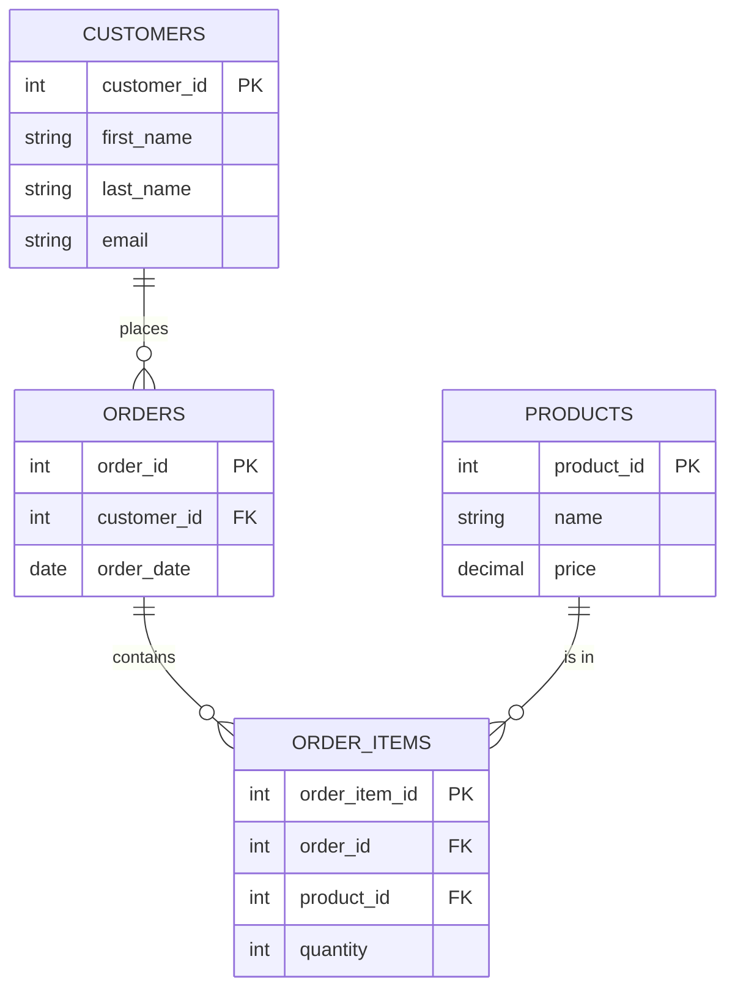

<!--
language: de
narrator: German Male

author:   André Dietrich; GitHub Copilot
email:    LiaScript@web.de

version:  1.0.0

comment:  Einführung in das relationale Modell: Tabellen, Zeilen, Spalten, Primär-/Fremdschlüssel, Normalisierung und Integritätsbedingungen. Diese Session liefert das konzeptionelle Fundament für die SQL-Praxis ab L7.

logo:     ../assets/img/logo/5-lecture.jpg

import:   https://raw.githubusercontent.com/LiaTemplates/DuckDB/0.0.5/README.md
          https://raw.githubusercontent.com/liaScript/mermaid_template/master/README.md
          https://raw.githubusercontent.com/LiaTemplates/SpreadSheet/refs/heads/main/README.md


@hd: `@0`<!-- style="word-break: inherit" -->

-->

# Relationales Modell: Tabellen, Keys, Integrität und SQL

> **Session 5** – Lecture (90 Minuten)  
> **Lernziele:** LZ 2 (Relationale Grundlagen)

    --{{0}}--
Willkommen zur Session 5! Nach unserem Paradigmen-Überblick tauchen wir heute tief in das relationale Modell ein – das Fundament moderner Datenbanken. Warum ist SQL so dominant? Was macht Tabellen und Schlüssel so mächtig? Und warum sprechen wir von „Integrität"? Diese Fragen beantworten wir heute.

    {{0}}
<section>

## 🎯 Lernziele dieser Session

Nach dieser Session können Sie:

1. **Das relationale Modell** erklären und von anderen Paradigmen abgrenzen
2. **Tabellen, Zeilen, Spalten** als Grundbausteine verstehen
3. **Primär- und Fremdschlüssel** definieren und anwenden
4. **Normalisierung (1NF–3NF)** im Überblick
5. **Integritätsbedingungen (Constraints)** formulieren und deren Nutzen begründen

</section>

---

## Das relationale Modell – Motivation

    --{{0}}--
Stellen Sie sich vor: Sie betreiben einen Online-Shop und pflegen alle Daten manuell in einer Excel-Tabelle. Kunden bestellen Produkte, manche mehrfach, manche gar nicht. Alles landet in einer großen Tabelle. Klingt erstmal praktisch – aber lassen Sie uns gemeinsam schauen, wo die Probleme lauern.

    {{0}}
<section>

### Szenario: Der Online-Shop in Excel

**Ihre Situation:**

Sie betreiben einen kleinen Online-Shop und verwalten **alle Daten in einer Excel-Tabelle**:

- **Kunden** mit Namen und E-Mail
- **Bestellungen** mit Datum
- **Produkte** mit Preis und Menge

Ein Kunde kann **mehrere Bestellungen** aufgeben, jede Bestellung kann **mehrere Produkte** enthalten.

**Die Tabelle sieht so aus:**

</section>

     {{1}}
<!--  style="max-width: 100%; overflow: auto"   -->
``` json  @spreadsheet
{
  "worksheets": [
    {
      "worksheetName": "Orders Flat (UNF)",
      "data": [
        [1, "Alice Müller", "alice@example.com", 101, "2025-10-01", 201, "Laptop", 1200.00, 1, "=H2*I2"],
        [1, "Alice Müller", "alice@example.com", 101, "2025-10-01", 202, "Mouse", 25.00, 2, "=H3*I3"],
        [1, "Alice Müller", "alice@example.com", 102, "2025-10-15", 204, "Monitor", 300.00, 1, "=H4*I4"],
        [2, "Bob Schmidt", "bob@example.com", 103, "2025-11-01", 203, "Keyboard", 60.00, 1, "=H5*I5"],
        [2, "Bob Schmidt", "bob@example.com", 103, "2025-11-01", 202, "Mouse", 25.00, 1, "=H6*I6"],
        [3, "Clara Fischer", "clara@example.com", "", "", "", "", "", "", ""]
      ],
      "columns": [
        { "type": "numeric",  "title": "customer_id",   "width": 110 },
        { "type": "text",     "title": "customer_name", "width": 160 },
        { "type": "text",     "title": "email",         "width": 220 },
        { "type": "numeric",  "title": "order_id",      "width": 100 },
        { "type": "calendar", "title": "order_date",    "width": 120, "format": "YYYY-MM-DD" },
        { "type": "numeric",  "title": "product_id",    "width": 110 },
        { "type": "text",     "title": "product_name",  "width": 140 },
        { "type": "numeric",  "title": "price",         "width": 110, "mask": "$ #,##0.00", "decimal": "." },
        { "type": "numeric",  "title": "quantity",      "width": 100 },
        { "type": "numeric",  "title": "line_total",    "width": 130, "mask": "$ #,##0.00", "decimal": "." }
      ],
      "options": {
        "search": true,
        "columnSorting": true,
        "freezeColumns": 1
      }
    }
  ]
}
```

    --{{0}}--
Schauen Sie sich diese Tabelle genau an. Auf den ersten Blick scheint alles in Ordnung – aber lassen Sie uns systematisch durchgehen, welche Probleme hier entstehen.

    {{1-2}}
<section>

### Problem 1: Massive Redundanz

    --{{1}}--
Fällt Ihnen etwas auf? Alice Müller und ihre E-Mail-Adresse stehen dreimal in der Tabelle. Bob Schmidt zweimal. Diese Wiederholung nennen wir Redundanz – und sie ist der Anfang aller Übel.

**Beobachtung:**

- **Alice Müller** erscheint **3-mal** (Zeilen 1–3)
- **Bob Schmidt** erscheint **2-mal** (Zeilen 4–5)
- Die gleiche E-Mail wird **mehrfach** gespeichert

**Warum ist das problematisch?**

- 📊 **Speicherplatzverschwendung:** Kundendaten werden x-fach dupliziert
- 🔍 **Inkonsistenzrisiko:** Was, wenn Alice in Zeile 1 eine andere E-Mail hat als in Zeile 3?
- 🐌 **Performance:** Große Tabellen werden langsam und unübersichtlich

> **Redundanz** = Unnötige Wiederholung von Daten

</section>

    {{2-3}}
<section>

### Problem 2: Update-Anomalie

    --{{2}}--
Stellen Sie sich vor, Alice heiratet und ändert ihren Namen zu Alice Schmidt. Oder sie zieht um und hat eine neue E-Mail-Adresse. Was müssen Sie tun?

**Szenario:** Alice ändert ihre E-Mail von `alice@example.com` zu `alice.mueller@newmail.com`

**Was müssen Sie tun?**

1. Zeile 1 aktualisieren
2. Zeile 2 aktualisieren
3. Zeile 3 aktualisieren

**Was passiert, wenn Sie eine Zeile vergessen?**

<!-- data-type="none"-->
| `customer_id` | `customer_name` | `email`                    | `order_id` | ... |
| ------------: | --------------- | -------------------------- | ---------: | --- |
|             1 | Alice Müller    | alice.mueller\@newmail.com |        101 | ... |
|             1 | Alice Müller    | alice\@example.com         |        101 | ... |
|             1 | Alice Müller    | alice.mueller\@newmail.com |        102 | ... |

❌ **Inkonsistenz!** Welche E-Mail ist jetzt korrekt?

> **Update-Anomalie:** Änderungen müssen an mehreren Stellen durchgeführt werden

</section>

    {{3-4}}
<section>

### Problem 3: Insert-Anomalie

    --{{3}}--
Schauen Sie sich Zeile 6 an: Clara Fischer. Sie ist als Kundin registriert, hat aber noch nie etwas bestellt. Deshalb sind alle Bestell- und Produktfelder leer. Das ist ineffizient und erzeugt NULL-Werte.

**Szenario:** Neuer Kunde **ohne Bestellung**

Clara Fischer hat sich registriert, aber noch nichts gekauft:

<!-- data-type="none"-->
| `customer_id` | `customer_name` | `email`            | `order_id` | `order_date` | `product_id` | `product_name` | `price` | `quantity` |
| ------------: | --------------- | ------------------ | ---------: | -----------: | -----------: | -------------- | ------: | ---------: |
|             3 | Clara Fischer   | clara\@example.com |            |              |              |                |         |            |

**Probleme:**

- ❌ **NULL-Felder:** 6 von 9 Spalten sind leer
- ❌ **Verschwendung:** Speicherplatz für nicht genutzte Felder
- ❌ **Logikfehler:** Ist `order_id = NULL` oder `order_id = 0` oder fehlt der Kunde ganz?

> **Insert-Anomalie:** Daten können nur unvollständig eingefügt werden

</section>

    {{4-5}}
<section>

### Problem 4: Delete-Anomalie

    --{{4}}--
Angenommen, Bob storniert seine einzige Bestellung. Wenn wir die Zeilen 4 und 5 löschen, sind alle Informationen über Bob komplett weg – obwohl er als Kunde vielleicht weiterhin im System sein sollte.

**Szenario:** Bestellung wird storniert

Bob storniert Bestellung 103. Wir löschen Zeilen 4–5:

**Vorher:**

<!-- data-type="none"-->
| `customer_id` | `customer_name` | `email`          | `order_id` | ... |
| ------------: | --------------- | ---------------- | ---------: | --- |
|             2 | Bob Schmidt     | bob\@example.com |        103 | ... |
|             2 | Bob Schmidt     | bob\@example.com |        103 | ... |

**Nachher:**

<!-- data-type="none"-->
| `customer_id` | `customer_name` | `email` | `order_id` | ... |
| ------------: | --------------- | ------- | ---------: | --- |
|               |                 |         |            |     |

❌ **Alle Kundendaten von Bob sind verloren!**

> **Delete-Anomalie:** Löschen von Daten führt zu ungewolltem Datenverlust

</section>

    {{5-6}}
<section>

### Problem 5: Schwierige Abfragen

    --{{5}}--
Versuchen Sie mal, aus dieser Tabelle herauszufinden: Wie viele Bestellungen hat jeder Kunde? Welche Produkte wurden am häufigsten verkauft? Solche Fragen erfordern komplexe Excel-Formeln oder Pivot-Tabellen – und werden schnell fehleranfällig.

**Typische Fragen:**

1. **Wie viele Bestellungen hat Alice?**  
   → Zeilen zählen, Duplikate ignorieren (Order 101 zählt nur 1x)

2. **Welches Produkt wurde am häufigsten verkauft?**  
   → Quantity summieren, nach Product gruppieren

3. **Welcher Kunde hat am meisten ausgegeben?**  
   → Price × Quantity berechnen, nach Customer summieren

**In Excel:**

- ❌ Komplexe `SUMIF`, `COUNTIF`, `VLOOKUP`-Formeln
- ❌ Anfällig für Fehler (falsche Zellreferenzen)
- ❌ Langsam bei vielen Zeilen (>10.000)

> **Abfragen** werden manuell, fehleranfällig und ineffizient

</section>

    {{6}}
<section>

### Problem 6: Keine strukturierte Validierung

    --{{6}}--
Was verhindert, dass jemand versehentlich "Laptop" in das Feld für den Preis einträgt? Oder dass eine E-Mail ohne At-Zeichen gespeichert wird? In Excel gibt es keine automatische Überprüfung – Fehler schleichen sich leicht ein.

**Fehlerbeispiele:**

| customer_id | email          | price   | quantity |
| ----------: | -------------- | ------- | -------- |
|           1 | alice-example  | Laptop  | 2.5      |
|           2 | bob@.com       | -50     | null     |

**Probleme:**

- ❌ **Ungültige E-Mail:** Kein `@`-Zeichen
- ❌ **Falscher Datentyp:** "Laptop" statt Zahl
- ❌ **Negative Preise:** Keine Plausibilitätsprüfung
- ❌ **NULL-Quantity:** Ist das 0 oder fehlt der Wert?

> Keine **automatische Validierung** → Datenqualität leidet

</section>

    --{{7}}--
Genau diese Probleme hat Edgar F. Codd 1970 erkannt und das relationale Modell entwickelt. Es basiert auf mathematischer Mengenlehre und Relationenalgebra – aber keine Sorge, wir fokussieren uns auf die praktischen Konzepte.

### Historie & Evolution

    --{{0}}--
Bevor wir tiefer ins relationale Modell einsteigen, werfen wir einen Blick zurück: Wie entstand SQL eigentlich? Und warum ist es seit 50 Jahren dominant?

    {{1}}
<section>

#### Die Geburt des relationalen Modells

**1970 – Edgar F. Codd (IBM):**

    --{{0}}--
Stellen Sie sich die Welt der Datenverarbeitung um 1970 vor: Daten wurden in komplexen, oft undurchsichtigen Strukturen gespeichert – meist hierarchisch oder als Netzwerke, die schwer zu durchsuchen und zu pflegen waren. Edgar F. Codd, ein britischer Mathematiker bei IBM, erkannte, dass diese Systeme fehleranfällig und unflexibel waren. Sein revolutionärer Ansatz: Daten sollten mathematisch sauber, als Mengen und Relationen organisiert werden. Das Ziel war, die Abhängigkeit von der physischen Speicherung zu durchbrechen und stattdessen eine abstrakte, deklarative Sicht auf Daten zu ermöglichen. Mit dem relationalen Modell wurde es erstmals möglich, Daten unabhängig von ihrer technischen Struktur zu modellieren, flexibel abzufragen und konsistent zu halten. Diese Idee war der Startschuss für moderne Datenbanksysteme und die Grundlage für SQL, wie wir es heute kennen.

- Mathematische Grundlage: Mengenlehre & Relationen
- Ziel: Datenunabhängigkeit & deklarative Abfragen
- Revolution: Weg von hierarchischen/netzwerkbasierten Datenbanken

> ___"A Relational Model of Data for Large Shared Data Banks"___
>
> <embed src="../assets/pdf/a-relational-model-of-data-for-large-shared-data-banks.pdf" type="application/pdf" width="100%" height="600px" />

    {{2}}
> ___We are Sorry to Inform you ...___
>
>    --{{2}}--
> Edgar F. Codds bahnbrechendes Paper zum relationalen Modell wurde tatsächlich nicht sofort als revolutionär gefeiert. Im Gegenteil: Es wurde mindestens zweimal von wissenschaftlichen Zeitschriften abgelehnt, bevor es endlich veröffentlicht wurde. Auch bei IBM selbst stieß Codd zunächst auf Widerstand. Viele Kollegen und Manager waren überzeugt, dass die bestehenden hierarchischen (IMS) und netzwerkartigen (CODASYL) Datenbanksysteme leistungsfähiger und ausgereifter seien. Codds Ansatz galt als zu theoretisch und wurde als „unpraktisch“ abgetan. Erst nach und nach – und mit viel Beharrlichkeit – konnte Codd die Community und IBM davon überzeugen, dass sein Modell die Grundlage für eine neue Generation von Datenbanksystemen bilden würde. Die Ablehnungsschreiben, wie das hier eingebettete, sind ein eindrucksvolles Zeugnis dafür, wie schwer sich Innovationen manchmal durchsetzen müssen.
>
> <embed src="../assets/pdf/we-are-sorry-to-inform-you.pdf" type="application/pdf" width="100%" height="600px" />

</section>

    {{3}}
<section>

#### ⚡ Codd’s Idee

    --{{3}}--
Statt Daten über physische Strukturen (Pointer, Navigationspfade) zu erreichen, sollte man sie über logische Beziehungen und mathematische Abfragen beschreiben können.

__Er kombinierte zwei Gebiete:__

- Mengenlehre
- Prädikatenlogik (erste Stufe)

Daraus entstand das, was er das relationale Modell nannte — Tabellen (Relations), Tupel (Rows), Attribute (Columns), und eine deklarative Sprache (später SQL).

</section>

### Was ist das relationale Modell?

**Definition:**

> Ein Datenmodell, das Daten in **Tabellen (Relations)** organisiert, wobei jede Zeile ein **Tupel** und jede Spalte ein **Attribut** darstellt.

<!--  style="max-width: 100%; overflow: auto"   -->
``` json  @spreadsheet
{
  "worksheets": [
    {
      "worksheetName": "Orders Flat (UNF)",
      "data": [
        [1, "Alice Müller", "alice@example.com", 101, "2025-10-01", 201, "Laptop", 1200.00, 1, "=H2*I2"],
        [1, "Alice Müller", "alice@example.com", 101, "2025-10-01", 202, "Mouse", 25.00, 2, "=H3*I3"],
        [1, "Alice Müller", "alice@example.com", 102, "2025-10-15", 204, "Monitor", 300.00, 1, "=H4*I4"],
        [2, "Bob Schmidt", "bob@example.com", 103, "2025-11-01", 203, "Keyboard", 60.00, 1, "=H5*I5"],
        [2, "Bob Schmidt", "bob@example.com", 103, "2025-11-01", 202, "Mouse", 25.00, 1, "=H6*I6"],
        [3, "Clara Fischer", "clara@example.com", "", "", "", "", "", "", ""]
      ],
      "columns": [
        { "type": "numeric",  "title": "customer_id",   "width": 110 },
        { "type": "text",     "title": "customer_name", "width": 160 },
        { "type": "text",     "title": "email",         "width": 220 },
        { "type": "numeric",  "title": "order_id",      "width": 100 },
        { "type": "calendar", "title": "order_date",    "width": 120, "format": "YYYY-MM-DD" },
        { "type": "numeric",  "title": "product_id",    "width": 110 },
        { "type": "text",     "title": "product_name",  "width": 140 },
        { "type": "numeric",  "title": "price",         "width": 110, "mask": "$ #,##0.00", "decimal": "." },
        { "type": "numeric",  "title": "quantity",      "width": 100 },
        { "type": "numeric",  "title": "line_total",    "width": 130, "mask": "$ #,##0.00", "decimal": "." }
      ],
      "options": {
        "search": true,
        "columnSorting": true,
        "freezeColumns": 1
      }
    }
  ]
}
```

**Kernprinzipien:**

{{1}} **Strukturierte Daten:** Feste Schemata mit definierten Datentypen

    --{{1}}--
Das erste Prinzip des relationalen Modells ist die Strukturierung der Daten. Jede Tabelle hat ein festes Schema mit klar definierten Datentypen. Das sorgt dafür, dass die Daten konsistent und überprüfbar sind – zum Beispiel kann in einer Spalte für Preise kein Text stehen. So wird die Datenqualität von Anfang an gesichert.


{{2}} **Beziehungen:** Verknüpfung über Schlüssel (Keys)

    --{{2}}--
Das zweite Prinzip sind die Beziehungen zwischen den Tabellen. Über Schlüssel – also Primär- und Fremdschlüssel – werden die Daten logisch miteinander verknüpft. So können Sie zum Beispiel Bestellungen eindeutig einem Kunden zuordnen und Produkte mit Bestellungen verbinden. Das macht komplexe Datenmodelle erst möglich.


{{3}} **Integrität:** Constraints sichern Konsistenz

    --{{3}}--
Das dritte Prinzip ist die Integrität. Constraints wie `NOT NULL`, `UNIQUE` oder `CHECK` sorgen dafür, dass die Datenbank nur gültige und konsistente Daten zulässt. Fehlerhafte oder widersprüchliche Einträge werden so direkt verhindert – die Datenbank wacht über die Qualität.


{{4}} **Deklarative Sprache:** SQL beschreibt „was", nicht „wie"

    --{{4}}--
Das vierte Prinzip ist die deklarative Sprache. Mit SQL beschreiben Sie, was Sie von der Datenbank möchten – zum Beispiel „Gib mir alle Kunden aus Deutschland“. Wie die Datenbank das technisch umsetzt, bleibt ihr überlassen. Das macht SQL mächtig und flexibel, weil Sie sich nicht um die Details der Ausführung kümmern müssen.


## SQL: Die Sprache der relationalen Datenbanken

   --{{0}}--
SQL ist mehr als nur SELECT. Als Edgar F. Codd das relationale Modell entwickelte, brauchte es eine Sprache, die sowohl die Schema-Definition als auch die Datenmanipulation und die Zugriffskontrolle abdeckt. SQL wurde deshalb von Anfang an als umfassende Datenbanksprache konzipiert – nicht nur zum Abfragen, sondern zum vollständigen Verwalten relationaler Datenbanken.

    {{0}}
<section>

### Die Evolution der SQL-Kategorien

**Von der Idee zur Praxis:**

Als IBM in den 1970ern SEQUEL entwickelte, wurde klar: Eine Datenbanksprache braucht verschiedene "Modi":

1. **Schema definieren** – Wie strukturieren wir Daten? → **DDL**
2. **Daten abfragen & ändern** – Wie arbeiten wir mit Daten? → **DQL/DML**
3. **Zugriff kontrollieren** – Wer darf was? → **DCL**
4. **Konsistenz sichern** – Wie bündeln wir Änderungen? → **TCL**

> SQL ist keine monolithische Sprache, sondern ein **Werkzeugkasten** mit spezialisierten Teilsprachen.

</section>

    {{1}}
<section>

### Von SEQUEL zu SQL

**Timeline:**

| Jahr      | Ereignis                                                                                      |
| --------- | --------------------------------------------------------------------------------------------- |
| **1974**  | IBM entwickelt **SEQUEL** (Structured English Query Language)                                 |
| **1976**  | Umbenennung zu **SQL** (wegen Markenrechten)                                                  |
| **1979**  | Erste kommerzielle Implementierung (Oracle)                                                   |
| **1986**  | **SQL-86** – erster ANSI-Standard                                                             |
| **1992**  | **SQL-92** – Major Update (Joins, Subqueries)                                                 |
| **1999**  | **SQL:1999** – Triggers, rekursive Queries                                                    |
| **2003+** | SQL:2003, 2006, 2008, 2011, 2016, 2023 – laufende Erweiterungen (XML, JSON, Window Functions) |

> SQL ist **standardisiert**, aber jede DB hat Dialekte (PostgreSQL, MySQL, SQL Server, Oracle)

</section>

    {{2}}
<section>

### SQL-Sprachkategorien

SQL ist keine monolithische Sprache, sondern besteht aus **5 Hauptkategorien**:

| Kategorie                        | Abkürzung | Zweck                                  | Beispiele                                |
| -------------------------------- | --------- | -------------------------------------- | ---------------------------------------- |
| **Data Query Language**          | **DQL**   | Daten abfragen (manchmal Teil von DML) | `SELECT`                                 |
| **Data Definition Language**     | **DDL**   | Schema definieren/ändern               | `CREATE`, `ALTER`, `DROP`, `TRUNCATE`    |
| **Data Manipulation Language**   | **DML**   | Daten lesen/schreiben                  | (`SELECT`), `INSERT`, `UPDATE`, `DELETE` |
| **Data Control Language**        | **DCL**   | Zugriffsrechte steuern                 | `GRANT`, `REVOKE`                        |
| **Transaction Control Language** | **TCL**   | Transaktionen verwalten                | `COMMIT`, `ROLLBACK`, `SAVEPOINT`        |

</section>

    {{3}}
<section>

### Warum SQL so erfolgreich ist

1. **Deklarativ:** Man sagt „was", nicht „wie"

   ```sql
   SELECT name FROM customers WHERE country = 'Germany';
   ```

   → DB entscheidet, wie sie die Daten holt (Index, Scan, etc.)

2. **Standardisiert:** ANSI/ISO Standard → portabel zwischen Systemen

3. **Mächtig:** Von einfachen Lookups bis zu komplexen Analysen

4. **Optimiert:** Query Optimizer plant effizienteste Ausführung

5. **Verbreitet:** Fast jede relationale DB spricht SQL

</section>


    {{3}}
<section>

### Vergleich zu bisherigen Paradigmen

| Paradigma      | Strukturgrad        | Beziehungen                | Abfragesprache       | Integrität            |
| -------------- | ------------------- | -------------------------- | -------------------- | --------------------- |
| **Key-Value**  | Unstrukturiert      | Keine                      | Key-Lookup           | Keine                 |
| **Document**   | Flexibel (JSON)     | Embedded/Refs              | JSON-Queries         | Optional              |
| **Column**     | Spaltenorientiert   | Begrenzt                   | SQL-ähnlich          | Partial               |
| **Relational** | **Rigide (Schema)** | **Primär-/Fremdschlüssel** | **SQL (deklarativ)** | **ACID, Constraints** |

> Relationale DBs tauschen Flexibilität gegen **Konsistenz und Integrität**.

</section>


### Data Definition Language **DDL**

**Zweck:** Datenbank-**Schema** definieren und ändern

**Haupt-Befehle:** `CREATE`, `ALTER`, `DROP`, `TRUNCATE`

**Beispiele:**

```sql
-- Tabelle erstellen
CREATE TABLE products (
  product_id INT PRIMARY KEY,
  name VARCHAR(100) NOT NULL,
  price DECIMAL(10,2) CHECK (price >= 0)
);

-- Tabelle erweitern
ALTER TABLE products ADD COLUMN category VARCHAR(50);

-- Tabelle löschen
DROP TABLE products;

-- Alle Daten löschen (Struktur bleibt)
TRUNCATE TABLE products;
```

**Wichtig:**

- DDL-Befehle ändern die **Struktur**, nicht die Daten
- Oft **nicht rückgängig** machbar (außer mit Backup)
- In SQLite: `ALTER TABLE` hat Einschränkungen (z. B. keine Spalten-Umbenennung in alten Versionen)

### Data Query Language **DQL**

    {{0}}
<section>

**Zweck:** Daten **abfragen** (lesen), ohne sie zu ändern

**Haupt-Befehl:** `SELECT`

**Beispiel:**

```sql
-- Alle Kunden aus Deutschland
SELECT first_name, last_name, email 
FROM customers 
WHERE country = 'Germany';
```

**Wichtig:**

- Viele betrachten `SELECT` als Teil von **DML** (Data Manipulation)
- In modernen Standards wird DQL oft separat genannt
- **Read-Only**: Keine Datenänderung, nur Abfrage

> **Deklarativ:** Sie sagen **was** Sie wollen, nicht **wie** die DB es holt (Query Optimizer entscheidet)

</section>

---


### Data Manipulation Language **DML**

**Zweck:** Daten **einfügen, ändern, löschen** (manchmal inkl. `SELECT`)

**Haupt-Befehle:** `INSERT`, `UPDATE`, `DELETE` (+ `SELECT`)

**Beispiele:**

```sql
-- Daten einfügen
INSERT INTO customers (first_name, last_name, email, country)
VALUES ('Alice', 'Müller', 'alice@example.com', 'Germany');

-- Daten ändern
UPDATE customers 
SET email = 'alice.mueller@example.com' 
WHERE customer_id = 1;

-- Daten löschen
DELETE FROM customers 
WHERE country = 'USA';
```

**Wichtig:**

- DML arbeitet mit den **Daten**, nicht mit der Struktur
- `SELECT` wird manchmal als DQL (Data Query Language) separiert
- Änderungen können in Transaktionen gebündelt werden (→ TCL)


### Data Control Language **DCL**

**Zweck:** **Zugriffsrechte** und Berechtigungen steuern

**Haupt-Befehle:** `GRANT`, `REVOKE`

**Beispiele:**

```sql
-- Benutzer anlegen und Rechte geben
GRANT SELECT, INSERT ON customers TO user_alice;

-- Rechte einschränken
REVOKE INSERT ON customers FROM user_alice;
```

**Wichtig:**

- **SQLite:** Keine Benutzer-Verwaltung (File-Level Security)
- **DuckDB:** Ähnlich wie SQLite, keine integrierten User-Rollen
- **PostgreSQL/MySQL:** Volle DCL-Unterstützung mit komplexen Rollen

> In Browser-basierten DBs (SQLite-Wasm, DuckDB-Wasm) ist DCL meist **nicht relevant**.

### Transaction Control Language **TCL**

**Zweck:** **Transaktionen** verwalten – Änderungen bündeln und absichern

**Haupt-Befehle:** `BEGIN`/`START TRANSACTION`, `COMMIT`, `ROLLBACK`, `SAVEPOINT`

**Beispiele:**

```sql
-- Transaktion starten
BEGIN TRANSACTION;

-- Mehrere Operationen
INSERT INTO orders (customer_id, order_date) VALUES (1, '2025-11-03');
UPDATE customers SET last_order = '2025-11-03' WHERE customer_id = 1;

-- Alles speichern
COMMIT;

-- Oder: Alles rückgängig machen
ROLLBACK;
```

**Mit Savepoints:**

```sql
BEGIN;
INSERT INTO logs (message) VALUES ('Start');
SAVEPOINT sp1;
INSERT INTO logs (message) VALUES ('Middle');
ROLLBACK TO sp1;  -- Nur 'Middle' wird rückgängig gemacht
COMMIT;           -- 'Start' bleibt
```

**Wichtig:**

- **Atomarität:** Entweder alles oder nichts
- **Konsistenz:** DB bleibt in gültigem Zustand
- Beide (SQLite & DuckDB) unterstützen **ACID-Transaktionen**


### Zusammenfassung: SQL-Kategorien

    {{0}}
<section>

### Die 5 Säulen von SQL

```ascii
         SQL-Sprachkategorien
              |
    ┌─────────┼─────────┬─────────┬─────────┐
    |         |         |         |         |

   DQL       DDL       DML       DCL       TCL
(Abfragen) (Schema) (Daten)  (Rechte) (Transaktionen)

    |         |         |         |         |

 SELECT    CREATE    INSERT    GRANT     BEGIN
           ALTER     UPDATE    REVOKE    COMMIT
           DROP      DELETE              ROLLBACK
```

**Praxis-Tipps:**

1. **DQL/DML** = Alltag (90% der Befehle)
2. **DDL** = Setup & Migration (Tabellen anlegen/ändern)
3. **DCL** = Multi-User-Systeme (Browser-DBs meist egal)
4. **TCL** = Konsistenz-kritische Operationen (z. B. Geldtransfers)

> **Nächster Schritt:** In Session 7 starten wir mit praktischem SQL – fokussiert auf **DQL** (`SELECT`).

</section>

---

## Relationale Datenbanken in der Praxis

    --{{0}}--
Jetzt wird es praktisch. Schauen Sie sich diese Tabelle genau an – sie sieht auf den ersten Blick aus wie eine normale Excel-Tabelle aus unserem Online-Shop-Beispiel. Aber hier liegt genau das Problem: In dieser einen Tabelle sind mindestens drei völlig unterschiedliche Entitäten vermischt – Kunden, Bestellungen und Produkte. Alice Müller taucht dreimal auf, Bob Schmidt zweimal. Das ist ineffizient und fehleranfällig. Im relationalen Modell würden wir das niemals so machen. Stattdessen teilen wir diese große Tabelle auf in spezialisierte, kleine Tabellen – eine für Kunden, eine für Produkte, eine für Bestellungen. Genau das schauen wir uns jetzt Schritt für Schritt an.

<!--  style="max-width: 100%; overflow: auto"   -->
``` json  @spreadsheet
{
  "worksheets": [
    {
      "worksheetName": "Orders Flat (UNF)",
      "data": [
        [1, "Alice Müller", "alice@example.com", 101, "2025-10-01", 201, "Laptop", 1200.00, 1, "=H2*I2"],
        [1, "Alice Müller", "alice@example.com", 101, "2025-10-01", 202, "Mouse", 25.00, 2, "=H3*I3"],
        [1, "Alice Müller", "alice@example.com", 102, "2025-10-15", 204, "Monitor", 300.00, 1, "=H4*I4"],
        [2, "Bob Schmidt", "bob@example.com", 103, "2025-11-01", 203, "Keyboard", 60.00, 1, "=H5*I5"],
        [2, "Bob Schmidt", "bob@example.com", 103, "2025-11-01", 202, "Mouse", 25.00, 1, "=H6*I6"],
        [3, "Clara Fischer", "clara@example.com", "", "", "", "", "", "", ""]
      ],
      "columns": [
        { "type": "numeric",  "title": "customer_id",   "width": 110 },
        { "type": "text",     "title": "customer_name", "width": 160 },
        { "type": "text",     "title": "email",         "width": 220 },
        { "type": "numeric",  "title": "order_id",      "width": 100 },
        { "type": "calendar", "title": "order_date",    "width": 120, "format": "YYYY-MM-DD" },
        { "type": "numeric",  "title": "product_id",    "width": 110 },
        { "type": "text",     "title": "product_name",  "width": 140 },
        { "type": "numeric",  "title": "price",         "width": 110, "mask": "$ #,##0.00", "decimal": "." },
        { "type": "numeric",  "title": "quantity",      "width": 100 },
        { "type": "numeric",  "title": "line_total",    "width": 130, "mask": "$ #,##0.00", "decimal": "." }
      ],
      "options": {
        "search": true,
        "columnSorting": true,
        "freezeColumns": 1
      }
    }
  ]
}
```

    --{{1}}--
Schauen wir uns nun an, wie wir diese chaotische Tabelle in ein sauberes relationales Modell überführen. Der erste Schritt ist die Kundentabelle – die CUSTOMERS-Tabelle. Hier landen ausschließlich Kundendaten: die customer_id als Primärschlüssel, Vorname, Nachname und E-Mail-Adresse. Beachten Sie: Jeder Kunde erscheint genau einmal. Alice steht nicht mehr dreimal in der Tabelle, sondern nur noch ein einziges Mal. Wenn sie ihre E-Mail-Adresse ändert, müssen wir das nur an dieser einen Stelle aktualisieren. Das ist der erste große Vorteil der Normalisierung: keine Redundanz, keine Update-Anomalien mehr.


    {{1}}
<!--  style="max-width: 100%; overflow: auto"   -->
``` json  @spreadsheet
{
  "worksheets": [
    {
      "data": [
        [1, "Alice", "Müller", "alice@example.com"],
        [2, "Bob", "Schmidt", "bob@example.com"],
        [3, "Clara", "Fischer", "clara@example.com"]
      ],
      "columns": [
        { "type": "numeric",  "title": "customer_id",   "width": 110 },
        { "type": "text",     "title": "first_name",    "width": 160 },
        { "type": "text",     "title": "last_name",     "width": 160 },
        { "type": "text",     "title": "email",         "width": 220 },
      ],
      "options": {
        "search": true,
        "columnSorting": true,
        "freezeColumns": 1
      }
    }
  ]
}
```

    --{{2}}--
Als nächstes benötigen wir einen Produktkatalog – die PRODUCTS-Tabelle. Auch hier gilt das gleiche Prinzip: Jedes Produkt wird nur einmal erfasst, mit seiner product_id als Primärschlüssel, dem Produktnamen und dem Preis. Die Maus kostet 25 Euro – diese Information steht genau einmal im System. Egal wie viele Kunden die Maus bestellen, egal in wie vielen Bestellungen sie auftaucht – die Produktinformationen liegen zentral an einer Stelle. Wenn sich der Preis ändert, ändern wir ihn einmal hier in der PRODUCTS-Tabelle, und alle Abfragen greifen automatisch auf den aktuellen Wert zu.


    {{2}}
<!--  style="max-width: 100%; overflow: auto"   -->
``` json  @spreadsheet
{
  "worksheets": [
    {
      "data": [
        [201, "Laptop", 1200.00],
        [202, "Mouse", 25.00],
        [203, "Keyboard", 60.00],
        [204, "Monitor", 300.00]
      ],
      "columns": [
        { "type": "numeric",  "title": "product_id",    "width": 110 },
        { "type": "text",     "title": "product_name",  "width": 140 },
        { "type": "numeric",  "title": "price",         "width": 110, "mask": "$ #,##0.00", "decimal": "." },
      ],
      "options": {
        "search": true,
        "columnSorting": true,
        "freezeColumns": 1
      }
    }
  ]
}
```

    --{{3}}--
Jetzt kommen wir zu den Bestellungen – der ORDERS-Tabelle. Diese Tabelle ist schlank und fokussiert: Sie enthält nur die order_id als Primärschlüssel, die customer_id als Fremdschlüssel, der auf die Kundentabelle verweist, und das Bestelldatum. Sehen Sie, was hier passiert? Wir speichern nicht mehr, wer bestellt hat – wir verweisen nur auf den Kunden über die customer_id. Die Datenbank kann dann bei Bedarf über diesen Fremdschlüssel die Kundeninformationen aus der CUSTOMERS-Tabelle holen. Keine Produktdaten, keine Kundennamen – nur Referenzen. Das ist das Herzstück des relationalen Modells: Beziehungen über Schlüssel statt durch Duplizierung von Daten.


    {{3}}
<!--  style="max-width: 100%; overflow: auto"   -->
``` json  @spreadsheet
{
  "worksheets": [
    {
      "data": [
        [101, 1, "2025-10-01"],
        [102, 1, "2025-10-15"],
        [103, 2, "2025-11-01"]
      ],
      "columns": [
        { "type": "numeric",  "title": "order_id",      "width": 100 },
        { "type": "numeric",  "title": "customer_id",   "width": 110 },
        { "type": "calendar", "title": "order_date",    "width": 120, "format": "YYYY-MM-DD" },
      ],
      "options": {
        "search": true,
        "columnSorting": true,
        "freezeColumns": 1
      }
    }
  ]
}
```

    --{{4}}--
Und schließlich fehlt uns noch die Verknüpfungstabelle: `ORDER_ITEMS`. Das ist die Tabelle, die die Viele-zu-Viele-Beziehung zwischen Bestellungen und Produkten auflöst. Warum brauchen wir die? Nun, eine Bestellung kann mehrere Produkte enthalten, und ein Produkt kann in vielen Bestellungen auftauchen. Diese N-zu-M-Beziehung können wir nicht direkt in einer Tabelle abbilden – wir brauchen eine Zwischentabelle. Jede Zeile hier repräsentiert genau ein Produkt in einer bestimmten Bestellung, inklusive der Menge. Über die Fremdschlüssel `order_id` und `product_id` stellen wir die Verbindungen zu den ORDERS- und PRODUCTS-Tabellen her. So entsteht ein sauberes, flexibles und wartbares Datenmodell ohne jegliche Redundanz.


    {{4}}
<!--  style="max-width: 100%; overflow: auto"   -->
``` json  @spreadsheet
{
  "worksheets": [
    {
      "data": [
        [301, 101, 201, 1],
        [302, 101, 202, 2],
        [303, 102, 204, 1],
        [304, 103, 203, 1],
        [305, 103, 202, 1]
      ],
      "columns": [
        { "type": "numeric",  "title": "order_item_id", "width": 130 },
        { "type": "numeric",  "title": "order_id",      "width": 100 },
        { "type": "numeric",  "title": "product_id",    "width": 110 },
        { "type": "numeric",  "title": "quantity",      "width": 100 },
      ],
      "options": {
        "search": true,
        "columnSorting": true,
        "freezeColumns": 1
      }
    }
  ]
}
```


### Entitäten und deren Beziehungen

    --{{0}}--
Lassen Sie uns jetzt einen Schritt zurücktreten und das große Bild betrachten. Was haben wir hier eigentlich modelliert? Wir haben aus einer chaotischen, redundanten Tabelle vier saubere, spezialisierte Tabellen gemacht. Aber das Spannende ist nicht nur, dass wir die Daten aufgeteilt haben – das Spannende sind die Beziehungen zwischen diesen Tabellen. Genau das macht das relationale Modell so mächtig.

    {{0}}
<section>

**Die vier Entitäten unseres Modells:**

- **CUSTOMERS** – Kundendaten
- **PRODUCTS** – Produktkatalog  
- **ORDERS** – Bestellungen
- **ORDER_ITEMS** – Bestellpositionen (Verknüpfungstabelle)

</section>

    --{{1}}--
Schauen wir uns zunächst die grundlegenden Komponenten einer relationalen Tabelle an. Jede Tabelle hat Spalten – auch Attribute genannt – die die Eigenschaften einer Entität beschreiben. Bei Kunden sind das zum Beispiel Vorname, Nachname und E-Mail. Jede Zeile – auch Tupel genannt – ist dann ein konkreter Datensatz, also ein einzelner Kunde. Und ganz wichtig: Der Primärschlüssel. Das ist das Attribut, das jeden Datensatz eindeutig identifiziert. Bei Kunden ist das die customer_id.

    {{1}}
<section>

**Komponenten einer relationalen Tabelle:**

- **Spalten (Columns/Attribute):** Eigenschaften der Entität (z. B. `first_name`, `email`, `price`)
- **Zeilen (Rows/Tupel):** Konkrete Datensätze (z. B. ein einzelner Kunde, ein einzelnes Produkt)
- **Primärschlüssel (Primary Key):** Eindeutige Identifikation jeder Zeile (z. B. `customer_id`, `product_id`)

</section>

    --{{2}}--
Jetzt wird es interessant: Wie stellen wir Beziehungen zwischen den Tabellen her? Dafür gibt es drei grundlegende Typen. Beginnen wir mit der Eins-zu-Eins-Beziehung. Das bedeutet: Ein Datensatz in Tabelle A gehört zu genau einem Datensatz in Tabelle B. Ein klassisches Beispiel wäre: Ein Kunde hat genau ein Kundenprofil mit zusätzlichen Informationen. In der Praxis trennt man solche Daten manchmal aus Sicherheits- oder Performance-Gründen, obwohl sie logisch zusammengehören.

    {{2}}
<section>

**1:1 (Eins-zu-Eins):**

> Ein Datensatz in Tabelle A ist mit **genau einem** Datensatz in Tabelle B verknüpft.

**Beispiel:**  
Ein Kunde hat genau ein Profil mit erweiterten Informationen (z. B. Zahlungsdaten, Lieferadresse).

```
CUSTOMERS (1) ←→ (1) CUSTOMER_PROFILES
```

</section>

    --{{3}}--
Viel häufiger ist die Eins-zu-Viele-Beziehung. Hier kann ein Datensatz in Tabelle A mit vielen Datensätzen in Tabelle B verknüpft sein. In unserem Beispiel: Ein Kunde kann viele Bestellungen aufgeben. Alice hat zwei Bestellungen, Bob hat eine. Das ist die typischste Beziehung in relationalen Datenbanken. Sie wird hergestellt, indem die Viele-Seite – also die ORDERS-Tabelle – einen Fremdschlüssel auf die Eins-Seite hat, also auf CUSTOMERS.

    {{3}}
<section>

**1:N (Eins-zu-Viele):**

> Ein Datensatz in Tabelle A ist mit **vielen** Datensätzen in Tabelle B verknüpft.

**Beispiel:**  
Ein Kunde kann viele Bestellungen aufgeben.

```
CUSTOMERS (1) ←→ (N) ORDERS
```

<!--  style="max-width: 100%; overflow: auto"   -->
``` json  @spreadsheet
{
  "worksheets": [
    {
      "data": [
        [101, 1, "2025-10-01"],
        [102, 1, "2025-10-15"],
        [103, 2, "2025-11-01"]
      ],
      "columns": [
        { "type": "numeric",  "title": "order_id",      "width": 100 },
        { "type": "numeric",  "title": "customer_id",   "width": 110 },
        { "type": "calendar", "title": "order_date",    "width": 120, "format": "YYYY-MM-DD" },
      ],
      "options": {
        "search": true,
        "columnSorting": true,
        "freezeColumns": 1
      }
    }
  ]
}
```


**Technisch:**  
Die ORDERS-Tabelle enthält einen **Fremdschlüssel** `customer_id`, der auf `CUSTOMERS.customer_id` verweist.

</section>

    --{{4}}--
Und dann gibt es noch die Viele-zu-Viele-Beziehung – die N-zu-M-Beziehung. Das ist der knifflige Fall: Viele Datensätze in Tabelle A können mit vielen Datensätzen in Tabelle B verknüpft sein. In unserem Beispiel: Viele Produkte können in vielen Bestellungen vorkommen. Die Maus wird von Alice und Bob bestellt, und Alice bestellt mehrere verschiedene Produkte. Diese Beziehung können wir nicht direkt abbilden – wir brauchen eine Zwischentabelle, die `ORDER_ITEMS`. Diese Tabelle löst die Viele-zu-Viele-Beziehung auf in zwei Eins-zu-Viele-Beziehungen: Eine Bestellung hat viele Order_Items, und ein Produkt kommt in vielen Order_Items vor.

    {{4}}
<section>

**N:M (Viele-zu-Viele):**

> Viele Datensätze in Tabelle A sind mit **vielen** Datensätzen in Tabelle B verknüpft.

**Beispiel:**  
Viele Produkte können in vielen Bestellungen vorkommen.

```
PRODUCTS (N) ←→ (M) ORDERS
```

**Problem:**  
Diese Beziehung kann nicht direkt in den Tabellen abgebildet werden.

**Lösung:**  
Eine **Zwischentabelle** (ORDER_ITEMS) mit zwei Fremdschlüsseln:

```
PRODUCTS (1) ←→ (N) ORDER_ITEMS (N) ←→ (1) ORDERS
```

<!--  style="max-width: 100%; overflow: auto"   -->
``` json  @spreadsheet
{
  "worksheets": [
    {
      "data": [
        [301, 101, 201, 1],
        [302, 101, 202, 2],
        [303, 102, 204, 1],
        [304, 103, 203, 1],
        [305, 103, 202, 1]
      ],
      "columns": [
        { "type": "numeric",  "title": "order_item_id", "width": 130 },
        { "type": "numeric",  "title": "order_id",      "width": 100 },
        { "type": "numeric",  "title": "product_id",    "width": 110 },
        { "type": "numeric",  "title": "quantity",      "width": 100 },
      ],
      "options": {
        "search": true,
        "columnSorting": true,
        "freezeColumns": 1
      }
    }
  ]
}
```

Die N:M-Beziehung wird aufgelöst in zwei 1:N-Beziehungen.

</section>

    --{{5}}--
Schauen wir uns das Ganze jetzt visuell an. Hier sehen Sie das Entity-Relationship-Diagramm unseres Datenmodells. Die Kästchen sind die Entitäten, die Linien zeigen die Beziehungen. Sehen Sie die Symbole? Der senkrechte Strich bedeutet „genau eins", der Krähenfuß bedeutet „viele". Ein Kunde kann viele Bestellungen aufgeben – das sehen Sie an der Linie zwischen CUSTOMERS und ORDERS. Eine Bestellung enthält viele Order_Items, und ein Produkt kommt in vielen Order_Items vor. So visualisieren wir die Struktur unseres Datenmodells, bevor wir es in SQL umsetzen.

    {{5}}
<section>

**Visualisierung: Entity-Relationship-Diagramm (ERD)**



**Legende:**

- `PK` = Primary Key (Primärschlüssel)
- `FK` = Foreign Key (Fremdschlüssel)
- `||--o{` = Eins-zu-Viele-Beziehung (1:N)

</section>

    --{{6}}--
Lassen Sie uns das Ganze nochmal zusammenfassen. Wir haben vier Tabellen modelliert, die über Schlüssel miteinander verbunden sind. Ein Kunde kann viele Bestellungen haben – das ist eine 1:N-Beziehung. Eine Bestellung kann viele Produkte enthalten und ein Produkt in vielen Bestellungen vorkommen – das ist eine N:M-Beziehung, die wir über die Zwischentabelle ORDER_ITEMS auflösen. Diese Struktur eliminiert Redundanz, verhindert Anomalien und macht das Datenmodell flexibel und wartbar. Das ist die Essenz des relationalen Modells.

    {{6}}
<section>

**Zusammenfassung der Beziehungen:**

| Von                   | Beziehung | Zu                | Bedeutung                                  |
| --------------------- | --------- | ----------------- | ------------------------------------------ |
| **CUSTOMERS**         | 1:N       | **ORDERS**        | Ein Kunde kann viele Bestellungen aufgeben |
| **ORDERS**            | 1:N       | **ORDER_ITEMS**   | Eine Bestellung enthält viele Positionen   |
| **PRODUCTS**          | 1:N       | **ORDER_ITEMS**   | Ein Produkt kann in vielen Positionen sein |
| **PRODUCTS ↔ ORDERS** | N:M       | (via ORDER_ITEMS) | Viele Produkte in vielen Bestellungen      |

✅ **Keine Redundanz**\
✅ **Klare Beziehungen über Schlüssel**\
✅ **Flexible Erweiterbarkeit**

</section>


### Datentypen: Sicherheit durch Schema

    --{{0}}--
Ein weiterer Grundpfeiler des relationalen Modells ist das feste Schema mit definierten Datentypen. Jede Spalte in einer relationalen Tabelle hat einen klar definierten Datentyp – INTEGER, VARCHAR, DATE und so weiter. Das mag auf den ersten Blick wie eine Einschränkung wirken, vor allem wenn Sie an schemafreie Systeme wie MongoDB oder Key-Value-Stores denken. Aber diese „Einschränkung" bringt enorme Vorteile: Sicherheit, Effizienz, Abfragbarkeit und Integrität. Schauen wir uns das genauer an.

    {{0}}
<section>

**Was sind Datentypen?**

Jede Spalte hat einen **festen Datentyp**, der bestimmt:

- Welche Werte erlaubt sind
- Wie viel Speicherplatz benötigt wird
- Welche Operationen möglich sind

**Grundlegende Datentypen:**

<!-- data-type="none" -->
| Datentyp       | Beschreibung          | Beispiel           |
| -------------- | --------------------- | ------------------ |
| `INTEGER`      | Ganzzahl              | `42`               |
| `VARCHAR(n)`   | Text (max. n Zeichen) | `'Max Mustermann'` |
| `DATE`         | Datum                 | `'2024-01-15'`     |
| `BOOLEAN`      | Wahrheitswert         | `TRUE`, `FALSE`    |
| `DECIMAL(p,s)` | Festkommazahl         | `19.99`            |

</section>

    {{1}}
<section>

**1. Vorteil: Datensicherheit & Validierung**

    --{{1}}--
Der erste große Vorteil fester Datentypen ist die Datensicherheit und Validierung. Wenn Sie definieren, dass die Spalte „Alter" vom Typ INTEGER ist, kann niemand versehentlich einen Text wie „dreiundzwanzig" eintragen. Die Datenbank weist das sofort zurück. In einem schemafreien System wie MongoDB oder einem Key-Value-Store könnten Sie problemlos verschiedene Datentypen in dasselbe Feld schreiben – das eine Dokument hat age als Zahl, das nächste als String. Das führt zu Chaos: Wenn Sie dann das Durchschnittsalter berechnen wollen, scheitert die Abfrage, weil „dreiundzwanzig" keine Zahl ist. In relationalen Datenbanken wird dieser Fehler bereits beim Schreiben abgefangen, nicht erst bei der Abfrage. Das spart Debugging-Zeit und verhindert Datenmüll.

**Relationale DB mit festem Schema:**

```sql
CREATE TABLE Customers (
  customer_id INTEGER PRIMARY KEY,
  age INTEGER,
  email VARCHAR(100)
);

-- Versuch: Falscher Datentyp
INSERT INTO Customers VALUES (1, 'dreiundzwanzig', 'alice@example.com');
-- ❌ FEHLER: "dreiundzwanzig" ist kein INTEGER!
```

**Vergleich:**

✅ **Relationale DB:** Typ-Fehler werden **sofort beim Einfügen** abgefangen\
❌ **Schemafreie DB:** Verschiedene Typen erlaubt → Fehler erst **bei der Abfrage**

</section>

    {{2}}
<section>

**2. Vorteil: Speicher- & Performance-Effizienz**


    --{{2}}--
Der zweite Vorteil ist die Speicher- und Performance-Effizienz. Ein INTEGER mit dem Wert 42 braucht in einer relationalen Datenbank genau 4 Bytes – immer, bei jedem Datensatz. Ein VARCHAR(100) reserviert maximal 100 Zeichen. Die Datenbank weiß genau, wie groß jeder Eintrag ist, und kann den Speicher optimal organisieren. In einem schemafreien System wie einem Key-Value-Store wird oft alles als generischer „Object"-Typ oder als JSON-String gespeichert. Der Wert 42 wird dann vielleicht als String „42" abgelegt, was mehr Platz braucht und langsamer zu verarbeiten ist, weil die Datenbank zur Laufzeit erst den Typ ermitteln und konvertieren muss. Feste Typen bedeuten: schneller Zugriff, weniger Overhead.

**Relationale DB:**

```sql
CREATE TABLE Products (
  product_id INTEGER,      -- 4 Bytes
  price DECIMAL(10,2),     -- 8 Bytes (fest)
  in_stock BOOLEAN         -- 1 Byte
);
```

- Jeder Datensatz hat **feste Größe**
- Datenbank kann Speicher **optimal** allokieren
- Indizes funktionieren **schnell** (feste Offsets)

**Schemafreie DB (generischer Object-Typ):**

- Werte oft als **String** oder **JSON** serialisiert
- Braucht mehr Platz (Overhead durch Typ-Information)
- Typ muss zur **Laufzeit** ermittelt werden

**Performance-Vergleich:**

| Operation           | Relationale DB | Schemafreie DB |
| ------------------- | -------------- | -------------- |
| Speicherplatz       | ✅ Minimal     | ❌ Overhead    |
| Zahlenvergleich     | ✅ Direkt      | ❌ Parsing     |
| Sortierung          | ✅ Schnell     | ❌ Langsamer   |
| Aggregation (SUM)   | ✅ Optimal     | ❌ Konvertierung|

</section>

    {{3}}
<section>

**3. Vorteil: Abfragbarkeit & Datenanalyse**

    --{{3}}--
Der dritte Vorteil ist die Abfragbarkeit und Datenanalyse. Weil die Datenbank weiß, dass „price" vom Typ DECIMAL ist, kann sie effizient Abfragen wie „alle Produkte unter 50 Euro" oder „Durchschnittspreis aller Laptops" ausführen. Der Query Optimizer kann Indizes nutzen, kann sortieren, kann aggregieren – alles optimiert für den Datentyp. In einem schemafreien System muss die Datenbank zur Laufzeit raten: Ist das jetzt eine Zahl oder ein String? Und hier wird es richtig problematisch: Wenn Sie Preise als Strings speichern und sortieren wollen, bekommen Sie lexikalische Sortierung – da kommt „100" vor „20", weil im Alphabet „1" vor „2" steht. Bei festen Typen passiert das nicht.

**Relationale DB – Typ-basierte Optimierung:**

```sql
-- Datenbank weiß: price ist DECIMAL
SELECT AVG(price) FROM Products WHERE price < 50.00;
-- ✅ Index auf price → schnelle Filterung
-- ✅ AVG() direkt berechenbar (keine Konvertierung)
-- ✅ Query Optimizer kann optimal planen
```

**Problem bei Typ-Unsicherheit:**

- Ist „price" eine Zahl oder ein String?
- Bei String-Sortierung: `"100" < "20"` (lexikalisch!)
- Index kann nicht optimal genutzt werden

**Sortierung – ein klassisches Problem:**

<!-- data-type="none" -->
| Wert (String) | Wert (Number) | String-Sort | Number-Sort |
| ------------- | ------------- | ----------- | ----------- |
| `"100"`       | `100`         | 1.          | 3.          |
| `"20"`        | `20`          | 2.          | 2.          |
| `"3"`         | `3`           | 3.          | 1.          |

✅ **Relationale DB:** Typ ist klar → korrekte Sortierung  
❌ **Schemafreie DB:** Typ gemischt → falsche Ergebnisse möglich

</section>

    {{4}}
<section>

**Die goldene Regel:**

    --{{4}}--
Natürlich haben schemafreie Systeme auch ihre Berechtigung. Sie sind flexibel, erlauben schnelle Änderungen am Datenmodell, und sind ideal für unstrukturierte Daten wie Logs oder Social-Media-Posts. Aber wenn Sie strukturierte Daten haben – Kunden, Bestellungen, Produkte – dann sind feste Datentypen Gold wert. Sie erzwingen Konsistenz, verbessern Performance, ermöglichen komplexe Abfragen und sichern Integrität. Das ist der Kern des relationalen Modells.

> Wenn Ihre Daten eine **klare Struktur** haben und Sie **Konsistenz** brauchen,\
> nutzen Sie **relationale Datenbanken** mit **festen Datentypen**.

**SQLite vs DuckDB – Typsysteme im Vergleich:**

| Typ       |    SQLite     |       DuckDB        |
| --------- | :-----------: | :-----------------: |
| INTEGER   |      ✅       | ✅ (versch. Größen) |
| REAL      |      ✅       |         ✅          |
| TEXT      |      ✅       |    ✅ (VARCHAR)     |
| BLOB      |      ✅       |         ✅          |
| BOOLEAN   | (als INTEGER) |         ✅          |
| DATE/TIME |  (als TEXT)   |         ✅          |
| DECIMAL   |  (als REAL)   |         ✅          |
| UUID      |      ❌       |         ✅          |
| ARRAY/MAP |      ❌       | ✅ (experimentell)  |

> **Hinweis:** SQLite verwendet ein flexibles Typensystem (Type Affinity), DuckDB ist strikter und SQL-konform.

    --{{5}}--
Ein wichtiger Unterschied zwischen den beiden Systemen, die wir verwenden werden: SQLite und DuckDB haben unterschiedliche Typsysteme. SQLite ist sehr flexibel – es nutzt Type Affinity, das heißt, Typen sind eher Hinweise als strikte Regeln. BOOLEAN wird als INTEGER gespeichert, DATE als TEXT, DECIMAL als REAL. Das ist pragmatisch, aber nicht SQL-Standard-konform. DuckDB hingegen ist strikt: Echte BOOLEANs, echte DATEs, echter DECIMAL-Typ. Dazu kommen fortgeschrittene Typen wie UUID und experimentell ARRAY und MAP. Wir nutzen DuckDB in dieser Vorlesung, weil es das relationale Modell sauberer umsetzt. Aber SQLite hat seine Berechtigung – es ist extrem verbreitet und perfekt für Embedded-Systeme. Die Wahl hängt vom Use-Case ab.

</section>


### Constraints (Integritätsbedingungen)

    --{{0}}--
Jetzt wird es ganz praktisch: Wir haben über Datentypen und Schlüssel gesprochen – aber wie setzen wir das alles technisch um? Die Antwort sind Constraints, also Integritätsbedingungen. Das sind Regeln, die wir direkt in der Datenbank definieren und die garantieren, dass unsere Daten konsistent, vollständig und korrekt bleiben. Schauen wir uns an, wie wir unsere vier Tabellen mit Constraints aufbauen und was jeder Constraint bewirkt.

    {{0}}
<section>

**Was sind Constraints?**

> Constraints sind **Regeln**, die die Datenbank **automatisch durchsetzt**, um Datenintegrität zu sichern.

**Die wichtigsten Constraint-Typen:**

1. **PRIMARY KEY** – Eindeutige Identifikation jeder Zeile
2. **FOREIGN KEY** – Beziehungen zwischen Tabellen
3. **NOT NULL** – Pflichtfelder
4. **UNIQUE** – Eindeutigkeit (außer Primärschlüssel)
5. **CHECK** – Geschäftsregeln (z. B. Preis ≥ 0)
6. **DEFAULT** – Standardwerte

**Drei Ebenen der Integrität:**

- **Entity Integrity:** Jede Zeile ist eindeutig identifizierbar (PRIMARY KEY)
- **Referential Integrity:** Beziehungen bleiben konsistent (FOREIGN KEY)
- **Domain Integrity:** Werte sind gültig (CHECK, NOT NULL, Datentypen)

</section>

    --{{1}}--
Beginnen wir mit der CUSTOMERS-Tabelle. Hier sehen Sie alle wichtigen Constraints in Aktion. Der Primärschlüssel `customer_id` garantiert, dass jeder Kunde eindeutig identifizierbar ist – keine Duplikate, niemals `NULL`. Die Spalten `first_name` und `last_name` sind `NOT NULL` – ein Kunde ohne Namen macht keinen Sinn. Und schauen Sie sich die E-Mail-Spalte an: Sie ist nicht nur `NOT NULL`, sondern auch `UNIQUE`. Das bedeutet: Jede E-Mail-Adresse kann nur einmal vorkommen. Keine zwei Kunden mit derselben E-Mail. Das ist Entity Integrity in Reinform.

    {{1}}
<section>

**1. CUSTOMERS-Tabelle – Entity Integrity**

```sql
CREATE TABLE CUSTOMERS (
  customer_id INT PRIMARY KEY,           -- 1️⃣ Eindeutige ID
  first_name VARCHAR(50) NOT NULL,       -- 2️⃣ Pflichtfeld
  last_name VARCHAR(50) NOT NULL,        -- 2️⃣ Pflichtfeld
  email VARCHAR(100) NOT NULL UNIQUE     -- 3️⃣ Pflicht + Einzigartig
);

INSERT INTO CUSTOMERS (customer_id, first_name, last_name, email) VALUES
  (1, 'Alice', 'Müller', 'alice@example.com'),
  (2, 'Bob', 'Schmidt', 'bob@example.com'),
  (3, 'Clara', 'Fischer', 'clara@example.com');
```
@DuckDB.terminal(demo)

**Was bewirken die Constraints?**

**1️⃣ PRIMARY KEY (`customer_id`):**

- ✅ Jeder Kunde hat eine eindeutige ID
- ❌ Duplikate werden abgelehnt: `INSERT INTO CUSTOMERS VALUES (1, 'Test', 'User', 'test@test.com')` → FEHLER
- ❌ NULL ist nicht erlaubt: `INSERT INTO CUSTOMERS VALUES (NULL, ...)` → FEHLER

**2️⃣ NOT NULL (`first_name`, `last_name`):**

- ✅ Namen müssen ausgefüllt sein
- ❌ Leere Namen: `INSERT INTO CUSTOMERS VALUES (4, NULL, 'Test', ...)` → FEHLER

**3️⃣ UNIQUE (`email`):**

- ✅ Jede E-Mail nur einmal
- ❌ Duplikate: `INSERT INTO CUSTOMERS VALUES (4, 'Dave', 'Test', 'alice@example.com')` → FEHLER

</section>

    --{{2}}--
Weiter zur PRODUCTS-Tabelle. Hier kommt ein neuer Constraint-Typ hinzu: CHECK. Schauen Sie sich die price-Spalte an – sie hat einen CHECK-Constraint, der sicherstellt, dass der Preis niemals negativ sein kann. Das ist Domain Integrity: Wir definieren gültige Wertebereiche für unsere Daten. Ein Produkt mit Preis minus 50 Euro? Macht keinen Sinn. Die Datenbank weist das automatisch ab. So erzwingen wir Geschäftsregeln direkt auf Datenbankebene, nicht in der Anwendung.

    {{2}}
<section>

**2. PRODUCTS-Tabelle – Domain Integrity mit CHECK**

```sql
CREATE TABLE PRODUCTS (
  product_id INT PRIMARY KEY,
  name VARCHAR(100) NOT NULL,
  price DECIMAL(10,2) CHECK (price >= 0)  -- 🔒 Kein Minus!
);

INSERT INTO PRODUCTS (product_id, name, price) VALUES
  (201, 'Laptop', 1200.00),
  (202, 'Mouse', 25.00),
  (203, 'Keyboard', 60.00),
  (204, 'Monitor', 300.00);
```
@DuckDB.terminal(demo)

**Was bewirkt der CHECK-Constraint?**

**🔒 CHECK (`price >= 0`):**

- ✅ Preise müssen >= 0 sein
- ❌ Negativer Preis: `INSERT INTO PRODUCTS VALUES (999, 'Test', -50.00)` → FEHLER
- ✅ Null Euro ist erlaubt: `INSERT INTO PRODUCTS VALUES (999, 'Gratis', 0.00)` → OK
- ✅ Geschäftsregeln direkt in der Datenbank

**Weitere mögliche CHECK-Constraints:**

```sql
-- Alter zwischen 18 und 120
age INT CHECK (age BETWEEN 18 AND 120)

-- Nur bestimmte Werte
status VARCHAR(20) CHECK (status IN ('active', 'inactive', 'pending'))

-- Datum nicht in der Zukunft
created_at DATE CHECK (created_at <= CURRENT_DATE)
```

</section>

    --{{3}}--
Jetzt wird es spannend: Die ORDERS-Tabelle führt uns zur referentiellen Integrität. Sehen Sie den FOREIGN KEY-Constraint bei `customer_id`? Der sagt: `customer_id` muss ein Wert sein, der tatsächlich in der CUSTOMERS-Tabelle existiert. Sie können keine Bestellung für Kunden-ID 999 anlegen, wenn es keinen Kunden mit der ID 999 gibt. Das ist der Kern des relationalen Modells: Beziehungen werden durch Constraints erzwungen. Die Datenbank garantiert, dass es keine "verwaisten" Bestellungen gibt – Bestellungen ohne zugehörigen Kunden.

    {{3}}
<section>

**3. ORDERS-Tabelle – Referential Integrity mit FOREIGN KEY**

```sql
CREATE TABLE ORDERS (
  order_id INT PRIMARY KEY,
  customer_id INT NOT NULL,
  order_date DATE,
  FOREIGN KEY (customer_id) REFERENCES CUSTOMERS(customer_id)  -- 🔗
);

INSERT INTO ORDERS (order_id, customer_id, order_date) VALUES
  (101, 1, '2025-10-01'),  -- Alice
  (102, 1, '2025-10-15'),  -- Alice
  (103, 2, '2025-11-01');  -- Bob
```
@DuckDB.terminal(demo)

**Was bewirkt der FOREIGN KEY?**

**🔗 FOREIGN KEY (`customer_id` → `CUSTOMERS.customer_id`):**

- ✅ Bestellungen nur für **existierende** Kunden
- ❌ Ungültige ID: `INSERT INTO ORDERS VALUES (999, 888, '2025-11-03')` → FEHLER (Kunde 888 existiert nicht)
- ✅ Clara (ID 3) hat keine Bestellung → OK (1:N erlaubt 0)
- ❌ Kunde löschen, der Bestellungen hat: `DELETE FROM CUSTOMERS WHERE customer_id = 1` → FEHLER (oder CASCADE)

**Optionen bei FOREIGN KEY:**

```sql
-- Was passiert, wenn der referenzierte Kunde gelöscht wird?
FOREIGN KEY (customer_id) REFERENCES CUSTOMERS(customer_id)
  ON DELETE CASCADE      -- Bestellungen werden mitgelöscht
  ON DELETE SET NULL     -- customer_id wird NULL
  ON DELETE RESTRICT     -- Löschen wird verhindert (Standard)
```

</section>

    --{{4}}--
Und schließlich die `ORDER_ITEMS`-Tabelle – hier sehen Sie zwei Foreign Keys in Aktion. Diese Tabelle ist die Brücke zwischen `ORDERS` und `PRODUCTS`, und beide Beziehungen werden durch Foreign Keys gesichert. Sie können kein `Order_Item` anlegen für eine nicht-existierende Bestellung. Sie können auch kein `Order_Item` anlegen für ein nicht-existierendes Produkt. Außerdem sehen Sie hier wieder einen CHECK-Constraint bei `quantity` – eine Bestellung mit null oder negativer Menge macht keinen Sinn. So entsteht ein wasserdichtes Netz aus Constraints, das Ihre Daten schützt.

    {{4}}
<section>

**4. ORDER_ITEMS-Tabelle – Mehrere FOREIGN KEYs**

```sql
CREATE TABLE ORDER_ITEMS (
  order_item_id INT PRIMARY KEY,
  order_id INT NOT NULL,
  product_id INT NOT NULL,
  quantity INT NOT NULL CHECK (quantity > 0),  -- 🔒 Min. 1 Stück
  FOREIGN KEY (order_id) REFERENCES ORDERS(order_id),        -- 🔗
  FOREIGN KEY (product_id) REFERENCES PRODUCTS(product_id)   -- 🔗
);

INSERT INTO ORDER_ITEMS (order_item_id, order_id, product_id, quantity) VALUES
  (301, 101, 201, 1),  -- Bestellung 101: 1x Laptop
  (302, 101, 202, 2),  -- Bestellung 101: 2x Mouse
  (303, 102, 204, 1),  -- Bestellung 102: 1x Monitor
  (304, 103, 203, 1),  -- Bestellung 103: 1x Keyboard
  (305, 103, 202, 1);  -- Bestellung 103: 1x Mouse
```
@DuckDB.terminal(demo)

**Was bewirken die Constraints?**

**🔗 FOREIGN KEY (`order_id`):**

- ✅ Nur Order_Items für **existierende Bestellungen**
- ❌ Ungültige Bestellung: `INSERT INTO ORDER_ITEMS VALUES (999, 888, 201, 1)` → FEHLER

**🔗 FOREIGN KEY (`product_id`):**

- ✅ Nur Order_Items für **existierende Produkte**
- ❌ Ungültiges Produkt: `INSERT INTO ORDER_ITEMS VALUES (999, 101, 777, 1)` → FEHLER

**🔒 CHECK (`quantity > 0`):**

- ✅ Mindestens 1 Stück
- ❌ Null: `INSERT INTO ORDER_ITEMS VALUES (999, 101, 201, 0)` → FEHLER
- ❌ Negativ: `INSERT INTO ORDER_ITEMS VALUES (999, 101, 201, -5)` → FEHLER

</section>

    --{{5}}--
Schauen wir uns jetzt an, wie all diese Tabellen zusammenspielen. Diese Abfrage hier ist ein `LEFT JOIN` über alle vier Tabellen – sie rekonstruiert die ursprüngliche Flat-Tabelle, die wir am Anfang hatten. Aber der Unterschied: Jetzt sind die Daten sauber normalisiert und durch Constraints geschützt. Alice' Daten stehen nur einmal in `CUSTOMERS`, Produktinformationen nur einmal in `PRODUCTS`. Keine Redundanz, keine Anomalien, aber wir können trotzdem die Daten so abfragen, als wären sie in einer Tabelle. Das ist die Eleganz des relationalen Modells.

    {{5}}
<section>

**Alles zusammen: Die Daten abfragen**

```sql
SELECT
  c.customer_id,
  CONCAT(c.first_name, ' ', c.last_name) AS customer_name,
  c.email,
  o.order_id,
  o.order_date,
  p.product_id,
  p.name AS product_name,
  p.price,
  oi.quantity
FROM CUSTOMERS AS c
LEFT JOIN ORDERS o ON c.customer_id = o.customer_id
LEFT JOIN ORDER_ITEMS oi ON o.order_id = oi.order_id
LEFT JOIN PRODUCTS p ON oi.product_id = p.product_id
ORDER BY c.customer_id, o.order_id;
```
@DuckDB.terminal(demo)

**Was sehen wir?**

- ✅ Alice (ID 1) hat 3 Zeilen: 2 Bestellungen mit insgesamt 3 Produkten
- ✅ Bob (ID 2) hat 2 Zeilen: 1 Bestellung mit 2 Produkten
- ✅ Clara (ID 3) hat 1 Zeile: Keine Bestellung (NULL-Werte bei LEFT JOIN)
- ✅ Daten sind **rekonstruierbar**, aber **normalisiert gespeichert**

</section>

    --{{6}}--
Fassen wir zusammen: Constraints sind der Klebstoff, der das relationale Modell zusammenhält. PRIMARY KEY garantiert Eindeutigkeit. FOREIGN KEY sichert Beziehungen. NOT NULL erzwingt Vollständigkeit. UNIQUE verhindert Duplikate. CHECK definiert Geschäftsregeln. DEFAULT setzt sinnvolle Standardwerte. Zusammen bilden sie ein Netz aus Regeln, das Ihre Daten konsistent, korrekt und verlässlich hält – automatisch, auf Datenbankebene, nicht in jeder einzelnen Anwendung. Das ist der große Vorteil relationaler Datenbanken.

    {{6}}
<section>

### Zusammenfassung: Constraint-Typen

| Constraint       | Zweck                                  | Beispiel                                           |
| ---------------- | -------------------------------------- | -------------------------------------------------- |
| **PRIMARY KEY**  | Eindeutige Identifikation              | `customer_id INT PRIMARY KEY`                      |
| **FOREIGN KEY**  | Beziehungen zwischen Tabellen          | `FOREIGN KEY (customer_id) REFERENCES CUSTOMERS`   |
| **NOT NULL**     | Pflichtfelder                          | `first_name VARCHAR(50) NOT NULL`                  |
| **UNIQUE**       | Eindeutigkeit (außer PK)               | `email VARCHAR(100) UNIQUE`                        |
| **CHECK**        | Geschäftsregeln                        | `price DECIMAL(10,2) CHECK (price >= 0)`           |
| **DEFAULT**      | Standardwerte                          | `created_at TIMESTAMP DEFAULT CURRENT_TIMESTAMP`   |

**Die drei Integritäts-Ebenen:**

1. **Entity Integrity:** Jede Zeile ist eindeutig (PRIMARY KEY)
2. **Referential Integrity:** Beziehungen bleiben konsistent (FOREIGN KEY)
3. **Domain Integrity:** Werte sind gültig (CHECK, NOT NULL, Datentypen)

**Warum Constraints wichtig sind:**

✅ **Zentrale Kontrolle:** Regeln an einer Stelle (Datenbank), nicht in jeder Anwendung  
✅ **Automatische Durchsetzung:** Datenbank prüft bei jedem INSERT/UPDATE/DELETE  
✅ **Datenkonsistenz:** Fehlerhafte Daten werden gar nicht erst gespeichert  
✅ **Dokumentation:** Schema zeigt klar, welche Regeln gelten

</section>

## Normalisierung: Was wir gerade getan haben

    --{{0}}--
Was wir in den letzten Schritten eigentlich gemacht haben, als wir aus einer großen Tabelle vier kleine erstellt haben, nennt sich Normalisierung. Das ist ein formaler Prozess mit klaren Regeln, der dafür sorgt, dass Datenbanken sauber strukturiert sind. Wir haben ihn bereits praktisch durchgeführt – ohne ihn beim Namen zu nennen. Jetzt schauen wir uns an, was Normalisierung bedeutet, welche Vorteile sie bringt, und gehen die Schritte nochmal durch, um zu verstehen, was wir da eigentlich getan haben.

    {{0}}
<section>

### Was ist Normalisierung?

**Definition:**

> Normalisierung ist der Prozess, Datenbanktabellen so zu organisieren, dass Redundanz minimiert und Datenintegrität maximiert wird.

**Was wir erreicht haben:**

- ✅ **Redundanz eliminiert** – Alice steht nur noch einmal in der Datenbank
- ✅ **Update-Anomalien vermieden** – E-Mail-Änderung nur an einer Stelle
- ✅ **Insert-Anomalien vermieden** – Clara kann ohne Bestellung existieren
- ✅ **Delete-Anomalien vermieden** – Bestellung löschen, Kunde bleibt
- ✅ **Datenintegrität gesichert** – Klare Struktur durch Schlüssel

**Wie wir es gemacht haben:**

- Tabellen nach funktionalen Abhängigkeiten aufgeteilt
- Schrittweise Normalformen angewendet (1NF → 2NF → 3NF)

</section>

    --{{1}}--
Erinnern Sie sich an unsere ursprüngliche Tabelle? Das war eine klassische nicht-normalisierte Form – auch UNF genannt. Alle Daten wild durcheinander: Kundendaten, Bestelldaten, Produktdaten in einer einzigen Tabelle. Alice Müller stand dreimal drin, die Maus kam zweimal vor. Clara Fischer hatte leere Felder, weil sie noch nichts bestellt hatte. Das war unsere Ausgangssituation – chaotisch, redundant, fehleranfällig. Genau von hier aus haben wir mit der Normalisierung begonnen.

    {{1}}
<section>

### Ausgangspunkt: UNF (Unnormalized Form)

**Erinnerung – unsere ursprüngliche Tabelle:**

<!--  style="max-width: 100%; overflow: auto"   -->
``` json  @spreadsheet
{
  "worksheets": [
    {
      "worksheetName": "Orders Flat (UNF)",
      "data": [
        [1, "Alice Müller", "alice@example.com", 101, "2025-10-01", 201, "Laptop", 1200.00, 1, "=H2*I2"],
        [1, "Alice Müller", "alice@example.com", 101, "2025-10-01", 202, "Mouse", 25.00, 2, "=H3*I3"],
        [1, "Alice Müller", "alice@example.com", 102, "2025-10-15", 204, "Monitor", 300.00, 1, "=H4*I4"],
        [2, "Bob Schmidt", "bob@example.com", 103, "2025-11-01", 203, "Keyboard", 60.00, 1, "=H5*I5"],
        [2, "Bob Schmidt", "bob@example.com", 103, "2025-11-01", 202, "Mouse", 25.00, 1, "=H6*I6"],
        [3, "Clara Fischer", "clara@example.com", "", "", "", "", "", "", ""]
      ],
      "columns": [
        { "type": "numeric",  "title": "customer_id",   "width": 110 },
        { "type": "text",     "title": "customer_name", "width": 160 },
        { "type": "text",     "title": "email",         "width": 220 },
        { "type": "numeric",  "title": "order_id",      "width": 100 },
        { "type": "calendar", "title": "order_date",    "width": 120, "format": "YYYY-MM-DD" },
        { "type": "numeric",  "title": "product_id",    "width": 110 },
        { "type": "text",     "title": "product_name",  "width": 140 },
        { "type": "numeric",  "title": "price",         "width": 110, "mask": "$ #,##0.00", "decimal": "." },
        { "type": "numeric",  "title": "quantity",      "width": 100 },
        { "type": "numeric",  "title": "line_total",    "width": 130, "mask": "$ #,##0.00", "decimal": "." }
      ],
      "options": {
        "search": true,
        "columnSorting": true,
        "freezeColumns": 1
      }
    }
  ]
}
```

**Probleme:**

**Das hatten wir:**

❌ **Redundanz:** Alice und Bob erscheinen mehrfach\
❌ **NULL-Werte:** Clara hat keine Bestellung\
❌ **Anomalien:** Update, Insert, Delete\
❌ **Kein klarer Primärschlüssel**

**Das war unser Ausgangsproblem.**

</section>

    --{{2}}--
Der erste Schritt der Normalisierung ist die Erste Normalform – 1NF. Die Regel ist einfach: Jede Zelle darf nur einen atomaren Wert enthalten, keine Listen, keine Wiederholungsgruppen. Unsere Tabelle hat das eigentlich schon erfüllt – jede Zelle hatte nur einen Wert. Ein klassisches Gegenbeispiel wäre, wenn wir in einer Zelle mehrere Produkt-Tags als komma-getrennte Liste gespeichert hätten. Das würde gegen 1NF verstoßen. Bei uns war das Problem eher: Wir hatten zwar atomare Werte, aber massive Redundanz und keinen klaren Primärschlüssel. Wir hätten eine Kombination aus `order_id` und `product_id` nehmen können, aber das löst die Redundanz nicht. Also mussten wir weiter normalisieren.

    {{2}}
<section>

### Schritt 1: Erste Normalform (1NF)

**Regel:**

> Eine Tabelle ist in 1NF, wenn:
>
> 1. Jede Zelle **atomare Werte** enthält (keine Listen, keine Mengen)
> 2. Es einen **Primärschlüssel** gibt, der jede Zeile eindeutig identifiziert
> 3. Keine Wiederholungsgruppen existieren

**Beispiel für Verletzung:**

```
❌ product_tags: "electronics, computers, laptops"  (Liste in einer Zelle)
```

**Richtig in 1NF:**

Separate Zeilen für jeden Tag, oder separate Tabelle `Product_Tags`.

**Was wir hatten:**

✅ Jede Zelle war atomar\
⚠️ Wir könnten (`order_id`, `product_id`) als zusammengesetzten Schlüssel nehmen\
❌ Aber: Massive Redundanz blieb bestehen!

**Also:** 1NF war gegeben, aber das reichte nicht aus.

</section>

    --{{3}}--
Der nächste Schritt – die Zweite Normalform, 2NF. Das war der entscheidende Schritt bei unserer Transformation. Die Regel lautet: Alle Nicht-Schlüssel-Attribute müssen vom gesamten Primärschlüssel abhängen, nicht nur von einem Teil. Was bedeutet das konkret? Stellen Sie sich vor, unser Primärschlüssel wäre die Kombination aus `order_id` und `product_id` gewesen. Dann hätten wir ein Problem: `customer_name` hängt nur von `customer_id` ab, hat aber nichts mit `product_id` zu tun. Und `product_name` hängt nur von `product_id` ab, hat aber nichts mit `order_id` zu tun. Das sind partielle Abhängigkeiten. Genau das haben wir gelöst, indem wir die Tabelle aufgeteilt haben: Kundendaten in `CUSTOMERS`, Produktdaten in `PRODUCTS`, Bestellungen in `ORDERS`, und die Verknüpfung in `ORDER_ITEMS`. Das war unser Weg zu 2NF.

    {{3}}
<section>

### Schritt 2: Zweite Normalform (2NF)

**Regel:**

> Eine Tabelle ist in 2NF, wenn:
> 
> 1. Sie in **1NF** ist
> 2. Alle Nicht-Schlüssel-Attribute vom **gesamten Primärschlüssel** abhängen (keine partiellen Abhängigkeiten)

**Was das Problem war:**

Wenn Primärschlüssel = (`order_id`, `product_id`), dann:

- `customer_name` hängt nur von `customer_id` ab → partielle Abhängigkeit!
- `product_name` hängt nur von `product_id` ab → partielle Abhängigkeit!
- `price` hängt nur von `product_id` ab → partielle Abhängigkeit!

**Was wir gemacht haben:**

Die Tabelle aufgeteilt in:

1. **CUSTOMERS** (`customer_id`, `first_name`, `last_name`, `email`)
2. **PRODUCTS** (`product_id`, `name`, `price`)
3. **ORDERS** (`order_id`, `customer_id`, `order_date`)
4. **ORDER_ITEMS** (`order_item_id`, `order_id`, `product_id`, `quantity`)

**Ergebnis:**

✅ Keine partiellen Abhängigkeiten mehr\
✅ Jede Tabelle hat einen eigenen, klaren Primärschlüssel\
✅ Redundanz eliminiert

</section>

    {{4}}
<section>

### Schritt 3: Dritte Normalform (3NF)

    --{{4}}--
Und der letzte Schritt – die Dritte Normalform, 3NF. Die Regel hier: Kein Nicht-Schlüssel-Attribut darf von einem anderen Nicht-Schlüssel-Attribut abhängen. Das nennt man transitive Abhängigkeiten. Ein klassisches Beispiel wäre: Wenn wir in der ORDERS-Tabelle nicht nur die `customer_id` gespeichert hätten, sondern auch den `customer_name`, dann würde `customer_name` von `customer_id` abhängen, und `customer_id` hängt von `order_id` ab. Das wäre eine Kette – eine transitive Abhängigkeit. Wir haben das richtig gemacht: `customer_name` steht nur in `CUSTOMERS`, nicht in `ORDERS`. Jede Tabelle enthält nur Attribute, die direkt von ihrem Primärschlüssel abhängen. Damit haben wir 3NF erreicht – und genau das ist unser finales, sauberes Datenmodell.

**Regel:**

> Eine Tabelle ist in 3NF, wenn:
> 
> 1. Sie in **2NF** ist
> 2. Kein Nicht-Schlüssel-Attribut **transitiv** vom Primärschlüssel abhängt

**Was sind transitive Abhängigkeiten?**

```
A → B → C

Wenn customer_id → customer_name und order_id → customer_id,
dann hängt customer_name transitiv von order_id ab.
```

**Beispiel für Verletzung:**

```sql
ORDERS (order_id, customer_id, customer_name, order_date)
```

Hier: order_id → customer_id → customer_name (transitiv!)

**Lösung:**

`customer_name` gehört nur in die CUSTOMERS-Tabelle:

```sql
ORDERS (order_id, customer_id, order_date)
CUSTOMERS (customer_id, customer_name, email)
```

**Unsere Tabellen nach 3NF:**

✅ **CUSTOMERS** (`customer_id`, `first_name`, `last_name`, `email`)\
✅ **PRODUCTS** (`product_id`, `name`, `price`)\
✅ **ORDERS** (`order_id`, `customer_id`, `order_date`)\
✅ **ORDER_ITEMS** (`order_item_id`, `order_id`, `product_id`, `quantity`)

Alle sind in 3NF! 🎉

</section>

    --{{5}}--
Fassen wir den gesamten Normalisierungsprozess nochmal zusammen. Wir sind von einer chaotischen, redundanten Tabelle ausgegangen – der UNF. Dann haben wir sie in die Erste Normalform gebracht, indem wir atomare Werte sichergestellt und einen Primärschlüssel definiert haben. Danach haben wir partielle Abhängigkeiten eliminiert, um die Zweite Normalform zu erreichen. Und schließlich haben wir transitive Abhängigkeiten entfernt, um zur Dritten Normalform zu gelangen. Das Ergebnis: Vier saubere Tabellen ohne Redundanz, ohne Anomalien, perfekt strukturiert.

    {{5}}
<section>

### Zusammenfassung: Der Normalisierungsprozess

```ascii
     UNF (Unnormalized Form)
     Chaotische Tabelle mit Redundanz
              |
              | Atomare Werte + Primärschlüssel
              ↓
          1NF (First Normal Form)
     Keine Wiederholungsgruppen
              |
              | Partielle Abhängigkeiten eliminieren
              ↓
          2NF (Second Normal Form)
     Volle Abhängigkeit vom Primärschlüssel
              |
              | Transitive Abhängigkeiten eliminieren
              ↓
          3NF (Third Normal Form)
     Keine Nicht-Schlüssel-Abhängigkeiten
```

**Regel-Zusammenfassung:**

| Normalform | Regel                                                     | Eliminiert              |
| ---------- | --------------------------------------------------------- | ----------------------- |
| **1NF**    | Atomare Werte + Primärschlüssel                           | Wiederholungsgruppen    |
| **2NF**    | 1NF + keine partiellen Abhängigkeiten                     | Teilabhängigkeiten      |
| **3NF**    | 2NF + keine transitiven Abhängigkeiten                    | Indirekte Abhängigkeiten|

</section>

    --{{6}}--
Die Normalisierung ist die Theorie – aber wie setzen wir sie in der Praxis um? Wie stellen wir sicher, dass die Datenbank die Regeln einhält? Die Antwort: Integritätsbedingungen, auch Constraints genannt. Das sind die technischen Werkzeuge, mit denen wir die Datenbank „zwingen", normalisiert zu bleiben. Schauen wir uns an, welche Constraints wir in unseren Tabellen verwenden und wie sie die Normalformen durchsetzen.

    {{6}}
<section>

### Normalisierung in der Praxis: Constraints

**Constraints = Normalisierung durchsetzen**

Die Normalformen beschreiben **was** erreicht werden soll.  
Constraints beschreiben **wie** wir es technisch umsetzen.

**Unsere wichtigsten Constraints:**

1. **PRIMARY KEY** – erzwingt 1NF (eindeutige Identifikation)
2. **FOREIGN KEY** – sichert Beziehungen zwischen Tabellen
3. **NOT NULL** – verhindert unvollständige Daten
4. **UNIQUE** – verhindert Duplikate
5. **CHECK** – erzwingt Geschäftsregeln

</section>

    --{{7}}--
Der Primary Key ist das Herzstück jeder normalisierten Tabelle. Er erzwingt die Erste Normalform, indem er sicherstellt, dass jede Zeile eindeutig identifizierbar ist. In unserer `CUSTOMERS`-Tabelle ist das die `customer_id`. Ohne Primary Key keine Normalisierung. Er garantiert, dass wir keine doppelten Einträge haben und dass jede Zeile atomar ist.

    {{7}}
<section>

**1. PRIMARY KEY – Eindeutigkeit erzwingen**

```sql
CREATE TABLE CUSTOMERS (
    customer_id INTEGER PRIMARY KEY,  -- erzwingt 1NF!
    first_name VARCHAR(50) NOT NULL,
    last_name VARCHAR(50) NOT NULL,
    email VARCHAR(100) UNIQUE NOT NULL
);
```

**Was der PRIMARY KEY sichert:**

- ✅ Jede Zeile hat eine eindeutige ID
- ✅ Keine Duplikate möglich
- ✅ Basis für Beziehungen zu anderen Tabellen
- ✅ **1NF:** Eindeutige Identifikation

</section>

    --{{8}}--
Foreign Keys sind die Brücke zwischen den Tabellen. Sie erzwingen referentielle Integrität – das heißt, eine `order_id` in der `ORDER_ITEMS`-Tabelle muss tatsächlich in der `ORDERS`-Tabelle existieren. Das verhindert Waisen-Datensätze und stellt sicher, dass unsere Beziehungen konsistent bleiben. Genau das haben wir mit der Normalisierung erreicht: klare Beziehungen über Schlüssel.

    {{8}}
<section>

**2. FOREIGN KEY – Beziehungen sichern**

```sql
CREATE TABLE ORDERS (
    order_id INTEGER PRIMARY KEY,
    customer_id INTEGER NOT NULL,
    order_date DATE NOT NULL,
    FOREIGN KEY (customer_id) REFERENCES CUSTOMERS(customer_id)
);

CREATE TABLE ORDER_ITEMS (
    order_item_id INTEGER PRIMARY KEY,
    order_id INTEGER NOT NULL,
    product_id INTEGER NOT NULL,
    quantity INTEGER NOT NULL CHECK (quantity > 0),
    FOREIGN KEY (order_id) REFERENCES ORDERS(order_id),
    FOREIGN KEY (product_id) REFERENCES PRODUCTS(product_id)
);
```

**Was FOREIGN KEYs sichern:**

- ✅ Bestellungen nur für existierende Kunden
- ✅ Order Items nur für existierende Bestellungen
- ✅ Keine "Waisen-Datensätze"
- ✅ **2NF/3NF:** Klare Abhängigkeiten

</section>

    --{{9}}--
NOT NULL und UNIQUE sind die Wächter der Datenqualität. NOT NULL stellt sicher, dass wichtige Felder immer ausgefüllt sind – keine leeren E-Mails, keine fehlenden Namen. UNIQUE verhindert, dass dieselbe E-Mail mehrfach vorkommt. Das sind genau die Anomalien, die wir mit der Normalisierung beseitigt haben: Clara Fischer hatte NULL-Werte, Alice Müller kam mehrfach vor. Mit diesen Constraints kann so etwas nicht mehr passieren.

    {{9}}
<section>

**3. NOT NULL & UNIQUE – Datenqualität sichern**

```sql
CREATE TABLE CUSTOMERS (
    customer_id INTEGER PRIMARY KEY,
    first_name VARCHAR(50) NOT NULL,      -- Pflichtfeld!
    last_name VARCHAR(50) NOT NULL,       -- Pflichtfeld!
    email VARCHAR(100) UNIQUE NOT NULL    -- Einmalig + Pflicht!
);
```

**Was sie verhindern:**

- ❌ **Insert-Anomalie:** Clara ohne E-Mail kann nicht eingefügt werden
- ❌ **Update-Anomalie:** Duplikate E-Mails werden abgelehnt
- ✅ **Datenintegrität:** Jeder Kunde hat vollständige, eindeutige Daten

</section>

    --{{10}}--
CHECK Constraints erlauben uns, Geschäftsregeln direkt in der Datenbank zu erzwingen. Eine Menge kann nicht negativ sein, ein Preis nicht null Euro, ein Bestelldatum nicht in der Zukunft. Das sind semantische Integritätsbedingungen, die über die reine Normalisierung hinausgehen – aber sie vervollständigen das Bild: Eine gut normalisierte Datenbank mit sauberen Constraints ist robust, konsistent und verlässlich.

    {{10}}
<section>

**4. CHECK – Geschäftsregeln erzwingen**

```sql
CREATE TABLE PRODUCTS (
    product_id INTEGER PRIMARY KEY,
    name VARCHAR(100) NOT NULL,
    price DECIMAL(10,2) NOT NULL CHECK (price >= 0)  -- Kein Minus!
);

CREATE TABLE ORDER_ITEMS (
    order_item_id INTEGER PRIMARY KEY,
    order_id INTEGER NOT NULL,
    product_id INTEGER NOT NULL,
    quantity INTEGER NOT NULL CHECK (quantity > 0),  -- Min. 1 Stück!
    FOREIGN KEY (order_id) REFERENCES ORDERS(order_id),
    FOREIGN KEY (product_id) REFERENCES PRODUCTS(product_id)
);
```

**Was CHECK sichert:**

- ✅ Keine negativen Preise
- ✅ Keine Bestellungen mit 0 oder negativer Menge
- ✅ Semantische Integrität

</section>

    --{{11}}--
Fassen wir zusammen: Normalisierung ist die Theorie, Constraints sind die Praxis. Wir haben gelernt, wie man Tabellen in Normalformen bringt – und jetzt wissen wir, wie man sie mit PRIMARY KEYs, FOREIGN KEYs, NOT NULL, UNIQUE und CHECK Constraints technisch umsetzt. Das ist das vollständige Bild: Saubere Struktur durch Normalisierung, sichere Implementierung durch Constraints.

    {{11}}
<section>

### Zusammenfassung: Normalisierung + Constraints

| Normalform | Constraint      | Zweck                                   |
| ---------- | --------------- | --------------------------------------- |
| **1NF**    | PRIMARY KEY     | Eindeutige Identifikation, atomare Werte|
| **2NF**    | FOREIGN KEY     | Beziehungen zwischen Entitäten          |
| **3NF**    | FOREIGN KEY     | Keine transitiven Abhängigkeiten        |
| **Alle**   | NOT NULL        | Vollständigkeit sichern                 |
| **Alle**   | UNIQUE          | Duplikate verhindern                    |
| **Alle**   | CHECK           | Geschäftsregeln erzwingen               |

**Das Zusammenspiel:**

Normalisierung **strukturiert** die Daten.  
Constraints **sichern** die Struktur.

🎯 **Ergebnis:** Robuste, konsistente, wartbare Datenbank!

</section>

    --{{12}}--
Aber Normalisierung ist nicht immer die beste Lösung für jede Situation. Es gibt Trade-offs. Wenn Sie voll normalisieren, eliminieren Sie Redundanz und vermeiden Anomalien – das ist großartig für die Datenintegrität. Aber Sie zahlen einen Preis: Komplexität. Um Daten abzurufen, müssen Sie oft mehrere Tabellen joinen, und das kostet Performance. In Systemen, die extrem viele Lesezugriffe haben – wie Data Warehouses für Analytics – wird deshalb bewusst denormalisiert. Man dupliziert Daten, um Joins zu vermeiden. Das nennt man dann ein Star-Schema oder Snowflake-Schema. Die Kunst ist, den richtigen Balance-Punkt zu finden zwischen Normalisierung für Integrität und Denormalisierung für Performance.

    {{12}}
<section>

### Trade-offs: Normalisierung vs. Denormalisierung

**Vorteile der Normalisierung:**

✅ Keine Redundanz → weniger Speicherplatz  
✅ Keine Update-Anomalien → konsistente Daten  
✅ Klare Struktur → wartbar und erweiterbar  
✅ Datenintegrität → durch Constraints gesichert

**Nachteile der Normalisierung:**

❌ Mehr Joins → langsamere Abfragen  
❌ Komplexere Queries → steile Lernkurve  
❌ Mehr Tabellen → Overhead bei Verwaltung

**Wann ist Denormalisierung sinnvoll?**

- 📊 **OLAP / Analytics:** Data Warehouses mit vielen Lesezugriffen
- 🚀 **Performance-kritische Systeme:** Wenn Geschwindigkeit wichtiger ist als Speicherplatz
- 📈 **Star-Schema:** Faktentabelle mit denormalisierten Dimensionen

**Beispiel Star-Schema (denormalisiert):**

```
SALES_FACT (sale_id, customer_name, product_name, date, price, quantity, total)
```

Statt:

```
SALES → CUSTOMERS
SALES → PRODUCTS
SALES → TIME_DIMENSION
```

**Faustregel:**

- **OLTP (Transaktionen):** Hoch normalisiert (3NF)
- **OLAP (Analytics):** Bewusst denormalisiert (Star/Snowflake)

</section>


