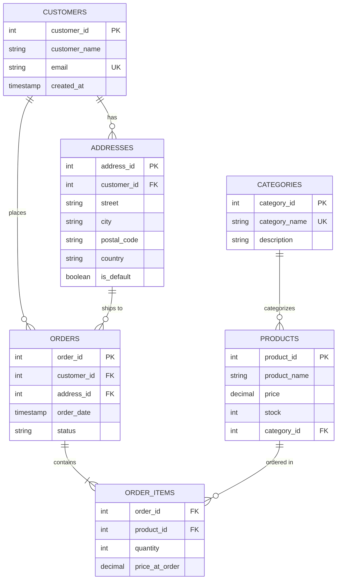

<!--
author:   André Dietrich
email:    LiaScript@web.de
version:  0.1.0
language: de
narrator: Deutsch Female

edit:     true

comment:  Interaktive Session zur Datenbank-Normalisierung und ER-Modellierung: Studierende lernen ER-Diagramm-Basics (Entitäten, Beziehungen, Kardinalitäten 1:1, 1:N, N:M), entwickeln schrittweise ein normalisiertes Online-Shop-Schema (0NF → 1NF → 2NF → 3NF) mit Visualisierung via dbdiagram.io und bauen gemeinsam ein Twitter-Datenmodell von Grund auf (User, Follower, Tweets, Likes, Many-to-Many-Beziehungen). Hands-on Didaktik: Anomalien werden live erlebbar gemacht.

logo:    ../assets/img/logo/9-lecture.jpg

import: https://raw.githubusercontent.com/LiaTemplates/PGlite/refs/heads/main/README.md
        https://raw.githubusercontent.com/LiaTemplates/dbdiagram/main/README.md
        https://raw.githubusercontent.com/liaScript/mermaid_template/master/README.md
-->

# Session 9 – Database Normalization & Schema Design

> **Session-Typ:** Lecture  
> **Dauer:** 90 Minuten  
> **Lernziele:** LZ 2 (SQL-Praxis, Schema-Design)

## Intro: Von Tabellen zu guten Tabellen

    --{{0}}--
Willkommen zurück! In Session 8 haben Sie gelernt, wie man Tabellen erstellt – CREATE TABLE, Constraints, INSERT, UPDATE, DELETE. Sie haben die Werkzeuge. Heute lernen Sie, wie man diese Werkzeuge RICHTIG einsetzt. Nicht irgendwelche Tabellen bauen, sondern GUTE Tabellen bauen. Tabellen, die keine Redundanz haben, keine Inkonsistenzen produzieren, keine Anomalien auslösen.

    {{0}}
**Rückblick Session 8:**

- ✅ CREATE TABLE – Tabellen erstellen
- ✅ PRIMARY KEY, FOREIGN KEY – Beziehungen definieren
- ✅ INSERT, UPDATE, DELETE – Daten manipulieren
- ✅ Constraints – Datenintegrität sichern

    --{{1}}--
Aber eine Frage blieb offen: Wann erstelle ich EINE große Tabelle mit allen Daten? Wann mehrere kleine Tabellen? Wie vermeide ich Redundanz? Wie verhindere ich, dass Daten inkonsistent werden? Die Antwort heißt: Normalisierung.

    {{1}}
**Heute lernen Sie:**

- **Anomalien:** Update, Delete, Insert – was kann schiefgehen?
- **Normalisierung:** 1NF, 2NF, 3NF – der Weg zu sauberen Schemas
- **ER-Diagramme:** Schemas visuell planen und verstehen
- **Praxis:** Bibliothek, Movie Reviews, Online-Shop – drei Beispiele, steigende Komplexität
- **Trade-offs:** Wann Normalisierung, wann Denormalisierung?

---

## Datenbank vorbereiten

    --{{0}}--
Wir starten mit einer Sandbox. Heute bauen wir gemeinsam drei Beispiele – von simpel zu komplex. Von der Bibliothek über Movie Reviews bis zum vollständigen Online-Shop. Jedes Beispiel zeigt neue Aspekte der Normalisierung.

```sql
-- Sandbox initialisieren
CREATE TABLE IF NOT EXISTS demo_test (id INTEGER, name TEXT);
INSERT INTO demo_test VALUES (1, 'Normalisierung rockt!');
SELECT 'Datenbank bereit!' AS status;
```
@PGlite.eval(normalization)

```sql
-- Interaktives Terminal
SELECT * FROM demo_test;
```
@PGlite.terminal(normalization)

---

## Beispiel 1: Bibliothek – Der einfachste Fall

    --{{0}}--
Starten wir mit dem simpelsten denkbaren Beispiel: Eine Bibliothek mit Büchern und Autoren. Nur zwei Entities, eine klare Beziehung. Perfekt, um die Grundprinzipien zu verstehen. Stellen Sie sich vor, Sie bauen eine Datenbank für eine kleine Bibliothek. Einfacher Ansatz: Eine Tabelle für alles!

    {{0}}
<section>

### Die "Alles-in-Einer" Tabelle

    --{{1}}--
Schauen wir uns an, was passiert, wenn wir alle Informationen in einer einzigen Tabelle speichern. Bücher haben Titel und ISBN, Autoren haben Namen, Geburtsjahr und Nationalität. Alles zusammen in einer Tabelle – klingt simpel, oder?

    {{1}}
**Naive Version:**

```sql
CREATE TABLE library_chaos (
  book_id INTEGER,
  title TEXT,
  isbn TEXT,
  author_name TEXT,
  author_birth_year INTEGER,
  author_nationality TEXT
);
```
@PGlite.eval(normalization)

    --{{2}}--
Jetzt fügen wir Daten ein. Beachten Sie: George Orwell hat zwei Bücher geschrieben. Was bedeutet das für unsere Tabelle?

    {{2}}
**Daten einfügen:**

```sql
INSERT INTO library_chaos VALUES
  (1, '1984', '978-0-452-28423-4', 'George Orwell', 1903, 'British'),
  (2, 'Animal Farm', '978-0-452-28424-1', 'George Orwell', 1903, 'British'),
  (3, 'Brave New World', '978-0-06-085052-4', 'Aldous Huxley', 1894, 'British');

SELECT * FROM library_chaos;
```
@PGlite.terminal(normalization)

</section>

    --{{3}}--
Sehen Sie das Problem? George Orwell steht zweimal in der Datenbank – mit allen seinen Informationen. Geburtsjahr, Nationalität, alles dupliziert. Das ist Redundanz. Und Redundanz führt zu Problemen. Schauen wir uns die Anomalien an.

    {{3}}
<section>

### Anomalie 1: Update-Anomalie

    --{{4}}--
Nehmen wir an, wir entdecken einen Fehler: George Orwell wurde nicht neunzehnhundertdrei, sondern neunzehnhundertdrei geboren. Klingt gleich? Nein – die Datenbank hat neunzehnhundertdrei statt neunzehnhundertdrei. Wir müssen das korrigieren. Wie viele Zeilen müssen wir updaten?

    {{4}}
**George Orwell's Geburtsjahr korrigieren:**

```sql
-- Versuchen wir, nur EINE Zeile zu ändern
UPDATE library_chaos
SET author_birth_year = 1903
WHERE book_id = 1;

-- Was ist jetzt passiert?
SELECT book_id, title, author_name, author_birth_year 
FROM library_chaos 
WHERE author_name = 'George Orwell';
```
@PGlite.terminal(normalization)

    --{{5}}--
Sehen Sie das Problem? Wir haben nur Zeile eins geändert. Zeile zwei hat immer noch das alte Geburtsjahr! Jetzt hat George Orwell zwei verschiedene Geburtsjahre in der Datenbank. Das ist eine Update-Anomalie. Redundante Daten führen zu Inkonsistenzen, wenn Sie nicht ALLE Vorkommen aktualisieren. In einer großen Datenbank mit Tausenden von Einträgen ist das eine Katastrophe.

    {{5}}
**🚨 Problem: Update-Anomalie**

- George Orwell hat 2 Bücher (2 Zeilen)
- Wir haben nur Zeile 1 geändert
- Jetzt hat Orwell 2 verschiedene Geburtsjahre!
- **Inkonsistenz:** Welches ist das richtige Geburtsjahr?

</section>

    --{{6}}--
Es wird noch schlimmer. Was passiert, wenn wir Daten löschen?

    {{6}}
<section>

### Anomalie 2: Delete-Anomalie

    --{{7}}--
Nehmen wir an, "Brave New World" wird aus der Bibliothek entfernt. Das Buch wird ausgemustert, wir löschen die Zeile. Einfach, oder?

    {{7}}
**"Brave New World" aus der Bibliothek entfernen:**

```sql
-- Buch löschen
DELETE FROM library_chaos WHERE book_id = 3;

-- Was ist mit Aldous Huxley passiert?
SELECT DISTINCT author_name, author_birth_year, author_nationality
FROM library_chaos
WHERE author_name = 'Aldous Huxley';
```
@PGlite.terminal(normalization)

    --{{8}}--
Aldous Huxley ist verschwunden! Wir wollten nur das Buch löschen, aber wir haben den gesamten Autor mit gelöscht. Alle Informationen über Huxley sind weg. Das ist eine Delete-Anomalie. Wenn Sie eine Zeile löschen, verlieren Sie mehr Daten als gewollt. Huxley existiert nicht mehr in der Datenbank, obwohl er ein wichtiger Autor ist.

    {{8}}
**🚨 Problem: Delete-Anomalie**

- "Brave New World" war Huxleys einziges Buch in der Datenbank
- Buch gelöscht → Huxley-Informationen sind WEG!
- Wir haben nicht nur das Buch gelöscht, sondern auch den Autor
- **Datenverlust:** Autor kann nicht mehr referenziert werden

</section>

    --{{9}}--
Und es gibt noch eine dritte Anomalie.

    {{9}}
<section>

### Anomalie 3: Insert-Anomalie

    --{{10}}--
Jetzt wollen wir einen neuen Autor in die Datenbank aufnehmen: Jane Austen. Großartige Autorin! Aber sie hat noch kein Buch in unserer Bibliothek. Können wir sie trotzdem speichern?

    {{10}}
**Neuen Autor ohne Buch hinzufügen:**

```sql
-- Versuch: Jane Austen hinzufügen (ohne Buch)
INSERT INTO library_chaos (author_name, author_birth_year, author_nationality)
VALUES ('Jane Austen', 1775, 'British');

-- Was passiert mit den Buch-Spalten?
SELECT * FROM library_chaos WHERE author_name = 'Jane Austen';
```
@PGlite.terminal(normalization)

    --{{11}}--
Das hat technisch funktioniert, aber schauen Sie sich das Ergebnis an: book underscore id ist NULL, title ist NULL, isbn ist NULL. Wir haben eine Zeile mit einem Autor, aber ohne Buch. Das ist semantisch falsch – diese Tabelle heißt "library underscore chaos", nicht "authors". Außerdem: Was, wenn book underscore id ein Primary Key ist? Dann können wir gar keinen Autor ohne Buch einfügen! Das ist eine Insert-Anomalie. Sie können bestimmte Daten nicht einfügen, ohne andere, unabhängige Daten ebenfalls einzufügen.

    {{11}}
**🚨 Problem: Insert-Anomalie**

- Wir können keinen Autor ohne Buch speichern (ohne NULL-Werte)
- Wenn `book_id` PRIMARY KEY ist → Insert unmöglich!
- **Unmögliche Operationen:** Autor-Katalog kann nicht unabhängig existieren

</section>

    --{{12}}--
Diese drei Anomalien sind der Grund, warum wir Normalisierung brauchen. Redundanz ist der Feind. Jetzt schauen wir uns an, wie man das Problem löst.

    {{12}}
<section>

### Die Lösung: Normalisierung

    --{{13}}--
Die Lösung ist einfach: Trennen Sie die Daten in zwei Tabellen. Eine Tabelle für Autoren, eine Tabelle für Bücher. Autoren-Informationen stehen nur einmal in der authors-Tabelle. Bücher referenzieren Autoren über einen Foreign Key. Keine Redundanz mehr.

    {{13}}
**Erste Normalform (1NF): Atomare Werte**

- Jede Spalte enthält nur atomare (unteilbare) Werte
- Keine Listen, keine Wiederholgruppen
- In unserem Beispiel: Bereits erfüllt (keine Listen)

**Zweite Normalform (2NF): Keine partiellen Abhängigkeiten**

- Jedes Attribut hängt vom GESAMTEN Primärschlüssel ab
- Problem: `author_name`, `author_birth_year`, `author_nationality` hängen nur von `author_name` ab, nicht von `book_id`!
- **Lösung:** Autoren-Tabelle auslagern

**Dritte Normalform (3NF): Keine transitiven Abhängigkeiten**

- Nicht-Schlüssel-Attribute dürfen nur vom Primärschlüssel abhängen, nicht voneinander
- In unserem Beispiel: Nach 2NF bereits erfüllt

    --{{14}}--
Schauen wir uns das normalisierte Schema an. Zwei Tabellen, eine klare Beziehung.

    {{14}}
**Normalisiertes Schema:**

```sql
-- Autoren-Tabelle
CREATE TABLE authors (
  author_id INTEGER PRIMARY KEY,
  name TEXT NOT NULL,
  birth_year INTEGER,
  nationality TEXT
);

-- Bücher-Tabelle
CREATE TABLE books (
  book_id INTEGER PRIMARY KEY,
  title TEXT NOT NULL,
  isbn TEXT UNIQUE,
  author_id INTEGER NOT NULL,
  FOREIGN KEY (author_id) REFERENCES authors(author_id)
);
```
@PGlite.eval(normalization)

    --{{15}}--
Jetzt fügen wir die Daten ein. Beachten Sie: Autoren zuerst, dann Bücher. George Orwell steht nur einmal in der authors-Tabelle!

    {{15}}
**Daten einfügen:**

```sql
-- Autoren zuerst
INSERT INTO authors VALUES 
  (1, 'George Orwell', 1903, 'British'),
  (2, 'Aldous Huxley', 1894, 'British');

-- Bücher referenzieren Autoren
INSERT INTO books VALUES 
  (1, '1984', '978-0-452-28423-4', 1),
  (2, 'Animal Farm', '978-0-452-28424-1', 1),
  (3, 'Brave New World', '978-0-06-085052-4', 2);

SELECT * FROM books;
```
@PGlite.terminal(normalization)

</section>

    --{{16}}--
Jetzt testen wir: Keine Anomalien mehr! Update funktioniert sauber, Delete verliert keine Autoren-Daten, Insert ist flexibel.

    {{16}}
<section>

### Tests: Keine Anomalien mehr!

    --{{17}}--
Test eins: George Orwell's Geburtsjahr ändern. Nur EINE Zeile updaten!

    {{17}}
**Test 1: Update (kein Problem mehr!)**

```sql
-- Orwell's Geburtsjahr korrigieren (nur EINE Zeile!)
UPDATE authors 
SET birth_year = 1903 
WHERE author_id = 1;

-- Alle Bücher haben automatisch die korrekten Daten:
SELECT b.title, a.name, a.birth_year
FROM books b
JOIN authors a ON b.author_id = a.author_id
WHERE a.name = 'George Orwell';
```
@PGlite.terminal(normalization)

    --{{18}}--
Test zwei: Buch löschen. Der Autor bleibt erhalten!

    {{18}}
**Test 2: Delete (kein Datenverlust!)**

```sql
-- "Brave New World" löschen
DELETE FROM books WHERE book_id = 3;

-- Huxley ist noch da:
SELECT * FROM authors WHERE author_id = 2;
```
@PGlite.terminal(normalization)

    --{{19}}--
Test drei: Neuen Autor ohne Buch hinzufügen. Kein Problem!

    {{19}}
**Test 3: Insert (volle Flexibilität!)**

```sql
-- Jane Austen hinzufügen (ohne Buch)
INSERT INTO authors VALUES 
  (3, 'Jane Austen', 1775, 'British');

SELECT * FROM authors WHERE author_id = 3;
```
@PGlite.terminal(normalization)

    --{{20}}--
Perfekt! Alle Tests bestanden. Keine Anomalien, keine Redundanz, volle Flexibilität. Das ist der Kern der Normalisierung.

    {{20}}
**✅ Alle Tests bestanden!**

- Update: Nur EINE Zeile ändern
- Delete: Keine ungewollten Datenverluste
- Insert: Autoren unabhängig von Büchern

</section>

    --{{21}}--
Jetzt visualisieren wir das Schema als ER-Diagramm. Das ist das Werkzeug, mit dem Profis Datenbanken planen.

    {{21}}
<section>

### ER-Diagramm: Visuell verstehen

    --{{22}}--
So sieht unser normalisiertes Schema als Entity-Relationship-Diagramm aus. Zwei Entities: Authors und Books. Eine Relationship: Authors schreiben Books. Die Linie zeigt die Beziehung, die Symbole zeigen die Kardinalität: Ein Autor kann viele Bücher schreiben, aber jedes Buch hat genau einen Autor. Das ist eine eins-zu-viele Beziehung.

    {{22}}
```dbml
Table authors {
  author_id int [pk, increment]
  name varchar(100) [not null]
  birth_year int
  nationality varchar(50)
  
  Note: 'Authors who write books in our library'
}

Table books {
  book_id int [pk, increment]
  title varchar(200) [not null]
  isbn varchar(20) [unique]
  author_id int [not null, ref: > authors.author_id]
  
  Note: 'Books in our library collection'
}
```
@dbdiagram

    --{{23}}--
Schauen Sie sich die Beziehung an: Der Pfeil von books punkt author underscore id zu authors punkt author underscore id zeigt: Viele Bücher gehören zu einem Autor. Das ist die eins-zu-viele Kardinalität. Ein Autor schreibt viele Bücher, aber jedes Buch hat genau einen Autor. In der DBML-Syntax steht das ref: Größer authors punkt author underscore id. Das Größer-Zeichen bedeutet: many-to-one. Viele Bücher zu einem Autor.

</section>

---

---

## Beispiel 2: Movie Reviews (IMDb) – Many-to-Many

    --{{0}}--
Jetzt wird es interessanter! Sie haben das Prinzip verstanden: Redundanz vermeiden, Tabellen trennen. Aber was, wenn die Beziehungen komplexer werden? Willkommen bei Movie Reviews – wie IMDb oder Letterboxd. Hier gibt es nicht nur eine eins-zu-viele Beziehung, sondern mehrere gleichzeitig. Und am Ende eine versteckte many-to-many Beziehung. Schauen wir uns das an.

    {{0}}
<section>

### Das Problem: Alles in einer Tabelle

    --{{1}}--
Stellen Sie sich eine Film-Review-Plattform vor. Filme haben Titel, Erscheinungsjahr, Regisseur. Nutzer schreiben Reviews mit Rating und Text. Naiver Ansatz: Alles in einer Tabelle! Was könnte schiefgehen?

    {{1}}
**Chaos-Tabelle:**

```sql
CREATE TABLE reviews_chaos (
  review_id INTEGER,
  movie_title TEXT,
  movie_year INTEGER,
  movie_director TEXT,
  reviewer_name TEXT,
  reviewer_email TEXT,
  rating INTEGER,
  review_text TEXT
);
```
@PGlite.eval(normalization)

    --{{2}}--
Daten einfügen. Beachten Sie: "Inception" hat zwei Reviews von verschiedenen Nutzern. "Alice" hat zwei Filme reviewt. Alles ist dupliziert.

    {{2}}
**Daten einfügen:**

```sql
INSERT INTO reviews_chaos VALUES
  (1, 'Inception', 2010, 'Christopher Nolan', 'Alice', 'alice@example.com', 5, 'Mind-blowing!'),
  (2, 'Inception', 2010, 'Christopher Nolan', 'Bob', 'bob@example.com', 4, 'Great, but confusing'),
  (3, 'The Matrix', 1999, 'Wachowski Sisters', 'Alice', 'alice@example.com', 5, 'Revolutionary!'),
  (4, 'Interstellar', 2014, 'Christopher Nolan', 'Charlie', 'charlie@example.com', 5, 'Stunning visuals');

SELECT * FROM reviews_chaos;
```
@PGlite.terminal(normalization)

    --{{3}}--
Sehen Sie die Redundanz? "Inception" steht zweimal mit allen Film-Infos. "Alice" steht zweimal mit ihrer Email. Christopher Nolan steht zweimal. Das ist Redundanz auf mehreren Ebenen. Was sind die Anomalien?

</section>

    {{3}}
<section>

### Anomalien identifizieren

    --{{4}}--
Anomalie eins: Film-Info ändern. Wenn Christopher Nolan's Name korrigiert werden muss – wie viele Zeilen?

    {{4}}
**Update-Anomalie:**

- Film-Info (Titel, Jahr, Regisseur) wird bei jedem Review dupliziert
- Regisseur-Name ändern → mehrere Zeilen updaten
- Email-Adresse ändern → mehrere Zeilen updaten

    --{{5}}--
Anomalie zwei: Review löschen. Wenn Bob's Review von "Inception" gelöscht wird, ist "Inception" dann noch in der Datenbank?

    {{5}}
**Delete-Anomalie:**

- Wenn alle Reviews eines Films gelöscht werden → Film-Info weg!
- Wenn letztes Review eines Nutzers gelöscht wird → Nutzer-Info weg!

    --{{6}}--
Anomalie drei: Neuer Film ohne Review. Können wir "Tenet" in die Datenbank aufnehmen, bevor jemand ein Review schreibt?

    {{6}}
**Insert-Anomalie:**

- Neuer Film ohne Review? Unmöglich oder NULL-Werte
- Neuer Nutzer ohne Review? Unmöglich

</section>

    --{{7}}--
Die Lösung? Drei Tabellen! Movies, Reviewers, Reviews. Schauen wir uns das normalisierte Schema an.

    {{7}}
<section>

### Normalisiertes Schema

    --{{8}}--
Drei Tabellen: Movies für Filme, Reviewers für Nutzer, Reviews für die eigentlichen Bewertungen. Reviews verbindet Movies und Reviewers. Das ist das klassische Pattern für eine viele-zu-viele Beziehung: Ein Film hat viele Reviews, ein Reviewer schreibt viele Reviews. Movies und Reviewers sind indirekt many-to-many verbunden – über die Reviews-Tabelle.

    {{8}}
```sql
-- Filme
CREATE TABLE movies (
  movie_id INTEGER PRIMARY KEY,
  title TEXT NOT NULL,
  release_year INTEGER,
  director TEXT
);

-- Reviewer (Nutzer)
CREATE TABLE reviewers (
  reviewer_id INTEGER PRIMARY KEY,
  name TEXT NOT NULL,
  email TEXT UNIQUE NOT NULL
);

-- Reviews (verbindet Movies und Reviewers)
CREATE TABLE reviews (
  review_id INTEGER PRIMARY KEY,
  movie_id INTEGER NOT NULL,
  reviewer_id INTEGER NOT NULL,
  rating INTEGER NOT NULL CHECK (rating BETWEEN 1 AND 5),
  review_text TEXT,
  created_at TIMESTAMP DEFAULT CURRENT_TIMESTAMP,
  FOREIGN KEY (movie_id) REFERENCES movies(movie_id),
  FOREIGN KEY (reviewer_id) REFERENCES reviewers(reviewer_id),
  UNIQUE (movie_id, reviewer_id)  -- Ein Reviewer kann einen Film nur einmal reviewen
);

ERDIAGRAM;
```
@PGlite.eval(normalization)

    --{{9}}--
Beachten Sie die UNIQUE Constraint auf movie underscore id komma reviewer underscore id. Das verhindert, dass ein Nutzer denselben Film zweimal bewertet. Das ist eine Business Rule, die wir direkt im Schema durchsetzen.

    {{9}}
**Daten einfügen:**

```sql
-- Filme zuerst
INSERT INTO movies VALUES 
  (1, 'Inception', 2010, 'Christopher Nolan'),
  (2, 'The Matrix', 1999, 'Wachowski Sisters'),
  (3, 'Interstellar', 2014, 'Christopher Nolan');

-- Reviewer
INSERT INTO reviewers VALUES 
  (1, 'Alice', 'alice@example.com'),
  (2, 'Bob', 'bob@example.com'),
  (3, 'Charlie', 'charlie@example.com');

-- Reviews (verbinden Filme und Reviewer)
INSERT INTO reviews (review_id, movie_id, reviewer_id, rating, review_text) VALUES
  (1, 1, 1, 5, 'Mind-blowing!'),
  (2, 1, 2, 4, 'Great, but confusing'),
  (3, 2, 1, 5, 'Revolutionary!'),
  (4, 3, 3, 5, 'Stunning visuals');

SELECT * FROM reviews;
```
@PGlite.terminal(normalization)

</section>

    --{{10}}--
Jetzt schauen wir uns das ER-Diagramm an. Und hier kommt das Spannende: Dieses Diagramm ist INTERAKTIV! Sie können es editieren!

    {{10}}
<section>

### ER-Diagramm: Interaktiv!

    --{{11}}--
So sieht unser Schema als ER-Diagramm aus. Drei Tabellen, zwei eins-zu-viele Beziehungen. Movies eins-zu-viele Reviews. Reviewers eins-zu-viele Reviews. Und dadurch entsteht indirekt eine viele-zu-viele Beziehung zwischen Movies und Reviewers. Das ist das klassische Junction-Table-Pattern. Und jetzt das Besondere: Sie können dieses Diagramm EDITIEREN! Doppelklicken Sie auf den Rand des Diagramms, ändern Sie den Code, und sehen Sie die Änderungen live!

    {{11}}
**Aufgabe:** Fügen Sie eine `genres` Tabelle hinzu! Movies sollten mehrere Genres haben können (n:m Beziehung). Wie würden Sie das modellieren?

```sql  @dbdiagram.edit
Table movies {
  movie_id int [pk, increment]
  title varchar(200) [not null]
  release_year int
  director varchar(100)
  
  Note: 'Movies in our review database'
}

Table reviewers {
  reviewer_id int [pk, increment]
  name varchar(100) [not null]
  email varchar(100) [unique, not null]
  
  Note: 'Users who write reviews'
}

Table reviews {
  review_id int [pk, increment]
  movie_id int [not null, ref: > movies.movie_id]
  reviewer_id int [not null, ref: > reviewers.reviewer_id]
  rating int [not null, note: '1-5 stars']
  review_text text
  created_at timestamp [default: `now()`]
  
  indexes {
    (movie_id, reviewer_id) [unique, note: 'One review per user per movie']
  }
  
  Note: 'Reviews connecting movies and reviewers'
}
```


</section>

    --{{12}}--
Haben Sie es versucht? Die Lösung ist eine separate genres-Tabelle und eine Junction Table movie underscore genres. Das ist das Standard-Pattern für n:m Beziehungen. Schauen wir uns die Lösung an.

    {{12}}
    [[Lösung anzeigen]]
    *******************
    
    **Genres hinzufügen (n:m mit Movies):**
    
    ```dbml
    Table genres {
      genre_id int [pk, increment]
      name varchar(50) [unique, not null]
      
      Note: 'Movie genres like Action, Drama, Sci-Fi'
    }
    
    Table movie_genres {
      movie_id int [ref: > movies.movie_id]
      genre_id int [ref: > genres.genre_id]
      
      indexes {
        (movie_id, genre_id) [pk]
      }
      
      Note: 'Junction table for many-to-many relationship'
    }
    ```
    
    **Erklärung:**
    - n:m Beziehung braucht **Junction Table** (movie_genres)
    - Ein Film hat viele Genres
    - Ein Genre gehört zu vielen Filmen
    - Junction Table hat zwei Foreign Keys als Composite Primary Key
    
    **SQL:**
    
    ```sql
    CREATE TABLE genres (
      genre_id INTEGER PRIMARY KEY,
      name TEXT UNIQUE NOT NULL
    );
    
    CREATE TABLE movie_genres (
      movie_id INTEGER,
      genre_id INTEGER,
      PRIMARY KEY (movie_id, genre_id),
      FOREIGN KEY (movie_id) REFERENCES movies(movie_id),
      FOREIGN KEY (genre_id) REFERENCES genres(genre_id)
    );
    
    -- Beispiel-Daten:
    INSERT INTO genres VALUES (1, 'Sci-Fi'), (2, 'Action'), (3, 'Thriller');
    INSERT INTO movie_genres VALUES (1, 1), (1, 2), (1, 3);  -- Inception: Sci-Fi, Action, Thriller
    ```
    
    *******************

</section>

---

    {{0}}
<section>

### Die "Alles-in-Einer" Tabelle

**Naive Version:**

```sql
CREATE TABLE orders_chaos (
  order_id INTEGER,
  order_date DATE,
  customer_name TEXT,
  customer_email TEXT,
  customer_address TEXT,
  product_name TEXT,
  product_price DECIMAL(10,2),
  product_category TEXT,
  category_description TEXT,
  quantity INTEGER
);
```
@PGlite.eval(normalization)

**Daten einfügen:**

```sql
INSERT INTO orders_chaos VALUES
  (1, '2025-11-01', 'Alice', 'alice@example.com', 'Hauptstr. 1', 'Laptop', 999.99, 'Electronics', 'Devices and gadgets', 1),
  (2, '2025-11-02', 'Bob', 'bob@example.com', 'Nebenstr. 5', 'Mouse', 25.00, 'Electronics', 'Devices and gadgets', 2),
  (3, '2025-11-03', 'Alice', 'alice@example.com', 'Hauptstr. 1', 'Desk', 299.99, 'Furniture', 'Tables and chairs', 1),
  (4, '2025-11-04', 'Charlie', 'charlie@example.com', 'Querstr. 12', 'Laptop', 999.99, 'Electronics', 'Devices and gadgets', 1),
  (5, '2025-11-05', 'Alice', 'alice@example.com', 'Hauptstr. 1', 'Chair', 149.99, 'Furniture', 'Tables and chairs', 2);

SELECT * FROM orders_chaos;
```
@PGlite.terminal(normalization)

</section>

    --{{1}}--
Sieht doch gar nicht so schlecht aus, oder? Alle Daten sind da, alles auf einen Blick. Aber jetzt passiert etwas: Alice zieht um. Neue Adresse. Kein Problem, UPDATE ausführen, fertig! Aber moment...

    {{1}}
<section>

### Anomalie 1: Update-Anomalie

**Alice zieht um – Adresse ändern:**

```sql
-- Naive Lösung: Nur EINE Zeile ändern
UPDATE orders_chaos
SET customer_address = 'Neue Str. 99'
WHERE order_id = 1;

-- Was ist passiert?
SELECT order_id, customer_name, customer_address 
FROM orders_chaos 
WHERE customer_name = 'Alice';
```
@PGlite.terminal(normalization)

**🚨 Problem:**

- Alice hat 3 Bestellungen (order_id 1, 3, 5)
- Wir haben nur Zeile 1 geändert
- Jetzt hat Alice 2 verschiedene Adressen in der Datenbank!
- **Inkonsistenz:** Welche ist die richtige Adresse?

</section>

    --{{2}}--
Das ist eine Update-Anomalie. Redundante Daten führen zu Inkonsistenzen, wenn Sie nicht ALLE Vorkommen aktualisieren. Aber es wird noch schlimmer.

    {{2}}
<section>

### Anomalie 2: Delete-Anomalie

**Charlie will seine Bestellung stornieren:**

```sql
-- Bestellung löschen
DELETE FROM orders_chaos WHERE order_id = 4;

-- Was ist passiert?
SELECT DISTINCT product_name, product_price 
FROM orders_chaos 
WHERE product_name = 'Laptop';
```
@PGlite.terminal(normalization)

**🚨 Problem:**

- Charlie war der einzige, der einen Laptop bestellt hat
- Bestellung gelöscht → Laptop-Informationen sind WEG!
- Wir haben nicht nur die Bestellung gelöscht, sondern auch das Produkt
- **Datenverlust:** Produkt kann nicht mehr verkauft werden

</section>

    --{{3}}--
Delete-Anomalie: Wenn Sie eine Zeile löschen, verlieren Sie mehr Daten als gewollt. Und es gibt noch eine dritte Anomalie.

    {{3}}
<section>

### Anomalie 3: Insert-Anomalie

**Neues Produkt in den Shop aufnehmen:**

```sql
-- Versuch: Neues Produkt "Monitor" hinzufügen
INSERT INTO orders_chaos (product_name, product_price, product_category, category_description)
VALUES ('Monitor', 399.99, 'Electronics', 'Devices and gadgets');

-- Fehlschlag! Warum?
```
@PGlite.terminal(normalization)

**🚨 Problem:**

- Wir können kein Produkt ohne Bestellung speichern!
- `order_id`, `customer_name` etc. sind NULL → aber vielleicht NOT NULL?
- **Unmögliche Operationen:** Produktkatalog kann nicht unabhängig existieren

</section>

    --{{4}}--
Insert-Anomalie: Sie können bestimmte Daten nicht einfügen, ohne andere, unabhängige Daten ebenfalls einzufügen. Diese drei Anomalien sind der Grund, warum wir Normalisierung brauchen.

---

## Normalisierung: Die Lösung

    --{{0}}--
Normalisierung ist der systematische Prozess, ein Datenbankschema so zu strukturieren, dass Redundanz minimiert und Anomalien vermieden werden. Es gibt mehrere Normalformen – wir fokussieren heute auf die ersten drei: 1NF, 2NF, 3NF.

    {{0}}
<section>

### Was ist Normalisierung?

**Definition:**

> Normalisierung ist die Zerlegung von Tabellen in kleinere, gut strukturierte Tabellen, um Redundanz zu eliminieren und Datenintegrität zu gewährleisten.

**Ziele:**

- ✅ Redundanz minimieren (Daten nicht mehrfach speichern)
- ✅ Anomalien vermeiden (Update, Delete, Insert)
- ✅ Datenintegrität sichern (Konsistenz garantieren)
- ✅ Flexibilität erhöhen (Schema leichter änderbar)

**Normalformen:**

```mermaid @mermaid
graph TD
    Start[Unnormalisiert] --> 1NF[1. Normalform<br/>Atomare Werte]
    1NF --> 2NF[2. Normalform<br/>Keine partiellen<br/>Abhängigkeiten]
    2NF --> 3NF[3. Normalform<br/>Keine transitiven<br/>Abhängigkeiten]
    3NF --> BCNF[BCNF<br/>Optional]
    
    style 1NF fill:#4a90e2
    style 2NF fill:#50c878
    style 3NF fill:#f39c12
    style BCNF fill:#95a5a6
```



</section>

---

## Erste Normalform (1NF)

    --{{0}}--
Die erste Normalform fordert: Jede Zelle enthält genau EINEN atomaren Wert. Keine Listen, keine Mehrfacheinträge, keine Wiederholgruppen. Schauen wir uns ein Beispiel an.

    {{0}}
<section>

### Regel: Atomare Werte

**Definition 1NF:**

- Jede Spalte enthält nur atomare (unteilbare) Werte
- Keine Wiederholgruppen (z.B. "Laptop, Mouse, Keyboard" in einer Zelle)
- Keine Arrays oder verschachtelte Strukturen

**Beispiel: Verletzt 1NF**

```sql
CREATE TABLE orders_not_1nf (
  order_id INTEGER PRIMARY KEY,
  customer_name TEXT,
  products TEXT  -- 🚨 "Laptop, Mouse, Keyboard"
);

INSERT INTO orders_not_1nf VALUES 
  (1, 'Alice', 'Laptop, Mouse, Keyboard'),
  (2, 'Bob', 'Desk, Chair');

SELECT * FROM orders_not_1nf;
```
@PGlite.terminal(normalization)

**Problem:**

- Wie finden Sie alle Bestellungen mit "Mouse"?
- `WHERE products LIKE '%Mouse%'` → unsauber, fehleranfällig
- Wie zählen Sie, wie oft jedes Produkt bestellt wurde? Unmöglich!

</section>

    --{{1}}--
Die Lösung: Jedes Produkt in eine eigene Zeile. Dadurch entstehen mehrere Zeilen pro Bestellung, aber jede Zelle enthält nur noch einen atomaren Wert.

    {{1}}
<section>

### Lösung: Aufspalten

**1NF-konforme Version:**

```sql
CREATE TABLE orders_1nf (
  order_id INTEGER,
  customer_name TEXT,
  product_name TEXT,
  PRIMARY KEY (order_id, product_name)  -- Composite Key
);

INSERT INTO orders_1nf VALUES 
  (1, 'Alice', 'Laptop'),
  (1, 'Alice', 'Mouse'),
  (1, 'Alice', 'Keyboard'),
  (2, 'Bob', 'Desk'),
  (2, 'Bob', 'Chair');

SELECT * FROM orders_1nf;
```
@PGlite.terminal(normalization)

**Jetzt funktioniert:**

```sql
-- Alle Bestellungen mit Mouse:
SELECT order_id, customer_name 
FROM orders_1nf 
WHERE product_name = 'Mouse';

-- Wie oft wurde jedes Produkt bestellt?
SELECT product_name, COUNT(*) AS times_ordered
FROM orders_1nf
GROUP BY product_name;
```
@PGlite.terminal(normalization)

**✅ 1NF erreicht!** Jede Zelle = ein Wert.

</section>

---

## Zweite Normalform (2NF)

    --{{0}}--
Die zweite Normalform baut auf 1NF auf und fordert: Keine partiellen Abhängigkeiten. Was heißt das? Alle Nicht-Schlüssel-Attribute müssen vom GESAMTEN Primärschlüssel abhängen, nicht nur von einem Teil davon. Das ist nur relevant bei zusammengesetzten Schlüsseln.

    {{0}}
<section>

### Regel: Keine partiellen Abhängigkeiten

**Definition 2NF:**

- Erfüllt 1NF
- Jedes Nicht-Schlüssel-Attribut hängt vollständig vom Primärschlüssel ab
- Keine Abhängigkeit von nur einem Teil eines zusammengesetzten Schlüssels

**Beispiel: Verletzt 2NF**

```sql
CREATE TABLE orders_not_2nf (
  order_id INTEGER,
  product_name TEXT,
  customer_name TEXT,      -- Hängt nur von order_id ab!
  product_price DECIMAL(10,2),  -- Hängt nur von product_name ab!
  quantity INTEGER,
  PRIMARY KEY (order_id, product_name)
);

INSERT INTO orders_not_2nf VALUES 
  (1, 'Laptop', 'Alice', 999.99, 1),
  (1, 'Mouse', 'Alice', 25.00, 2),
  (2, 'Laptop', 'Bob', 999.99, 1),  -- 🚨 Redundanz: Laptop-Preis dupliziert!
  (3, 'Mouse', 'Alice', 25.00, 1);  -- 🚨 Alice-Name dupliziert!

SELECT * FROM orders_not_2nf;
```
@PGlite.terminal(normalization)

**Problem:**

- `customer_name` hängt nur von `order_id` ab (nicht von `product_name`)
- `product_price` hängt nur von `product_name` ab (nicht von `order_id`)
- **Redundanz:** Produktpreise und Kundennamen werden dupliziert
- **Update-Anomalie:** Laptop-Preis ändern → mehrere Zeilen updaten!

</section>

    --{{1}}--
Die Lösung: Tabellen so aufspalten, dass jede Tabelle nur Attribute enthält, die vom gesamten Primärschlüssel abhängen. Kundendaten in eine separate Tabelle, Produktdaten in eine andere.

    {{1}}
<section>

### Lösung: Tabellen aufspalten

**2NF-konforme Version:**

```sql
-- Kunden-Tabelle: Kunde hängt nur von order_id ab
CREATE TABLE customers_2nf (
  customer_id INTEGER PRIMARY KEY,
  customer_name TEXT NOT NULL,
  customer_email TEXT
);

-- Produkte-Tabelle: Preis hängt nur von Produkt ab
CREATE TABLE products_2nf (
  product_id INTEGER PRIMARY KEY,
  product_name TEXT NOT NULL,
  product_price DECIMAL(10,2) NOT NULL
);

-- Bestellungen: Nur Order-Level Daten
CREATE TABLE orders_2nf (
  order_id INTEGER PRIMARY KEY,
  customer_id INTEGER NOT NULL,
  order_date DATE,
  FOREIGN KEY (customer_id) REFERENCES customers_2nf(customer_id)
);

-- Order Items: Die Many-to-Many Beziehung
CREATE TABLE order_items_2nf (
  order_id INTEGER,
  product_id INTEGER,
  quantity INTEGER NOT NULL,
  PRIMARY KEY (order_id, product_id),
  FOREIGN KEY (order_id) REFERENCES orders_2nf(order_id),
  FOREIGN KEY (product_id) REFERENCES products_2nf(product_id)
);
```
@PGlite.eval(normalization)

**Daten einfügen:**

```sql
INSERT INTO customers_2nf VALUES (1, 'Alice', 'alice@example.com'), (2, 'Bob', 'bob@example.com');
INSERT INTO products_2nf VALUES (1, 'Laptop', 999.99), (2, 'Mouse', 25.00);
INSERT INTO orders_2nf VALUES (1, 1, '2025-11-01'), (2, 2, '2025-11-02');
INSERT INTO order_items_2nf VALUES (1, 1, 1), (1, 2, 2), (2, 1, 1);

SELECT * FROM order_items_2nf;
```
@PGlite.terminal(normalization)

**✅ 2NF erreicht!** Keine partiellen Abhängigkeiten mehr.

**Test: Preis ändern:**

```sql
-- Laptop-Preis ändern (nur EINE Zeile!)
UPDATE products_2nf SET product_price = 899.99 WHERE product_id = 1;

-- Alle Bestellungen haben automatisch den neuen Preis:
SELECT o.order_id, p.product_name, p.product_price, oi.quantity
FROM order_items_2nf oi
JOIN products_2nf p ON oi.product_id = p.product_id
JOIN orders_2nf o ON oi.order_id = o.order_id;
```
@PGlite.terminal(normalization)

</section>

---

## Dritte Normalform (3NF)

    --{{0}}--
Die dritte Normalform baut auf 2NF auf und fordert: Keine transitiven Abhängigkeiten. Was heißt das? Nicht-Schlüssel-Attribute dürfen nicht von anderen Nicht-Schlüssel-Attributen abhängen. Nur vom Primärschlüssel.

    {{0}}
<section>

### Regel: Keine transitiven Abhängigkeiten

**Definition 3NF:**

- Erfüllt 2NF
- Keine transitiven Abhängigkeiten: A → B → C (wenn A der Schlüssel ist, darf B nicht C bestimmen)
- Nicht-Schlüssel-Attribute dürfen nur vom Primärschlüssel abhängen, nicht voneinander

**Beispiel: Verletzt 3NF**

```sql
CREATE TABLE products_not_3nf (
  product_id INTEGER PRIMARY KEY,
  product_name TEXT NOT NULL,
  product_price DECIMAL(10,2) NOT NULL,
  category_name TEXT,
  category_description TEXT  -- 🚨 Hängt von category_name ab, nicht von product_id!
);

INSERT INTO products_not_3nf VALUES 
  (1, 'Laptop', 999.99, 'Electronics', 'Devices and gadgets'),
  (2, 'Mouse', 25.00, 'Electronics', 'Devices and gadgets'),  -- 🚨 Redundanz!
  (3, 'Desk', 299.99, 'Furniture', 'Tables and chairs'),
  (4, 'Chair', 149.99, 'Furniture', 'Tables and chairs');     -- 🚨 Redundanz!

SELECT * FROM products_not_3nf;
```
@PGlite.terminal(normalization)

**Problem:**

- `category_description` hängt von `category_name` ab, nicht von `product_id`
- **Transitive Abhängigkeit:** product_id → category_name → category_description
- **Redundanz:** Kategorie-Beschreibungen werden dupliziert
- **Update-Anomalie:** "Electronics" umbenennen → mehrere Zeilen!

</section>

    --{{1}}--
Die Lösung: Kategorie-Informationen in eine separate Tabelle auslagern. Dann gibt es keine transitiven Abhängigkeiten mehr.

    {{1}}
<section>

### Lösung: Kategorien auslagern

**3NF-konforme Version:**

```sql
-- Kategorien-Tabelle
CREATE TABLE categories_3nf (
  category_id INTEGER PRIMARY KEY,
  category_name TEXT UNIQUE NOT NULL,
  category_description TEXT
);

-- Produkte-Tabelle (referenziert Kategorie)
CREATE TABLE products_3nf (
  product_id INTEGER PRIMARY KEY,
  product_name TEXT NOT NULL,
  product_price DECIMAL(10,2) NOT NULL,
  category_id INTEGER NOT NULL,
  FOREIGN KEY (category_id) REFERENCES categories_3nf(category_id)
);
```
@PGlite.eval(normalization)

**Daten einfügen:**

```sql
-- Kategorien zuerst
INSERT INTO categories_3nf VALUES 
  (1, 'Electronics', 'Devices and gadgets'),
  (2, 'Furniture', 'Tables and chairs');

-- Produkte referenzieren Kategorien
INSERT INTO products_3nf VALUES 
  (1, 'Laptop', 999.99, 1),
  (2, 'Mouse', 25.00, 1),
  (3, 'Desk', 299.99, 2),
  (4, 'Chair', 149.99, 2);

SELECT * FROM products_3nf;
```
@PGlite.terminal(normalization)

**✅ 3NF erreicht!** Keine transitiven Abhängigkeiten mehr.

**Test: Kategorie ändern:**

```sql
-- Kategorie-Beschreibung ändern (nur EINE Zeile!)
UPDATE categories_3nf 
SET category_description = 'Electronic devices and accessories'
WHERE category_id = 1;

-- Alle Produkte haben automatisch die neue Beschreibung:
SELECT p.product_name, c.category_name, c.category_description
FROM products_3nf p
JOIN categories_3nf c ON p.category_id = c.category_id;
```
@PGlite.terminal(normalization)

</section>

---

## Finales Schema: Online-Shop komplett

    --{{0}}--
Jetzt haben wir alle Puzzleteile. Lassen Sie uns das finale, vollständig normalisierte Online-Shop-Schema zusammenbauen – mit allen Beziehungen, Constraints und Best Practices.

    {{0}}
<section>

### Komplettes normalisiertes Schema

```sql
-- 1. Kategorien
CREATE TABLE categories (
  category_id INTEGER PRIMARY KEY,
  category_name TEXT UNIQUE NOT NULL,
  description TEXT
);

-- 2. Produkte
CREATE TABLE products (
  product_id INTEGER PRIMARY KEY,
  product_name TEXT NOT NULL,
  price DECIMAL(10,2) NOT NULL CHECK (price >= 0),
  stock INTEGER DEFAULT 0 CHECK (stock >= 0),
  category_id INTEGER NOT NULL,
  FOREIGN KEY (category_id) REFERENCES categories(category_id)
);

-- 3. Kunden
CREATE TABLE customers (
  customer_id INTEGER PRIMARY KEY,
  customer_name TEXT NOT NULL,
  email TEXT UNIQUE NOT NULL,
  created_at TIMESTAMP DEFAULT CURRENT_TIMESTAMP
);

-- 4. Adressen (separate Tabelle für Flexibilität)
CREATE TABLE addresses (
  address_id INTEGER PRIMARY KEY,
  customer_id INTEGER NOT NULL,
  street TEXT NOT NULL,
  city TEXT NOT NULL,
  postal_code TEXT NOT NULL,
  country TEXT NOT NULL,
  is_default BOOLEAN DEFAULT FALSE,
  FOREIGN KEY (customer_id) REFERENCES customers(customer_id) ON DELETE CASCADE
);

-- 5. Bestellungen
CREATE TABLE orders (
  order_id INTEGER PRIMARY KEY,
  customer_id INTEGER NOT NULL,
  address_id INTEGER NOT NULL,
  order_date TIMESTAMP DEFAULT CURRENT_TIMESTAMP,
  status TEXT CHECK (status IN ('pending', 'shipped', 'delivered', 'cancelled')),
  FOREIGN KEY (customer_id) REFERENCES customers(customer_id),
  FOREIGN KEY (address_id) REFERENCES addresses(address_id)
);

-- 6. Bestellpositionen (Order Items - Many-to-Many)
CREATE TABLE order_items (
  order_id INTEGER,
  product_id INTEGER,
  quantity INTEGER NOT NULL CHECK (quantity > 0),
  price_at_order DECIMAL(10,2) NOT NULL,  -- Preis zum Zeitpunkt der Bestellung
  PRIMARY KEY (order_id, product_id),
  FOREIGN KEY (order_id) REFERENCES orders(order_id) ON DELETE CASCADE,
  FOREIGN KEY (product_id) REFERENCES products(product_id)
);
```
@PGlite.eval(normalization)

</section>

    --{{1}}--
Schauen wir uns die Struktur visuell an. Jede Tabelle hat eine klare Verantwortung, alle Beziehungen sind explizit definiert, keine Redundanz.

    {{1}}
<section>

### Entity-Relationship Diagramm



</section>

    --{{2}}--
Jetzt füllen wir den Shop mit Leben. Kategorien, Produkte, Kunden, Adressen, Bestellungen – alles normalisiert, keine Redundanz.

    {{2}}
<section>

### Daten einfügen

```sql
-- Kategorien
INSERT INTO categories VALUES 
  (1, 'Electronics', 'Electronic devices and accessories'),
  (2, 'Furniture', 'Tables, chairs, and office furniture');

-- Produkte
INSERT INTO products VALUES 
  (1, 'Laptop', 999.99, 10, 1),
  (2, 'Mouse', 25.00, 50, 1),
  (3, 'Keyboard', 75.00, 30, 1),
  (4, 'Desk', 299.99, 5, 2),
  (5, 'Chair', 149.99, 8, 2);

-- Kunden
INSERT INTO customers VALUES 
  (1, 'Alice', 'alice@example.com', CURRENT_TIMESTAMP),
  (2, 'Bob', 'bob@example.com', CURRENT_TIMESTAMP);

-- Adressen
INSERT INTO addresses VALUES 
  (1, 1, 'Hauptstr. 1', 'Berlin', '10115', 'Germany', TRUE),
  (2, 2, 'Nebenstr. 5', 'Munich', '80331', 'Germany', TRUE);

-- Bestellungen
INSERT INTO orders VALUES 
  (1, 1, 1, CURRENT_TIMESTAMP, 'pending'),
  (2, 2, 2, CURRENT_TIMESTAMP, 'shipped');

-- Bestellpositionen
INSERT INTO order_items VALUES 
  (1, 1, 1, 999.99),  -- Alice: 1x Laptop
  (1, 2, 2, 25.00),   -- Alice: 2x Mouse
  (2, 4, 1, 299.99),  -- Bob: 1x Desk
  (2, 5, 1, 149.99);  -- Bob: 1x Chair

SELECT 'Shop erfolgreich aufgebaut!' AS status;
```
@PGlite.terminal(normalization)

</section>

    --{{3}}--
Jetzt testen wir das normalisierte Schema. Keine Anomalien mehr! Adresse ändern, Produkt löschen, neues Produkt hinzufügen – alles funktioniert sauber.

    {{3}}
<section>

### Tests: Keine Anomalien mehr!

**Test 1: Update (Alice zieht um)**

```sql
-- Adresse ändern (nur EINE Zeile!)
UPDATE addresses 
SET street = 'Neue Str. 99', city = 'Hamburg', postal_code = '20095'
WHERE address_id = 1;

-- Alle Bestellungen haben automatisch die neue Adresse:
SELECT o.order_id, c.customer_name, a.street, a.city
FROM orders o
JOIN customers c ON o.customer_id = c.customer_id
JOIN addresses a ON o.address_id = a.address_id
WHERE c.customer_name = 'Alice';
```
@PGlite.terminal(normalization)

**Test 2: Delete (Bob storniert Bestellung)**

```sql
-- Bestellung löschen
DELETE FROM orders WHERE order_id = 2;

-- Produkte sind noch da (kein Datenverlust!):
SELECT product_id, product_name, price 
FROM products 
WHERE product_id IN (4, 5);
```
@PGlite.terminal(normalization)

**Test 3: Insert (Neues Produkt ohne Bestellung)**

```sql
-- Neues Produkt hinzufügen (kein Problem!)
INSERT INTO products VALUES 
  (6, 'Monitor', 399.99, 12, 1);

SELECT * FROM products WHERE product_id = 6;
```
@PGlite.terminal(normalization)

**✅ Alle Tests bestanden!** Keine Anomalien, keine Redundanz, volle Flexibilität.

</section>

---

## Denormalisierung: Wann & Warum?

    --{{0}}--
Normalisierung ist toll – aber es gibt Situationen, wo Sie bewusst dagegen verstoßen sollten. Denormalisierung heißt: Kontrolliert Redundanz einbauen, um Performance zu gewinnen. Wann macht das Sinn?

    {{0}}
<section>

### Trade-offs: Normalisierung vs. Performance

**Wann denormalisieren?**

| Szenario | Normalisiert | Denormalisiert | Wann Denormalisierung? |
|----------|--------------|----------------|------------------------|
| **Reads** | Mehrere JOINs nötig | Daten direkt verfügbar | Read-heavy Systeme (z.B. Analytics) |
| **Writes** | Einfach (nur eine Tabelle) | Komplex (mehrere Tabellen synchen) | Write-heavy Systeme bevorzugen Normalisierung |
| **Speicher** | Minimal (keine Redundanz) | Höher (Duplikate) | Speicher ist billig, Performance teuer |
| **Konsistenz** | Garantiert | Manuell sicherstellen | Kritische Daten: immer normalisieren! |

**Beispiel: Denormalisierung für Performance**

```sql
-- Normalisiert: 3 JOINs für Order-Übersicht
SELECT 
  o.order_id,
  c.customer_name,
  c.email,
  a.city,
  p.product_name,
  oi.quantity,
  oi.price_at_order
FROM orders o
JOIN customers c ON o.customer_id = c.customer_id
JOIN addresses a ON o.address_id = a.address_id
JOIN order_items oi ON o.order_id = oi.order_id
JOIN products p ON oi.product_id = p.product_id;

-- Denormalisiert: Alles in einer Tabelle (wie am Anfang!)
-- ➔ Schneller, aber Redundanz & Update-Anomalien
```

**Lösungsansätze:**

- **Materialized Views:** Automatisch aktualisierte denormalisierte Ansichten
- **Caching:** Redis/Memcached für häufige Queries
- **Read Replicas:** Separate DB für Lesezugriffe
- **CQRS:** Command Query Responsibility Segregation (zwei Datenmodelle)

</section>

    --{{1}}--
In der Praxis: Starten Sie normalisiert (3NF), denormalisieren Sie nur gezielt bei gemessenen Performance-Problemen. Niemals "blind" denormalisieren!

---

## Weitere Normalformen (Ausblick)

    --{{0}}--
3NF ist meist ausreichend. Es gibt höhere Normalformen – BCNF, 4NF, 5NF – aber die brauchen Sie selten. Kurzer Überblick, was darüber hinausgeht.

    {{0}}
<section>

### BCNF, 4NF, 5NF – Braucht man das?

**Boyce-Codd Normalform (BCNF):**

- Verschärfung von 3NF
- Jede Abhängigkeit muss vom Superschlüssel ausgehen
- Relevant bei komplexen Schlüsselstrukturen
- **Praxis:** Selten nötig, 3NF reicht meist

**Vierte Normalform (4NF):**

- Eliminiert Multi-Valued Dependencies
- Beispiel: Lehrer unterrichtet mehrere Fächer UND mehrere Klassen (unabhängig)
- **Praxis:** Sehr selten relevant

**Fünfte Normalform (5NF):**

- Eliminiert Join Dependencies
- Theoretisch interessant, praktisch kaum relevant
- **Praxis:** Fast nie notwendig

**💡 Empfehlung:** 

- **Ziel:** 3NF als Standard
- **BCNF:** Nur wenn Sie darauf stoßen
- **4NF+:** Vergessen Sie es (außer Sie schreiben eine Dissertation)

</section>

---

## Weitere Beispiele

    --{{0}}--
Normalisierung ist überall. Schauen wir uns kurz drei weitere Szenarien an: Blog, Bibliothek, Social Network. Das Prinzip ist immer gleich.

    {{0}}
<section>

### Beispiel 1: Blog-System

**Entities:**

- Authors (Autoren)
- Posts (Blog-Posts)
- Comments (Kommentare)
- Tags (Schlagworte)

**Beziehungen:**

- Author **1:n** Posts (Ein Autor, viele Posts)
- Post **1:n** Comments (Ein Post, viele Kommentare)
- Posts **n:m** Tags (Ein Post hat mehrere Tags, ein Tag in mehreren Posts)

**Schema:**

```sql
CREATE TABLE authors (
  author_id INTEGER PRIMARY KEY,
  name TEXT NOT NULL,
  email TEXT UNIQUE
);

CREATE TABLE posts (
  post_id INTEGER PRIMARY KEY,
  author_id INTEGER NOT NULL,
  title TEXT NOT NULL,
  content TEXT,
  published_at TIMESTAMP,
  FOREIGN KEY (author_id) REFERENCES authors(author_id)
);

CREATE TABLE comments (
  comment_id INTEGER PRIMARY KEY,
  post_id INTEGER NOT NULL,
  author_name TEXT,
  content TEXT,
  created_at TIMESTAMP DEFAULT CURRENT_TIMESTAMP,
  FOREIGN KEY (post_id) REFERENCES posts(post_id) ON DELETE CASCADE
);

CREATE TABLE tags (
  tag_id INTEGER PRIMARY KEY,
  tag_name TEXT UNIQUE NOT NULL
);

CREATE TABLE post_tags (
  post_id INTEGER,
  tag_id INTEGER,
  PRIMARY KEY (post_id, tag_id),
  FOREIGN KEY (post_id) REFERENCES posts(post_id) ON DELETE CASCADE,
  FOREIGN KEY (tag_id) REFERENCES tags(tag_id)
);
```

</section>

    {{1}}
<section>

### Beispiel 2: Bibliothek

**Entities:**

- Books (Bücher)
- Authors (Autoren)
- Copies (Exemplare)
- Loans (Ausleihen)
- Members (Mitglieder)

**Besonderheiten:**

- Books **n:m** Authors (Co-Autoren)
- Book **1:n** Copies (Ein Buch, mehrere physische Exemplare)
- Copy **1:n** Loans (Ein Exemplar wird mehrfach ausgeliehen)

**Schema:**

```sql
CREATE TABLE books (
  book_id INTEGER PRIMARY KEY,
  title TEXT NOT NULL,
  isbn TEXT UNIQUE,
  published_year INTEGER
);

CREATE TABLE authors (
  author_id INTEGER PRIMARY KEY,
  name TEXT NOT NULL
);

CREATE TABLE book_authors (
  book_id INTEGER,
  author_id INTEGER,
  PRIMARY KEY (book_id, author_id),
  FOREIGN KEY (book_id) REFERENCES books(book_id),
  FOREIGN KEY (author_id) REFERENCES authors(author_id)
);

CREATE TABLE copies (
  copy_id INTEGER PRIMARY KEY,
  book_id INTEGER NOT NULL,
  acquisition_date DATE,
  status TEXT CHECK (status IN ('available', 'on_loan', 'damaged')),
  FOREIGN KEY (book_id) REFERENCES books(book_id)
);

CREATE TABLE members (
  member_id INTEGER PRIMARY KEY,
  name TEXT NOT NULL,
  email TEXT UNIQUE,
  joined_date DATE
);

CREATE TABLE loans (
  loan_id INTEGER PRIMARY KEY,
  copy_id INTEGER NOT NULL,
  member_id INTEGER NOT NULL,
  loan_date DATE NOT NULL,
  due_date DATE NOT NULL,
  return_date DATE,
  FOREIGN KEY (copy_id) REFERENCES copies(copy_id),
  FOREIGN KEY (member_id) REFERENCES members(member_id)
);
```

</section>

    {{2}}
<section>

### Beispiel 3: Social Network (Self-Referencing)

**Entity:**

- Users (Nutzer)

**Besonderheit:**

- Users **n:m** Users (Freundschaften = Self-Referencing Many-to-Many)

**Schema:**

```sql
CREATE TABLE users (
  user_id INTEGER PRIMARY KEY,
  username TEXT UNIQUE NOT NULL,
  email TEXT UNIQUE NOT NULL,
  joined_at TIMESTAMP DEFAULT CURRENT_TIMESTAMP
);

CREATE TABLE friendships (
  user_id_1 INTEGER,
  user_id_2 INTEGER,
  status TEXT CHECK (status IN ('pending', 'accepted', 'blocked')),
  created_at TIMESTAMP DEFAULT CURRENT_TIMESTAMP,
  PRIMARY KEY (user_id_1, user_id_2),
  FOREIGN KEY (user_id_1) REFERENCES users(user_id),
  FOREIGN KEY (user_id_2) REFERENCES users(user_id),
  CHECK (user_id_1 < user_id_2)  -- Verhindert Duplikate (A→B und B→A)
);

-- Freundschaften einfügen:
INSERT INTO users VALUES (1, 'alice', 'alice@example.com', CURRENT_TIMESTAMP);
INSERT INTO users VALUES (2, 'bob', 'bob@example.com', CURRENT_TIMESTAMP);
INSERT INTO friendships VALUES (1, 2, 'accepted', CURRENT_TIMESTAMP);

-- Alle Freunde von Alice:
SELECT u.username 
FROM friendships f
JOIN users u ON (f.user_id_2 = u.user_id OR f.user_id_1 = u.user_id)
WHERE (f.user_id_1 = 1 OR f.user_id_2 = 1) AND u.user_id != 1;
```

</section>

---

## Zusammenfassung

    --{{0}}--
Was haben Sie gelernt? Sie können jetzt Anomalien erkennen, Normalformen anwenden, Schemas normalisieren und Trade-offs zwischen Normalisierung und Performance abwägen. Das ist das Fundament für gutes Datenbankdesign.

    {{0}}
<section>

| Konzept | Beschreibung | Ziel |
|---------|--------------|------|
| **Update-Anomalie** | Redundante Daten führen zu Inkonsistenzen | Vermeiden durch Normalisierung |
| **Delete-Anomalie** | Ungewollter Datenverlust beim Löschen | Separate Tabellen für unabhängige Entities |
| **Insert-Anomalie** | Daten können nicht ohne andere eingefügt werden | Tabellen trennen |
| **1NF** | Atomare Werte (keine Listen in Zellen) | Wiederholgruppen eliminieren |
| **2NF** | Keine partiellen Abhängigkeiten | Jedes Attribut hängt vom GANZEN Schlüssel ab |
| **3NF** | Keine transitiven Abhängigkeiten | Nicht-Schlüssel-Attribute nur vom Schlüssel abhängig |
| **Denormalisierung** | Kontrollierte Redundanz für Performance | Nur bei gemessenen Problemen |

</section>

    --{{1}}--
Die wichtigsten Takeaways: Starten Sie normalisiert (3NF). Denormalisieren Sie nur gezielt bei Performance-Problemen. Testen Sie immer: Können Sie UPDATE/DELETE/INSERT ohne Anomalien ausführen? Wenn ja, ist Ihr Schema gut.

---

## Checkliste: Ist mein Schema normalisiert?

    --{{0}}--
Nutzen Sie diese Checkliste, um Ihre eigenen Schemas zu überprüfen. Jede Frage sollte mit "Ja" beantwortet werden können.

    {{0}}
<section>

### Normalisierungs-Check

**Erste Normalform (1NF):**

- [ ] Jede Zelle enthält genau einen atomaren Wert?
- [ ] Keine Arrays oder Listen in Spalten?
- [ ] Keine Wiederholgruppen (z.B. "product1", "product2", "product3")?
- [ ] Jede Zeile ist eindeutig identifizierbar (PRIMARY KEY)?

**Zweite Normalform (2NF):**

- [ ] Schema erfüllt 1NF?
- [ ] Bei zusammengesetzten Schlüsseln: Hängt jedes Nicht-Schlüssel-Attribut vom GESAMTEN Schlüssel ab?
- [ ] Keine Redundanz durch partielle Abhängigkeiten?

**Dritte Normalform (3NF):**

- [ ] Schema erfüllt 2NF?
- [ ] Keine transitiven Abhängigkeiten (A → B → C)?
- [ ] Nicht-Schlüssel-Attribute hängen nur vom Primärschlüssel ab, nicht voneinander?

**Best Practices:**

- [ ] Jede Tabelle hat einen klaren Zweck (Single Responsibility)?
- [ ] FOREIGN KEYs sind definiert für alle Beziehungen?
- [ ] Constraints (CHECK, NOT NULL, UNIQUE) sind sinnvoll gesetzt?
- [ ] Tests durchgeführt: UPDATE/DELETE/INSERT ohne Anomalien?

</section>

---

## Quiz: Testen Sie Ihr Wissen

**Frage 1: Was ist eine Update-Anomalie?**

- [( )] Daten können nicht eingefügt werden
- [(X)] Redundante Daten führen zu Inkonsistenzen beim Update
- [( )] Daten gehen beim Löschen verloren
- [( )] Performance-Problem bei großen Tabellen

**Frage 2: Welche Normalform fordert atomare Werte?**

- [(X)] 1NF
- [( )] 2NF
- [( )] 3NF
- [( )] BCNF

**Frage 3: Was eliminiert die 2NF?**

- [( )] Wiederholgruppen
- [(X)] Partielle Abhängigkeiten
- [( )] Transitive Abhängigkeiten
- [( )] Multi-Valued Dependencies

**Frage 4: Wann sollten Sie denormalisieren?**

- [( )] Immer, Normalisierung ist überbewertet
- [( )] Nie, 3NF ist heilig
- [(X)] Bei gemessenen Performance-Problemen in Read-heavy Systemen
- [( )] Bei allen Write-heavy Systemen

**Frage 5: Was ist ein Self-Referencing Foreign Key?**

- [( )] Ein Fehler im Schema
- [( )] Ein Foreign Key ohne Referenced Table
- [(X)] Ein Foreign Key, der auf die eigene Tabelle verweist (z.B. Freundschaften, Hierarchien)
- [( )] Ein Primary Key, der sich selbst referenziert

---

## Übungsaufgaben

    --{{0}}--
Zeit für Praxis! Probieren Sie diese Aufgaben selbst aus.

**Aufgabe 1: Schema normalisieren**

Gegeben ist diese denormalisierte Tabelle:

```
employees_denormalized:
| emp_id | name  | dept_name | dept_manager | dept_location |
|--------|-------|-----------|--------------|---------------|
| 1      | Alice | IT        | Bob          | Berlin        |
| 2      | Charlie | IT      | Bob          | Berlin        |
| 3      | Diana | HR        | Eve          | Munich        |
```

Normalisieren Sie auf 3NF!

    [[Lösung anzeigen]]
    *******************
    
    **Analyse:**
    - `dept_manager` und `dept_location` hängen von `dept_name` ab (transitive Abhängigkeit)
    - Lösung: Separate `departments` Tabelle
    
    ```sql
    CREATE TABLE departments (
      dept_id INTEGER PRIMARY KEY,
      dept_name TEXT UNIQUE NOT NULL,
      dept_manager TEXT,
      dept_location TEXT
    );
    
    CREATE TABLE employees (
      emp_id INTEGER PRIMARY KEY,
      name TEXT NOT NULL,
      dept_id INTEGER NOT NULL,
      FOREIGN KEY (dept_id) REFERENCES departments(dept_id)
    );
    
    INSERT INTO departments VALUES (1, 'IT', 'Bob', 'Berlin'), (2, 'HR', 'Eve', 'Munich');
    INSERT INTO employees VALUES (1, 'Alice', 1), (2, 'Charlie', 1), (3, 'Diana', 2);
    ```
    @PGlite.terminal(normalization)
    
    *******************

**Aufgabe 2: Anomalie identifizieren**

Welche Anomalie tritt hier auf?

```sql
CREATE TABLE courses_denormalized (
  student_id INTEGER,
  course_id INTEGER,
  student_name TEXT,
  student_email TEXT,
  course_name TEXT,
  instructor TEXT,
  PRIMARY KEY (student_id, course_id)
);
```

Wenn Student "Alice" ihren Namen ändert, müssen Sie...?

    [[Lösung anzeigen]]
    *******************
    
    **Update-Anomalie!**
    
    - `student_name` und `student_email` hängen nur von `student_id` ab (partielle Abhängigkeit)
    - Wenn Alice 5 Kurse belegt, müssen Sie 5 Zeilen updaten
    - Vergessen Sie eine → Inkonsistenz!
    
    **Lösung:**
    
    ```sql
    CREATE TABLE students (
      student_id INTEGER PRIMARY KEY,
      student_name TEXT NOT NULL,
      student_email TEXT UNIQUE
    );
    
    CREATE TABLE courses (
      course_id INTEGER PRIMARY KEY,
      course_name TEXT NOT NULL,
      instructor TEXT
    );
    
    CREATE TABLE enrollments (
      student_id INTEGER,
      course_id INTEGER,
      PRIMARY KEY (student_id, course_id),
      FOREIGN KEY (student_id) REFERENCES students(student_id),
      FOREIGN KEY (course_id) REFERENCES courses(course_id)
    );
    ```
    
    *******************

**Aufgabe 3: ERD zeichnen**

Entwerfen Sie ein normalisiertes Schema für ein Kino-Buchungssystem:

- Filme (Movies)
- Vorstellungen (Screenings) – ein Film läuft mehrmals
- Kunden (Customers)
- Buchungen (Bookings) – Kunde bucht Vorstellung, mehrere Sitzplätze möglich

Zeichnen Sie ein ERD und schreiben Sie die CREATE TABLE Statements!

    [[Lösung anzeigen]]
    *******************
    
    ```sql
    CREATE TABLE movies (
      movie_id INTEGER PRIMARY KEY,
      title TEXT NOT NULL,
      duration_minutes INTEGER,
      genre TEXT
    );
    
    CREATE TABLE screenings (
      screening_id INTEGER PRIMARY KEY,
      movie_id INTEGER NOT NULL,
      screening_time TIMESTAMP NOT NULL,
      room TEXT,
      FOREIGN KEY (movie_id) REFERENCES movies(movie_id)
    );
    
    CREATE TABLE customers (
      customer_id INTEGER PRIMARY KEY,
      name TEXT NOT NULL,
      email TEXT UNIQUE
    );
    
    CREATE TABLE bookings (
      booking_id INTEGER PRIMARY KEY,
      customer_id INTEGER NOT NULL,
      screening_id INTEGER NOT NULL,
      seats_booked INTEGER NOT NULL CHECK (seats_booked > 0),
      booking_time TIMESTAMP DEFAULT CURRENT_TIMESTAMP,
      FOREIGN KEY (customer_id) REFERENCES customers(customer_id),
      FOREIGN KEY (screening_id) REFERENCES screenings(screening_id)
    );
    ```
    @PGlite.terminal(normalization)
    
    **ERD:**
    - CUSTOMERS 1:n BOOKINGS
    - SCREENINGS 1:n BOOKINGS
    - MOVIES 1:n SCREENINGS
    
    *******************

---

## Ausblick: Was kommt als Nächstes?

    --{{0}}--
Sie können jetzt normalisierte Schemas entwerfen. Mehrere Tabellen, klare Beziehungen, keine Redundanz. Aber wie nutzen Sie diese Tabellen gemeinsam? Wie kombinieren Sie Daten aus `customers`, `orders` und `products` in einer einzigen Abfrage? Das sind Joins – unser nächstes großes Thema.

**Kommende Sessions:**

- **Session 10:** SQL Joins & Combining Data (INNER, LEFT, RIGHT, FULL, CROSS)
- **Session 11:** Row-Level Functions (String, Number, Date, CASE)
- **Session 12:** Aggregation & Window Functions
- **Session 13:** Advanced SQL Techniques (Subqueries, CTEs, Views)
- **Session 14:** Relationale Algebra (formale Grundlagen)

🎉 **Glückwunsch!** Sie beherrschen jetzt Normalisierung – das Fundament für professionelles Datenbankdesign!

---

## Anhang: DBML-Syntax-Referenz

    --{{0}}--
Für Interessierte: Eine komplette Referenz der DBML-Syntax, die Sie in den ER-Diagrammen gesehen haben. DBML ist die Sprache hinter dbdiagram punkt io. Wenn Sie eigene Diagramme erstellen möchten, ist dies Ihre Cheat-Sheet.

    {{0}}
<section>

### Tabellen definieren

```dbml
Table table_name {
  column_name column_type [settings]
}
```

**Column Types:**

- `int`, `integer`
- `varchar(n)`, `char(n)`, `text`
- `decimal(p,s)`, `numeric(p,s)`
- `timestamp`, `datetime`, `date`, `time`
- `boolean`, `bool`

**Column Settings:**

- `pk` – Primary Key
- `not null` – Nicht NULL
- `unique` – Eindeutig
- `increment` – Auto-Increment
- `default: value` – Default-Wert
- `note: 'text'` – Spalten-Kommentar

**Beispiel:**

```dbml
Table users {
  user_id int [pk, increment]
  username varchar(50) [not null, unique]
  email varchar(100) [not null, unique]
  created_at timestamp [default: `now()`]
  status varchar(20) [default: 'active', note: 'active, inactive, banned']
  
  Note: 'User accounts in the system'
}
```

</section>

    {{1}}
<section>

### Beziehungen (Relationships)

    --{{2}}--
Beziehungen sind das Herzstück von ER-Diagrammen. DBML hat eine elegante Syntax dafür.

    {{2}}
**Inline (empfohlen):**

```dbml
Table orders {
  user_id int [ref: > users.id]  // many-to-one
}
```

**Separat:**

```dbml
Ref: orders.user_id > users.id
```

**Relationship Types:**

- `>` – many-to-one (viele Orders → ein User)
- `<` – one-to-many (ein User → viele Orders)
- `-` – one-to-one (ein User → ein Profile)
- `<>` – many-to-many (viele Students ↔ viele Courses)

**WICHTIG:** Bei n:m verwenden Sie **Junction Tables**!

```dbml
Table student_courses {
  student_id int [ref: > students.id]
  course_id int [ref: > courses.id]
  
  indexes {
    (student_id, course_id) [pk]
  }
}
```

**Benannte Beziehungen:**

```dbml
Ref name_of_relationship: products.category_id > categories.id
```

</section>

    {{3}}
<section>

### Indexes

    --{{4}}--
Indexes sind wichtig für Performance. DBML lässt Sie diese direkt im Schema definieren.

    {{4}}
```dbml
Table users {
  email varchar(100)
  username varchar(50)
  
  indexes {
    email [unique]
    (email, username) [unique, name: 'email_username_idx']
    username [type: btree, note: 'Speed up username lookups']
  }
}
```

**Index Settings:**

- `unique` – Unique Index
- `pk` – Primary Key Index
- `type: btree` – Index-Typ (btree, hash, gin, gist)
- `name: 'index_name'` – Expliziter Index-Name
- `note: 'text'` – Index-Kommentar

</section>

    {{5}}
<section>

### Notes (Dokumentation)

    --{{6}}--
Dokumentation direkt im Schema – für Sie und Ihre Kollegen!

    {{6}}
**Tabellen-Notes:**

```dbml
Table users {
  id int [pk]
  
  Note: 'This table stores all user accounts in the system'
}
```

**Spalten-Notes:**

```dbml
Table users {
  id int [pk, note: 'Unique identifier for each user']
  status varchar(20) [note: 'Possible values: active, inactive, banned']
}
```

**Multi-line Notes:**

```dbml
Table users {
  Note: '''
    This table stores user accounts.
    
    Business Rules:
    - Email must be unique
    - Username must be at least 3 characters
    - Status defaults to 'active'
  '''
}
```

</section>

    {{7}}
<section>

### Table Groups

    --{{8}}--
Gruppieren Sie zusammengehörige Tabellen für bessere Übersicht.

    {{8}}
```dbml
TableGroup ecommerce {
  customers
  orders
  order_items
  products
}

TableGroup auth {
  users
  sessions
  permissions
}
```

</section>

    {{9}}
<section>

### Enums

    --{{10}}--
Definieren Sie Enums für eingeschränkte Wertebereiche.

    {{10}}
```dbml
enum order_status {
  pending
  processing
  shipped
  delivered
  cancelled
}

Table orders {
  order_id int [pk]
  status order_status [default: 'pending']
}
```

</section>

    {{11}}
<section>

### Vollständiges Beispiel

```dbml
// E-Commerce Schema

enum order_status {
  pending
  processing
  shipped
  delivered
  cancelled
}

Table customers {
  customer_id int [pk, increment]
  name varchar(100) [not null]
  email varchar(100) [unique, not null]
  created_at timestamp [default: `now()`]
  
  indexes {
    email [unique]
    created_at [type: btree]
  }
  
  Note: 'Customer accounts'
}

Table products {
  product_id int [pk, increment]
  name varchar(200) [not null]
  price decimal(10,2) [not null, note: 'Price in EUR']
  stock int [default: 0]
  category_id int [ref: > categories.category_id]
  
  indexes {
    category_id
    (name, category_id) [note: 'Speed up product searches']
  }
  
  Note: 'Product catalog'
}

Table categories {
  category_id int [pk, increment]
  name varchar(100) [unique, not null]
  description text
  
  Note: 'Product categories'
}

Table orders {
  order_id int [pk, increment]
  customer_id int [not null, ref: > customers.customer_id]
  order_date timestamp [default: `now()`]
  status order_status [default: 'pending']
  total_amount decimal(10,2)
  
  indexes {
    customer_id
    order_date
    (customer_id, order_date) [name: 'customer_orders_idx']
  }
  
  Note: 'Customer orders'
}

Table order_items {
  order_id int [pk, ref: > orders.order_id]
  product_id int [pk, ref: > products.product_id]
  quantity int [not null]
  price_at_order decimal(10,2) [not null, note: 'Price at time of purchase']
  
  Note: 'Junction table for orders and products'
}

// Gruppierung
TableGroup core {
  customers
  orders
  order_items
}

TableGroup catalog {
  products
  categories
}
```

</section>

    {{12}}
<section>

### Nützliche Links

- **dbdiagram.io:** https://dbdiagram.io/
- **DBML Documentation:** https://dbml.dbdiagram.io/docs/
- **Live Editor:** https://dbdiagram.io/d (zum Experimentieren)
- **dbdiagram CLI:** https://github.com/holistics/dbml (für Automation)

</section>

---

**Ende der Session 9** – Sie sind jetzt ein Normalisierungs-Profi! 🎓
