<!--
import: https://raw.githubusercontent.com/LiaTemplates/PGlite/refs/heads/main/README.md
-->

# Session 9 – Database Normalization & Schema Design

> **Session-Typ:** Lecture  
> **Dauer:** 90 Minuten  
> **Lernziele:** LZ 2 (SQL-Praxis, Schema-Design)

## Intro: Von Tabellen zu guten Tabellen

    --{{0}}--
Willkommen zurück! In Session 8 haben Sie gelernt, wie man Tabellen erstellt – CREATE TABLE, Constraints, INSERT, UPDATE, DELETE. Sie haben die Werkzeuge. Heute lernen Sie, wie man diese Werkzeuge RICHTIG einsetzt. Nicht irgendwelche Tabellen bauen, sondern GUTE Tabellen bauen. Tabellen, die keine Redundanz haben, keine Inkonsistenzen produzieren, keine Anomalien auslösen.

    {{0}}
**Rückblick Session 8:**

- ✅ CREATE TABLE – Tabellen erstellen
- ✅ PRIMARY KEY, FOREIGN KEY – Beziehungen definieren
- ✅ INSERT, UPDATE, DELETE – Daten manipulieren
- ✅ Constraints – Datenintegrität sichern

    --{{1}}--
Aber eine Frage blieb offen: Wann erstelle ich EINE große Tabelle mit allen Daten? Wann mehrere kleine Tabellen? Wie vermeide ich Redundanz? Wie verhindere ich, dass Daten inkonsistent werden? Die Antwort heißt: Normalisierung.

    {{1}}
**Heute lernen Sie:**

- **Anomalien:** Update, Delete, Insert – was kann schiefgehen?
- **Normalisierung:** 1NF, 2NF, 3NF – der Weg zu sauberen Schemas
- **Praxis:** Online-Shop von Chaos zu Struktur (interaktiv!)
- **Trade-offs:** Wann Normalisierung, wann Denormalisierung?

---

## Datenbank vorbereiten

    --{{0}}--
Wir starten mit einer Sandbox. Heute bauen wir gemeinsam einen Online-Shop – vom chaotischen "Alles-in-einer-Tabelle"-Horror zu einem sauberen, normalisierten Schema.

```sql
-- Sandbox initialisieren
CREATE TABLE IF NOT EXISTS demo_test (id INTEGER, name TEXT);
INSERT INTO demo_test VALUES (1, 'Normalisierung rockt!');
SELECT 'Datenbank bereit!' AS status;
```
@PGlite.eval(normalization)

```sql
-- Interaktives Terminal
SELECT * FROM demo_test;
```
@PGlite.terminal(normalization)

---

## Problem: Der chaotische Online-Shop

    --{{0}}--
Stellen Sie sich vor, Sie bauen einen Online-Shop. Einfacher Ansatz: Eine Tabelle für alles! Kunden, Bestellungen, Produkte – alles in einer riesigen Tabelle. Klingt simpel, oder? Schauen wir uns an, was passiert.

    {{0}}
<section>

### Die "Alles-in-Einer" Tabelle

**Naive Version:**

```sql
CREATE TABLE orders_chaos (
  order_id INTEGER,
  order_date DATE,
  customer_name TEXT,
  customer_email TEXT,
  customer_address TEXT,
  product_name TEXT,
  product_price DECIMAL(10,2),
  product_category TEXT,
  category_description TEXT,
  quantity INTEGER
);
```
@PGlite.eval(normalization)

**Daten einfügen:**

```sql
INSERT INTO orders_chaos VALUES
  (1, '2025-11-01', 'Alice', 'alice@example.com', 'Hauptstr. 1', 'Laptop', 999.99, 'Electronics', 'Devices and gadgets', 1),
  (2, '2025-11-02', 'Bob', 'bob@example.com', 'Nebenstr. 5', 'Mouse', 25.00, 'Electronics', 'Devices and gadgets', 2),
  (3, '2025-11-03', 'Alice', 'alice@example.com', 'Hauptstr. 1', 'Desk', 299.99, 'Furniture', 'Tables and chairs', 1),
  (4, '2025-11-04', 'Charlie', 'charlie@example.com', 'Querstr. 12', 'Laptop', 999.99, 'Electronics', 'Devices and gadgets', 1),
  (5, '2025-11-05', 'Alice', 'alice@example.com', 'Hauptstr. 1', 'Chair', 149.99, 'Furniture', 'Tables and chairs', 2);

SELECT * FROM orders_chaos;
```
@PGlite.terminal(normalization)

</section>

    --{{1}}--
Sieht doch gar nicht so schlecht aus, oder? Alle Daten sind da, alles auf einen Blick. Aber jetzt passiert etwas: Alice zieht um. Neue Adresse. Kein Problem, UPDATE ausführen, fertig! Aber moment...

    {{1}}
<section>

### Anomalie 1: Update-Anomalie

**Alice zieht um – Adresse ändern:**

```sql
-- Naive Lösung: Nur EINE Zeile ändern
UPDATE orders_chaos
SET customer_address = 'Neue Str. 99'
WHERE order_id = 1;

-- Was ist passiert?
SELECT order_id, customer_name, customer_address 
FROM orders_chaos 
WHERE customer_name = 'Alice';
```
@PGlite.terminal(normalization)

**🚨 Problem:**

- Alice hat 3 Bestellungen (order_id 1, 3, 5)
- Wir haben nur Zeile 1 geändert
- Jetzt hat Alice 2 verschiedene Adressen in der Datenbank!
- **Inkonsistenz:** Welche ist die richtige Adresse?

</section>

    --{{2}}--
Das ist eine Update-Anomalie. Redundante Daten führen zu Inkonsistenzen, wenn Sie nicht ALLE Vorkommen aktualisieren. Aber es wird noch schlimmer.

    {{2}}
<section>

### Anomalie 2: Delete-Anomalie

**Charlie will seine Bestellung stornieren:**

```sql
-- Bestellung löschen
DELETE FROM orders_chaos WHERE order_id = 4;

-- Was ist passiert?
SELECT DISTINCT product_name, product_price 
FROM orders_chaos 
WHERE product_name = 'Laptop';
```
@PGlite.terminal(normalization)

**🚨 Problem:**

- Charlie war der einzige, der einen Laptop bestellt hat
- Bestellung gelöscht → Laptop-Informationen sind WEG!
- Wir haben nicht nur die Bestellung gelöscht, sondern auch das Produkt
- **Datenverlust:** Produkt kann nicht mehr verkauft werden

</section>

    --{{3}}--
Delete-Anomalie: Wenn Sie eine Zeile löschen, verlieren Sie mehr Daten als gewollt. Und es gibt noch eine dritte Anomalie.

    {{3}}
<section>

### Anomalie 3: Insert-Anomalie

**Neues Produkt in den Shop aufnehmen:**

```sql
-- Versuch: Neues Produkt "Monitor" hinzufügen
INSERT INTO orders_chaos (product_name, product_price, product_category, category_description)
VALUES ('Monitor', 399.99, 'Electronics', 'Devices and gadgets');

-- Fehlschlag! Warum?
```
@PGlite.terminal(normalization)

**🚨 Problem:**

- Wir können kein Produkt ohne Bestellung speichern!
- `order_id`, `customer_name` etc. sind NULL → aber vielleicht NOT NULL?
- **Unmögliche Operationen:** Produktkatalog kann nicht unabhängig existieren

</section>

    --{{4}}--
Insert-Anomalie: Sie können bestimmte Daten nicht einfügen, ohne andere, unabhängige Daten ebenfalls einzufügen. Diese drei Anomalien sind der Grund, warum wir Normalisierung brauchen.

---

## Normalisierung: Die Lösung

    --{{0}}--
Normalisierung ist der systematische Prozess, ein Datenbankschema so zu strukturieren, dass Redundanz minimiert und Anomalien vermieden werden. Es gibt mehrere Normalformen – wir fokussieren heute auf die ersten drei: 1NF, 2NF, 3NF.

    {{0}}
<section>

### Was ist Normalisierung?

**Definition:**

> Normalisierung ist die Zerlegung von Tabellen in kleinere, gut strukturierte Tabellen, um Redundanz zu eliminieren und Datenintegrität zu gewährleisten.

**Ziele:**

- ✅ Redundanz minimieren (Daten nicht mehrfach speichern)
- ✅ Anomalien vermeiden (Update, Delete, Insert)
- ✅ Datenintegrität sichern (Konsistenz garantieren)
- ✅ Flexibilität erhöhen (Schema leichter änderbar)

**Normalformen:**

```mermaid @mermaid
graph TD
    Start[Unnormalisiert] --> 1NF[1. Normalform<br/>Atomare Werte]
    1NF --> 2NF[2. Normalform<br/>Keine partiellen<br/>Abhängigkeiten]
    2NF --> 3NF[3. Normalform<br/>Keine transitiven<br/>Abhängigkeiten]
    3NF --> BCNF[BCNF<br/>Optional]
    
    style 1NF fill:#4a90e2
    style 2NF fill:#50c878
    style 3NF fill:#f39c12
    style BCNF fill:#95a5a6
```



</section>

---

## Erste Normalform (1NF)

    --{{0}}--
Die erste Normalform fordert: Jede Zelle enthält genau EINEN atomaren Wert. Keine Listen, keine Mehrfacheinträge, keine Wiederholgruppen. Schauen wir uns ein Beispiel an.

    {{0}}
<section>

### Regel: Atomare Werte

**Definition 1NF:**

- Jede Spalte enthält nur atomare (unteilbare) Werte
- Keine Wiederholgruppen (z.B. "Laptop, Mouse, Keyboard" in einer Zelle)
- Keine Arrays oder verschachtelte Strukturen

**Beispiel: Verletzt 1NF**

```sql
CREATE TABLE orders_not_1nf (
  order_id INTEGER PRIMARY KEY,
  customer_name TEXT,
  products TEXT  -- 🚨 "Laptop, Mouse, Keyboard"
);

INSERT INTO orders_not_1nf VALUES 
  (1, 'Alice', 'Laptop, Mouse, Keyboard'),
  (2, 'Bob', 'Desk, Chair');

SELECT * FROM orders_not_1nf;
```
@PGlite.terminal(normalization)

**Problem:**

- Wie finden Sie alle Bestellungen mit "Mouse"?
- `WHERE products LIKE '%Mouse%'` → unsauber, fehleranfällig
- Wie zählen Sie, wie oft jedes Produkt bestellt wurde? Unmöglich!

</section>

    --{{1}}--
Die Lösung: Jedes Produkt in eine eigene Zeile. Dadurch entstehen mehrere Zeilen pro Bestellung, aber jede Zelle enthält nur noch einen atomaren Wert.

    {{1}}
<section>

### Lösung: Aufspalten

**1NF-konforme Version:**

```sql
CREATE TABLE orders_1nf (
  order_id INTEGER,
  customer_name TEXT,
  product_name TEXT,
  PRIMARY KEY (order_id, product_name)  -- Composite Key
);

INSERT INTO orders_1nf VALUES 
  (1, 'Alice', 'Laptop'),
  (1, 'Alice', 'Mouse'),
  (1, 'Alice', 'Keyboard'),
  (2, 'Bob', 'Desk'),
  (2, 'Bob', 'Chair');

SELECT * FROM orders_1nf;
```
@PGlite.terminal(normalization)

**Jetzt funktioniert:**

```sql
-- Alle Bestellungen mit Mouse:
SELECT order_id, customer_name 
FROM orders_1nf 
WHERE product_name = 'Mouse';

-- Wie oft wurde jedes Produkt bestellt?
SELECT product_name, COUNT(*) AS times_ordered
FROM orders_1nf
GROUP BY product_name;
```
@PGlite.terminal(normalization)

**✅ 1NF erreicht!** Jede Zelle = ein Wert.

</section>

---

## Zweite Normalform (2NF)

    --{{0}}--
Die zweite Normalform baut auf 1NF auf und fordert: Keine partiellen Abhängigkeiten. Was heißt das? Alle Nicht-Schlüssel-Attribute müssen vom GESAMTEN Primärschlüssel abhängen, nicht nur von einem Teil davon. Das ist nur relevant bei zusammengesetzten Schlüsseln.

    {{0}}
<section>

### Regel: Keine partiellen Abhängigkeiten

**Definition 2NF:**

- Erfüllt 1NF
- Jedes Nicht-Schlüssel-Attribut hängt vollständig vom Primärschlüssel ab
- Keine Abhängigkeit von nur einem Teil eines zusammengesetzten Schlüssels

**Beispiel: Verletzt 2NF**

```sql
CREATE TABLE orders_not_2nf (
  order_id INTEGER,
  product_name TEXT,
  customer_name TEXT,      -- Hängt nur von order_id ab!
  product_price DECIMAL(10,2),  -- Hängt nur von product_name ab!
  quantity INTEGER,
  PRIMARY KEY (order_id, product_name)
);

INSERT INTO orders_not_2nf VALUES 
  (1, 'Laptop', 'Alice', 999.99, 1),
  (1, 'Mouse', 'Alice', 25.00, 2),
  (2, 'Laptop', 'Bob', 999.99, 1),  -- 🚨 Redundanz: Laptop-Preis dupliziert!
  (3, 'Mouse', 'Alice', 25.00, 1);  -- 🚨 Alice-Name dupliziert!

SELECT * FROM orders_not_2nf;
```
@PGlite.terminal(normalization)

**Problem:**

- `customer_name` hängt nur von `order_id` ab (nicht von `product_name`)
- `product_price` hängt nur von `product_name` ab (nicht von `order_id`)
- **Redundanz:** Produktpreise und Kundennamen werden dupliziert
- **Update-Anomalie:** Laptop-Preis ändern → mehrere Zeilen updaten!

</section>

    --{{1}}--
Die Lösung: Tabellen so aufspalten, dass jede Tabelle nur Attribute enthält, die vom gesamten Primärschlüssel abhängen. Kundendaten in eine separate Tabelle, Produktdaten in eine andere.

    {{1}}
<section>

### Lösung: Tabellen aufspalten

**2NF-konforme Version:**

```sql
-- Kunden-Tabelle: Kunde hängt nur von order_id ab
CREATE TABLE customers_2nf (
  customer_id INTEGER PRIMARY KEY,
  customer_name TEXT NOT NULL,
  customer_email TEXT
);

-- Produkte-Tabelle: Preis hängt nur von Produkt ab
CREATE TABLE products_2nf (
  product_id INTEGER PRIMARY KEY,
  product_name TEXT NOT NULL,
  product_price DECIMAL(10,2) NOT NULL
);

-- Bestellungen: Nur Order-Level Daten
CREATE TABLE orders_2nf (
  order_id INTEGER PRIMARY KEY,
  customer_id INTEGER NOT NULL,
  order_date DATE,
  FOREIGN KEY (customer_id) REFERENCES customers_2nf(customer_id)
);

-- Order Items: Die Many-to-Many Beziehung
CREATE TABLE order_items_2nf (
  order_id INTEGER,
  product_id INTEGER,
  quantity INTEGER NOT NULL,
  PRIMARY KEY (order_id, product_id),
  FOREIGN KEY (order_id) REFERENCES orders_2nf(order_id),
  FOREIGN KEY (product_id) REFERENCES products_2nf(product_id)
);
```
@PGlite.eval(normalization)

**Daten einfügen:**

```sql
INSERT INTO customers_2nf VALUES (1, 'Alice', 'alice@example.com'), (2, 'Bob', 'bob@example.com');
INSERT INTO products_2nf VALUES (1, 'Laptop', 999.99), (2, 'Mouse', 25.00);
INSERT INTO orders_2nf VALUES (1, 1, '2025-11-01'), (2, 2, '2025-11-02');
INSERT INTO order_items_2nf VALUES (1, 1, 1), (1, 2, 2), (2, 1, 1);

SELECT * FROM order_items_2nf;
```
@PGlite.terminal(normalization)

**✅ 2NF erreicht!** Keine partiellen Abhängigkeiten mehr.

**Test: Preis ändern:**

```sql
-- Laptop-Preis ändern (nur EINE Zeile!)
UPDATE products_2nf SET product_price = 899.99 WHERE product_id = 1;

-- Alle Bestellungen haben automatisch den neuen Preis:
SELECT o.order_id, p.product_name, p.product_price, oi.quantity
FROM order_items_2nf oi
JOIN products_2nf p ON oi.product_id = p.product_id
JOIN orders_2nf o ON oi.order_id = o.order_id;
```
@PGlite.terminal(normalization)

</section>

---

## Dritte Normalform (3NF)

    --{{0}}--
Die dritte Normalform baut auf 2NF auf und fordert: Keine transitiven Abhängigkeiten. Was heißt das? Nicht-Schlüssel-Attribute dürfen nicht von anderen Nicht-Schlüssel-Attributen abhängen. Nur vom Primärschlüssel.

    {{0}}
<section>

### Regel: Keine transitiven Abhängigkeiten

**Definition 3NF:**

- Erfüllt 2NF
- Keine transitiven Abhängigkeiten: A → B → C (wenn A der Schlüssel ist, darf B nicht C bestimmen)
- Nicht-Schlüssel-Attribute dürfen nur vom Primärschlüssel abhängen, nicht voneinander

**Beispiel: Verletzt 3NF**

```sql
CREATE TABLE products_not_3nf (
  product_id INTEGER PRIMARY KEY,
  product_name TEXT NOT NULL,
  product_price DECIMAL(10,2) NOT NULL,
  category_name TEXT,
  category_description TEXT  -- 🚨 Hängt von category_name ab, nicht von product_id!
);

INSERT INTO products_not_3nf VALUES 
  (1, 'Laptop', 999.99, 'Electronics', 'Devices and gadgets'),
  (2, 'Mouse', 25.00, 'Electronics', 'Devices and gadgets'),  -- 🚨 Redundanz!
  (3, 'Desk', 299.99, 'Furniture', 'Tables and chairs'),
  (4, 'Chair', 149.99, 'Furniture', 'Tables and chairs');     -- 🚨 Redundanz!

SELECT * FROM products_not_3nf;
```
@PGlite.terminal(normalization)

**Problem:**

- `category_description` hängt von `category_name` ab, nicht von `product_id`
- **Transitive Abhängigkeit:** product_id → category_name → category_description
- **Redundanz:** Kategorie-Beschreibungen werden dupliziert
- **Update-Anomalie:** "Electronics" umbenennen → mehrere Zeilen!

</section>

    --{{1}}--
Die Lösung: Kategorie-Informationen in eine separate Tabelle auslagern. Dann gibt es keine transitiven Abhängigkeiten mehr.

    {{1}}
<section>

### Lösung: Kategorien auslagern

**3NF-konforme Version:**

```sql
-- Kategorien-Tabelle
CREATE TABLE categories_3nf (
  category_id INTEGER PRIMARY KEY,
  category_name TEXT UNIQUE NOT NULL,
  category_description TEXT
);

-- Produkte-Tabelle (referenziert Kategorie)
CREATE TABLE products_3nf (
  product_id INTEGER PRIMARY KEY,
  product_name TEXT NOT NULL,
  product_price DECIMAL(10,2) NOT NULL,
  category_id INTEGER NOT NULL,
  FOREIGN KEY (category_id) REFERENCES categories_3nf(category_id)
);
```
@PGlite.eval(normalization)

**Daten einfügen:**

```sql
-- Kategorien zuerst
INSERT INTO categories_3nf VALUES 
  (1, 'Electronics', 'Devices and gadgets'),
  (2, 'Furniture', 'Tables and chairs');

-- Produkte referenzieren Kategorien
INSERT INTO products_3nf VALUES 
  (1, 'Laptop', 999.99, 1),
  (2, 'Mouse', 25.00, 1),
  (3, 'Desk', 299.99, 2),
  (4, 'Chair', 149.99, 2);

SELECT * FROM products_3nf;
```
@PGlite.terminal(normalization)

**✅ 3NF erreicht!** Keine transitiven Abhängigkeiten mehr.

**Test: Kategorie ändern:**

```sql
-- Kategorie-Beschreibung ändern (nur EINE Zeile!)
UPDATE categories_3nf 
SET category_description = 'Electronic devices and accessories'
WHERE category_id = 1;

-- Alle Produkte haben automatisch die neue Beschreibung:
SELECT p.product_name, c.category_name, c.category_description
FROM products_3nf p
JOIN categories_3nf c ON p.category_id = c.category_id;
```
@PGlite.terminal(normalization)

</section>

---

## Finales Schema: Online-Shop komplett

    --{{0}}--
Jetzt haben wir alle Puzzleteile. Lassen Sie uns das finale, vollständig normalisierte Online-Shop-Schema zusammenbauen – mit allen Beziehungen, Constraints und Best Practices.

    {{0}}
<section>

### Komplettes normalisiertes Schema

```sql
-- 1. Kategorien
CREATE TABLE categories (
  category_id INTEGER PRIMARY KEY,
  category_name TEXT UNIQUE NOT NULL,
  description TEXT
);

-- 2. Produkte
CREATE TABLE products (
  product_id INTEGER PRIMARY KEY,
  product_name TEXT NOT NULL,
  price DECIMAL(10,2) NOT NULL CHECK (price >= 0),
  stock INTEGER DEFAULT 0 CHECK (stock >= 0),
  category_id INTEGER NOT NULL,
  FOREIGN KEY (category_id) REFERENCES categories(category_id)
);

-- 3. Kunden
CREATE TABLE customers (
  customer_id INTEGER PRIMARY KEY,
  customer_name TEXT NOT NULL,
  email TEXT UNIQUE NOT NULL,
  created_at TIMESTAMP DEFAULT CURRENT_TIMESTAMP
);

-- 4. Adressen (separate Tabelle für Flexibilität)
CREATE TABLE addresses (
  address_id INTEGER PRIMARY KEY,
  customer_id INTEGER NOT NULL,
  street TEXT NOT NULL,
  city TEXT NOT NULL,
  postal_code TEXT NOT NULL,
  country TEXT NOT NULL,
  is_default BOOLEAN DEFAULT FALSE,
  FOREIGN KEY (customer_id) REFERENCES customers(customer_id) ON DELETE CASCADE
);

-- 5. Bestellungen
CREATE TABLE orders (
  order_id INTEGER PRIMARY KEY,
  customer_id INTEGER NOT NULL,
  address_id INTEGER NOT NULL,
  order_date TIMESTAMP DEFAULT CURRENT_TIMESTAMP,
  status TEXT CHECK (status IN ('pending', 'shipped', 'delivered', 'cancelled')),
  FOREIGN KEY (customer_id) REFERENCES customers(customer_id),
  FOREIGN KEY (address_id) REFERENCES addresses(address_id)
);

-- 6. Bestellpositionen (Order Items - Many-to-Many)
CREATE TABLE order_items (
  order_id INTEGER,
  product_id INTEGER,
  quantity INTEGER NOT NULL CHECK (quantity > 0),
  price_at_order DECIMAL(10,2) NOT NULL,  -- Preis zum Zeitpunkt der Bestellung
  PRIMARY KEY (order_id, product_id),
  FOREIGN KEY (order_id) REFERENCES orders(order_id) ON DELETE CASCADE,
  FOREIGN KEY (product_id) REFERENCES products(product_id)
);
```
@PGlite.eval(normalization)

</section>

    --{{1}}--
Schauen wir uns die Struktur visuell an. Jede Tabelle hat eine klare Verantwortung, alle Beziehungen sind explizit definiert, keine Redundanz.

    {{1}}
<section>

### Entity-Relationship Diagramm


</section>

    --{{2}}--
Jetzt füllen wir den Shop mit Leben. Kategorien, Produkte, Kunden, Adressen, Bestellungen – alles normalisiert, keine Redundanz.

    {{2}}
<section>

### Daten einfügen

```sql
-- Kategorien
INSERT INTO categories VALUES 
  (1, 'Electronics', 'Electronic devices and accessories'),
  (2, 'Furniture', 'Tables, chairs, and office furniture');

-- Produkte
INSERT INTO products VALUES 
  (1, 'Laptop', 999.99, 10, 1),
  (2, 'Mouse', 25.00, 50, 1),
  (3, 'Keyboard', 75.00, 30, 1),
  (4, 'Desk', 299.99, 5, 2),
  (5, 'Chair', 149.99, 8, 2);

-- Kunden
INSERT INTO customers VALUES 
  (1, 'Alice', 'alice@example.com', CURRENT_TIMESTAMP),
  (2, 'Bob', 'bob@example.com', CURRENT_TIMESTAMP);

-- Adressen
INSERT INTO addresses VALUES 
  (1, 1, 'Hauptstr. 1', 'Berlin', '10115', 'Germany', TRUE),
  (2, 2, 'Nebenstr. 5', 'Munich', '80331', 'Germany', TRUE);

-- Bestellungen
INSERT INTO orders VALUES 
  (1, 1, 1, CURRENT_TIMESTAMP, 'pending'),
  (2, 2, 2, CURRENT_TIMESTAMP, 'shipped');

-- Bestellpositionen
INSERT INTO order_items VALUES 
  (1, 1, 1, 999.99),  -- Alice: 1x Laptop
  (1, 2, 2, 25.00),   -- Alice: 2x Mouse
  (2, 4, 1, 299.99),  -- Bob: 1x Desk
  (2, 5, 1, 149.99);  -- Bob: 1x Chair

SELECT 'Shop erfolgreich aufgebaut!' AS status;
```
@PGlite.terminal(normalization)

</section>

    --{{3}}--
Jetzt testen wir das normalisierte Schema. Keine Anomalien mehr! Adresse ändern, Produkt löschen, neues Produkt hinzufügen – alles funktioniert sauber.

    {{3}}
<section>

### Tests: Keine Anomalien mehr!

**Test 1: Update (Alice zieht um)**

```sql
-- Adresse ändern (nur EINE Zeile!)
UPDATE addresses 
SET street = 'Neue Str. 99', city = 'Hamburg', postal_code = '20095'
WHERE address_id = 1;

-- Alle Bestellungen haben automatisch die neue Adresse:
SELECT o.order_id, c.customer_name, a.street, a.city
FROM orders o
JOIN customers c ON o.customer_id = c.customer_id
JOIN addresses a ON o.address_id = a.address_id
WHERE c.customer_name = 'Alice';
```
@PGlite.terminal(normalization)

**Test 2: Delete (Bob storniert Bestellung)**

```sql
-- Bestellung löschen
DELETE FROM orders WHERE order_id = 2;

-- Produkte sind noch da (kein Datenverlust!):
SELECT product_id, product_name, price 
FROM products 
WHERE product_id IN (4, 5);
```
@PGlite.terminal(normalization)

**Test 3: Insert (Neues Produkt ohne Bestellung)**

```sql
-- Neues Produkt hinzufügen (kein Problem!)
INSERT INTO products VALUES 
  (6, 'Monitor', 399.99, 12, 1);

SELECT * FROM products WHERE product_id = 6;
```
@PGlite.terminal(normalization)

**✅ Alle Tests bestanden!** Keine Anomalien, keine Redundanz, volle Flexibilität.

</section>

---

## Denormalisierung: Wann & Warum?

    --{{0}}--
Normalisierung ist toll – aber es gibt Situationen, wo Sie bewusst dagegen verstoßen sollten. Denormalisierung heißt: Kontrolliert Redundanz einbauen, um Performance zu gewinnen. Wann macht das Sinn?

    {{0}}
<section>

### Trade-offs: Normalisierung vs. Performance

**Wann denormalisieren?**

| Szenario | Normalisiert | Denormalisiert | Wann Denormalisierung? |
|----------|--------------|----------------|------------------------|
| **Reads** | Mehrere JOINs nötig | Daten direkt verfügbar | Read-heavy Systeme (z.B. Analytics) |
| **Writes** | Einfach (nur eine Tabelle) | Komplex (mehrere Tabellen synchen) | Write-heavy Systeme bevorzugen Normalisierung |
| **Speicher** | Minimal (keine Redundanz) | Höher (Duplikate) | Speicher ist billig, Performance teuer |
| **Konsistenz** | Garantiert | Manuell sicherstellen | Kritische Daten: immer normalisieren! |

**Beispiel: Denormalisierung für Performance**

```sql
-- Normalisiert: 3 JOINs für Order-Übersicht
SELECT 
  o.order_id,
  c.customer_name,
  c.email,
  a.city,
  p.product_name,
  oi.quantity,
  oi.price_at_order
FROM orders o
JOIN customers c ON o.customer_id = c.customer_id
JOIN addresses a ON o.address_id = a.address_id
JOIN order_items oi ON o.order_id = oi.order_id
JOIN products p ON oi.product_id = p.product_id;

-- Denormalisiert: Alles in einer Tabelle (wie am Anfang!)
-- ➔ Schneller, aber Redundanz & Update-Anomalien
```

**Lösungsansätze:**

- **Materialized Views:** Automatisch aktualisierte denormalisierte Ansichten
- **Caching:** Redis/Memcached für häufige Queries
- **Read Replicas:** Separate DB für Lesezugriffe
- **CQRS:** Command Query Responsibility Segregation (zwei Datenmodelle)

</section>

    --{{1}}--
In der Praxis: Starten Sie normalisiert (3NF), denormalisieren Sie nur gezielt bei gemessenen Performance-Problemen. Niemals "blind" denormalisieren!

---

## Weitere Normalformen (Ausblick)

    --{{0}}--
3NF ist meist ausreichend. Es gibt höhere Normalformen – BCNF, 4NF, 5NF – aber die brauchen Sie selten. Kurzer Überblick, was darüber hinausgeht.

    {{0}}
<section>

### BCNF, 4NF, 5NF – Braucht man das?

**Boyce-Codd Normalform (BCNF):**

- Verschärfung von 3NF
- Jede Abhängigkeit muss vom Superschlüssel ausgehen
- Relevant bei komplexen Schlüsselstrukturen
- **Praxis:** Selten nötig, 3NF reicht meist

**Vierte Normalform (4NF):**

- Eliminiert Multi-Valued Dependencies
- Beispiel: Lehrer unterrichtet mehrere Fächer UND mehrere Klassen (unabhängig)
- **Praxis:** Sehr selten relevant

**Fünfte Normalform (5NF):**

- Eliminiert Join Dependencies
- Theoretisch interessant, praktisch kaum relevant
- **Praxis:** Fast nie notwendig

**💡 Empfehlung:** 

- **Ziel:** 3NF als Standard
- **BCNF:** Nur wenn Sie darauf stoßen
- **4NF+:** Vergessen Sie es (außer Sie schreiben eine Dissertation)

</section>

---

## Weitere Beispiele

    --{{0}}--
Normalisierung ist überall. Schauen wir uns kurz drei weitere Szenarien an: Blog, Bibliothek, Social Network. Das Prinzip ist immer gleich.

    {{0}}
<section>

### Beispiel 1: Blog-System

**Entities:**

- Authors (Autoren)
- Posts (Blog-Posts)
- Comments (Kommentare)
- Tags (Schlagworte)

**Beziehungen:**

- Author **1:n** Posts (Ein Autor, viele Posts)
- Post **1:n** Comments (Ein Post, viele Kommentare)
- Posts **n:m** Tags (Ein Post hat mehrere Tags, ein Tag in mehreren Posts)

**Schema:**

```sql
CREATE TABLE authors (
  author_id INTEGER PRIMARY KEY,
  name TEXT NOT NULL,
  email TEXT UNIQUE
);

CREATE TABLE posts (
  post_id INTEGER PRIMARY KEY,
  author_id INTEGER NOT NULL,
  title TEXT NOT NULL,
  content TEXT,
  published_at TIMESTAMP,
  FOREIGN KEY (author_id) REFERENCES authors(author_id)
);

CREATE TABLE comments (
  comment_id INTEGER PRIMARY KEY,
  post_id INTEGER NOT NULL,
  author_name TEXT,
  content TEXT,
  created_at TIMESTAMP DEFAULT CURRENT_TIMESTAMP,
  FOREIGN KEY (post_id) REFERENCES posts(post_id) ON DELETE CASCADE
);

CREATE TABLE tags (
  tag_id INTEGER PRIMARY KEY,
  tag_name TEXT UNIQUE NOT NULL
);

CREATE TABLE post_tags (
  post_id INTEGER,
  tag_id INTEGER,
  PRIMARY KEY (post_id, tag_id),
  FOREIGN KEY (post_id) REFERENCES posts(post_id) ON DELETE CASCADE,
  FOREIGN KEY (tag_id) REFERENCES tags(tag_id)
);
```

</section>

    {{1}}
<section>

### Beispiel 2: Bibliothek

**Entities:**

- Books (Bücher)
- Authors (Autoren)
- Copies (Exemplare)
- Loans (Ausleihen)
- Members (Mitglieder)

**Besonderheiten:**

- Books **n:m** Authors (Co-Autoren)
- Book **1:n** Copies (Ein Buch, mehrere physische Exemplare)
- Copy **1:n** Loans (Ein Exemplar wird mehrfach ausgeliehen)

**Schema:**

```sql
CREATE TABLE books (
  book_id INTEGER PRIMARY KEY,
  title TEXT NOT NULL,
  isbn TEXT UNIQUE,
  published_year INTEGER
);

CREATE TABLE authors (
  author_id INTEGER PRIMARY KEY,
  name TEXT NOT NULL
);

CREATE TABLE book_authors (
  book_id INTEGER,
  author_id INTEGER,
  PRIMARY KEY (book_id, author_id),
  FOREIGN KEY (book_id) REFERENCES books(book_id),
  FOREIGN KEY (author_id) REFERENCES authors(author_id)
);

CREATE TABLE copies (
  copy_id INTEGER PRIMARY KEY,
  book_id INTEGER NOT NULL,
  acquisition_date DATE,
  status TEXT CHECK (status IN ('available', 'on_loan', 'damaged')),
  FOREIGN KEY (book_id) REFERENCES books(book_id)
);

CREATE TABLE members (
  member_id INTEGER PRIMARY KEY,
  name TEXT NOT NULL,
  email TEXT UNIQUE,
  joined_date DATE
);

CREATE TABLE loans (
  loan_id INTEGER PRIMARY KEY,
  copy_id INTEGER NOT NULL,
  member_id INTEGER NOT NULL,
  loan_date DATE NOT NULL,
  due_date DATE NOT NULL,
  return_date DATE,
  FOREIGN KEY (copy_id) REFERENCES copies(copy_id),
  FOREIGN KEY (member_id) REFERENCES members(member_id)
);
```

</section>

    {{2}}
<section>

### Beispiel 3: Social Network (Self-Referencing)

**Entity:**

- Users (Nutzer)

**Besonderheit:**

- Users **n:m** Users (Freundschaften = Self-Referencing Many-to-Many)

**Schema:**

```sql
CREATE TABLE users (
  user_id INTEGER PRIMARY KEY,
  username TEXT UNIQUE NOT NULL,
  email TEXT UNIQUE NOT NULL,
  joined_at TIMESTAMP DEFAULT CURRENT_TIMESTAMP
);

CREATE TABLE friendships (
  user_id_1 INTEGER,
  user_id_2 INTEGER,
  status TEXT CHECK (status IN ('pending', 'accepted', 'blocked')),
  created_at TIMESTAMP DEFAULT CURRENT_TIMESTAMP,
  PRIMARY KEY (user_id_1, user_id_2),
  FOREIGN KEY (user_id_1) REFERENCES users(user_id),
  FOREIGN KEY (user_id_2) REFERENCES users(user_id),
  CHECK (user_id_1 < user_id_2)  -- Verhindert Duplikate (A→B und B→A)
);

-- Freundschaften einfügen:
INSERT INTO users VALUES (1, 'alice', 'alice@example.com', CURRENT_TIMESTAMP);
INSERT INTO users VALUES (2, 'bob', 'bob@example.com', CURRENT_TIMESTAMP);
INSERT INTO friendships VALUES (1, 2, 'accepted', CURRENT_TIMESTAMP);

-- Alle Freunde von Alice:
SELECT u.username 
FROM friendships f
JOIN users u ON (f.user_id_2 = u.user_id OR f.user_id_1 = u.user_id)
WHERE (f.user_id_1 = 1 OR f.user_id_2 = 1) AND u.user_id != 1;
```

</section>

---

## Zusammenfassung

    --{{0}}--
Was haben Sie gelernt? Sie können jetzt Anomalien erkennen, Normalformen anwenden, Schemas normalisieren und Trade-offs zwischen Normalisierung und Performance abwägen. Das ist das Fundament für gutes Datenbankdesign.

    {{0}}
<section>

| Konzept | Beschreibung | Ziel |
|---------|--------------|------|
| **Update-Anomalie** | Redundante Daten führen zu Inkonsistenzen | Vermeiden durch Normalisierung |
| **Delete-Anomalie** | Ungewollter Datenverlust beim Löschen | Separate Tabellen für unabhängige Entities |
| **Insert-Anomalie** | Daten können nicht ohne andere eingefügt werden | Tabellen trennen |
| **1NF** | Atomare Werte (keine Listen in Zellen) | Wiederholgruppen eliminieren |
| **2NF** | Keine partiellen Abhängigkeiten | Jedes Attribut hängt vom GANZEN Schlüssel ab |
| **3NF** | Keine transitiven Abhängigkeiten | Nicht-Schlüssel-Attribute nur vom Schlüssel abhängig |
| **Denormalisierung** | Kontrollierte Redundanz für Performance | Nur bei gemessenen Problemen |

</section>

    --{{1}}--
Die wichtigsten Takeaways: Starten Sie normalisiert (3NF). Denormalisieren Sie nur gezielt bei Performance-Problemen. Testen Sie immer: Können Sie UPDATE/DELETE/INSERT ohne Anomalien ausführen? Wenn ja, ist Ihr Schema gut.

---

## Checkliste: Ist mein Schema normalisiert?

    --{{0}}--
Nutzen Sie diese Checkliste, um Ihre eigenen Schemas zu überprüfen. Jede Frage sollte mit "Ja" beantwortet werden können.

    {{0}}
<section>

### Normalisierungs-Check

**Erste Normalform (1NF):**

- [ ] Jede Zelle enthält genau einen atomaren Wert?
- [ ] Keine Arrays oder Listen in Spalten?
- [ ] Keine Wiederholgruppen (z.B. "product1", "product2", "product3")?
- [ ] Jede Zeile ist eindeutig identifizierbar (PRIMARY KEY)?

**Zweite Normalform (2NF):**

- [ ] Schema erfüllt 1NF?
- [ ] Bei zusammengesetzten Schlüsseln: Hängt jedes Nicht-Schlüssel-Attribut vom GESAMTEN Schlüssel ab?
- [ ] Keine Redundanz durch partielle Abhängigkeiten?

**Dritte Normalform (3NF):**

- [ ] Schema erfüllt 2NF?
- [ ] Keine transitiven Abhängigkeiten (A → B → C)?
- [ ] Nicht-Schlüssel-Attribute hängen nur vom Primärschlüssel ab, nicht voneinander?

**Best Practices:**

- [ ] Jede Tabelle hat einen klaren Zweck (Single Responsibility)?
- [ ] FOREIGN KEYs sind definiert für alle Beziehungen?
- [ ] Constraints (CHECK, NOT NULL, UNIQUE) sind sinnvoll gesetzt?
- [ ] Tests durchgeführt: UPDATE/DELETE/INSERT ohne Anomalien?

</section>

---

## Quiz: Testen Sie Ihr Wissen

**Frage 1: Was ist eine Update-Anomalie?**

- [( )] Daten können nicht eingefügt werden
- [(X)] Redundante Daten führen zu Inkonsistenzen beim Update
- [( )] Daten gehen beim Löschen verloren
- [( )] Performance-Problem bei großen Tabellen

**Frage 2: Welche Normalform fordert atomare Werte?**

- [(X)] 1NF
- [( )] 2NF
- [( )] 3NF
- [( )] BCNF

**Frage 3: Was eliminiert die 2NF?**

- [( )] Wiederholgruppen
- [(X)] Partielle Abhängigkeiten
- [( )] Transitive Abhängigkeiten
- [( )] Multi-Valued Dependencies

**Frage 4: Wann sollten Sie denormalisieren?**

- [( )] Immer, Normalisierung ist überbewertet
- [( )] Nie, 3NF ist heilig
- [(X)] Bei gemessenen Performance-Problemen in Read-heavy Systemen
- [( )] Bei allen Write-heavy Systemen

**Frage 5: Was ist ein Self-Referencing Foreign Key?**

- [( )] Ein Fehler im Schema
- [( )] Ein Foreign Key ohne Referenced Table
- [(X)] Ein Foreign Key, der auf die eigene Tabelle verweist (z.B. Freundschaften, Hierarchien)
- [( )] Ein Primary Key, der sich selbst referenziert

---

## Übungsaufgaben

    --{{0}}--
Zeit für Praxis! Probieren Sie diese Aufgaben selbst aus.

**Aufgabe 1: Schema normalisieren**

Gegeben ist diese denormalisierte Tabelle:

```
employees_denormalized:
| emp_id | name  | dept_name | dept_manager | dept_location |
|--------|-------|-----------|--------------|---------------|
| 1      | Alice | IT        | Bob          | Berlin        |
| 2      | Charlie | IT      | Bob          | Berlin        |
| 3      | Diana | HR        | Eve          | Munich        |
```

Normalisieren Sie auf 3NF!

    [[Lösung anzeigen]]
    *******************
    
    **Analyse:**
    - `dept_manager` und `dept_location` hängen von `dept_name` ab (transitive Abhängigkeit)
    - Lösung: Separate `departments` Tabelle
    
    ```sql
    CREATE TABLE departments (
      dept_id INTEGER PRIMARY KEY,
      dept_name TEXT UNIQUE NOT NULL,
      dept_manager TEXT,
      dept_location TEXT
    );
    
    CREATE TABLE employees (
      emp_id INTEGER PRIMARY KEY,
      name TEXT NOT NULL,
      dept_id INTEGER NOT NULL,
      FOREIGN KEY (dept_id) REFERENCES departments(dept_id)
    );
    
    INSERT INTO departments VALUES (1, 'IT', 'Bob', 'Berlin'), (2, 'HR', 'Eve', 'Munich');
    INSERT INTO employees VALUES (1, 'Alice', 1), (2, 'Charlie', 1), (3, 'Diana', 2);
    ```
    @PGlite.terminal(normalization)
    
    *******************

**Aufgabe 2: Anomalie identifizieren**

Welche Anomalie tritt hier auf?

```sql
CREATE TABLE courses_denormalized (
  student_id INTEGER,
  course_id INTEGER,
  student_name TEXT,
  student_email TEXT,
  course_name TEXT,
  instructor TEXT,
  PRIMARY KEY (student_id, course_id)
);
```

Wenn Student "Alice" ihren Namen ändert, müssen Sie...?

    [[Lösung anzeigen]]
    *******************
    
    **Update-Anomalie!**
    
    - `student_name` und `student_email` hängen nur von `student_id` ab (partielle Abhängigkeit)
    - Wenn Alice 5 Kurse belegt, müssen Sie 5 Zeilen updaten
    - Vergessen Sie eine → Inkonsistenz!
    
    **Lösung:**
    
    ```sql
    CREATE TABLE students (
      student_id INTEGER PRIMARY KEY,
      student_name TEXT NOT NULL,
      student_email TEXT UNIQUE
    );
    
    CREATE TABLE courses (
      course_id INTEGER PRIMARY KEY,
      course_name TEXT NOT NULL,
      instructor TEXT
    );
    
    CREATE TABLE enrollments (
      student_id INTEGER,
      course_id INTEGER,
      PRIMARY KEY (student_id, course_id),
      FOREIGN KEY (student_id) REFERENCES students(student_id),
      FOREIGN KEY (course_id) REFERENCES courses(course_id)
    );
    ```
    
    *******************

**Aufgabe 3: ERD zeichnen**

Entwerfen Sie ein normalisiertes Schema für ein Kino-Buchungssystem:

- Filme (Movies)
- Vorstellungen (Screenings) – ein Film läuft mehrmals
- Kunden (Customers)
- Buchungen (Bookings) – Kunde bucht Vorstellung, mehrere Sitzplätze möglich

Zeichnen Sie ein ERD und schreiben Sie die CREATE TABLE Statements!

    [[Lösung anzeigen]]
    *******************
    
    ```sql
    CREATE TABLE movies (
      movie_id INTEGER PRIMARY KEY,
      title TEXT NOT NULL,
      duration_minutes INTEGER,
      genre TEXT
    );
    
    CREATE TABLE screenings (
      screening_id INTEGER PRIMARY KEY,
      movie_id INTEGER NOT NULL,
      screening_time TIMESTAMP NOT NULL,
      room TEXT,
      FOREIGN KEY (movie_id) REFERENCES movies(movie_id)
    );
    
    CREATE TABLE customers (
      customer_id INTEGER PRIMARY KEY,
      name TEXT NOT NULL,
      email TEXT UNIQUE
    );
    
    CREATE TABLE bookings (
      booking_id INTEGER PRIMARY KEY,
      customer_id INTEGER NOT NULL,
      screening_id INTEGER NOT NULL,
      seats_booked INTEGER NOT NULL CHECK (seats_booked > 0),
      booking_time TIMESTAMP DEFAULT CURRENT_TIMESTAMP,
      FOREIGN KEY (customer_id) REFERENCES customers(customer_id),
      FOREIGN KEY (screening_id) REFERENCES screenings(screening_id)
    );
    ```
    @PGlite.terminal(normalization)
    
    **ERD:**
    - CUSTOMERS 1:n BOOKINGS
    - SCREENINGS 1:n BOOKINGS
    - MOVIES 1:n SCREENINGS
    
    *******************

---

## Ausblick: Was kommt als Nächstes?

    --{{0}}--
Sie können jetzt normalisierte Schemas entwerfen. Mehrere Tabellen, klare Beziehungen, keine Redundanz. Aber wie nutzen Sie diese Tabellen gemeinsam? Wie kombinieren Sie Daten aus `customers`, `orders` und `products` in einer einzigen Abfrage? Das sind Joins – unser nächstes großes Thema.

**Kommende Sessions:**

- **Session 10:** SQL Joins & Combining Data (INNER, LEFT, RIGHT, FULL, CROSS)
- **Session 11:** Row-Level Functions (String, Number, Date, CASE)
- **Session 12:** Aggregation & Window Functions
- **Session 13:** Advanced SQL Techniques (Subqueries, CTEs, Views)
- **Session 14:** Relationale Algebra (formale Grundlagen)

🎉 **Glückwunsch!** Sie beherrschen jetzt Normalisierung – das Fundament für professionelles Datenbankdesign!
