<!--
author:   André Dietrich
email:    andre.dietrich@ovgu.de
version:  0.1.0
language: de
narrator: Deutsch Female
comment:  Hands-on Tutorial: KI-gestützte Datenbankabfragen mit MCP (Model Context Protocol) auf der IMDB-Datenbank in VS Code.
logo:     ../assets/img/logo/mcp-tutorial.jpg

import:   https://raw.githubusercontent.com/LiaTemplates/dbdiagram/main/README.md

-->

# MCP & Datenbanken: KI als Database Co-Pilot

    --{{0}}--
Willkommen zu diesem praktischen Tutorial! Hier lernen Sie, wie Sie künstliche Intelligenz als Helfer für Datenbankabfragen einsetzen können – ohne jede SQL-Anfrage manuell zu schreiben. Wir nutzen dafür das Model Context Protocol (MCP), das GitHub Copilot direkten Zugriff auf Ihre Datenbanken gibt.

    --{{1}}--
Am Ende dieses Tutorials können Sie mit natürlicher Sprache Datenbanken erkunden, Queries generieren lassen und komplexe Analysen durchführen – alles direkt in VS Code!

      {{1}}
> **Lernziele:**
>
> - Verstehen, warum KI + Datenbanken eine sinnvolle Kombination sind
> - Das Model Context Protocol (MCP) konzeptionell einordnen können
> - Einen MCP-Server in VS Code installieren und konfigurieren
> - Mit natürlicher Sprache über GitHub Copilot Datenbanken abfragen
> - Grenzen und Trade-offs dieser Technologie reflektieren

---

## KI & Datenbanken: Warum überhaupt?

    --{{0}}--
Stellen Sie sich vor: Sie arbeiten an einem Projekt mit einer unbekannten Datenbank. Hunderte Tabellen, Tausende Spalten – und Sie sollen "schnell mal" eine Auswertung erstellen. Wo fangen Sie an?

    --{{1}}--
Traditionell würden Sie das Schema erkunden, Dokumentation suchen, Beispiel-Queries studieren und dann mühsam SQL schreiben. Aber was, wenn eine KI Ihnen diese Arbeit abnehmen könnte?

      {{1}}
**Typische Use Cases für KI + DB:**

      {{1}}
<div>

1. **Schema-Exploration**  
   *"Zeige mir alle Tabellen in dieser Datenbank."*

2. **Query-Generierung**  
   *"Wie viele Filme wurden nach 2010 veröffentlicht?"*

3. **Datenanalyse**  
   *"Wer sind die Top 10 Schauspieler nach Anzahl der Filme?"*

4. **Debugging**  
   *"Warum liefert diese Query keine Ergebnisse?"*

5. **Dokumentation**  
   *"Erkläre mir die Beziehung zwischen `movies` und `actors`."*

</div>

    --{{2}}--
Das Problem: KI-Modelle wie ChatGPT oder GitHub Copilot haben keinen direkten Zugriff auf Ihre lokalen Datenbanken. Sie können zwar SQL schreiben, aber nicht ausführen oder das Schema inspizieren. Hier kommt MCP ins Spiel.

      {{2}}
> **Problem ohne MCP:**
>
> - KI kann SQL schreiben, aber nicht ausführen
> - Keine Kenntnis über das tatsächliche Schema
> - Kein Feedback, ob Queries funktionieren
> - Manuelle Copy-Paste-Workflows notwendig

---

## Was ist MCP? (Model Context Protocol)

    --{{0}}--
MCP steht für "Model Context Protocol" – ein offener Standard, der KI-Modellen strukturierten Zugriff auf externe Ressourcen ermöglicht. Entwickelt von Anthropic, aber offen für alle Tools.

    --{{1}}--
Stellen Sie sich MCP wie eine Werkzeugkiste vor: Der MCP-Server stellt der KI verschiedene Tools zur Verfügung – zum Beispiel "read_query" oder "list_tables". Die KI entscheidet selbst, welches Tool sie wann aufruft, und generiert dabei bereits das benötigte SQL. Der Server führt es nur noch aus!

      {{1}}
```ascii
┌─────────────────────────────────────────────────────────────────────┐
│  KI-Client (GitHub Copilot)                                         │
│  • Versteht natürliche Sprache                                      │
│  • Generiert SQL-Queries selbst                                     │
│  • Entscheidet, welches Tool zu nutzen ist                          │
└────────────────────────────┬────────────────────────────────────────┘
                             │ MCP (Tool-Aufrufe)
                             ▼
┌─────────────────────────────────────────────────────────────────────┐
│  MCP-Server (@executeautomation/database-server)                    │
│  Stellt Tools bereit:                                               │
│  • read_query(sql)     – Führt SELECT-Queries aus                   │
│  • write_query(sql)    – Führt INSERT/UPDATE/DELETE aus             │
│  • list_tables()       – Zeigt alle Tabellen                        │
│  • describe_table(name)– Zeigt Spaltenstruktur                      │
│  • ...und weitere                                                   │
└────────────────────────────┬────────────────────────────────────────┘
                             │ SQL
                             ▼
┌─────────────────────────────────────────────────────────────────────┐
│  Datenbank (SQLite: IMDB)                                           │
│  • Führt SQL aus                                                    │
│  • Liefert Ergebnisse zurück                                        │
└─────────────────────────────────────────────────────────────────────┘
```

    --{{2}}--
Wichtig zu verstehen: Die KI ist der "Denker" – sie übersetzt Ihre Frage in SQL und wählt das passende Tool. Der MCP-Server ist der "Ausführer" – er bietet die Tools an und führt die SQL-Queries aus. Er übersetzt NICHT Ihre natürliche Sprache!

      {{2}}
**Beispiel-Ablauf:**

      {{2}}
<div>

1. **Sie fragen:** *"Wie viele Filme gibt es in der Datenbank?"*
2. **KI denkt:** "Ich brauche die Tabelle `title_basics` und ein COUNT... ich nutze das Tool `read_query`"
3. **KI generiert SQL:** `SELECT COUNT(*) FROM title_basics WHERE titleType = 'movie'`
4. **KI ruft Tool auf:** `read_query(sql="SELECT COUNT(*) ...")`
5. **MCP-Server führt aus:** Schickt SQL an die Datenbank
6. **Datenbank antwortet:** `35505`
7. **KI präsentiert:** "Es gibt 35.505 Filme in der Datenbank."

</div>

    --{{3}}--
Der MCP-Server für SQLite stellt typischerweise 10+ Tools bereit. Sie werden das später beim Start sehen: "Discovered 10 tools" bedeutet, dass GitHub Copilot jetzt 10 verschiedene Werkzeuge nutzen kann!

      {{3}}
**Vorteile von MCP:**

      {{3}}
<div>

- ✅ **Direkter Zugriff:** KI sieht das echte Schema via `list_tables()` und `describe_table()`
- ✅ **Feedback-Loop:** Queries werden ausgeführt, Fehler sofort sichtbar
- ✅ **Kontextbewusst:** KI lernt aus vorherigen Tool-Aufrufen
- ✅ **Standardisiert:** Ein Protokoll für viele Tools (Copilot, Claude, etc.)
- ✅ **Sicher:** Server läuft lokal, keine Cloud-Uploads

</div>

    --{{4}}--
Wichtig: MCP-Server laufen lokal auf Ihrem Rechner. Ihre Daten verlassen niemals Ihren Computer – nur die Query-Ergebnisse werden an die KI gesendet.

      {{4}}
> **Architektur-Details:**
>
> - **Client:** GitHub Copilot, Claude Desktop, oder andere MCP-fähige Tools
> - **Server:** Node.js-Pakete (z. B. `@executeautomation/database-server`)
> - **Transport:** JSON-RPC über stdio/HTTP
> - **Protokoll:** [MCP Specification](https://modelcontextprotocol.io/)
> - **Tools:** Jeder MCP-Server definiert eigene Tools (read_query, write_query, list_tables, etc.)

    {{4}}
!?[What is MCP? Integrate AI Agents with Databases & APIs](https://www.youtube.com/watch?v=eur8dUO9mvE)

## Hands-on: MCP mit SQLite & IMDB installieren

    --{{0}}--
Jetzt wird es praktisch! Wir installieren einen MCP-Server für SQLite und verbinden ihn mit einer echten IMDB-Datenbank. Sie werden sehen: Die Installation ist einfacher, als Sie denken.

      {{0}}
> **Voraussetzungen:**
>
> - sqlite installiert (Version 3.0+): https://sqlite.org/index.html
> - VS Code installiert: https://code.visualstudio.com/
> - GitHub-Account: https://github.com
> - GitHub Copilot Extension aktiv (mit aktivem Subscription): https://docs.github.com/en/education/about-github-education/github-education-for-students/apply-to-github-education-as-a-student
> - Internetverbindung für Downloads


### Schritt 1: IMDB-Datenbank herunterladen

    --{{0}}--
Wir nutzen eine vorbereitete IMDB-Datenbank mit Filmen, Schauspielern, Regisseuren und Bewertungen. Die Datei ist 40 MB groß und liegt auf GitHub.

      {{0}}
**Download via Terminal:**

      {{0}}
```bash
cd ~/Downloads
curl -L -o imdb-40mb.sqlite "https://github.com/andre-dietrich/Datenbankensysteme-Vorlesung/raw/refs/heads/main/assets/dat/imdb/40-mb.sqlite"
```

    --{{1}}--
Alternativ können Sie die Datei auch direkt im Browser herunterladen. Merken Sie sich den Speicherort – den brauchen wir gleich!

      {{1}}
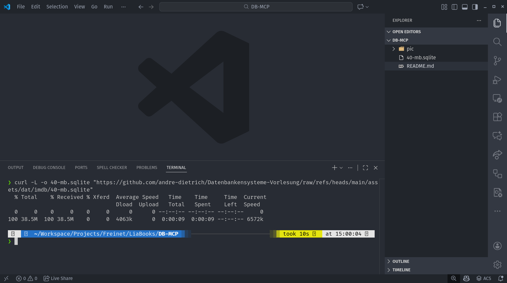

    --{{2}}--
Die Datenbank enthält drei Haupttabellen: title_basics (alle Medientitel), name_basics (Personen) und title_ratings (Bewertungen). Insgesamt über 178.000 Titel und 260.000 Personen – von 1878 bis 2025!

      {{2}}
> **📊 Datenquelle & Aufbereitung:**
>
> Diese Datenbank basiert auf den [offiziellen IMDB Non-Commercial Datasets](https://developer.imdb.com/non-commercial-datasets/), wurde jedoch für didaktische Zwecke vereinfacht:
>
> - Fokus auf die am häufigsten bewerteten Filme und Serien
> - Bereinigung unvollständiger Einträge
> - Reduzierung auf 3 Kerntabellen (Original: 7+ Tabellen)
> - Verfügbar in drei Größen:
>
>   - **[6 MB](../assets/dat/imdb/6-mb.sqlite)** (kompakt)
>   - **[10 MB](../assets/dat/imdb/10-mb.sqlite)** (mittel)
>   - **[40 MB](../assets/dat/imdb/40-mb.sqlite)** (umfangreich)
>
> So bleibt die Datenbank realistisch, aber handhabbar für erste Experimente!


### Schritt 2: MCP Database Server installieren

    --{{0}}--
Jetzt installieren wir den MCP-Server. VS Code hat dafür ein praktisches Menü eingebaut – kein Terminal, kein npm nötig!

      {{0}}
**Öffnen Sie die Command Palette:**

      {{0}}
<div>

- **Windows/Linux:** <kbd>Ctrl</kbd> + <kbd>Shift</kbd> + <kbd>P</kbd>
- **macOS:** <kbd>Cmd</kbd> + <kbd>Shift</kbd> + <kbd>P</kbd>

</div>

    --{{1}}--
Tippen Sie "MCP" und wählen Sie "MCP: Add Server". VS Code fragt Sie nun nach dem Server-Typ.

      {{1}}
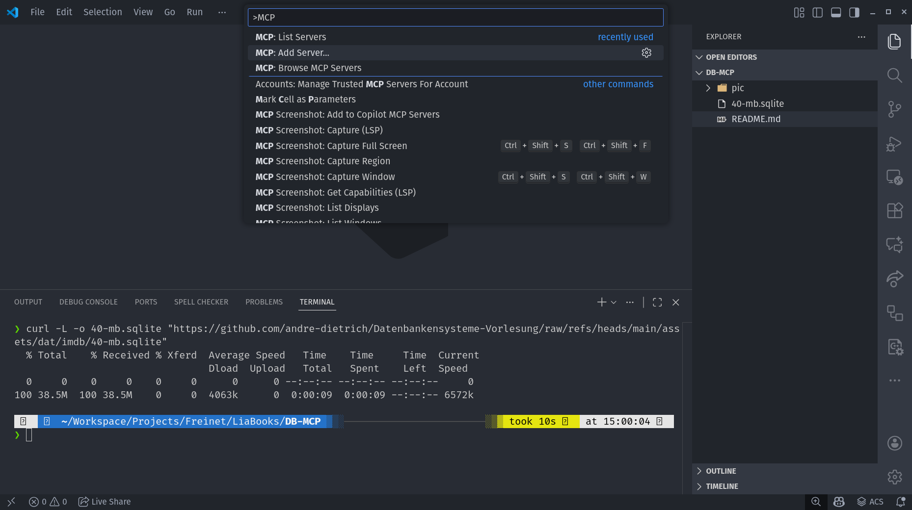

    --{{2}}--
Wählen Sie "Install from npm package". Wir nutzen ein fertiges Paket aus dem npm-Registry.

      {{2}}
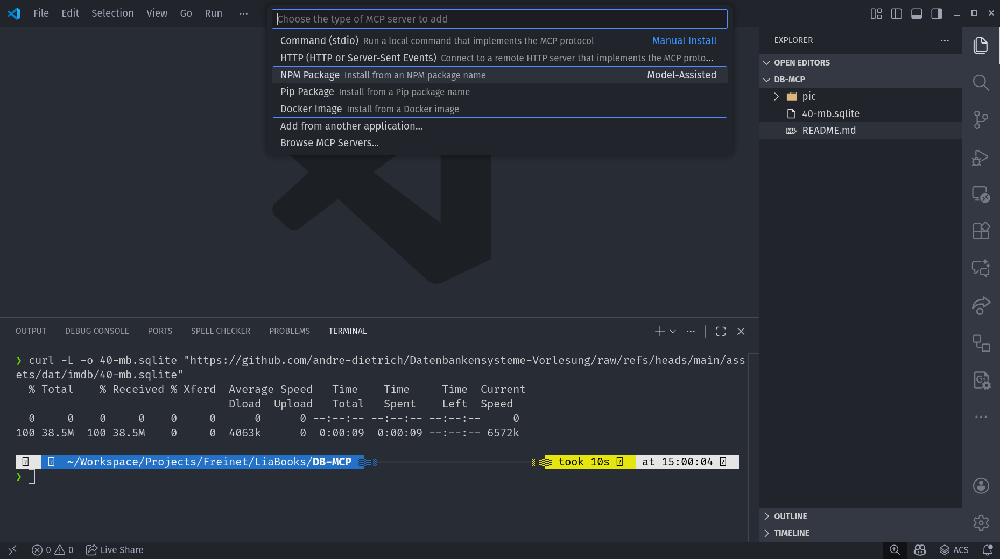

    --{{3}}--
Geben Sie jetzt den Paketnamen ein: `@executeautomation/database-server`. Dies ist ein Community-Server, der SQLite, PostgreSQL und MySQL unterstützt.

{{3}} https://www.npmjs.com/package/@executeautomation/database-server

      {{3}}
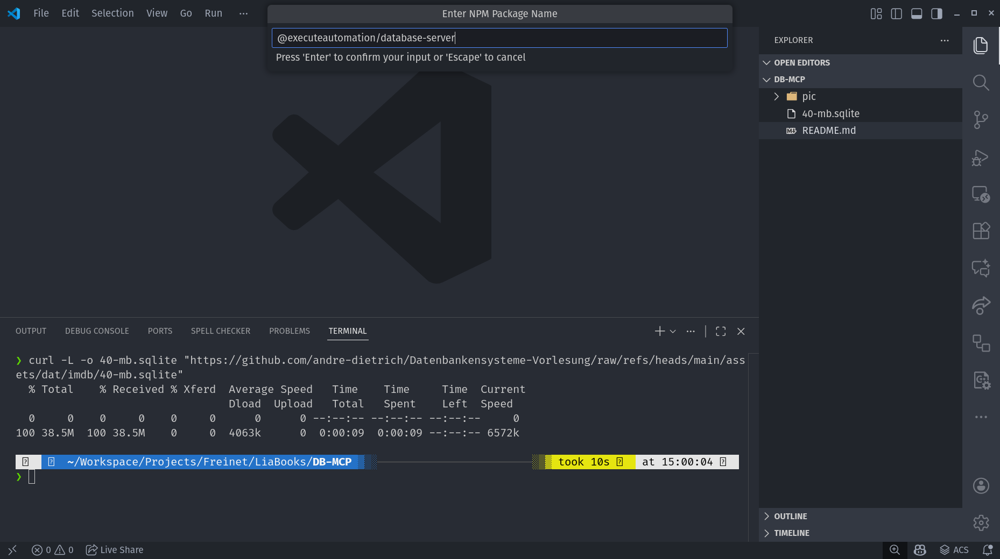

    --{{4}}--
VS Code fragt nach Ihrer Erlaubnis, das Paket zu installieren. Klicken Sie auf "Allow" – der Server wird nun heruntergeladen und eingerichtet.

      {{4}}
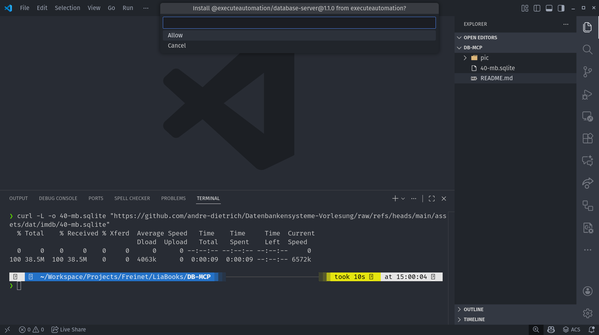

---

### Schritt 3: Server-ID & Konfiguration

    --{{0}}--
Nach der Installation müssen wir dem Server eine eindeutige ID geben. Wählen Sie einen sprechenden Namen, z. B. "sqlite".

      {{0}}
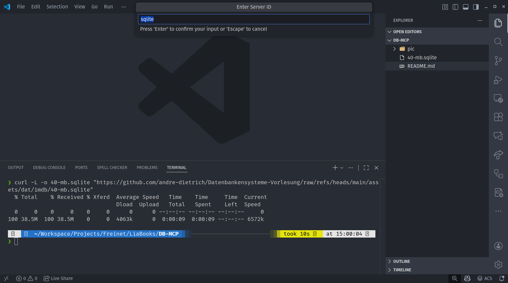

    --{{1}}--
VS Code fragt, ob der Server global oder nur für diesen Workspace gelten soll. Wählen Sie "Workspace" – so bleibt die Konfiguration projektspezifisch.

      {{1}}
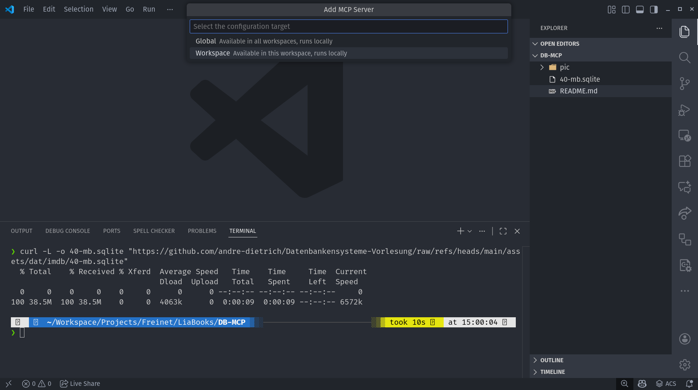

    --{{2}}--
Jetzt kommt der wichtigste Schritt: Die Konfiguration. VS Code öffnet automatisch die `mcp.json`-Datei. Hier müssen wir den Pfad zur Datenbank eintragen.

      {{2-3}}
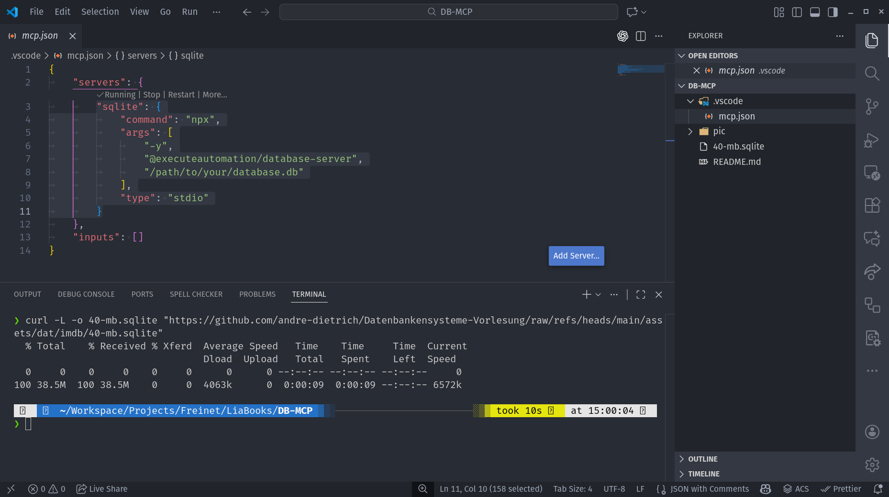

    --{{3}}--
Passen Sie den `args`-Abschnitt an: Tragen Sie den vollständigen Pfad zu Ihrer heruntergeladenen Datei ein. `npx` lädt den Server und startet ihn mit der angegebenen Datenbank. `"type": "stdio"` bedeutet, dass die Kommunikation über Standard-Ein- und Ausgabe erfolgt.

      {{3}}
**Beispiel-Konfiguration:**

      {{3}}
```json
{
	"servers": {
		"sqlite": {
			"command": "npx",
			"args": [
				"-y",
				"@executeautomation/database-server",
				"./40-mb.sqlite"
			],
			"type": "stdio"
		}
	},
	"inputs": []
}
```

    --{{4}}--
Wichtig: Ersetzen Sie den Pfad durch Ihren tatsächlichen Download-Ordner! Unter Windows nutzen Sie Backslashes oder doppelte Slashes.

      {{4}}
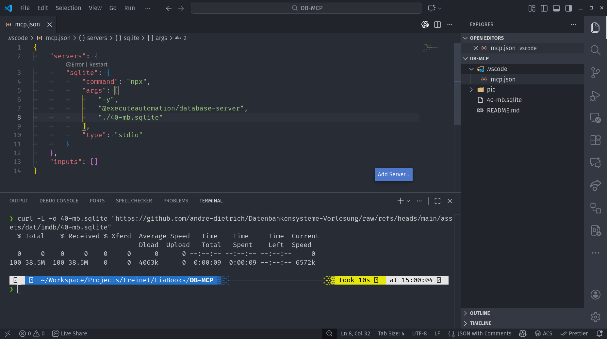

---

### Schritt 4: Server starten & testen

    --{{0}}--
Geschafft! Die Konfiguration ist abgeschlossen. Jetzt starten wir den Server und prüfen, ob alles funktioniert.

      {{0}}
**Server-Liste anzeigen:**

      {{0}}
<div>

- Öffnen Sie erneut die Command Palette (<kbd>Ctrl</kbd>/<kbd>Cmd</kbd> + <kbd>Shift</kbd> + <kbd>P</kbd>)
- Tippen Sie "MCP: List Servers"

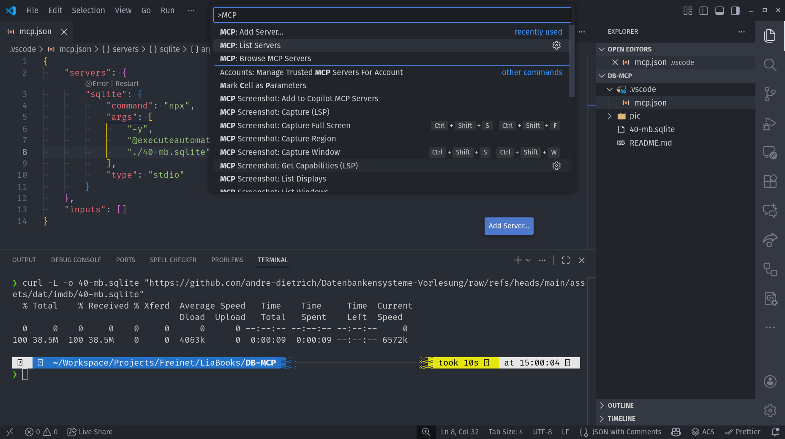

</div>

    --{{1}}--
Sie sollten jetzt Ihren "sqlite" sehen und auswählen. Klicken Sie darauf, um den Server zu starten, zu stoppen, zu konfigurieren, etc.

      {{1}}
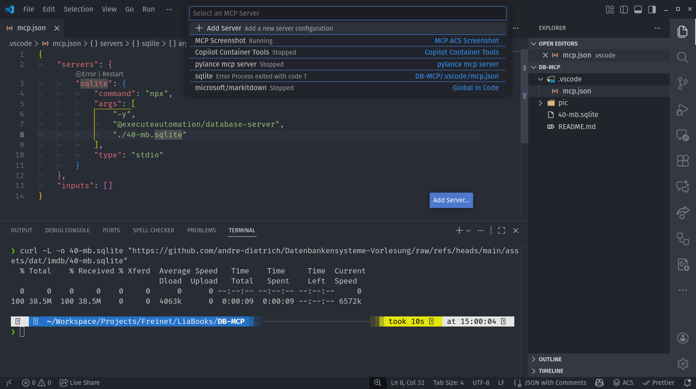

    --{{2}}--
Klicken Sie auf "Start Server". Der MCP-Server wird nun gestartet und verbindet sich mit der Datenbank.

      {{2-3}}
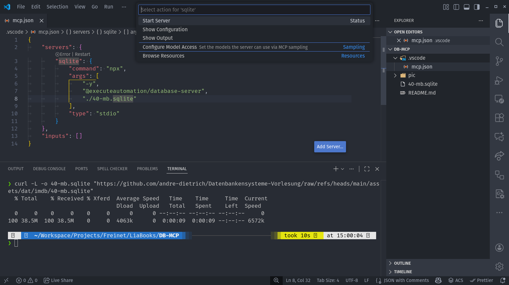

Der Server wird gestartet – Sie sehen im Output-Tab ob alles geklappt hat. Die Status-Anzeige `Discovered 10 tools` bedeutet das GitHub Copilot Zugriff hat und dabei 10 unterschiedliche Funktionen zur Verfügung stehen!

      {{3}}
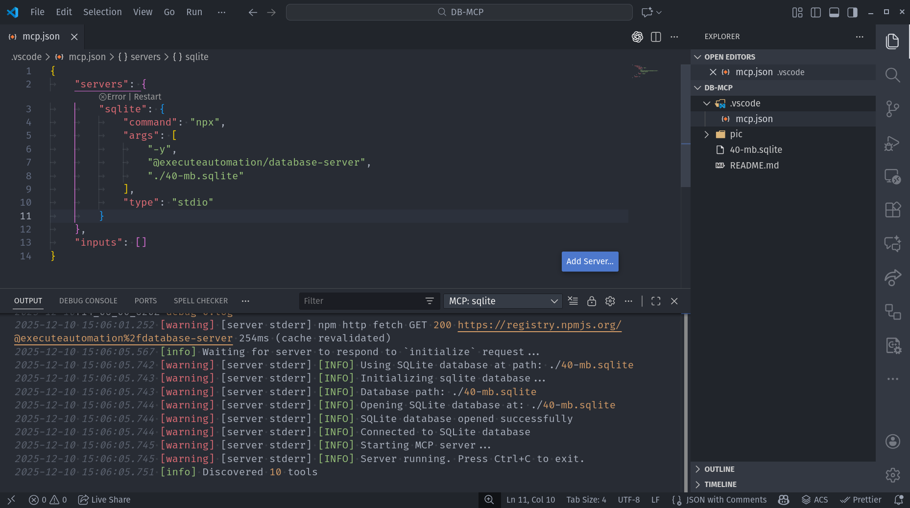

    --{{4}}--
Perfekt! Jetzt können wir mit der eigentlichen Arbeit beginnen: Datenbankabfragen über natürliche Sprache.

---

## Praktische Anwendung: Mit der DB über KI sprechen

    --{{0}}--
Jetzt kommt der spannende Teil: Sie öffnen GitHub Copilot Chat und stellen Fragen – die KI generiert SQL, führt es aus und zeigt Ihnen die Ergebnisse. Alles automatisch!

---

### Copilot Chat öffnen

    --{{0}}--
Klicken Sie auf das Chat-Icon in der VS Code-Seitenleiste oder nutzen Sie das Keyboard-Shortcut.

      {{0}}
<div>

- **Windows/Linux:** <kbd>Ctrl</kbd> + <kbd>Shift</kbd> + <kbd>I</kbd>
- **macOS:** <kbd>Cmd</kbd> + <kbd>Shift</kbd> + <kbd>I</kbd>

- Oder nutzen Sie die Command Palette und tippen "Chat"

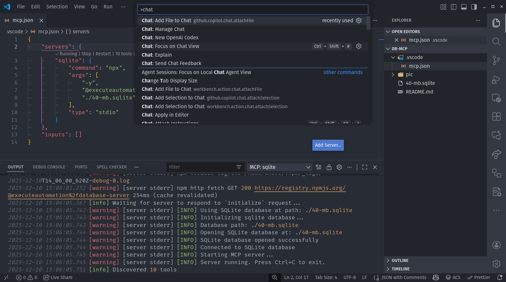

</div>


    --{{1}}--
Sie sehen jetzt das Chat-Fenster. Wählen Sie eine KI Ihrer Wahl und wechseln sie in den Agent-Modus.

      {{1}}
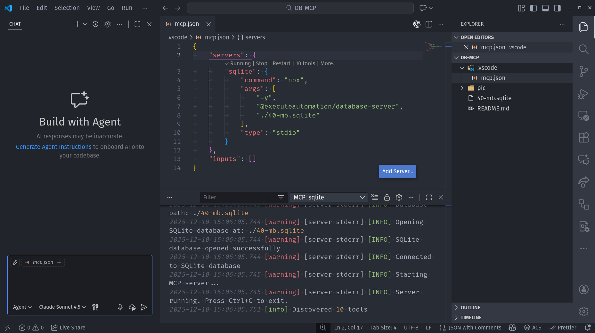

### Beispiel: Schema erkunden

    --{{0}}--
Beginnen wir einfach: Lassen Sie sich alle Tabellen anzeigen. Tippen Sie einfach in natürlicher Sprache!

      {{0}}
**Prompt:**

      {{0}}
```
Welche Tabellen gibt es in der IMDB-Datenbank?
```

    --{{1}}--
GitHub Copilot analysiert Ihre Frage, generiert die passende SQL-Query, führt sie aus und zeigt Ihnen die Ergebnisse – alles in Sekunden.
Da hier ein Zugriff auf die echte Resource besteht, müssen sie jede Anfrage bestätigen, sie können aber auch den automatischen Modus aktivieren.

      {{1}}
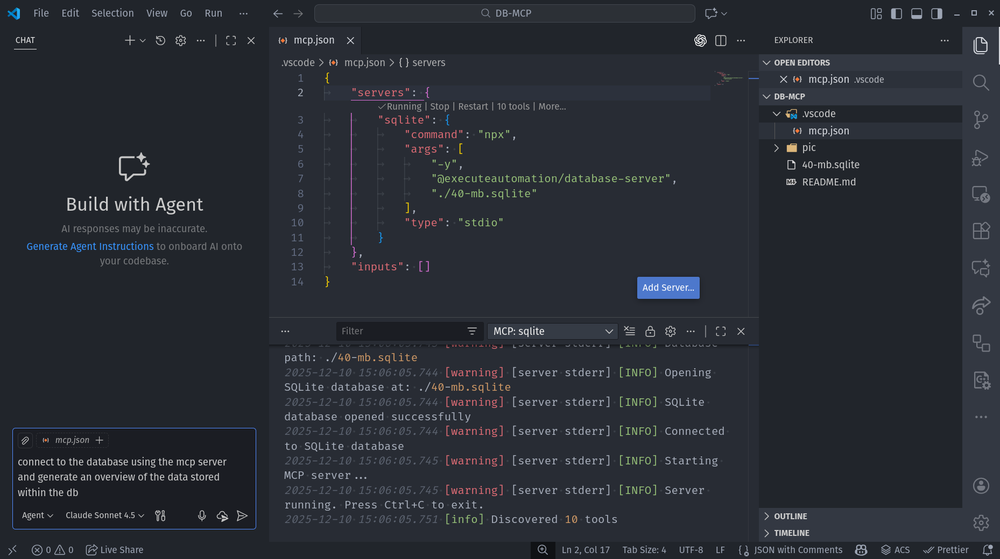

    --{{2}}--
Sie sehen jetzt drei Tabellen: `title_basics` (178.124 Titel), `name_basics` (260.050 Personen) und `title_ratings` (Bewertungen). Die KI hat automatisch die passende Query generiert.

      {{2}}
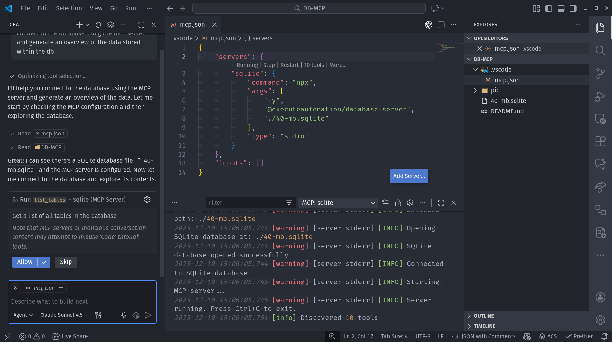
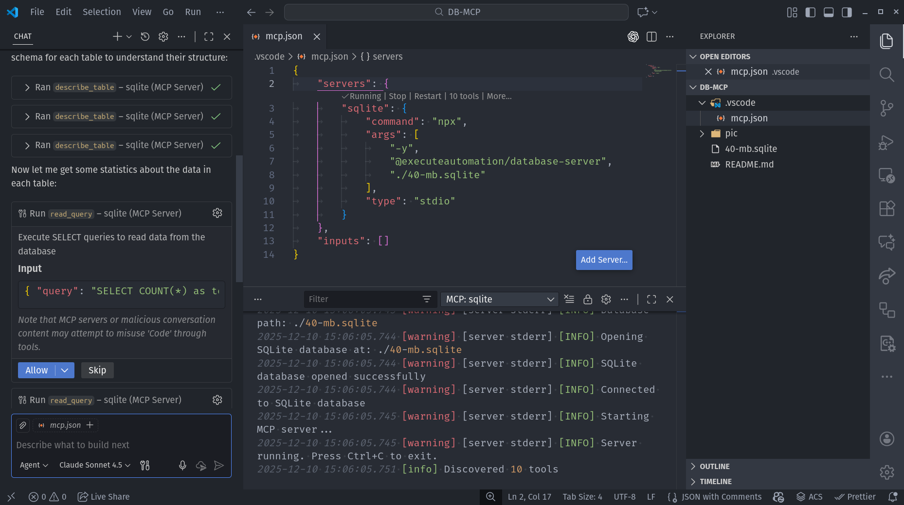
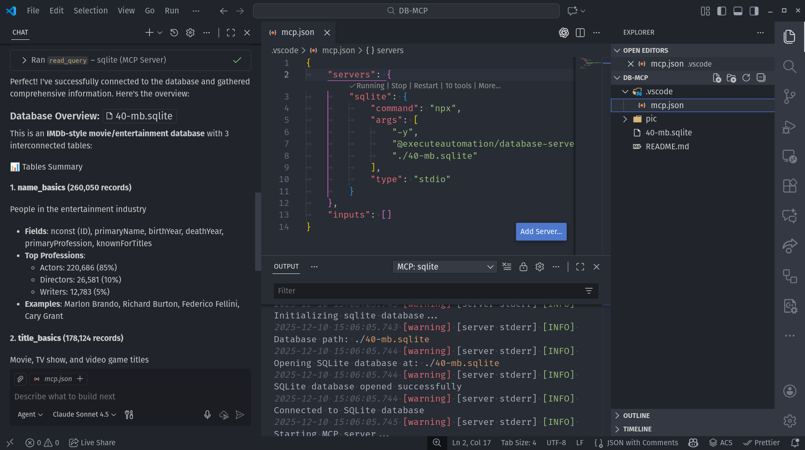

### Aufgabe 1: Tabellenstruktur analysieren

    --{{0}}--
Bevor Sie Daten abfragen, sollten Sie verstehen, wie die Datenbank aufgebaut ist. In dieser Aufgabe erkunden Sie die Struktur der Tabellen – welche Spalten gibt es, welche Datentypen, welche Beziehungen?

    --{{1}}--
Die KI kann Ihnen dabei helfen, das Schema zu visualisieren und zu verstehen. Probieren Sie verschiedene Fragen aus!

      {{1}}
**Prompt-Ideen für Schema-Exploration:**

      {{1}}
<div>

1. **Spalten einer Tabelle erkunden:**

   - *"Zeige mir die Struktur der Tabelle `title_basics`."*
   - *"Welche Spalten hat die Tabelle `name_basics`?"*
   - *"Was für Datentypen haben die Spalten in `title_ratings`?"*

2. **Beziehungen zwischen Tabellen finden:**

   - *"Wie sind die Tabellen `title_basics` und `title_ratings` verbunden?"*
   - *"Gibt es gemeinsame Spalten zwischen den Tabellen?"*
   - *"Welche Spalte könnte als Primärschlüssel dienen?"*

3. **Beispieldaten anschauen:**

   - *"Zeige mir 3 Beispielzeilen aus `title_basics`."*
   - *"Wie sehen die Daten in der `genres`-Spalte aus?"*
   - *"Gibt es NULL-Werte in der Datenbank?"*

4. **Diagramme generieren:**

   - *"Erstelle ein dbdiagram für die gesamte Datenbank."*
   - *"Zeige mir ein ASCII-Art-Diagramm der Tabellenbeziehungen."*
   - *"Visualisiere die Spalten aller Tabellen."*

</div>

    --{{2}}--
Probieren Sie mindestens 3–4 dieser Fragen aus! Die KI wird automatisch DESCRIBE-, PRAGMA- oder SELECT-Statements generieren, um das Schema zu analysieren.

      {{2}}
**Interaktive Visualisierung:**

      {{2}}
<div>

Wenn die KI Ihnen ein **dbdiagram** generiert hat, können Sie es hier einfügen und live rendern lassen:

``` sql


```
@dbdiagram.eval

**Beispiel-Struktur für dbdiagram:**

```sql
Table title_basics {
  tconst TEXT [pk]
  titleType TEXT
  primaryTitle TEXT
  startYear TEXT
  genres TEXT
}

Table title_ratings {
  tconst TEXT [pk]
  averageRating TEXT
  numVotes TEXT
}

Ref: title_basics.tconst - title_ratings.tconst
```

</div>

    --{{3}}--
Wenn Sie die Struktur verstanden haben, können Sie gezielter Fragen stellen. Welche Spalten sind interessant? Welche Tabellen müssen Sie joinen? Das ist die Grundlage für alle weiteren Analysen!

      {{3}}
> **Reflexion:**
>
> - Welche Tabelle enthält die meisten Informationen?
> - Wie sind die Tabellen miteinander verknüpft? (Hinweis: `tconst`, `nconst`)
> - Welche Spalten haben ungewöhnliche Datentypen? (Warum ist `startYear` TEXT statt INTEGER?)
> - Gibt es Spalten, die mehrere Werte enthalten? (z. B. `genres`, `primaryProfession`)

### Aufgabe 2: Die Filmdatenbank erkunden

    --{{0}}--
Jetzt sind Sie dran! In dieser Aufgabe lernen Sie die IMDB-Datenbank Schritt für Schritt kennen. Stellen Sie der KI die folgenden Fragen – in Ihrer eigenen Sprache, ohne perfektes SQL!

    --{{1}}--
Arbeiten Sie die Fragen der Reihe nach durch. Beobachten Sie, wie die KI Ihre natürliche Sprache in SQL übersetzt und welche Ergebnisse zurückkommen.

      {{1}}
**Frage 1: Genres erkunden**

      {{1}}
<div>

Stellen Sie dem KI-Agenten diese Frage:

> *"Wie viele Genres sind in der Datenbank?"*

**Beobachten Sie:**

- Welche Tabelle wählt die KI aus? (Tipp: `title_basics` enthält eine `genres`-Spalte)
- Wie lautet die generierte SQL-Query?
- Wie viele verschiedene Genre-Kombinationen gibt es? (Die Top 3: Comedy ~14k, Drama ~13k, Documentary ~11k)

</div>

    --{{2}}--
Die KI wird vermutlich die Tabelle `genres` abfragen und ein `COUNT(*)` oder `COUNT(DISTINCT ...)` verwenden. Notieren Sie sich die Anzahl!

      {{2}}
**Frage 2: Filme zählen**

      {{2}}
<div>

Nächste Frage:

> *"Wie viele Filme gibt es in der Datenbank?"*

**Überlegen Sie:**

- Ist die Anzahl höher oder niedriger als erwartet? (Antwort: ~35.500 Filme)
- Aus welchem Zeitraum stammen die Filme? (1878–2025!)
- Was ist mit den anderen ~142.000 Titeln?

</div>

    --{{3}}--
Über 178.000 Titel! Aber Vorsicht: Das sind nicht nur Filme, sondern auch TV-Episoden, Serien, Videospiele und mehr. Die KI zeigt Ihnen auch die generierte SQL-Query – so können Sie lernen, wie die Abfrage aufgebaut ist.

      {{3}}
**Frage 3: Genre-Zuordnungen prüfen**

      {{3}}
<div>

Jetzt wird es interessanter:

> *"Wie viele Filme sind Genres zugeordnet?"*

**Vergleichen Sie:**

- Ist diese Zahl identisch mit der Gesamtzahl der Filme?
- Wenn nicht: Gibt es Filme ohne Genre?

**Bonus-Frage (optional):**

> *"Zeige mir 5 Filme, die keinem Genre zugeordnet sind."*

</div>

    --{{4}}--
Hier lernen Sie etwas über Datenqualität: Nicht alle Filme haben vollständige Metadaten. Solche Lücken sind typisch für reale Datenbanken.

      {{4}}
**Frage 4: Serien in der Datenbank?**

      {{4}}
<div>

Eine spannende Hypothese:

> *"Gibt es Serien in der Datenbank?"*

**Tipp:** Die KI sucht in der Spalte `titleType` nach `tvSeries`.

**Antwort vorweg:**

- Ja! ~11.600 TV-Serien
- Plus ~90.500 TV-Episoden!
- Lassen Sie sich ein paar bekannte Titel anzeigen

</div>

    --{{5}}--
Die IMDB-Datenbank enthält oft nicht nur Filme, sondern auch TV-Serien, Miniserien oder TV-Specials. Die KI findet das passende Feld automatisch!

      {{5}}
**Frage 5: Weitere Medientypen entdecken**

      {{5}}
<div>

Letzte Erkundung:

> *"Was gibt es noch für Medientypen in der Datenbank?"*

**Erwarten Sie:**

- Eine Liste aller `titleType`-Werte
- Die Top 5: `tvEpisode` (~90k), `movie` (~35k), `short` (~21k), `tvSeries` (~11k), `tvMovie` (~6k)
- Außerdem: `video`, `tvMiniSeries`, `videoGame`, `tvSpecial`, `tvShort`

**Bonus-Frage (optional):**

> *"Zeige mir die Verteilung der Medientypen (Anzahl pro Typ)."*

</div>

    --{{6}}--
Glückwunsch! Sie haben jetzt einen systematischen Überblick über die Datenbank. Sie wissen, welche Tabellen es gibt, wie die Daten strukturiert sind und wo mögliche Lücken existieren.

      {{6}}
> **Reflexion:**
>
> - Welche Frage hat Sie überrascht?
> - Wie gut hat die KI Ihre Absicht verstanden?
> - Hätten Sie die SQL-Queries selbst so geschrieben?
> - Welche weiteren Fragen möchten Sie stellen?

    --{{7}}--
Experimentieren Sie weiter! Jede Frage bringt Sie näher daran, die Datenbank intuitiv zu verstehen – und gleichzeitig lernen Sie, wie SQL funktioniert.

---

### Aufgabe 3: Komplexe Analysen durchführen

    --{{0}}--
Jetzt wird es anspruchsvoll! In dieser Aufgabe entwickeln Sie eigene Fragestellungen und lassen die KI komplexere Analysen durchführen. Sie entscheiden selbst, was Sie herausfinden möchten.

    --{{1}}--
Überlegen Sie sich interessante Fragen zur Datenbank und formulieren Sie diese in natürlicher Sprache. Die KI wird automatisch komplexe SQL-Queries mit Joins, Gruppierungen und Aggregationen generieren.

      {{1}}
**Themenvorschläge (wählen Sie selbst!):**

      {{1}}
<div>

### 📊 Zeitreihen-Analysen

- Wie hat sich die Filmproduktion über die Jahrzehnte entwickelt?
- Gibt es Trends in bestimmten Genres über die Zeit?
- Welches Jahrzehnt hatte die höchste Produktion?

**Tipp:** Die `startYear`-Spalte enthält das Erscheinungsjahr. Überlegen Sie, wie man Jahrzehnte gruppieren könnte.

</div>

    --{{2}}--
Zeitreihen-Analysen zeigen historische Trends. Die KI kann automatisch Dekaden berechnen und gruppieren – probieren Sie verschiedene Zeiträume aus!

      {{2}}
<div>

### ⭐ Ratings & Qualität

- Welche Filme haben die höchsten Bewertungen?
- Gibt es einen Zusammenhang zwischen Anzahl der Votes und Rating?
- Welche Genres schneiden im Durchschnitt am besten ab?

**Tipp:** Die Tabelle `title_ratings` enthält `averageRating` und `numVotes`. Überlegen Sie: Sollten Filme mit nur wenigen Votes berücksichtigt werden?

</div>

    --{{3}}--
Ratings-Analysen sind spannend, aber Vorsicht: Ein Film mit 5 Stimmen und Rating 10.0 ist nicht unbedingt besser als einer mit 50.000 Stimmen und 8.5. Wie könnte man das filtern?

      {{3}}
<div>

### 🎭 Personen & Verbindungen

- Welche Personen haben in den meisten Titeln mitgewirkt?
- Wie viele Schauspieler vs. Regisseure gibt es in der Datenbank?
- Welche Personen sind sowohl Schauspieler als auch Regisseur?

**Tipp:** Die Tabelle `name_basics` enthält `primaryProfession`. Diese Spalte kann mehrere Berufe enthalten (z. B. "actor,director").

</div>

    --{{4}}--
Personen-Analysen zeigen die Vielseitigkeit von Filmschaffenden. Die KI kann mit String-Operationen wie LIKE oder INSTR in Mehrfach-Kategorien suchen.

      {{4}}
<div>

### 🎬 Genre-Verteilung

- Welche Genres dominieren die Datenbank?
- Wie viele Filme haben mehrere Genres?
- Gibt es Genre-Kombinationen, die besonders häufig vorkommen?

**Tipp:** Die `genres`-Spalte kann mehrere Genres enthalten, getrennt durch Kommas (z. B. "Action,Adventure,Sci-Fi").

</div>

    --{{5}}--
Genre-Analysen zeigen Markt-Trends. Beachten Sie: Ein Film kann mehrere Genres haben – das macht die Analyse komplexer, aber auch interessanter!

      {{5}}
<div>

### 🔍 Datenqualität & Vollständigkeit

- Wie viele Titel haben keine Jahresangabe?
- Welcher Prozentsatz der Filme hat Ratings?
- Gibt es Personen ohne Geburtsjahr?

**Tipp:** Fehlende Werte werden als `\N` gespeichert (IMDB-Standard). Sie können mit `WHERE spalte = '\N'` oder `WHERE spalte != '\N'` filtern.

</div>

    --{{6}}--
Datenqualität ist ein kritisches Thema. Reale Datenbanken haben immer Lücken – diese zu erkennen und zu quantifizieren ist eine wichtige Fähigkeit!

      {{6}}
> **Ihre Aufgabe:**
>
> 1. Wählen Sie **2–3 Themenbereiche** aus der Liste oben
> 2. Formulieren Sie **eigene Fragen** dazu – in natürlicher Sprache!
> 3. Lassen Sie die KI die Queries generieren und ausführen
> 4. **Analysieren Sie die Ergebnisse:**
>    - Sind die Zahlen plausibel?
>    - Welche SQL-Techniken hat die KI verwendet? (JOIN, GROUP BY, HAVING, Subqueries?)
>    - Könnten Sie die Query selbst nachvollziehen oder sogar verbessern?

    --{{7}}--
Experimentieren Sie frei! Es gibt keine "richtige" Frage – wichtig ist, dass Sie die Ergebnisse verstehen und kritisch hinterfragen. Die KI ist Ihr Werkzeug, aber Sie bleiben der Analyst!

## Reflexion: Wann macht MCP Sinn?

    --{{0}}--
MCP ist mächtig – aber nicht für jeden Use Case geeignet. Lassen Sie uns die Stärken und Grenzen analysieren.

      {{0}}
**Stärken:**

      {{0}}
<div>

- ✅ **Explorative Phasen:** Schnelles Erkunden unbekannter Datenbanken
- ✅ **Prototyping:** Ad-hoc Analysen ohne aufwändige Tool-Setups
- ✅ **Lernhilfe:** Anfänger sehen, wie SQL-Queries aufgebaut sind
- ✅ **Dokumentation:** Automatische Beschreibungen von Schema-Beziehungen
- ✅ **Fehlersuche:** KI kann Queries debuggen und optimieren

</div>

    --{{1}}--
Aber es gibt auch klare Grenzen. MCP ist kein Ersatz für fundiertes SQL-Wissen!

      {{1}}
**Grenzen & Trade-offs:**

      {{1}}
<div>

- ⚠️ **Lernkurve:** Verständnis für gute Prompts notwendig
- ⚠️ **Abhängigkeit:** Ohne MCP-Server funktioniert nichts
- ⚠️ **Performance:** Komplexe Queries können ineffizient sein
- ⚠️ **Sicherheit:** Read-only für Produktivdaten empfohlen
- ⚠️ **Kosten:** GitHub Copilot ist kostenpflichtig (~10$/Monat)

</div>

    --{{2}}--
Wichtig: MCP ist ein Werkzeug, kein Autopilot. Sie müssen die Ergebnisse verstehen und validieren können.

      {{2}}
> **Best Practice:**
>
> 1. Nutzen Sie MCP für Exploration & Prototyping
> 2. Überprüfen Sie generierte Queries kritisch
> 3. Lernen Sie aus den Beispielen – schreiben Sie dann selbst SQL
> 4. Für Produktiv-Code: Review & Tests sind Pflicht!

## Zusammenfassung & Nächste Schritte

    --{{0}}--
Glückwunsch! Sie haben erfolgreich einen MCP-Server installiert und mit natürlicher Sprache Datenbanken abgefragt. Das öffnet völlig neue Workflows!

      {{0}}
**Was Sie gelernt haben:**

      {{0}}
<div>

- ✅ Warum KI + Datenbanken sinnvoll kombiniert werden können
- ✅ Wie MCP als Brücke zwischen KI und Daten funktioniert
- ✅ Installation & Konfiguration eines MCP-Servers in VS Code
- ✅ Praktische Datenbankabfragen über GitHub Copilot
- ✅ Grenzen und Trade-offs dieser Technologie

</div>

    --{{1}}--
Jetzt sind Sie dran: Probieren Sie weitere Prompts aus, experimentieren Sie mit komplexen Queries und hinterfragen Sie die Ergebnisse kritisch. MCP ist ein Werkzeug – nutzen Sie es weise!

      {{1}}
> **Nächste Schritte:**
>
> 1. 📝 Erstellen Sie 5 eigene Prompts für die IMDB-Datenbank
> 2. 🔍 Analysieren Sie die generierten SQL-Queries – was ist gut, was ineffizient?
> 3. 🚀 Versuchen Sie, einen zweiten MCP-Server hinzuzufügen (z. B. Ihre eigene SQLite-DB)
> 4. 💡 Überlegen Sie: Für welche Ihrer Projekte wäre MCP nützlich?

    --{{2}}--
Viel Erfolg beim Ausprobieren – und vergessen Sie nicht: Die beste Lernmethode ist, selbst zu experimentieren. Machen Sie Fehler, verstehen Sie sie, und wachsen Sie daran!

      {{2}}
{{|>}}
Happy querying! 🚀🎓