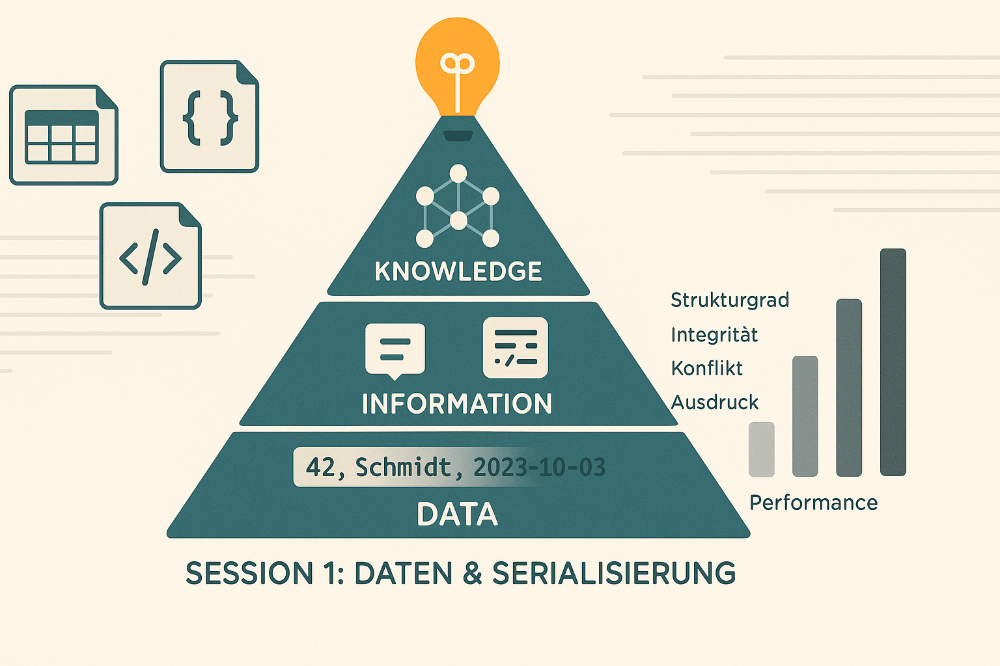

# Session 1 (Lecture)

## Titel

Session 1 – Daten & Serialisierung + DIKW + Vergleichsachsen Teaser (Lecture)

## Zusammenfassung

CSV/JSON/YAML/XML Formen, erste Ad-hoc Analyse, Inkonsistenz-Motivation. Kontext: Einstieg, Motivation der Vergleichsachsen und Daten→Information (DIKW) Übergang.

## Inhalte

- Dateiformate: CSV, JSON, YAML, XML, NDJSON (Erwähnung)
- Strukturgrad & Validierung: locker vs. strikt
- Erste Abfragen (DuckDB direkt auf CSV)
- DIKW Pyramide (Daten → Information → Wissen → (Entscheidung))
- Vergleichsachsen Teaser (Struktur, Integrität, Replizierbarkeit, Konfliktpotenzial, Abfrageausdruck, Performanceprofil)

## Aktivitäten

- Mini-Demo: Ad-hoc Query über CSV
- Kleingruppen: Welche Probleme seht ihr bei wachsender Datenmenge?
- Kurze Reflexion: Wo treten Inkonsistenzen auf?

## Referenzen & Quellen

- DuckDB Doku
- JSON / YAML Spezifikationen (Kurz)
- DIKW Modell (Zusammenfassung)

## Logo - Prompt

Wide aspect 16:9 flat minimal educational tech illustration. Mittelpunkt: stilisierte DIKW-Pyramide (Data → Information → Knowledge → Wisdom) mit 4 klar getrennten Ebenen, von unten nach oben:

1) Basis "Data": rohe Textzeilen (CSV-Stil, "42, Schmidt, 2023-10-03"),
2) "Information": strukturierte Karten/Tags (JSON-Klammern {}, XML-Tags <>),
3) "Knowledge": verbundene Knoten (Graph/Netzwerk-Muster, 5-7 Knoten),
4) Spitze "Wisdom": leuchtende Glühbirne oder Kompass-Symbol (Orientierung).

Links neben Pyramide: 3 schwebende Dokument-Icons (CSV-Tabelle, JSON-Objekt mit {}, XML-Baum mit </>). Rechts neben Pyramide: 5 vertikale Achsen/Balken als Vergleichsmetrik (Strukturgrad, Integrität, Konflikt, Ausdruck, Performance) mit unterschiedlichen Höhen (Diagramm-Stil). Hintergrund: subtiler Datenfluss (horizontale Linien) von links (roh) nach rechts (strukturiert). Schriftzug (optional) "Session 1: Daten & Serialisierung" dezent, sans-serif, unten zentriert. Farbschema: Petrol (#0B6E75 – Pyramide), Warm Orange (#FF8C42 – Highlights auf Wisdom/Top), Sand (#F2E9DC – Background), Dark Gray (#333 – Achsen/Diagramme), Off-White (#F9F9F9 – Flächen). Keine Gradients, klare Konturen, weiche Rundungen, hoher Kontrast, kein Photorealismus, educational diagram style, clean edges, negative space sinnvoll nutzen.

