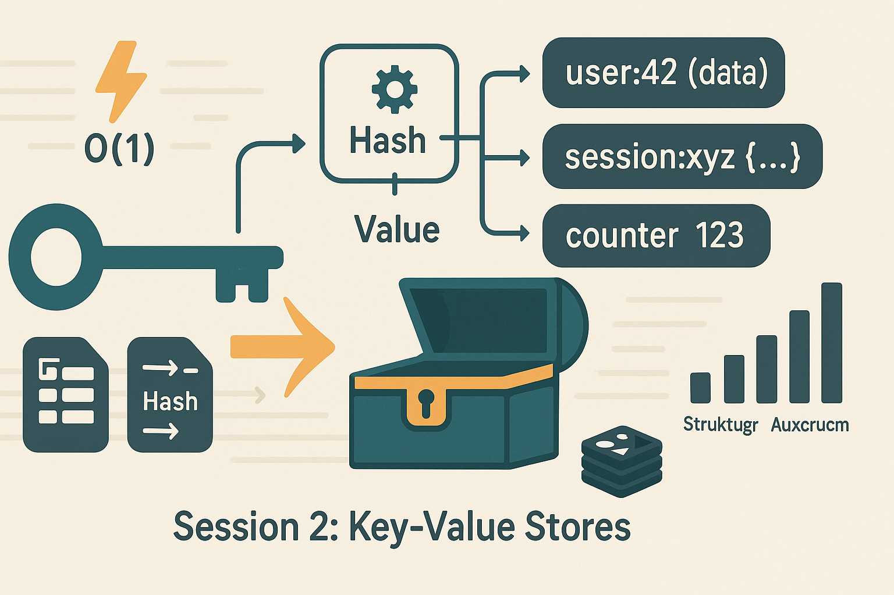

# Session 2 (Lecture)

## Titel

Session 2 – Key-Value Stores (kompakt) (Lecture)

## Zusammenfassung

Zugriff, Patterns, TTL, Atomic Keys, Grenzen (keine Range Queries). Kompakter Überblick über Key-Value Paradigma: Grundkonzepte, typische Patterns und Limitierungen.

## Inhalte

- Key-Value Grundprinzip: O(1) Lookup
- Zugriffsmuster: GET, SET, DELETE, EXISTS
- TTL (Time-To-Live) & Expiration
- Atomic Operations: INCR, DECR, CAS (Compare-And-Set)
- Key-Design Patterns: Namespacing, Composite Keys
- Typische Use Cases: Session Store, Caching, Rate Limiting
- Grenzen: Keine Range Queries, keine Joins, eingeschränkte Ad-hoc Analysen
- Beispiel-Systeme: Redis, Memcached, LocalStorage/IndexedDB (Browser)

## Aktivitäten

- Mini-Demo: Redis/LocalStorage Live-Zugriff
- Diskussion: Für welche Szenarien ist KV optimal/ungeeignet?
- Pattern-Katalog Übersicht

## Referenzen & Quellen

- Redis Documentation (Commands Overview)
- LocalStorage / IndexedDB Web APIs
- Caching Patterns (Martin Fowler, Cache-Aside)

## Logo - Prompt

Wide aspect 16:9 flat minimal educational tech illustration.
Mittelpunkt: großer stilisierter Schlüssel (Key-Symbol, goldfarben oder petrol) 
zeigt auf eine geöffnete Schatztruhe oder Safe-Box (Value-Container).
Zwischen Schlüssel und Box: transparente Hash-Funktion-Box 
(mathematisches Symbol wie f(x) oder Zahnrad-Muster) mit Pfeil "Key → Hash → Value".
Rechts neben Box: 3-4 schwebende Key-Value-Paare als Karten/Tags 
(z.B. "user:42 → {data}", "session:xyz → {...}", "counter → 123").
Links oben: kleines Blitz-Symbol mit "O(1)" Label (konstante Zugriffszeit).
Unten rechts: subtiles Redis-Logo oder Memory-Chip-Icon (In-Memory-Hinweis).
Hintergrund: horizontale Datenfluss-Linien von links (Key) nach rechts (Value).
Schriftzug (optional) "Session 2: Key-Value Stores" dezent, sans-serif, unten zentriert.
Farbschema: Petrol (#0B6E75 – Schlüssel/Hash-Box), Gold/Warm Orange (#FF8C42 – Highlights), 
Sand (#F2E9DC – Background), Dark Gray (#333 – Key-Value-Karten), Off-White (#F9F9F9).
Keine Gradients, klare Konturen, weiche Rundungen, hoher Kontrast, kein Photorealismus, 
tech diagram style, clean edges, negative space sinnvoll nutzen.

