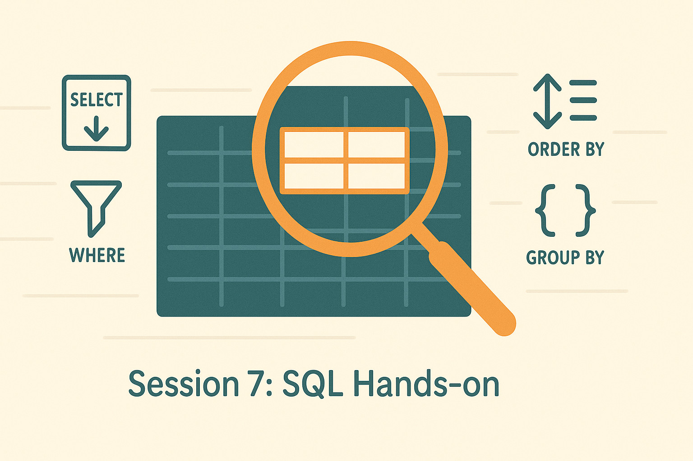

# Session 7 – SQL Introduction & Query Data (SELECT)

> **Session-Typ:** Lecture  
> **Dauer:** 90 Minuten  
> **Lernziele:** LZ 2 (SQL-Praxis)

---

## Zusammenfassung

Willkommen zur SQL-Praxis! Nach der Einführung ins relationale Modell (L5) und dem Paradigmen-Vergleich (L6) starten wir nun mit der **praktischen Anwendung von SQL**. Diese Session führt Sie in die Grundlagen der **Structured Query Language** ein: Was ist SQL, welche Komponenten gibt es, und wie formulieren Sie Abfragen mit **SELECT**?

Wir lernen die wichtigsten Bausteine kennen: **SELECT**, **FROM**, **WHERE**, **ORDER BY**, **GROUP BY**, **HAVING** und **DISTINCT**. Am Ende dieser Session können Sie einfache bis mittlere Abfragen schreiben und verstehen, wie SQL Daten filtert, sortiert und aggregiert.

**Bezug zur Agenda:**  
Diese Session ist der Einstieg in Block 2 (SQL Einführung & Grundlagen). Sie liefert das Handwerkszeug für alle folgenden SQL-Sessions (L8–L13) und bereitet die praktischen Übungen (E2–E6) vor.

---

## Inhalte (Geplant)

### Block 1: Was ist SQL?

- **Definition & Geschichte:**
  - Structured Query Language (SQL)
  - Entwickelt in den 1970ern (IBM System R)
  - Standard: ANSI SQL, ISO SQL
  
- **SQL-Komponenten:**
  - **DDL (Data Definition Language):** CREATE, ALTER, DROP
  - **DML (Data Manipulation Language):** SELECT, INSERT, UPDATE, DELETE
  - **DCL (Data Control Language):** GRANT, REVOKE
  - **TCL (Transaction Control Language):** COMMIT, ROLLBACK
  
- **Warum SQL?**
  - Deklarativ: "Was" statt "Wie"
  - Portabel: Funktioniert auf vielen DBMS (MySQL, PostgreSQL, SQLite, DuckDB)
  - Mächtig: Von einfachen Lookups bis komplexe Analysen

### Block 2: SELECT – Die Basis-Abfrage

- **Grundstruktur:**
  ```sql
  SELECT column1, column2
  FROM table_name;
  ```
  
- **Alle Spalten auswählen:**
  ```sql
  SELECT * FROM customers;
  ```
  
- **Spalten umbenennen (Aliases):**
  ```sql
  SELECT first_name AS name, email AS contact
  FROM customers;
  ```

### Block 3: WHERE – Daten filtern

- **Einfache Bedingungen:**
  ```sql
  SELECT * FROM products
  WHERE price > 100;
  ```
  
- **Vergleichsoperatoren:**
  - `=`, `!=`, `<`, `>`, `<=`, `>=`
  
- **Logische Operatoren:**
  - `AND`, `OR`, `NOT`
  ```sql
  SELECT * FROM products
  WHERE price > 50 AND category = 'Electronics';
  ```
  
- **IN, BETWEEN, LIKE:**
  ```sql
  SELECT * FROM customers
  WHERE country IN ('Germany', 'Austria', 'Switzerland');
  
  SELECT * FROM orders
  WHERE order_date BETWEEN '2023-01-01' AND '2023-12-31';
  
  SELECT * FROM products
  WHERE name LIKE '%Phone%';
  ```

### Block 4: ORDER BY – Sortierung

- **Aufsteigend / Absteigend:**
  ```sql
  SELECT * FROM products
  ORDER BY price ASC;  -- aufsteigend (Standard)
  
  SELECT * FROM products
  ORDER BY price DESC; -- absteigend
  ```
  
- **Mehrere Spalten:**
  ```sql
  SELECT * FROM products
  ORDER BY category ASC, price DESC;
  ```

### Block 5: GROUP BY & Aggregation

- **Aggregatfunktionen:**
  - `COUNT()`, `SUM()`, `AVG()`, `MIN()`, `MAX()`
  
- **Gruppierung:**
  ```sql
  SELECT category, COUNT(*) AS product_count
  FROM products
  GROUP BY category;
  ```
  
- **HAVING – Filter nach Aggregation:**
  ```sql
  SELECT category, AVG(price) AS avg_price
  FROM products
  GROUP BY category
  HAVING AVG(price) > 100;
  ```

### Block 6: DISTINCT – Duplikate entfernen

- **Eindeutige Werte:**
  ```sql
  SELECT DISTINCT country
  FROM customers;
  ```
  
- **Kombination mit Aggregation:**
  ```sql
  SELECT COUNT(DISTINCT country) AS unique_countries
  FROM customers;
  ```

---

## Aktivitäten (Geplant)

1. **Aktivierungsimpuls (5 Min):**
   - Frage: "Wie würden Sie alle Produkte finden, die mehr als 50 Euro kosten und in der Kategorie 'Electronics' sind?"
   - Hypothese sammeln, dann WHERE-Clause erklären

2. **Live-Demo (20 Min):**
   - DuckDB-Wasm: CSV-Import (z. B. `products.csv`)
   - SELECT-Abfragen Schritt für Schritt:
     - Alle Zeilen: `SELECT * FROM products;`
     - Filter: `WHERE price > 50`
     - Sortierung: `ORDER BY price DESC`
     - Aggregation: `GROUP BY category`
     - HAVING: Filter nach Aggregation

3. **Interaktive Übung (15 Min):**
   - Teilnehmende schreiben eigene Queries:
     - "Finde alle Kunden aus Deutschland"
     - "Zähle die Anzahl der Bestellungen pro Kunde"
     - "Welche Produktkategorie hat den höchsten Durchschnittspreis?"

4. **Paradigmen-Matrix erweitern (5 Min):**
   - SQL: Deklarativ, mächtig, portabel
   - Vergleich mit KV (nur Key-Lookup) und Document (JSON-Queries)

5. **Reflexion (5 Min):**
   - 1-Minute-Paper: "Was ist der größte Vorteil von SQL gegenüber direktem Datei-Zugriff?"

---

## Referenzen & Quellen

- **SQL Tutorial**: [https://www.sqlitetutorial.net/](https://www.sqlitetutorial.net/)
- **DuckDB Documentation**: [https://duckdb.org/docs/](https://duckdb.org/docs/)
- **SQL Performance Explained** (Markus Winand)
- **Database System Concepts** (Silberschatz, Korth, Sudarshan) – Kapitel 3 & 4
- **W3Schools SQL Tutorial**: [https://www.w3schools.com/sql/](https://www.w3schools.com/sql/)

---

## Offene Fragen / TODOs

- [ ] DuckDB-Wasm-Demo vorbereiten (CSV-Import: `products.csv`, `customers.csv`)
- [ ] Interaktive Übungen mit Musterlösungen
- [ ] Vergleichstabelle: SQL vs. NoSQL-Queries (KV, Document)
- [ ] Paradigmen-Matrix aktualisieren (SQL-Abfrageausdruck hinzufügen)


## Logo - Prompt

@logo-prompt: Wide aspect 16:9 flat minimal educational tech illustration. Mittelpunkt: stilisierte SQL-Abfrage visualisiert als interaktive Lupe über einer Datenbanktabelle (3-4 Zeilen, 4-5 Spalten, klare Gitterstruktur). Die Lupe hebt eine SELECT-Auswahl hervor (2 Zeilen, 2 Spalten orange umrandet). Links neben der Tabelle: kleines schwebendes "SELECT"-Icon (Pfeil nach unten) + "WHERE"-Filtersymbol (Trichter). Rechts: gestapelte Sortierpfeile (ORDER BY) + Gruppierungs-Klammern (GROUP BY). Hintergrund: subtile horizontale Datenfluss-Linien (von links nach rechts), angedeutet als "Live Query Execution". Schriftzug (optional) "Session 7: SQL Hands-on" dezent, sans-serif, unten zentriert. Farbschema: Petrol (#0B6E75 – Tabelle/Struktur), Warm Orange (#FF8C42 – SELECT Highlights/Lupe), Sand (#F2E9DC – Background), Dark Gray (#333 – Grid/Icons), Off-White (#F9F9F9 – Flächen). Keine Gradients, klare Konturen, weiche Rundungen, hoher Kontrast, kein Photorealismus, hands-on learning style, clean edges, negative space sinnvoll nutzen.

